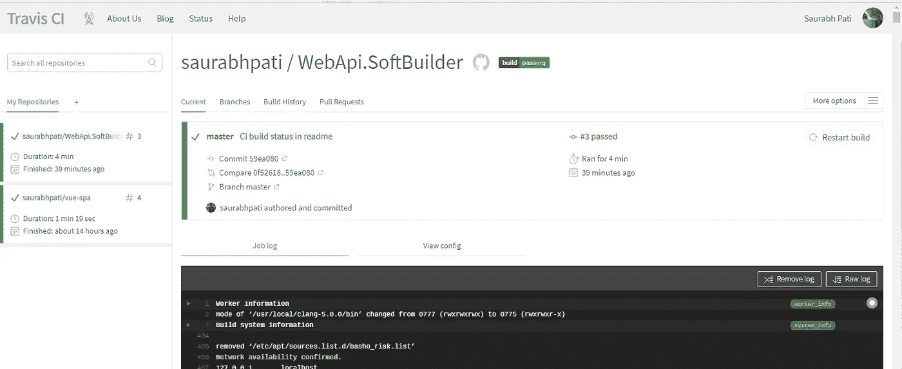

# 在 Github 上使用 Travis 进行持续集成

> 原文：<https://medium.com/hackernoon/continuous-integration-using-travis-on-github-1f7f2314b6b7>


这是一篇关于在 Github 上为您的项目设置 Travis CI 的短文。

# CI 是什么？

[CI](https://en.wikipedia.org/wiki/Continuous_integration) 是 [DevOps](https://en.wikipedia.org/wiki/DevOps) 的一个齿轮，使你的代码成为 ***【交付就绪】*** 。

> “简而言之，事情总是必须处于生产就绪状态:如果您编写了它，您就必须在那里让它运行！”**——**[**麦克·米勒**](https://www.linkedin.com/in/mlmilleratmit)

为了准备好生产，你必须不断地测试你的代码，提前找出任何集成问题。那么，如果您可以在推送代码后立即测试您的代码，并且自动化该过程，以便在 Github 上对您的存储库进行任何提交后，您的项目的所有测试都可以立即运行。如果您的提交可能会产生任何问题，那么由 CI 构建过程触发的测试将会失败，这表明在发布过程中需要更早地重新访问您的代码或测试。

# 特拉维斯

Travis 是一个 CI 构建工具，可免费用于您的 Github 项目。它将构建你的应用程序，并在你每次推送到存储库时运行你的测试，最重要的是它是开源的。

# 为您的项目设置 Travis CI。

我在 Github 上有一个 ASP.NET Web API 项目，为了这篇文章，我使用 MS 测试框架编写了一个单元测试，尽管我的首选测试框架是 XUnit。

一旦你写了测试，你需要做的就是在你的项目的根路径上写一个***' . Travis . yml '***文件。该文件将包含 Travis 构建和运行项目中编写的测试所需的所有配置。

***这是我项目的 my .travis.yml。***

```
language: csharp
solution: "./WebApi.SoftBuilder/WebApi.SoftBuilder.sln"
```

解中的路径就是我的 ***的路径。sln*** 文件来自 ***.travis.yml*** 所在的目录。

***一旦你按下这个你需要做的就是:***

1.  进入 [***特拉维斯 CI 网页***](https://travis-ci.org/) ***。***
2.  在网页的右上角你会看到一个***‘用 Github 登录’***选项。


Sign in with your Github account in Travis

3.一旦你这样做，你会看到一个同意屏幕，如果这是你的第一次。在继续之前，请仔细阅读权限，确保您同意 Travis 访问所需的数据。

4.之后，Travis 会用一个像这样的轻触开关列出你所有的存储库


Travis lists all your public repositories with a github account.

您可以打开想要为其设置 CI 的存储库的开关。在这里，我已经为这篇文章中提到的项目打开了它。

5.一旦你轻击它，Travis 将开始它的魔法，并开始基于 ***.travis.yml*** 文件中提供的配置构建和运行你的测试，在它完成编织它的魔法之后，瞧！如果您的所有测试都通过了，您将会看到类似这样的内容，如果失败，您可以查看命令行输出和日志，以了解哪里出错了。这些消息大多对开发人员友好，很容易理解。



Any push to your repository will initiate in a CI build in Travis

6.大多数团队喜欢在 Github repo 的 readme 文件中包含他们的构建状态，这样当有人访问时就可以显示当前构建的状态。为此，只需点击顶部的这个按钮，选择降价选项，然后将代码粘贴到您的***【readme . MD】***文件选项中，并将更改推送到您的回购中。


Status of the build


Select the markdown option from the dropdown and copy the resultant code from the box.


Paste the generated code in your README.md file


See the updated status of your build in your Github repo page.

# 为其他项目设置 Travis CI。

如果您在不同的环境中有项目，比如使用 karma 平台和 mocha 测试框架的 node，那么为 CI 设置 Travis 的过程完全类似。唯一会改变的是你的 ***.travis.yml*** 文件。我还有另一个 repo，它有 karma 和 mocha 测试，我已经为它设置了 Travis CI。这是相同的配置。

```
language: node_js
node_js:
  - 8.9.4
```

就是这样！这就是全部的代价。

如果你已经走到这一步，谢谢你！。欢迎所有改进本文的建议和您的想法。