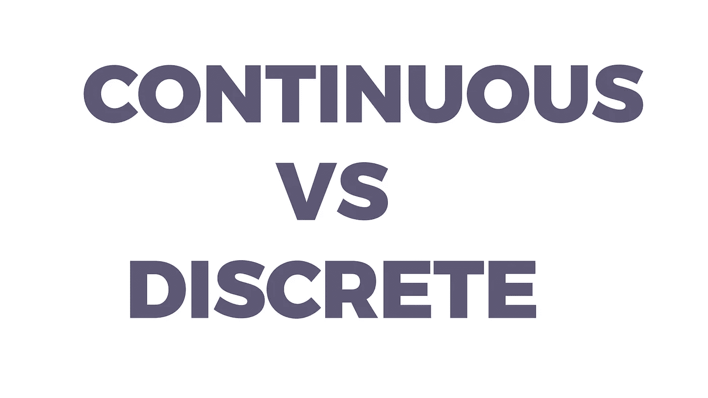
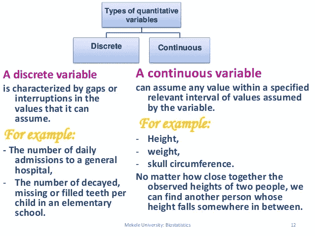

# 机器学习环境中的连续变量与离散变量。

> 原文：<https://medium.com/hackernoon/continuous-vs-discrete-variables-in-the-context-of-machine-learning-15d9005e2525>

让我们快速进入主题。我知道，你没时间了。你还得学习其他的话题。好吧！我听到了:)

# 连续变量

连续变量可以取任何值。可以这样想:如果变量中的数字可以一直计数，那么它就是一个连续变量。

例:一个人的体重:152.232 公斤，你可能在想，“我在哪里数？”。是的，你是！人的体重实际上是 152.23211223322112223332112224477889399999998888888888377476666787888992336677

显然，这些点不会很快结束。事实上，他们没有结束！

现在你明白这个变量是如何“持续计数”的了吧？当我说“计数”时，我指的是小数点后的那些数。

这是连续变量的一个例子。

# 你能想出另一个例子吗？

你是说年龄吗？“你真棒！”。没错！因为年龄一直在算。不相信我？安装[这个，自己看](https://chrome.google.com/webstore/detail/motivation/ofdgfpchbidcgncgfpdlpclnpaemakoj?hl=en)。

好吧，其他例子是训练深度神经网络的时间，收入，电力成本，你大脑的处理能力(什么！！？？)，你在 J 中的夜间能量，只是一个快速余数:J 是能量的 S.I 单位。

我的意思是你现在知道其他的例子。

## ML 上下文:连续变量用于回归。

[https://www.slideshare.net/cdhnmj/introduction-to-biostasstics](https://www.slideshare.net/cdhnmj/introduction-to-biostasstics)

# 离散/分类变量

一个离散变量只能取所有可能值中的一个特定值，或者换句话说，如果你不继续计算那个值，那么它就是一个离散变量，也就是分类变量。

例如:一所大学的学生人数。

想想大学里的学生人数。假设一所大学有 75，123 名注册学生。那个变量是连续的吗？

你可能会说“是”，因为你很聪明。你会说 75，123 是

75，123，000，000，000，000，000，000，000，000，000，000，000，000，000，000，000，000，000，000，000，000，000，000，000，000，000，000，000，000，0000，0000，000，0000，0000，0000，0000，00，0000，000，0000，00，00000

伙计。我也有同样的想法，但是让我告诉你这个:75，123.00…=75，123，因为，小数点后的 0 根本不考虑在内。哈哈。统计学家很聪明！:)重点是，如果数是整数(显然整数没有小数)那么它就是离散的。

# **其他例子:**

市场上深度学习库的数量。

您的普通计算机拥有的 GPU 数量。

你的 ML 模型有多好:假设它只有两个选项{好，坏}。那么它就是一个离散变量。

同意程度{完全、部分、完全不同意}

## ML 上下文:离散变量用于分类。

为了结束这篇文章，让我问你一个问题:如果一个变量 A 只能取值{22.3，225.69，122.23}，它是什么类型的变量？为什么？

连续还是离散？别跟我说“都有”！

如果你喜欢这篇文章，那就鼓掌吧！:)也许一个跟随？

我的社交插件:

[https://www.linkedin.com/in/rakshith-vasudev/](https://www.linkedin.com/in/rakshith-vasudev/)

 [## 拉克什特·瓦苏德夫

### 拉克什·瓦苏德夫。和我一起学习人工智能，让这个世界变得更美好。张量流…

www.facebook.com](https://www.facebook.com/imrakshithvasudev/)  [## Rakshith Vasudev -中等

### 阅读拉克什特·瓦苏德夫在媒介上的作品。软件工程学生赶上数据科学…

medium.com](/@rakshithvasudev)  [## 拉克什特·瓦苏德夫

### Datascience 入门，最佳编程实践。主题包括机器学习和其他。

www.youtube.com](https://www.youtube.com/c/rakshithvasudev)