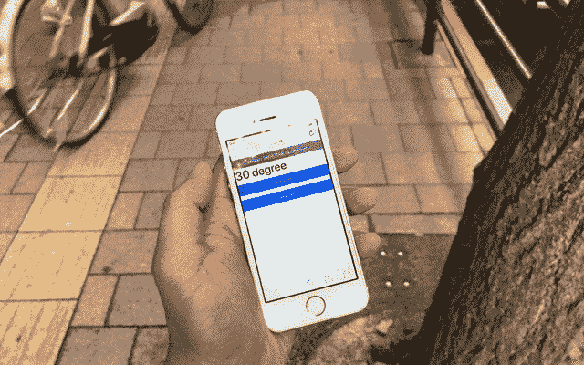
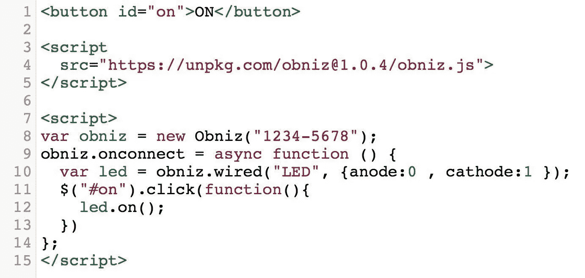

# 用智能手机随时随地控制交流电源——DIY 智能家居

> 原文：<https://medium.com/hackernoon/control-ac-from-anywhere-with-smartphone-diy-smart-home-d1320ac373a8>



这款远程交流控制器可以让你用智能手机从外面测量室温和开关空调。你可以在到家之前打开空调，舒适地待在家里。让我们用 [obniz](https://obniz.io/) 来制作 DIY 空调遥控器吧。

# 这个项目中使用的东西

[奥布尼斯](https://obniz.io/)

红外模块

LM32DZ

智能手机

# 步骤 1 —设置 obniz

要开始，你需要做的就是遵循三个步骤。
1。将 [obniz](https://obniz.io/) 连接到 wifi
2。将 LED 或电机等设备连接到[obniz](https://obniz.io/)3。扫描 [obniz](https://obniz.io/) 的二维码，开始编程。你不需要安装任何软件。

# 第二步

将 IR 模块和 LM32DZ 连接到 [obniz](https://obniz.io/) 上，如下所示，并将其放置在您的家中。


# 第三步

写程序段写的程序。您需要将程序中的 [obniz](https://obniz.io/) ID 更改为您的 ID。通过点击“保存&打开”，可以看到房间温度。


# 第四步

记录空调的开/关信号。

示例程序包含 IR 接收器的注释输出代码。去掉注释，记录下你的空调开/关信号。你的信号会显示在日志里。

将记录的数据数组写入您的程序。

# 用它！

用智能手机在网络浏览器上打开 HTML。你可以在世界任何地方控制你的空调！

# Obniz 是什么？

Obniz 是一个云连接物联网开发板。你可以在任何智能手机或电脑的网络浏览器上编程，命令通过互联网经由 obniz cloud 发送到 obniz。通过 wifi 将 Obniz 连接到云，用户可以远程控制物理连接到 [obniz](https://obniz.io/) 的设备。


[Obniz](https://obniz.io/) 有 12 个 IO 和 WiFi-BLE 模块。它可以通过 [obniz](https://obniz.io/) 云上的 API——REST 或 web socket API——来控制。通过互联网远程控制 [obniz](https://obniz.io/) 不仅可以使用简单的 IO 开/关，还可以使用 UART、I2C、BLE 等。连接 [obniz](https://obniz.io/) 只需要通过扫描二维码输入唯一 ID。复杂的流程由 [obniz](https://obniz.io/) 及其云完成。你可以用 HTML 开始编程，浏览器和电路已经集成在一起了。如果您编写一个程序来收集传感器值，您可以很容易地制作一个值的图表。



在硬件方面，每个 IO 都可以驱动到 1A，并提供过校正保护，因此电机等高电流要求设备可以直接连接到 Obniz IO。GPIO 和 AD 可以在每个 IO 上使用。UART、SPI 等外设可以分配给每个 IO。甚至输出电压 3v/5v 也可以通过软件改变。大多数电气部件可以直接连接。开关、有机发光二极管显示器和 BLE 等嵌入部件已准备好用于项目。


# 程序

```
<!-- HTML Example --><html><head><meta name="viewport" content="width=device-width, initial-scale=1"><link rel="stylesheet" href="https://stackpath.bootstrapcdn.com/bootstrap/4.1.1/css/bootstrap.min.css"><script src="https://obniz.io/js/jquery-3.2.1.min.js"></script><script src="https://unpkg.com/obniz@1.6.1/obniz.js"></script></head><body><div id="obniz-debug"></div><h1 id="temp">Measuring...</h1><p><button id="on" class="btn btn-primary btn-block">Turn ON</button></p><p><button id="off" class="btn btn-primary btn-block">Turn OFF</button></p><script>var obniz = new Obniz("OBNIZ_ID_HERE");obniz.onconnect = async function () {//var sensor = obniz.wired('IRSensor', {vcc:0, gnd:3, output: 2});//sensor.start(function (arr) {//  console.log('detected!!')//  console.log(JSON.stringify(arr));//})// Javascript Examplevar tempsens = obniz.wired("LM35DZ",   { gnd:7 , output:8, vcc:9});tempsens.onchange = function(temp){$("#temp").text('' + parseInt(temp)+ ' degree')obniz.display.clear();obniz.display.font('Avenir', 60)obniz.display.print('' + parseInt(temp) + '℃')};var infraredLed = obniz.wired('InfraredLED', {anode: 1, cathode: 3});$("#on").click(function(){// your value for ON here.infraredLed.send([])})$("#off").click(function(){// your value for OFF hereinfraredLed.send([])})}</script></body></html>
```