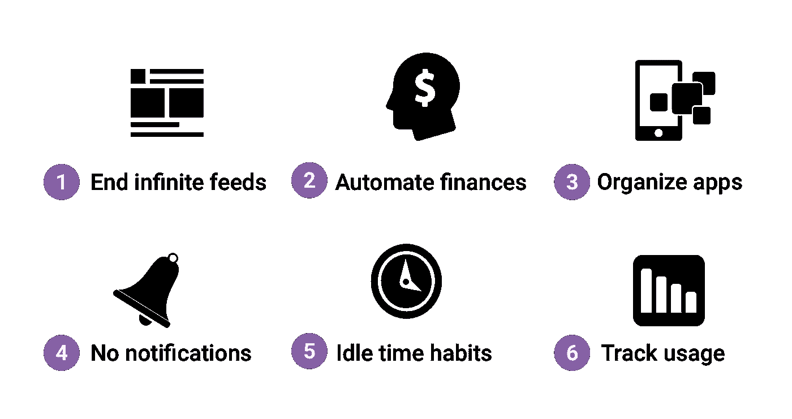
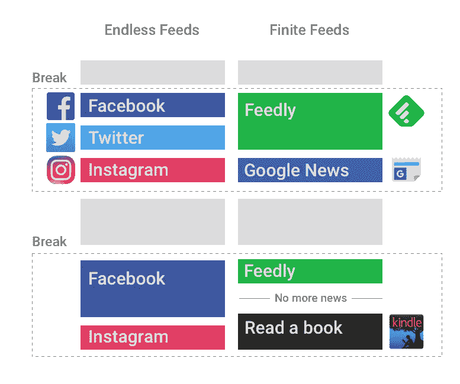
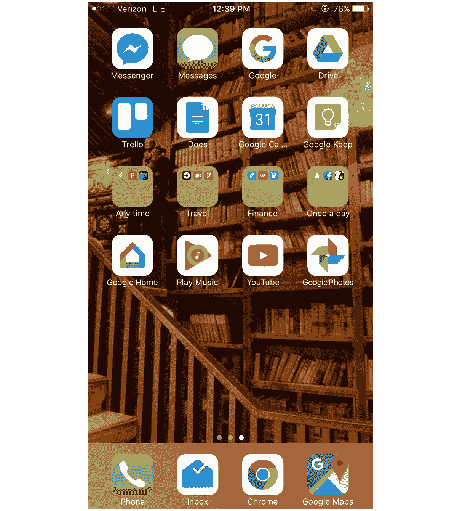
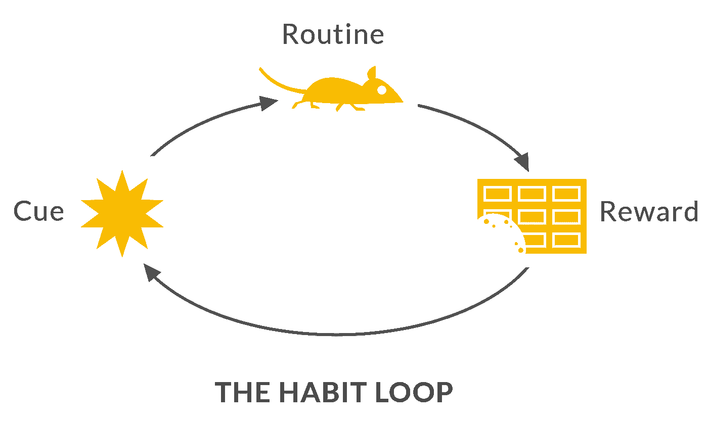

# 控制技术，而不是相反

> 原文：<https://medium.com/hackernoon/control-technology-not-the-other-way-around-f518edf1e4ee>

## 我是如何生活的

这篇文章是我分享帮助我组织生活的个人“系统”的一部分。通过分享我的系统，我希望得到反馈并激励其他人也来分享。

过去几周对许多人来说是技术使用方面的觉醒。脸书也许从来没有像现在这样受到消费者的关注，#DeleteFacebook 活动甚至影响到了[埃隆马斯克](https://www.bloomberg.com/news/articles/2018-03-23/tesla-spacex-pages-vanish-as-musk-joins-deletefacebook-crusade)和 [WhatsApp 联合创始人](https://www.firstpost.com/world/delete-facebook-and-forget-about-it-says-whatsapp-co-founder-brian-acton-4400189.html)。让我们借此机会观察并有意识地重新设计我们的互联网使用。

> “技术正在劫持我们的思想和社会。”——特里斯坦·哈里斯，[人道技术中心](http://humanetech.com/)

正如我之前讨论的那样，我们需要思考技术如何才能停止操控用户的注意力。相反，技术如何促进有意义的互动和“时间的合理利用”，这是特里斯坦·哈里斯的人道技术中心创造的一个短语。就个人而言，解决方案似乎不是删除或放弃技术，而是健康和谨慎的技术参与。

以下是我有意使用技术的六种方法。

Iconography via The Noun Project. Gregor Cresnar, Bin Hur, Alexandr Cherkinsky, Ivan Garbev, Theo K, GR

# 1)杜绝无限进给

无限订阅通常对公司有利，但对用户不利。我试图尽可能结束我的无限提要，并远离使用激励无休止滚动的技术。你可以在这里阅读更多关于[我的有限新闻系统。](https://hackernoon.com/how-i-live-my-finite-news-system-9389631f05d8)

在桌面上，我使用 [News Feed Eradicator Chrome 扩展](https://chrome.google.com/webstore/detail/news-feed-eradicator-for/fjcldmjmjhkklehbacihaiopjklihlgg?hl=en)屏蔽了我的新闻订阅。在手机上，我通过手机浏览器登录 facebook.com(我没有安装这个应用程序，因为我不想太频繁地登录)。iOS 用户的另一个选择是 [Feedless](http://feedless.me/#/) ，它可以在移动 Safari 浏览器中阻止无休止的 feeds。

Endless feed models never truly “end” — you can spend all of your breaks constantly getting more information. Finite feed models will eventually run out of content, forcing you to find a new thing to do after you’re done consuming information.

虽然管理信息消费确实需要管理成本，但额外的管理将帮助你专注于了解你关心的事情，而不是金·卡戴珊今天早上拍了多少张自拍。

# 2)财务自动化

尝试一种“设置好就忘了”的个人理财方法。设置自动循环支付，停止在比特币和细价股上赌博。尽管比特币已经得到了令人难以置信的大肆宣传，但它仍然是一种高风险的投资，不适合大多数金融系统。你可以更详细地了解我的整个财务系统。

# 3)使用微调原则组织你的应用程序

理查德·塞勒是最近的诺贝尔经济学奖获得者，也是《T2 推动:改善关于健康、财富和幸福的决策》一书的作者。在他的书中，他将“选择架构”描述为一种构建你的环境以激励期望决策的方式。例如，把蔬菜放在眼睛的高度，把甜点放在看不见的地方，可以鼓励健康饮食。

为什么不把同样的原理应用到你的主屏幕上呢？我的 iPhone 主屏幕看起来是这样的:

我故意“隐藏”了一些常见的让人分心的应用(Snapchat、脸书等。)背后一个“每天一次”的群体。这不仅提醒我不要太频繁地使用应用程序，而且也增加了打开应用程序的额外摩擦，因为它是两次点击，而不是通常的一次点击。你可以在这里了解更多关于[我的完整 iPhone 组织。](https://hackernoon.com/how-i-live-my-iphone-home-screen-ec8f82b6707d)

# 4)没有徽章，没有通知

我真的相信[缓慢的网络运动](http://theslowweb.com/)，这是为了让你作为用户能够选择何时与网络互动，而不是相反。因此，我禁用了我的大多数应用程序的徽章和通知(你可以在设置应用程序中这样做)。

> 徽章是那些带有数字的红色小圆圈，出现在 iOS 应用程序的右上角。

# 5)养成空闲时间的健康习惯

在空闲的时候，大多数人的第一反应是拿出手机查看通知。正如查尔斯·杜希格在他的书[习惯的力量](https://amzn.to/2pNttA9)中提到的，有一个经典的反馈循环驱动着这种行为:

提示是空闲时间，例行程序是检查你的手机，奖励是你可能会在上周发布的个人资料照片上获得一个“喜欢”的机会。打破这种循环的一个关键是改变常规——不要在无聊的时候查看手机，而是做一些简单的健身操，或者打电话给朋友。我个人有空的时候尽量看实体书而不是手机，或者[直接上我的 Kindle app](https://hackernoon.com/how-i-live-reading-books-so-they-last-6f93c7e7d702) 。

# 6)跟踪你的技术使用情况

对你的技术使用保持警惕和深思熟虑总是很重要的。这就是为什么有几个很棒的工具可以帮助监控你的使用情况。最受欢迎的几个包括[改期](https://www.rescuetime.com/)、[时刻](https://inthemoment.io/)和 [Checky](http://www.checkyapp.com/) 。

甚至不一定是 app！只要确保安排一些有规律的反思时间。

花点时间回顾一下你的技术使用情况。你在哪里花了比你希望的更多的时间？试着有意识地设计一些方法，让你专注于自己的目标，合理利用时间。

我很想听听避免技术成瘾的其他策略——请在下面评论！如果你觉得这篇文章有帮助，请鼓掌👏并在下方订阅！