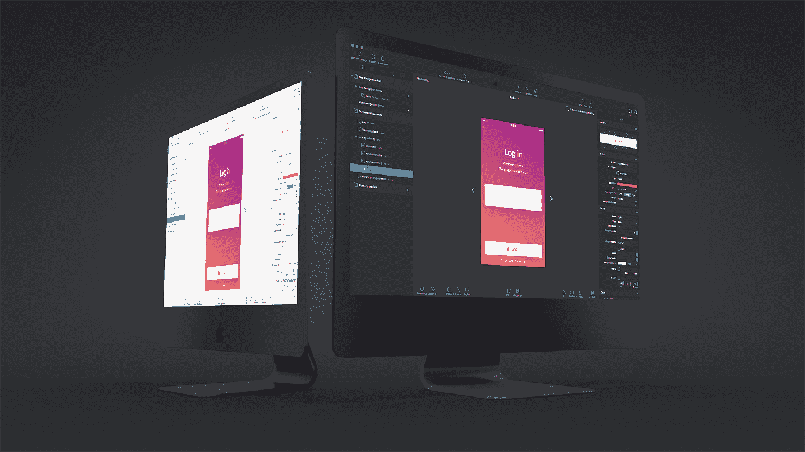

# 在几分钟内将设计转化为原生移动应用

> 原文：<https://medium.com/hackernoon/convert-designs-into-native-mobile-apps-in-minutes-40548a542bbf>

[**Supernova Studio**](https://www.supernova.studio/) 是一款桌面 Mac OS X 应用程序，允许您采用移动应用程序的任何设计，并使用独一无二的预测算法将其从设计数据(即草图文件)转换为工作的移动应用程序。结果包括本地组件、响应性布局、所有资产、代码和本地化。大多数任务的自动化程度超乎您的想象，以前需要数百小时的任务现在只需几分钟。

[**凯文威廉大卫**](https://www.linkedin.com/in/kevinwilliamdavid/) 采访了 [**Nav Nouhi**](https://www.linkedin.com/in/navnouhi/) ，首席收入官 [**超新星**](https://siftery.com/supernova) 了解更多。

## 嗨，Nav，告诉我们你在做什么？

Supernova 是一个面向代码的设计平台，旨在加速移动设计人员和开发人员的应用开发流程。Supernova Studio 允许将应用程序设计完美转换为原生 iOS、Android 和 React 原生代码。

Studio 可在几分钟内将草图设计转换为本地和生产组件，如按钮、标签、图像、表格等。这仅仅是个开始，Studio 采用高度先进的试探法和分析，允许自动导出资产、本地化、动画和代码..更多，没有开发人员。

Supernova Cloud 是 Supernova 的协作平台，设计师和开发人员可以直接从他们的团队或客户那里收集反馈，进行调整并重复这个过程，直到满意为止。与其他协作解决方案相反，Supernova Cloud 允许用户审查真实的工作应用程序，而不是原型，原型可以立即转换为代码，没有任何妥协。

## 告诉我更多关于你为什么要建立这个的信息？

Supernova 开始于个人的挫折，因为我们厌倦了前端开发的重复和乏味的任务。我们所有人都在某种程度上使用过移动应用程序，所以我们已经看到了相同问题的可能变化。我们认为 Supernova 改变了困扰行业的越来越多的问题，如重复、没有时间真正完善应用程序或只是进入开发所需的入门级知识(我们认为 Supernova 是初学者的一个很好的教育工具)。

对开发人员的高需求和不断增长的需求。满足这一需求的唯一方法是在缺少自动化的地方添加自动化。移动开发和将设计交给开发人员是一个缓慢、乏味的过程，会挫败创新。

Supernova 以无缝的方式自动化了许多标准的开发人员任务(资源导出、设计创建、响应性布局)，完美地适应了开发过程。Supernova 生成了生产就绪代码，可用于进一步迭代应用程序，节省了无数时间。

## Supernova 与市场上已经存在的产品有何不同？

[Native Studio by Neonto](https://medium.com/u/634a4556db7e?source=post_page-----40548a542bbf--------------------------------) 、[泽普林](https://medium.com/u/5d3d19cfe01?source=post_page-----40548a542bbf--------------------------------)、 [Avocode](https://medium.com/u/b3d7a592511?source=post_page-----40548a542bbf--------------------------------) 和[漫威](https://medium.com/u/13fbc62fd646?source=post_page-----40548a542bbf--------------------------------)。这些是当今设计师和开发人员用来为客户创建原型或从设计中提取信息的主要工具。这些工具对于原型开发是有用的，但是它们都没有解决将应用程序屏幕以原生代码的形式交付给开发人员的主要挑战。

Supernova 提供带有本机组件的生产代码。当所有其他工具制作图像动画时，我们制作实际的按钮和过渡动画。虽然有些工具提供代码片段，但我们使用最新的技术和标准生成整个屏幕。Supernova 不会中断一个人的工作流，而是通过使用草图文件作为信息源和输出当前由开发人员交付的资产来增强它。

## 谁用 Supernova？您的客户在他们的公司中担任什么样的角色？

我们的目标客户是移动设计者和开发者。我们的目标是让设计师无需学习一行代码就能实现他们的设计，并为开发人员释放资源，使他们能够构建创新的应用。我们的客户可能是自由职业者、应用程序开发机构、初创公司、企业，只要你能想到的。真的，任何在 iOS、Android 或 React Native 上拥有移动业务的人。

从设计和开发的角度来看，我们的客户是真正实现这一目标的人。他们是艺术家和工程师，以移动应用程序的形式将想法变为现实。通过消除重复和乏味的编码时间，我们相信我们的客户将产生创新和迷人的应用程序。

## 您的客户如何使用 Supernova？你能分享一些不同的使用案例吗？

使用 Supernova 的用户主要有两类——开发人员和设计人员。开发人员使用 Supernova 进行非常快速的移交，这在以前是不可能的。虽然其他服务会为您创建 UI 某些方面的代码片段，但 Supernova 跳过了这一步，为该平台生成完整的 UI，使开发人员能够专注于需要创造力和人情味的代码。

另一方面，设计师现在拥有了他们渴望已久的能力——不用学习编码就能把设计变成现实。通过构建整个 UI 端，开发人员和设计人员之间不必要的来回交流就不复存在了——设计人员只需将开发人员可以构建后端的完全编码的 UI 交给他们。

## Supernova 有没有您没有想到或预料到的独特用例？

在通常的用例中——快速而精确地将设计转换为实际的工作应用，我们观察到了相当多的用例，我们最初认为这只是一个边缘用例——但现在明确证明我们已经创建了一个对很多人有用的非常通用的工具。

其中之一是创业世界中的快速高保真原型制作。以前，甚至启动最基本的 MVP 都需要几周到几个月的时间，但有了 Supernova，设计师们可以每周有效地对应用程序进行多次迭代，根本不必等待任何编码工作完成。一旦 MVP 稳定并最终确定，编码人员就可以开始工作并完成后端集成等。—你只想做一次的工作。

另一个非常有趣的角度是，Supernova 能够教会程序员和设计师如何正确地创建应用程序。我们有数百名设计师正在使用 Supernova 学习前端编码的基础知识，他们只是通过实验、绘制不同的设计和阅读 Supernova 的输出。学生和第一次学习代码的人也一样。诚然，通过实例学习是快速掌握概念的最快方式，Supernova 允许全新层次的互动——在学习的同时为您创建教育材料。

## 有什么早期的“成长秘诀”或策略促成了你现在的成功吗？

我们全心全意地相信，建立一个强大的产品需要一个令人惊叹的社区，这从一开始就是我们的关注点。当事情不顺利时，我们一直在用户身边，与他们一起工作，以确保他们满意——即使这意味着花费额外的时间来开发一个功能或 bug，以使一个用户满意。

这些人成了传道者、好朋友，给了我们所能要求的最好的反馈。与真实的人一起工作，而不“盲目”，确实是了解你的用户群的最佳方式，也是一个人的产品取得成功的最佳途径。

永远完全公开和诚实已经成为我们公司的座右铭。我们的用户知道期待什么，即将到来什么，以及我们希望在[未来](https://hackernoon.com/tagged/future)把它带到哪里。(当然，我们仍然保留一些东西作为惊喜——因为谁不喜欢好的惊喜呢？)

## 在早期构建产品时，最大的挑战是什么？你是如何解决的？

与一些能够负担得起半成品 MVP 的创业公司相反，我们与[技术](https://hackernoon.com/tagged/technology)作斗争，很多次我们问自己这是否可能。雷德·霍夫曼的名言“如果你对你的产品的第一个版本不感到尴尬，那你已经推出太晚了”，在这种情况下，并不适用于我们。

我们的开发人员和设计人员期望他们收到的代码具有一定的质量，由于许多公司甚至未能自动化开发的最小方面，我们必须确保它是正确的。

出于这个原因，在公开测试版发布之前，我们在 Supernova 上工作了近 3 年——有时我们无法继续。最终，我们到达了终点线。在我们有机会向任何人展示之前，坚持不懈和专注于目标是我们成功或失败的唯一决定因素。

## 最后，你运营公司所依赖的顶级产品是什么&你如何使用它们？

我们是一家自动化初创公司，所以我们自己使用了相当多的自动化——无论是电子邮件、支持还是只是运行新版本部署等日常操作。我们使用许多服务，因为节省几分钟的时间，通常还是值得的。以下是我们很荣幸与之合作的一些产品:

*   [Slack](https://medium.com/u/26d90a99f605?source=post_page-----40548a542bbf--------------------------------) 我们独自利用社区渠道建立了我们的整个社区，没有它 Supernova 就不会有今天..Slack 在集成和简单易用方面表现出色。
*   [**AWS**](https://siftery.com/amazon-s3)&[**谷歌云引擎**](https://siftery.com/google-app-engine) 运行我们整个云服务和网页
*   [**Firebase**](https://siftery.com/firebase) 现在也是 Firestore 为我们的实时服务提供动力。我们喜欢这项服务，它让我们可以快速迭代
*   [Stripe](https://medium.com/u/3ecae35d6d66?source=post_page-----40548a542bbf--------------------------------) 用于管理付款、发票等。在时间紧迫的情况下，这一切几乎是不可能实现的(在初创企业中总是如此)
*   [对讲机](https://medium.com/u/7ca8972daf76?source=post_page-----40548a542bbf--------------------------------)为整个客户提供支持。我们的网站上同时有数百人，而我们的团队只有 6 个人，但我们仍然平均用不到 3 分钟来回答每一个问题——只有通过对讲机的良好设置才有可能

【siftery.com】最初发表于**。**