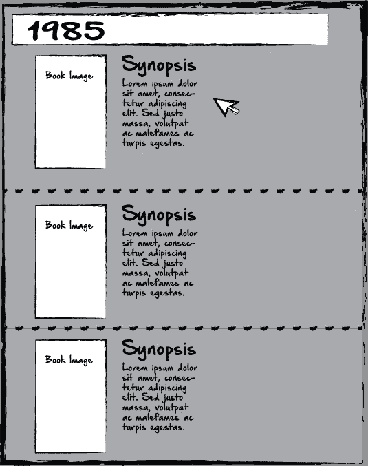

# 使用 JavaScript 和 JQuery 将多页面布局转换为干净的 SPAs

> 原文：<https://medium.com/hackernoon/converting-multi-page-layouts-to-clean-spas-with-javascript-and-jquery-415bfe2d37a7>


让我从一个简单的场景开始。在下面的例子中，我们有一个用户 Bill，他想访问我们的图书数据库。他搜寻 1985 年以来的书籍。我们进行 API 调用，并将结果传递给页面。这里的主要问题是，一旦检索到数据，我们应该如何显示它？


上面是一个非常典型的显示数据的布局。数据加载后，顶部的搜索栏和搜索栏下方的结果。然而，这产生了一个小问题，滚动。现在，我们要求用户滚动浏览如此多的数据来找到他们想要的东西。也许比尔不介意。但是假设他在搜索一本 1985 年的不知名的书。如果他看到标题，也许他会认出来，但是他必须一路滚动到底部，然后翻到第 2 页，第 3 页，第 4 页才能找到。我们要求 Bill 做的事情可能是这样的:



现在，平心而论，这是非常典型的，因此，作为用户，我们已经从许多网站中期待这一点，所以普通用户可能不会介意。但是，为了公平起见，让我们使用 JavaScript 和 JQuery 为 Bill 创建一个更优雅的单页设计。我喜欢先说出我的想法，所以我的想法是这样的:


在这个粗糙的例子中，我们已经完全清理了场地，并留下了大量的呼吸空间和负空间，我相信比尔会喜欢的。我们已经创建了一个侧面板，所有的控制将。用户将在这里搜索，并在同一个面板中看到结果。在我们的简单例子中，我们甚至不需要显示每本书的所有数据。我们可以简单地显示每本书的标题。然后，当点击它时，完整的概要、图像和信息将出现在主要内容区域。

在这种情况下，数据并不重要。这可能是玩具飞机，书籍，电子游戏，或公主娃娃。无论哪种情况，对我个人来说，我更喜欢简单、干净的单页设计。

# 第一步:HTML

HTML 可能非常简单。

```
<body>
    <div id="sidepanel" class="sidepanel">
<input id="input" placeholder="what do you want?" />
<button type="submit" id="submitBtn">Go</button><div id="dynamicSideContent">//--Content goes here--//
</div></div>
<div id="content" class="content">//--Content goes here--//</div></body>
```

根据不同的场景，这确实是我们所需要的。是的，最终我们会用一个横幅、一个标志和所有真实网站通常有的东西来美化它。但是最终，由于我们所有的数据都是动态生成的，这就是我们所需要的。

我们有:

## a)侧板

> 1)搜索栏
> 
> 2)内容加载区

## b)内容部门

> 1)内容加载区

# 步骤 2:进行 API 调用

```
 $(window).load(function() {
      console.log("talking");fetch('[myApi_URL_thingy').then(function(response)](https://api.mlab.com/api/1/databases/presentation-maker/collections/ldsScriptures?&l=41994&apiKey=T_4ma8aw6AyAhVzAcfzCpxEKDJqxffrn').then(function(response)) {
          if (response.status != 200) {
            window.alert("Oopsie Daisy");
            return;
          }response.json().then(function(data) { 
```

# 第三步:解析数据

我们现在有了某种形式的数据。我们在这里的最终目标，是得到一些书名，或任何东西，显示在我们的侧面板。在这样做时，我们可能会面临几个问题:

## 问题:

每个按钮对应于我们数据中的一本书。每个按钮里面都有一个书名。我们不想使用链接，因为它会将我们导航到一个新的页面。相反，我们希望将它显示在右侧的内容区域。如果我们使用链接，我们可以简单地将链接存储在数据文件中。当用户点击一个链接时，我们将提取那段数据，访问 url 并重定向用户。但是我们不想那样做。为了解决这个问题，我们需要动态地为每个按钮创建 id，然后在按钮 id 中存储关于每本书的数据，以便我们可以在内容区域访问和显示它。我们可以在解析数据时使用 for 循环来实现这一点。

在下面的例子中，我将使用我们的用户 Bill 按作者而不是日期搜索的场景，因为这样更有趣。

```
let input = document.getElementById('input');
            let submit = document.getElementById('submitBtn');
            submit.onclick = searchData;function searchData () {
              let currentBook = [];
              let input = document.getElementById('input');
              for (var i = 0; i < books.length; i++) {
                let val3 = input.value;
                let val2 = val3.toLowerCase();
                let value = val2.replace(/ /g, '');
                let text3 = books[i].author;
                let text2 = text3.toLowerCase();
                let text = text2.replace(/ /g, '');
                console.log(text.indexOf(value) >= 0);
                console.log(text);
                console.log(value);
                if (text.indexOf(value) >= 0) {
                  currentBook.push([books[i], i]);
                }}
```

我在这里所做的，是试着去想一个用户可能会做什么。比尔可能想要一本劳拉·英格拉姆博士的书。但是，可怜的比尔，他的记忆正在衰退……他所能记得的只有“劳拉”。因此，他通过在输入中提交“Laura”来搜索作者。上面所做的，是将输入转换成小写，然后删除输入中的任何空格。然后对于当前的 API 条目，我对作者做同样的事情。这样，如果 Bill 搜索“Laura ”,实际作者被列为“dr . Laura Ingram ”, JavaScript 实际上是在比较这两个字符串:

“劳拉”和“劳拉博士”。

如果我们没有这样做，那就是比较:

从“劳拉”到“劳拉·英格拉姆博士”，

用大写字母和额外的空格来匹配结果可能会更困难。我们想比较苹果和苹果，而不是苹果和橘子。现在我们有两个相似的字符串，我们这样做:

```
if (text.indexOf(value) >= 0) {
                  currentBook.push([books[i], i]);
                }
```

现在我们有了这两个字符串，我们要做的是查看当前可迭代的图书作者是否包含用户输入的子字符串。因为“dr.lauraingram”确实有子字符串“laura ”,所以它会匹配。现在，再一次，这可能会产生一系列我们必须解决的其他问题，比如很多结果不是比尔想要的，但我们不要忘记，是比尔的错，是他的记忆问题让我们陷入了这场混乱！继续前进…

无论如何，在这一点上，我们应该有 Bill 正在搜索的书，我们正在显示它，并且在侧栏中显示任何其他匹配。但是请记住，我们希望以某种方式将书的内容放在按钮 Id 中。

我们刚刚将所有匹配的书籍推送到一个名为 currentAuthor 的数组中。让我们用一个 for 循环来分析这个数组，并使用反勾号来创建按钮。然后我们将使用模板表达式将 ID 插入到按钮中。

```
for (var i = 0; i < currentBook.length; i++) {
                currentBook[i] = `
         <button id="id_${currentBook[i][1]}" class="btn7">
           ${currentBook[i][0].author}-${currentBook[i][0].title}
         </button>
                `;
                document.getElementById('dynamicSideContent').innerHTML += currentQuote[i];
              }
            }
```

所以，我在这里所做的是循环通过当前的书。然后，对于数组中的每个条目，我用一个模板表达式给它赋一个新值。模板表达式只包含一个带有 ID 的按钮、一个类和按钮内的文本:

```
<button id="id_${currentBook[i][1]}" class="btn7">
  ${currentBook[i][0].author}-${currentBook[i][0].title}
</button>
```

现在，如果你注意到了，当我循环遍历我的初始 book 数组时，我将匹配的 books“books[I]”，但是我也将迭代号“I”，都推到了一个数组中。因为每个迭代编号都是唯一的，所以我可以把它作为我的按钮 ID 的一部分，我就是这样做的。模板表达式中定义的按钮是:

```
id_${currentBook[i][1]}
```

但是，这意味着每个图书 ID 实际上将是“id_1”、“ID _ 2”…等等。

还有一点需要指出的是，班级是“btn7”。因为我们不能在 JavaScript 中访问这些 ID，所以我们实际上将首先使用 JQuery 来访问该类，然后在访问该类之后获取 ID。我们将简单地在每次点击按钮时都这样做。

伪代码应该是，“如果一个 btn7 类的按钮被点击，做一些事情”。

在 JQuery 的帮助下，我们可以这样写:

```
$(document).on('click', '.btn7', function () {
              let currentBook = [];
              let id = this.id;
              let currentId = id.split("_");
              let idNumber = parseInt(currentId[1]);
              let disregard = parseInt(currentId[0]);
              for (var i = 0; i < books.length; i++) {
                if(i == idNumber ) {
                  currentBook.push(books[i]);
                }
              }
```

我在这里所做的就是。我们监听任何点击“btn7”类按钮的时间。我们知道 button 有一个 id，所以我们用“this.id”访问它，并将它赋给一个名为“ID”的变量。然后，我们拆分 ID 字符串:

```
let currentId = id.split("_");
```

我们的 id 都是以“Id”开头，后面跟着下划线，然后是数字。string.split()会把它变成一个数组，我们现在不需要 id，或者下划线…我们只需要数字。我们通过将 currentID 变量转换成一个数字来得到它

```
let idNumber = parseInt(currentId[1]);
```

然后，在我们的 for 循环中，我们查看 idNumber 是否匹配当前图书的迭代。如果有匹配的，那就是我们想要的。

```
for (var i = 0; i < books.length; i++) {
                if(i == idNumber ) {
                  currentBook.push(books[i]);
                }
```

当我们最初搜索数组时，我们保存了那个索引值，然后我们再次使用它来确保我们匹配用户点击的动态按钮。

现在 Bill 点击了他想要的东西，我们需要在我们的内容区域显示它。我们将使用之前创建的相同的模板表达式格式，并将其发送到 HTML。

```
for (var i = 0; i < currentBook.length; i++) {
                currentBook[i] = `
                <span class="container">
                <h1 class="bookTitle">${currentBook[i].author} - ${currentBook[i].title}</h1>
                <p class="synopsis">${currentBook[i].text}</p>
                </span>
                `
              document.getElementById('content').innerHTML += currentBook[i];
              }
```

此时，我们只是用 for 循环解析刚刚创建的数组。除非我们还需要对这些数据做些什么，否则我们不需要再次创建 ID，但是如果需要的话，我们可以再次这样做。在这里，我们只需点击一下按钮，将匹配的书籍放到主显示屏上。

同样，有很多很多方法可以做到这一点，可能有很多比我的方法更好更简单，但我认为这至少是朝着正确方向迈出的一步。如果你有任何反馈，请告诉我。谢谢！