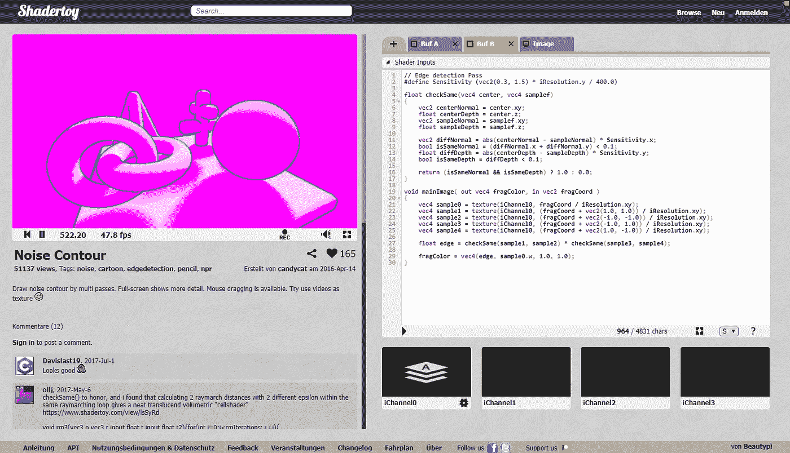

# 将着色器从 Shadertoy 转化为 ThreeJS

> 原文：<https://medium.com/hackernoon/converting-shaders-from-shadertoy-to-threejs-fe17480ed5c6>

马库斯·纽伊和 T2·德克·克劳斯

如何将着色器从 Shadertoy 转移到 ThreeJS ( [德意志版](/@markus.neuy/postprocessing-shader-mit-shadertoy-und-threejs-8164600c6c76))。

# 介绍

作为阳狮 Pixelpark 创新实验室研究的一部分，我们研究了如何在网络技术中使用低级语言。明显的选择似乎是 [asm.js](http://asmjs.org/) 或 [WebAssembly](http://webassembly.org/) 。

但是您也可以使用 WebGL 着色器来解决面向机器的问题。着色器是用类似于 C/C++的语言编程的，虽然它们主要不是为了解决一般问题，但它们可以用于更多的事情，而不仅仅是渲染图像和 3D 场景。
第二个动机源于可以通过着色器实现的视觉效果。2002 年，威斯康星大学麦迪逊分校的一群学生发布了 [NPRQuake](https://research.cs.wisc.edu/graphics/Gallery/NPRQuake/whatIsIt.html) (“非真实感渲染之锤”)，这是知名游戏 Quake 通过在渲染管道中注入代码的变体。

NPRQuake Screenshot

这种变化的美学质量是惊人的；我们立即意识到这种效果可能会改变项目的游戏规则。虽然在 2002 年，这种变化只能通过为 OpenGL 编写驱动程序来实现，但现在在 2018 年，可以通过着色器来实现——甚至在 web 浏览器中。

因此，当我们最近参与一个艺术项目时，我们决定尝试一下着色器。

# 着色器代码的可用性

如果你真的不习惯编程着色器，那么显而易见的选择是搜索免费提供的示例并使用它们(仔细查看所涉及的许可证)。另一个例子是 [Shadertoy](https://www.shadertoy.com) 和 [ShaderFrog](https://shaderfrog.com) 。

因为在我们决定用来自 ThreeJS 中 Shadertoy 的后处理着色器来发布我们的发现之前，我们已经成功地与 ThreeJS 一起工作了。

# ThreeJS 中的着色器

ThreeJS 可用于利用改变整个渲染图像的后处理着色器以及可改变 3D 对象材质的材质着色器。这两种类型都需要顶点和片段着色器部分；顶点着色器可以更改顶点在 3D 中的位置，而片段着色器通常会替换渲染图像的颜色。

这张图片展示了四种可能的变化。

Types of shaders

在左上角，后处理着色器向渲染图像添加颜色渐变。在它的右边，一个顶点着色器减少了渲染区域。下面的两幅图像显示了材质着色器；左边的只改变颜色，而右边的改变顶点的位置。由于着色器始终由顶点和片段部分组成，最后一个示例也更改了颜色。

# Shadertoy

## Shadertoy 的小例子

2014 年，我们研究了如何将着色器从 Shadertoy 转移到 ThreeJS，首批结果发布在 [StackOverflow](https://stackoverflow.com/a/37508079/573216) 上。我们发现以下模式很有用:

*   添加[阴影具体变量](https://www.shadertoy.com/howto)如 **iGlobalTime** 等。
*   将 **mainImage(out vec4 z，in vec2 w)** 重命名为 **main()**
*   将 **z** 重命名为 **gl_FragColor**

通过遵循这种模式，你可以将一个简单的着色器转换成三个着色器。

[Trivial Shader](https://jsfiddle.net/dirkk0/zt9dhvqx/)

## 来自 Shadertoy 的重要示例

对于一个更复杂的着色器，你需要做更多的事情，正如我们现在将要概述的。对于一个重要的例子，我们选择了**噪声轮廓**由 [**candycat**](https://www.shadertoy.com/user/candycat) ，因为你遇到了一些问题。你可以在这里找到:[https://www.shadertoy.com/view/MscSzf](https://www.shadertoy.com/view/MscSzf)

此示例还使用着色器语言创建了一个完整的场景。但是在 ThreeJS 中，你通常想要控制 3D 对象，所以我们决定在 ThreeJS 中创建场景，同时仍然利用着色器来改变它。

## 了解着色器的结构

我们首先试图掌握着色器的结构；这可以通过 Shadertoy 的编辑器来实现。因为可以实时看到对代码的编辑，所以我们可以做一些小的改变来理解它是如何工作的。

在实际代码下方，我们看到该代码基于一个名为 **iChannel0** 的通道，其中 **B** 表示一个缓冲区。

要查看这个缓冲区的运行情况，我们注释掉第 37 行并添加以下内容:

结果应该是:

这个简单的改变导致显示前一个缓冲区的颜色，而不是这个缓冲区的结果。

通过检查之前的缓冲区— **Buf B** —我们看到这个也使用了 **iChannel0** ，所以我们仍然没有看到原始的场景创建代码。

利用和以前一样的技巧，我们注释掉第 29 行，并添加一行来计算 uv 和实际颜色，如下所示:

这应该留给我们:

这看起来更像是一个普通的场景。此外， **Buf A** 没有使用另一个缓冲区，所以我们正在查看原始场景创建代码。

# 三个 j 的重建

完整的免责声明:下面的代码绝不是“最佳”代码，而只是以最直接的方式解决问题的一种方法。

## 创建场景

我们首先创建一个稍微简单点的场景，只有一个球体和一个平面。此外，我们想使用 ThreeJS 的 **MeshNormalMaterial** 。

这里显示了一个可能的结果:

Shader in ThreeJS step 0

代码包含在一个名为*index.html*的 HTML 文件中:

我们需要关注 ThreeJS 库的依赖性，并且我们还在 *index.js* 中添加了我们自己的代码:

这段 JavaScript 代码创建了一个渲染器、一个摄像机、一个动态观察控件以及一个带有 **MeshNormalMaterial** 的平面和球体。它还负责窗口大小的改变和渲染。

从 Shadertoy 移植场景的第 0 步到此结束。

Shader in ThreeJS step 0

## 重新创建第一个着色器过程

在下一步中，我们尝试在缓冲区中重新创建第一个着色器渲染步骤；这基本上是将着色器代码复制到 ThreeJS。

结果应该是这样的:

Shadertoy withou the last pass

为了实现这一点，我们为 ThreeJS 使用了 [EffectComposer](https://github.com/mrdoob/three.js/blob/dev/examples/js/postprocessing/EffectComposer.js) ，它提供了一种使用后处理着色器的简单方法。

这将创建一个 EffectComposer 实例，该实例添加一个正常渲染过程和一个附加着色器过程。我们复制变量**顶点**和**片段**中的着色器代码。着色器定义还定义了 EffectComposer 使用的名为 **tDiffuse** 的**统一**。它包含来自上一个渲染过程的图像，该图像将在当前过程中被更改。

使用这个新的渲染步骤，我们显示这个过程而不是原始场景。因此，我们需要添加一些代码来调整大小，因此我们添加:

现在我们需要定义常量**顶点**和**片段**。我们不能使用 Shadertoy 的顶点着色器，所以我们需要定义自己的:

不过，我们确实使用了 Shadertoy 的片段着色器，并将其添加到**片段**:

这基本上创建了着色器，但我们仍然需要解决以下问题:

*   顶点着色器坐标尚未用于片段着色器
    -片段着色器使用了**纹理**，这在当前 WebGL 上下文中是未知的
*   **mainImage** 必须改名为 **main**
*   iResolution 还没有设置。

所以着色器还没有工作。

解决第一个问题产生了这个定义:

现在我们可以用向量 **vUv** 代替**frag coord/ire resolution . xy**。这导致:

现在我们简单地用**纹理 2D** 替换每一次出现的**纹理**。

此外，我们将**主图像**更改为**主图像**，不带参数:

**main** 也应该返回 **gl_FragColor** 而不是定义着色器颜色的 **fragColor** 。

最后，我们需要将 iResolution 添加到制服中。我们通过定义一个存储宽度和高度的 ThreeJS 向量来实现这一点:

现在我们可以将分辨率添加到制服中:

我们需要增强我们的**调整**功能:

重要的是，我们使用实际渲染过程的制服。原作已被 EffectComposer 深度克隆；改变变量**分辨率**不会有任何影响。

因为我们确实定义了两个制服，所以我们需要将它们引入我们的片段着色器，所以我们定义它们:

这就结束了这个着色器过程，如果一切顺利，我们会看到:

Shader Pass 1 without shadows

从蓝色线条中我们可以看出，它通常是有效的，但粉色部分仍然缺失。让我们改变这一点。

## 用阴影解决问题

粉红色的部分不见了，因为 Shadertoy 中的着色器秘密地将阴影渲染到最初不可见的 alpha 通道，如下图所示:

Shadows in Shadertoy

有几种方法可以解决这个问题——我们使用了直接的方法，通过添加一种保持阴影的材料。这些必须在额外的渲染过程中处理。

所以让我们用三个 j 来创建阴影:

阴影需要光线，在这种情况下，需要有方向性的光线:

一个**网状材料**可以容纳阴影。

而新的渲染目标保存它们。

同样，需要一个 **resize** 函数:

现在，我们可以将阴影转移到新的渲染目标，并为着色器做准备:

这些线设置材质，渲染场景，将阴影设置为均匀，并将材质改回 **MeshNormalMaterial** 。

现在，着色器需要了解阴影，以便能够处理它们，因此我们更改了制服:

片段着色器也是如此:

然后我们用我们的影子代替前面的线。

结果应该看起来像 Shadertoy 上的第二步。

Shader step 1

现在，我们只差第二个着色器通道就可以完成了。

## 最终着色器阶段

对于最终的着色器过程，我们添加了另一个 EffectComposer 实例。

让我们定义另一个着色器:

我们为之前的渲染过程停用 **renderToScreen** :

再次，引入了更多的变量； **iTime** 随时间改变变量 **iChannel1** 添加噪声。

Shadertoy Noise and iTime

我们使用三个时钟来计时。

每一次变化，我们都会更新 iTime:

我们给制服添加了时间和噪音:

噪波只是一个噪波纹理(例如 Shadertoy 中的一个)，我们将三个 j 加载到 **tNoise** 中。

现在，我们需要调整片段着色器以适应新的变量，因此我们应用了以下措施:

*   将**主图像**更改为**主图像**
*   定义制服并调整变量
*   定义 **vUv** 坐标
*   将返回的结果更改为 **gl_FragColor**
*   将**纹理**替换为**纹理 2D**

这给了我们:

在这些更改之后，着色器仍然无法编译，因为该着色器需要特定的 WebGL 扩展。谢天谢地，这很容易用三个 j 来补充:

这给了我们以下结果:

Final Shader

这非常接近原始的阴影图:

# 结论

通过以下步骤，我们成功地将复杂的 Shadertoy 着色器转移到 ThreeJS:

*   了解特定着色器的结构
*   实现着色器过程
*   解决可能的 GLSL 不兼容问题
*   创建可选的着色器过程和/或材质
*   激活可选扩展

我们预计这些挑战将随着即将到来的 ThreeJS 中的 WebGL2 支持而得到缓解，因为可能的 GLSL 不兼容性应该会消失。

完整源代码[这里](https://github.com/dirkk0/Shadertoy2Threejs)。

The final result

# 有用的链接和资源

*   Shadertoy 着色器:[https://www.shadertoy.com/view/MscSzf](https://www.shadertoy.com/view/MscSzf](https://www.shadertoy.com/view/MscSzf))
*   webgl 2 基本面:[https://webgl2fundamentals.org](https://webgl2fundamentals.org/](https://webgl2fundamentals.org/))
*   three js:[https://three js . org/](https://three js . org/](https://threejs.org/](https://threejs.org/))
*   三个例子:[https://github.com/mrdoob/three.js/tree/dev/examples](https://github.com/mrdoob/three.js/tree/dev/examples](https://github.com/mrdoob/three.js/tree/dev/examples))
*   Web GL-Extensions:[https://developer . Mozilla . org/en-US/docs/Web/API/WebGLRenderingContext/get extension](https://developer.mozilla.org/en-US/docs/Web/API/WebGLRenderingContext/getExtension](https://developer.mozilla.org/en-US/docs/Web/API/WebGLRenderingContext/getExtension))和【https://github.com/mrdoob/three.js/issues/7379】T2
*   作曲:https://github.com/hughsk/three-effectcomposer
*   另一个 EffectComposer 方法:[https://github.com/spite/Wagner](https://github.com/spite/Wagner](https://github.com/spite/Wagner))
*   WebGL 快速参考卡:[https://www . khronos . org/files/web GL/web GL-Reference-Card-1 _ 0 . pdf](https://www.khronos.org/files/webgl/webgl-reference-card-1_0.pdf](https://www.khronos.org/files/webgl/webgl-reference-card-1_0.pdf))

# 信用

这项研究的一部分由 EFRE 资助。NRW 项目。

