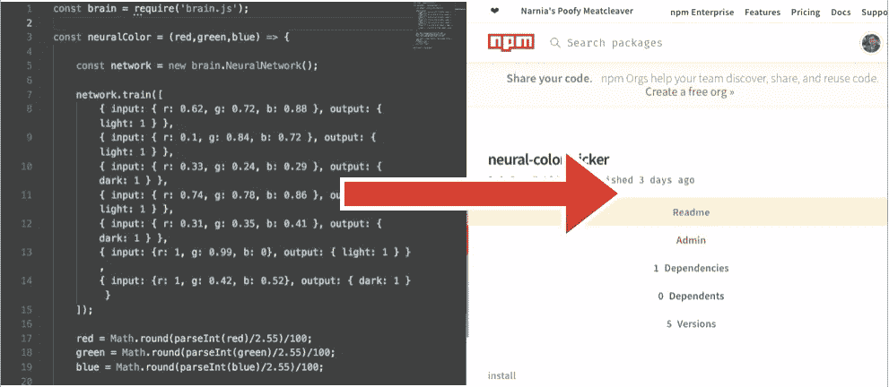

# 将你的 JS 锅炉板转换成 NPM 模块:权威指南

> 原文：<https://medium.com/hackernoon/converting-your-js-boiler-plate-into-npm-modules-the-definitive-guide-3dfa0f9f0a9c>



本指南包含以下几个部分:

1.  为 npm 构建您的代码📑
2.  模块的文件结构📁
3.  发布和使用您的模块💻

`Note : This guide assumes that you have node and npm installed. I will be using module and package interchangeably to refer to your npm module.😄`

# 1.为 npm 构建您的代码📑

npm 模块是可以通过使用 require()包含到 Node.js 程序中的代码片段。就你作者而言，它们是你的文件系统中独立的 Node.js 程序，导出一些函数供其他程序使用。

考虑你的样板 JS:

```
const dependency = require(‘dependency-name’);
//list all requires required by your npm modulefunction yourFunction(args) {
  // operations
  return result;
}
```

只需将函数放入**模块中，就可以将代码转换成 npm 模块。在下面的例子中，我将把函数放在 **const** 中，将其作为变量导出:**

```
const dependency = require('dependency-name');
//list all requires required by your npm moduleconst yourFunction = (args) => {
  //operations
  return result;
}module.exports = yourFunction;
```

编码部分到此为止！🎉

# 2.模块的文件结构📁

1.  创建一个新的项目文件夹，用你想给你的模块和 cd 命名:

```
mkdir module-name
cd module-name
```

将新创建的 js 文件放在这个文件夹中，并将其重命名为模块名`module-name.js`

2.使用`npm init`并回答问卷，如包名、版本等。这会用您提供的信息创建一个 package.json 文件。

最后，用以下字段填充 package.json，使您的模块 SEO 友好。

`Note : Here the 'main' field is important as it is the entry point of your module`

# 3.发布和使用您的模块💻

1.  去[npmjs.com](https://www.npmjs.com/)创建一个账户。
2.  运行`npm login`，输入你的用户名和密码。
3.  现在输入`npm publish`将您的代码发布到 NPM 数据库。前往`npmjs.com/your-package-name`查看您的包裹
4.  如果您想更新您的包，只需更改 package.json 中的“package-version ”,然后再次运行`npm publish`。

要在任何 Node.js 程序中使用您发布的模块，只需使用

`npm i your-package-name --save`

最后，使用你的模块，通过 **require()** 将它包含在你的代码中，然后直接使用你的函数。😄

```
const dependency = require('your-package-name')const desired_result = dependency(args)
```

取得联系！！：

[Github](https://www.github.com/akash-joshi) [NPM](https://www.npmjs.com/%7Eakash-joshi) [领英](https://www.linkedin.com/in/akash-s-joshi) [推特](https://twitter.com/iamkrusty)