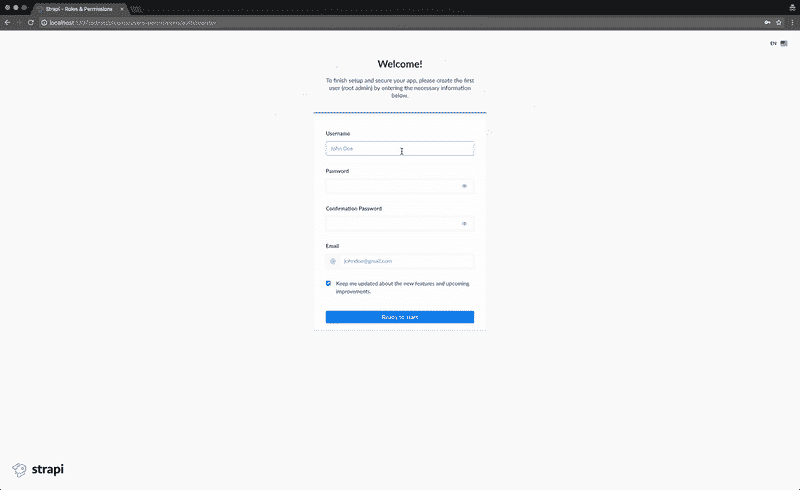

# 🍝用 Next.js (React)、GraphQL、Strapi 和 Stripe 制作一个 Deliveroo 克隆

> 原文：<https://medium.com/hackernoon/cooking-a-deliveroo-clone-with-next-js-react-graphql-strapi-and-stripe-3159b255bd45>

## 本教程改编自 Pierre 的 Nuxt 和 Strapi Deliveroo 克隆版本。

本教程将被改编为在前端使用**next . js**(React)over Nuxt(Vue)，并使用 **GraphQL、Stripe、Strapi 和 React Context** 。

准备开发一个 **Deliveroo 克隆人，使用令人惊叹的技术:**[**next . js**](https://nextjs.org/)**(**[**React**](https://reactjs.org/)**)，**[**graph QL**](https://graphql.org/)**，** [**条纹**](http://stripe.com/) **和** [**Strapi** 从注册到点餐，你将让用户发现餐馆、菜肴并选择他们的快乐套餐。](https://strapi.io/)


最终结果的**演示应该让你饿了:**


*注:* ***源代码*** *是* ***在 GitHub****:*[*https://GitHub . com/strapi/strapi-examples/tree/master/next js-react-strapi-deliver oo-clone-tutorial*](https://github.com/strapi/strapi-examples/tree/master/nextjs-react-strapi-deliveroo-clone-tutorial)。

最终产品的截图:


# 斯特拉皮:

[**Strapi**](https://github.com/strapi/strapi) 是最先进的开源 **Node.js 无头内容管理系统**用于快速高效地构建可扩展、安全、生产就绪的 api，节省开发人员无数的开发时间。

凭借其可扩展的插件系统，它提供了大量的内置功能:管理面板、认证和权限管理、内容管理、API 生成器等。与在线 CMS 不同， **Strapi 是 100%开源的**(看看 [GitHub 库](https://github.com/strapi/strapi))，这意味着:

*   Strapi 是完全自由的。
*   你可以**在你自己的服务器**上托管它，所以你拥有数据。
*   多亏了插件系统，它完全是可定制和可扩展的。

# Next.js:

[**下一个**](https://github.com/zeit/next.js/) 是一个轻量级开发框架，用于在 **React** 中创建静态的、服务器渲染的应用。Next.js 将负责应用程序的繁重工作，如*代码分割、HMR(热模块替换)和 SSR(服务器端渲染)*，并允许我们专注于应用程序。

# 反应:

[**React**](https://github.com/facebook/react) 是最流行的前端 Javascript 框架之一，由 facebook 开发，被包括*网飞、Airbnb 和 Github* 在内的无数科技公司用于构建应用。React 是一个声明性的库，它使创建交互式用户界面变得容易，通过其基于组件的架构保持代码库的组织性。

# GraphQL:

[**GraphQL**](https://github.com/graphql) 也是脸书开发的一种查询语言，允许应用的前端轻松查询应用的 API。每个查询只请求当前视图需要呈现的数据。这使得开发人员能够在多种设备和屏幕尺寸上创造出色的用户体验。

# 条纹:

[**Stripe**](https://github.com/stripe) 是当今应用的支付处理器之一(如果不是最大的)。Stripe 开发了工具和 SDK，允许开发人员轻松地将*安全、合规的支付处理*集成到任何应用中。

# 目录

# 🏗️设置

# 然后

要设置 Next.js，我们需要一个空目录来安装库并托管我们的项目根目录。

我们将把我们的项目分成两部分，一部分用于前端(Next.js 代码)，一部分用于后端(Strapi 代码)。

```
mkdir strapi-deliveroo
cd strapi-deliveroo
mkdir frontend
cd frontendyarn add next react react-dom
```

*注意:我使用 yarn 作为我的包管理器，你也可以使用 npm 并执行* `*npm install --save next react react-dom*`。

将以下内容添加到您的`package.json`文件中:

```
"scripts": {
  "dev": "next",
  "build": "next build",
  "start": "next start"
}
```

因此您的文件看起来像这样(您的包依赖项可能有不同的版本，这取决于安装的时间):

```
{
  "dependencies": {
    "next": "^7.0.2",
    "react": "^16.6.1",
    "react-dom": "^16.6.1",
  },
  "scripts": {
    "dev": "next",
    "build": "next build",
    "start": "next start"
  }
}
```

Next.js 使用`/pages`目录中的任何 JavaScript 文件作为应用程序的路径。要进行设置，只需创建`/pages`目录并添加一个`index.js`文件，包含:

```
mkdir pages
cd pages
touch index.js
```

现在我们有了我们的主路径(index.js)，它将在每次浏览器 URL 位于根位置时被加载(即 [www.yourapp.com)。](http://www.yourapp.com).)要测试这一点，您可以将以下内容插入 index.js 文件:

```
export default () => <div>Welcome to next.js!</div>
```

要查看正在运行的应用程序，请使用以下命令启动本地 dev 服务器:

```
yarn dev
```

您的应用程序现在应该在 [http://localhost:3000](http://localhost:3000/) 上可见。

确保在项目根目录下创建一个`.gitignore`，并在其中添加`.next`和`node_modules`目录:

```
cd .. 
touch .gitignore
```

```
/* .gitignore */ 
node_modules 
.next
```

**添加引导程序**

对于本教程，我们将使用[反应带](https://reactstrap.github.io/)在我们的应用程序中实现引导 4。对于 CSS 样式，我们将直接从 CDN 导入。

首先安装反应器陷阱:

```
yarn add reactstrap bootstrap
```

**reactstrap** 只是一个前端库，可以轻松创建引导组件和样式。

为了导入 CSS 并在所有页面之间共享布局组件，我们将在**页面目录**中使用一个定制的`_app.js`文件。

这个文件将覆盖 Next 使用的默认 App.js，并呈现在每个页面上，允许我们在一个地方设置全局样式/共享组件。

你可以在这里阅读更多关于【https://nextjs.org/docs/#custom-app】处理[的信息。](https://nextjs.org/docs/#custom-app)

这将允许我们导入一个`<Head>`组件，并在标题中全局设置样式表。

```
cd pages
touch _app.js
```

路径:`/frontend/pages/_app.js`

现在，如果我们在`index.js`中添加一些 reactstrap 组件，一旦重启服务器，我们应该会看到应用了引导样式。

路径:`/frontend/pages/index.js`

重启服务器以应用新的更改。


## 设计页面

现在我们已经在 Next.js 项目中运行了 Bootstrap，我们可以开始设计基本的共享前端组件了，比如 navbar。

首先创建一个文件夹来存储我们的组件，并创建我们的布局组件:

```
cd ..  
mkdir components  
cd components  
touch Layout.js
```

Nextjs 使用`<Link>`组件来执行页面之间的客户端路由。链接组件只是一个高阶组件，可以接受任何能够处理 onClick 处理程序的 html 标签(`<a>`、`<button>`、`<div>`等)。).

这将导致我们不得不在 reactstrap 文档之外做一些修改。为了给我们的 navbar 设置样式，我们可以使用 nextjs 默认提供的 JS `<style jsx>`中的内置 CSS。

在 JS 中插入 CSS，如下所示:

```
<style jsx> {`  
  a { color: yellow }
`}
</style>
```

允许我们将 CSS 的范围扩展到呈现样式标签的组件，也可以传入全局选项来设置一个全局样式:`<style jsx global>`

你可以在接下来的文档[中阅读更多关于 JS 中 CSS 的内容。](https://nextjs.org/docs/#css-in-js)

打开`Layout.js`文件，创建共享布局组件，并插入条带脚本(稍后使用),如下所示:

路径:`/frontend/components/Layout.js`

编辑`index.js`文件以使用新的布局组件:

路径:`/frontend/pages/index.js`

现在，您的所有页面都应该有一个共享的标题栏:


我们将创建两个额外的页面，允许用户分别在`/signin`和`/signup`登录和注册。

您需要在`/pages`目录中创建相应的文件，以便 next 识别路由。

```
cd ..  
cd pages

touch signin.js  
touch signup.js
```

用下面的代码填充这些文件，一旦我们的 Strapi 服务器设置好了，我们将会回来。

路径:`/frontend/pages/signup.js`

路径:`/frontend/pages/signin.js`

您现在应该可以在 [http://localhost:3000](http://localhost:3000/) 上看到这些路由。

# 斯特拉皮

有一个前端是好的，但是你的应用显然需要一个后端来管理用户、餐厅、菜品和订单。为了创造奇迹，让我们创建一个 Strapi API。

## 安装 Strapi

*要求:请确保使用*[*Node 9*](https://nodejs.org/en/download)*(或以上)，并且在您的机器上安装并运行*[*MongoDB*](https://docs.mongodb.com/manual/installation/)*、Postgres 或 MySQL。*

使用 npm 安装 Strapi:

```
npm i strapi@alpha -g
```

*注:Strapi v3 仍然是 alpha 版本，但对于本教程来说就没问题了。*

生成一个 Strapi 项目

通过一个命令行在`strapi-deliveroo`中搭建您的 API:

在名为`backend`的目录中安装一个 strapi 服务器:

```
cd ..  
cd ..  
strapi new backend
```

CLI 将要求您选择您的数据库:选择 MongoDB、Postgres 或 MySQL。然后，填入数据库信息。如果您在机器上正确安装了数据库系统，缺省值应该有效。

启动服务器

启动 Node.js 服务器:

```
cd backend  
strapi start
```


从现在开始，您应该能够访问项目的管理面板:[http://localhost:1337/admin](http://localhost:1337/admin)。

## 创建您的第一个用户

从[注册页面](http://localhost:1337/admin/plugins/users-permissions/auth/register)添加您的第一个用户。



干得好，您成功地设置了 Next.js 和 Strapi 项目！🎉

🏠在下一节中，您将学习如何显示 https://blog.strapi.io/strapi-next-restaurants/的:餐馆的**列表。**

*最初由 Ryan Belke 于 2018 年 11 月 12 日在*[*blog . strapi . io*](https://blog.strapi.io/strapi-next-setup/)*发布。*