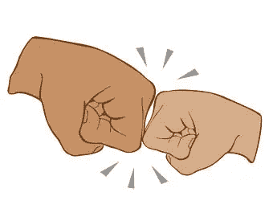

# 合作是中东的遗产，而不是冲突

> 原文：<https://medium.com/hackernoon/cooperation-is-the-middle-easts-legacy-not-conflict-21957f0f13f6>

甚至在摩西登上西奈山接受十诫之前，中东文明就创造并记录了支配人类如何互动的社会准则。无论是法老、摩西、穆罕默德还是拿撒勒的耶稣，很多人都同意服从源于中东的统治体系。

在犹太人和阿拉伯人已经争斗了几千年的西方对话中，有一种危险的对中东[冲突](https://hackernoon.com/tagged/conflict)的过度简单化，期望在我们的有生之年解决是狂妄的。这些讨论没有计算出犹太人和阿拉伯人和平共处的例子，就像奥斯曼社会一样。第二次世界大战后一系列针对以色列的地区战争的根源在于基督教-欧洲/俄罗斯试图将犹太人驱逐出这些土地，而不是任何关于亚伯拉罕出生权的解体。亚伯拉罕的后代通常会找到政治和商业的平衡，直到欧洲十字军东征、殖民主义或种族清洗挑战了这种平衡。

犹太人以“圣约人”为荣，这意味着那些声称属于以色列十二个部落的人拥有一个特殊的契约/法典/协议/规则系统，拥有一种不可思议的力量。犹太人的信仰说所有人都可以回到上帝的面前，然而犹太人有额外的规定。

穆斯林也为自己是规则的提交者而自豪。“穆斯林”这个词本身的意思是“顺从的人”服从上帝的规则是多么“酷”的一个例子，看看流行的穆斯林名字“阿卜杜拉；“abd”是阿拉伯语中“仆人”的意思，“ullah”来源于“Allah”或“上帝”，所以“Abdullah”是“上帝的仆人”的缩写。就像任何阿卜杜拉国王或现在的沙特王储阿卜杜拉一样，有一个信息是，虽然我是皇室成员，但我只是上帝的一个卑微的仆人。

所以，如果中东被证明是创造规则的地方，并且有遵循规则的文化，那么什么新的规则体系会从中东产生呢？

附件是对《T4》一书的作者格蕾丝·拉赫马尼和马可·侯文的采访。“在本次播客讨论中，我们将讲述人类未来系统将如何使用计算机代码，通过透明的规则来促进规模化合作。