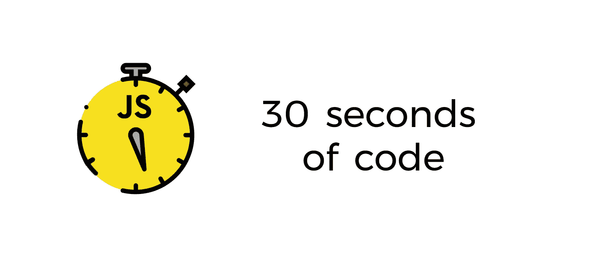

# 用 JavaScript 将文本复制到剪贴板

> 原文：<https://medium.com/hackernoon/copying-text-to-clipboard-with-javascript-df4d4988697f>

*在这篇文章中，我将深入解释来自* [*30 秒代码*](https://github.com/Chalarangelo/30-seconds-of-code) *的* `*copyToClipboard*` *片段是如何工作的。您可以在项目的资源库中找到它的源代码和大量其他有用的方法。*

**30 seconds of code:** Javascript snippets that you can understand in 30 seconds or less

## 核心功能

在[网站建设](https://hackernoon.com/tagged/web-development)中经常出现的一件事是将一些文本复制到剪贴板的能力，而不需要用户选择它或者在键盘上敲击合适的组合键。Javascript 可以通过五个简单的步骤轻松做到这一点:

1.  创建一个要追加到文档中的`<textarea>`元素。将它的`value`设置为我们想要复制到剪贴板的字符串。
2.  将所述`<textarea>`元素添加到当前 HTML 文档中。
3.  使用`[HTMLInputElement.select()](https://developer.mozilla.org/en-US/docs/Web/API/HTMLInputElement/select)`选择`<textarea>`元素的内容。
4.  使用`[Document.execCommand('copy')](https://developer.mozilla.org/en-US/docs/Web/API/Document/execCommand#Commands)`将`<textarea>`的内容复制到剪贴板。
5.  从文档中移除`<textarea>`元素。

这个方法的最简单版本应该是这样的:

copyToClipboard method basic implementation

请记住，由于`Document.execCommand()`的工作方式，这种方法不会在任何地方都有效，而只是作为用户操作的结果(比如在`click`事件监听器内部)。

## 使附加的元素不可见

如果您尝试上面的方法，您可能会看到一些闪烁，当`<textarea>`元素被追加然后移除时。这个问题对于使用屏幕阅读器的人来说尤其糟糕，因为它会导致一些非常烦人的问题。因此，下一个合乎逻辑的步骤是使用一些 CSS 使这个元素不可见，并使它成为`readonly`以防用户试图弄乱它:

copyToClipboard implementation without the textarea being shown

## 保存和恢复原始文档的选择

最后要考虑的是，用户可能已经选择了 HTML 文档中的一些内容，所以最好不要删除他们可能已经选择的任何内容。幸运的是，我们现在可以使用一些现代的 Javascript 方法和属性，如`[DocumentOrShadowRoot.getSelection()](https://developer.mozilla.org/en-US/docs/Web/API/DocumentOrShadowRoot/getSelection)`、`[Selection.rangeCount](https://developer.mozilla.org/en-US/docs/Web/API/Selection/rangeCount)`、`[Selection.getRangeAt()](https://developer.mozilla.org/en-US/docs/Web/API/Selection/getRangeAt)`、`[Selection.removeAllRanges()](https://developer.mozilla.org/en-US/docs/Web/API/Selection/removeAllRanges)`和`[Selection.addRange()](https://developer.mozilla.org/en-US/docs/Web/API/Selection/addRange)`来保存和恢复原始的文档选择。下面是实现这些改进的最终带注释的代码:

Final form of copyToClipboard with selection storing

差不多就是这些了。在不到 20 行代码中，我们创建了前端开发中最常用的方法之一。

*如果你喜欢这篇文章，给它一个掌声(或者五十个),记得查看* [*30 秒代码*](https://github.com/Chalarangelo/30-seconds-of-code) *为你的 Javascript 项目获取更多有用的代码片段！*