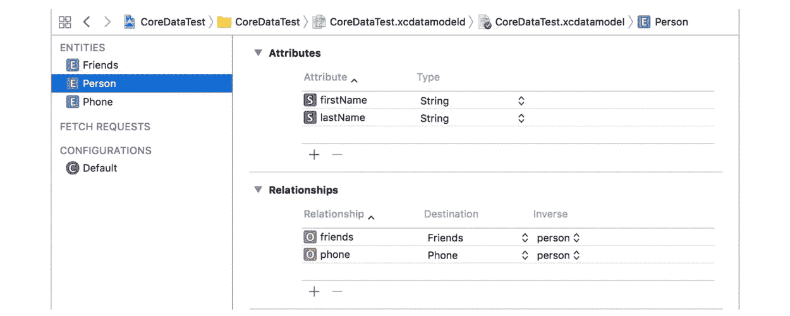
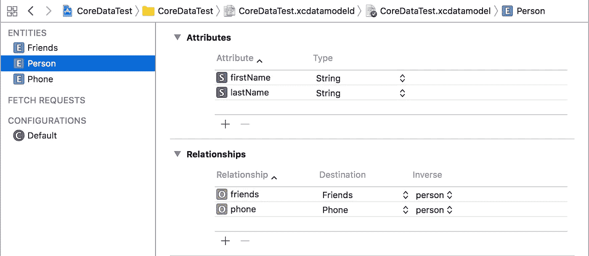
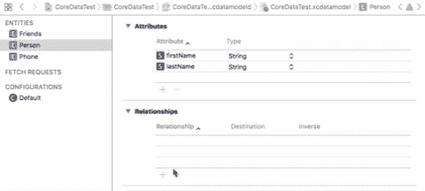
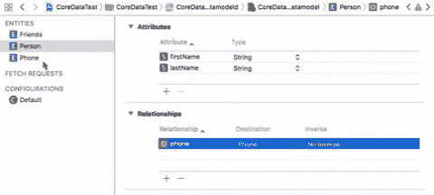

# 核心数据关系

> 原文：<https://medium.com/hackernoon/core-data-relationships-d813ed66ba8c>

## 理解一对一和一对多关系

在我最近的项目 **中工作** [**时，我决定写一个关于*实体间核心数据关系的教程*。**](http://apple.co/2CrlXDf)

持久存储已经成为今天发布的大多数 iOS 应用的重要组成部分。当我们谈论 iOS 中的持久性时，我们应该只考虑核心数据。这款强大的工具将为您提供出色的数据存储管理体验。

# 核心数据关系示例

出于本教程的目的，我已经创建了一个简单的项目，该项目具有处理一对一和一对多关系的核心数据实体。

该示例中创建了 3 个实体:

1.  **人** -这将是主要实体，将与*电话*和*朋友*实体有关系。
2.  **Phone**——一个保存人的手机信息的实体。假设*人*只有一部手机，它将被用作*一对一*关系。
3.  **朋友**——一个保存所有人的朋友的实体。它将被用作一对多关系，假设这个人有不止一个朋友。

正如你在上面的截图中看到的，我已经创建了关系。我现在将向您解释如何正确地做到这一点(这非常简单)。👇

## 一对一的关系(人->电话)

如果您已经创建了实体，我们可以继续创建人和电话之间的关系。您需要添加 3 个值才能创建关系。

1.  **关系**——说出你们的关系。
2.  **目的地**——添加你想与之建立关系的实体(在我们的例子中是电话)。
3.  **反向** -从手机创建一个反向关系，并在 Person 下选择它。Apple 建议您始终添加一个逆数值，因此千万不要将其留空。

**Part 1 (Person)**

**Part 2 (Phone)**

## 密码

每个实体都包含自己自动生成的 [*NSManagedObject*](https://developer.apple.com/documentation/coredata/nsmanagedobject) 代码，您可以在其中工作。这是核心数据先于其他数据的优势之一。

这里有一个例子，你可以如何在 *Person* 和它的一对一关系( *Phone* )中写。👇

Simple isn’t it?

## 一对多关系(人->朋友)

我希望到目前为止你已经理解了人际关系是如何运作的。现在我们将更进一步，创建一个*一对多*关系。这个概念与*一对一*关系相同，只是有一些小的变化。

当创建一个*一对多*关系时，您必须从****数据模型检查器中将类型改为 ***对多*** 。而*一对一*则不是这样，因为这种类型默认设置为***对一个*****。******

**********

## *****密码*****

*****下面是一个例子，说明如何在 *Person* 及其一对多关系( *Friends* )中进行编写。👇*****

*****NSManagedObject 包含类似于`addToFriends()`的通用方法，其中你可以传递一个 Friends 对象或者一个 Friends 数组*。******

> *******注意:**由于预定义的上下文和核心数据保存方法，您在本教程中看到的代码是为了简化和提供更快的测试而在 AppDelegate 中编写的。*****

## *****我在我的最新项目中使用核心数据关系:*****

***** [## 1x2 赌注-足球提示和赔率

### 热门赔率每天，我们都会生成一份全球热门赔率列表。这些是下降最多的赔率…

apple.co](https://apple.co/2EIiDpI) 

## 如果你喜欢我的教程，并且它对你有帮助，请👏或者分享这个故事，这样其他人也可以找到它。干杯！🚀*****