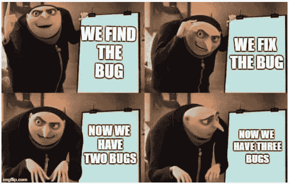
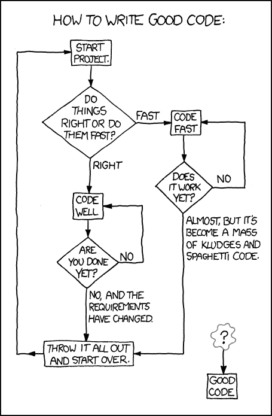

# 核心设计模式——摆脱过于复杂的代码的方法

> 原文：<https://medium.com/hackernoon/core-design-pattern-the-way-out-from-overly-complicated-code-b8804449941>

你有没有发现自己陷入了大量过于复杂的代码中？没有吗？但你知道这是什么，对吧？因此，假设您是一名开发人员(在任何级别的进化中),或者您参与了产品开发，那么本文就是为您准备的！为什么？让我们看看简短的答案，然后欢迎您阅读更多关于您可能遇到的问题的解决方案。



# 简短的回答

从事各种项目让我无数次地问自己——为什么我脑海中的系统模型和它以代码形式的实现是完全不同的东西？这种“不匹配”实际上会导致代码过于复杂。简单的答案是，业务逻辑和代码有不同的生命周期，这意味着开发人员需要维护更多的代码，开发过程更长，维护费用更高，这对项目经理来说很重要。

# 更多细节，请

实现发生在我们业务逻辑的不方便的“空间”——类和变量之一，这导致了所谓的“漏抽象”问题。后者导致了业务逻辑和代码生命周期的不同。虽然业务逻辑的生命周期相当稳定(它可以在很长一段时间内重复使用多次)。代码部分的生命周期很短——对于相同的业务逻辑，它通常会被修改多次。

如果您不熟悉这个术语——泄漏抽象是试图简化与对象(比如说，系统代码的一个可重用部分)的交互，从而创建一个比对象本身更复杂的抽象模型。听起来好像有点不对劲，不是吗？的确！

所以，在试图简化事情的同时，我们实际上让事情变得更加复杂。是的。最后，业务逻辑及其技术实现之间的这些差异需要大量不必要的代码。有什么方法可以避免它吗？我相信我找到了一个。(嗯，如果你明白我的意思，这不仅仅是一种信仰。)

主要的想法是从另一个侧面——业务逻辑的侧面。事实证明，如果我们开始用最接近业务逻辑的语言来描述程序逻辑，我们将能够最大限度地减少不必要的代码量和不同技巧的需要。此外，它将更容易调试和维护程序，因此代码的生命周期将更长。

# 这就是 CORE 发挥作用的地方

想象一下，你有一个充满不同角色的场景，他们以成千上万种不同的方式相互影响。他们吃饭，睡觉，互相交流。他们可能会互相争斗，或者根本不关心别人。听起来很像现实生活，对吧？应该如此！请暂时记住这张图片—我们很快就会回到那里。

正如我们发现的，当生活(业务逻辑)和它的代码表示有矛盾时，过度复杂的代码就会发生。这就是我们需要另一种编程概念的地方，这种概念能够从现实生活转移到代码，而不是向后。为此，我想向您介绍一下 [CORE](https://github.com/extremeprog-com/core) (上下文、对象、请求和事件的缩写)，它有助于构建一个依赖于业务逻辑的架构。

然而，过度复杂的代码并不是唯一可以用[核心](https://hackernoon.com/tagged/core)修复的东西。有时你的逻辑会变得混乱，你在维护你的代码时会遇到麻烦，或者你正在从头开始构建一个架构——在所有这些情况下(事实上还有很多情况), CORE 会有所帮助。



*Acknowledging that you are in a such loop makes you create real solutions. (Have you been there? :D)*

好了，现在让我们回到我们的操场，因为——信不信由你——CORE 的工作方式非常相似。您可以通过快速浏览其主要组件来亲自了解它:

*   上下文

你记得我们以前谈论的场景吗？这就是了！背景是我们的角色生活和互动的场景。比方说，我们有一块有刺猬的田地，刺猬是我们的目标。

*   目标

从角色的角度思考对象，每个角色都有自己的需求和意图，他们通过直接活动或向其他角色求助来实现这些需求和意图。所以刺猬是我们的对象，它们做一些常规的事情——比如吃饭、睡觉、互相玩耍——为此它们需要事件和请求。

*   事件

我们的一只刺猬(物体)吃了一个苹果，这是一个事件。不严格地说，事件是一个对象拥有的活动，它们不能被其他对象初始化。请注意，事件是不能取消的:就像生活中一样——如果一个角色发生了什么事，它会被记录在他的个人历史中。

下面是它在伪代码中的样子:

```
Hedgehog = {
  Event: {
    JustAteApple: new EventPoint
  }
  eatApple() {
    FireEvent(new **Hedgehog.Event.JustAteApple**);
  }
}
```

虽然，在野外，除了刺猬，我们可能有一个研究员必须观察刺猬并做记录。这是一个很好的例子，说明了事件订阅在内核中是如何工作的——它是静态发生的，而不是以常见的动态方式发生的。这就是为什么不需要编写额外的代码来添加订阅。

```
HedgehogObserver = {
  recordWhatHedgehogAte() {
    CatchEvent(**Hedgehog.Event.JustAteApple**)
      // to do smth
  }
}
```

此外，一个方法可以静态地为一个对象订阅多个事件:

```
HedgehogObserver = {
  recordWhatHedgehogAte() {
    var event = CatchEvent(
         **Hedgehog.Event.JustAteApple,
         Hedgehog.Event.JustAteBanana, 
         Hedgehog.Event.JustAteKiwi** ); if( event instanceof Hedgehog.Event.JustAteKiwi) {
      // to do smth
    } }
}
```

*   要求

你不能自己做所有的事情(例如，有些事情可能不是对象的责任)，我们的刺猬和它们的观察者(对象)也是如此。在这种情况下，他们的同伴(其他对象)可以通过请求的方式帮助他们。因此，当对象无法执行任何活动时，它会发送一个帮助请求。重要的注意事项:不是在一个特定的对象上调用方法(这是通常的面向对象的设计风格),而是调用任何可以这样做的对象(实际上，调用是在一个可用的对象可以捕获它的上下文中进行的),而是指定调用者的对象。

因此，如果我们的一名观察员需要换人，他必须这样大声呼救:

```
HedgehogObserver = {
  askForHelpAndGoHome() {
    FireRequest(
      new **HedgehogObserver.Request.TakeMyShiftPlease**()
    )
    // go home
  }
}// handle it like that
AnotherHedgehogObserver = {
  goToTheFieldAndStartObserve() {
    CatchRequest(**HedgehogObserver.Request.TakeMyShiftPlease**);
    // go to the field and start observe
  }
}// or even like that
ObserverStation = {
  sendNewObserverToTheField() {
    CatchRequest(**HedgehogObserver.Request.TakeMyShiftPlease**);
    // get an available observer and send to the field
  }
}
```

我们可以很容易地将此消息视为业务逻辑消息“刺猬观察者需要一个转变”，系统的另一部分将知道如何处理它。

想象一下阅读和维护这样的代码是多么容易，因为你的阅读上下文既包含了“*我们做什么？”*和“*我们什么时候这么做？”*在一个地方，你不需要通过代码来回忆方法被调用的地方。

# 你可能想知道——有没有什么能让你联想到 CORE 的东西？没问题！

我知道我们总是需要把新的概念和我们已经熟悉的东西联系起来。这就是为什么为了更好地理解事件和请求，让我们考虑一下最流行的开发概念——面向对象编程。核心和标准 OOP 的区别在于，OOP 中对象的接口由方法表示，而在核心中它以事件和请求的形式存在。

还有什么？嗯，CORE 肯定与其他编程概念有相似之处，例如:

*   **基于自动机的编程**(核心的方法之间的切换是状态机的一种实现)；
*   **演员模型**(内核中每个对象都是一个演员，有自己的状态)；
*   **信号和插槽系统**(内核中的请求和事件提醒发送信号，其他小工具可以接收)。

# 真实案例

当然，许多事情在理论上听起来很酷，尽管实际上并非所有事情都是如此。但是事情是这样的——我和我的同事在告诉任何人之前，已经在许多现实世界的项目中对 CORE 的酷性进行了大量测试。

举个例子，假设你有几千行智能电视视频播放器的代码，你需要重写并适应另一个系统。但是，您没有像开发人员那样去做(这可能导致至少一周的工作)，而是决定向后移动——从最终产品的逻辑到它的代码实现。瞧，你设法在一天之内重写了成千上万的代码！

然而，在 CORE 的帮助下，我们不仅缩短了时间，而且新的播放器也只有几百行代码长(这要归功于 CORE 的声明性)，功能也比原来的好(无错误且易于维护)。

明白了。那么，我怎么使用它呢？

我是这样看待最佳路径的:

1.  定义您的对象及其职责；
2.  列出每个对象发生的事件；
3.  列出每个对象的方法(您可以根据对象采取的操作来考虑它们)
4.  弄清楚当特定事件发生时会自动调用哪些方法
5.  如果某些对象需要其他对象的帮助，则添加将处理它们的请求和方法；
6.  技术上实施

我有可以共享的 JS 和 PHP 框架，但是这种模式可以很容易地用任何其他通用语言实现——Python、C、C++、Go 等等。

# 结论，或者我们什么时候需要 CORE？

我们已经看到了 CORE 的想法来自哪里，如何应用的例子，现在是时候为第一次接触 CORE 划下界线了。那么，哪些情况最适合使用 CORE 呢？在以下情况下使用:

*   你需要从头开始创建一个架构
*   您有许多错误和过于复杂的代码(您可以使用 CORE 重写系统的一部分)
*   当逻辑变得混乱时(它在规划和实现部分都是相关的)
*   很难维护现有的代码，需要将它划分成多个模块
*   您必须实现多语言系统设计或分布式系统的逻辑
*   在服务器和客户端编程中，甚至在低级系统编程中

# 关于我的几句话(或许也是关于你的)


我是高性能系统的开发人员和架构师。设计框架和 API 是我工作的一部分，也是我的爱好。:-)

CORE 是我在过去几年中一直使用的设计系统架构的主要方法。我相信，CORE 可以帮助编写更好的代码并创造出高质量的产品。这不仅仅是一个逻辑假设，而是在不同团队中从事实际项目的实际经验的结果。这就是为什么我想吸引尽可能多的 IT 发烧友(开发人员、QA 测试人员、项目经理、架构师等)参与 CORE 的开发。)的开源项目。伙计们，你们可以在这里找到需要帮助的信息[。](/ux-of-programming-languages/lets-build-a-community-around-core-701eb8ebb02c)

另外，您也可以通过[捐款](/ux-of-programming-languages/lets-build-a-community-around-core-701eb8ebb02c)来支持这个项目。有了这样的帮助，我将能够花更多的时间开发它，并移植到不同的编程语言中。

如果您只是想知道 CORE 是否适合您的项目需求，或者您想加入开发，请随时通过电子邮件与我联系:[okneigres@gmail.com](mailto:okneigres@gmail.com)

最后，这里有一些继续探索 CORE 的链接:

https://github.com/extremeprog-com/core

[](https://github.com/extremeprog-com/core-example-player) [## extreme Prog-com/core-example-播放器

### 在 GitHub 上创建一个帐户，为 extreme Prog-com/core-example-player 开发做贡献。

github.com](https://github.com/extremeprog-com/core-example-player)