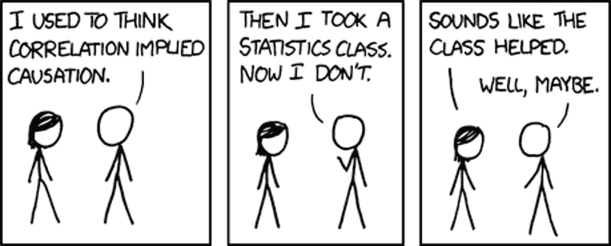
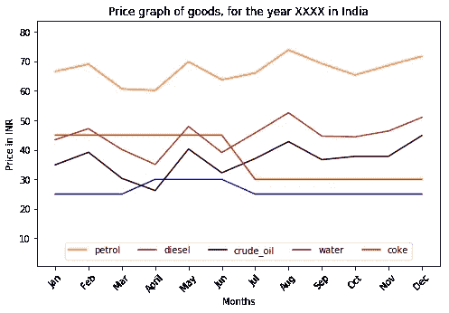

# 举例说明相关性和因果关系

> 原文：<https://medium.com/hackernoon/correlation-and-causation-by-example-e7fd627475e5>

Correlation or Causation

# 你应该很快知道什么？

给定对两个特征 A 和 B 的观察:当我们看到 A 和 B 同时改变其值的模式时，我们观察到特征 A 和 B 之间的**相关性**。当 A 和 B 的值一起增加或减少时，我们说它们正相关。当 A 的值增加时，如果我们发现 B 的值成比例地减少，反之亦然，我们说它们是负相关的。
有了这个我们就不能说什么是什么的原因了。换句话说，你不能说一个特征导致了另一个特征。

当一个特征的变化导致另一个特征的变化，我们称之为**因果关系**。当我们找到相关的特征时，我们在领域周围挖掘，做更多的研究和家庭作业来增加我们的领域知识，以声称一个特征是另一个的原因。

# 通过示例了解

Plot showing price trends of items for a particular year in India

以汽油、柴油、原油、水、焦炭五种成分的价格趋势为例，如上图所示。你会发现汽油、柴油和原油价格之间有很强的相关性。你也可以在水和百事可乐的价格上看到一些相关性。

现在，虽然水和百事可乐的价格似乎不会像图表所示那样经常变化，但我们看到了印度夏季价格上涨的趋势。这两者似乎是相互关联的，深入研究后我们发现，在炎热的季节，对它的需求增加，导致它的价格上涨。
其中，仅从图表数据中，我们能说出是什么特性导致了其他特性的价格变化吗？不，我们不能。

作为数据科学家或研究人员，我们做了一些功课来了解汽油和柴油是原油的衍生物。有了这一新发现的知识，并将其与图表数据相结合，我们大声疾呼，原油价格变化会导致或影响其衍生品(如汽油和柴油)的价格变化。

# 摘要

统计为您提供了一种工具，可以通过定量数据来查找特征之间的相关性。它规定了进行实验以获得定性数据的技术，或者领域知识帮助您获得定性数据，以在提供的数据中识别引起其他特征的特征(如果有的话)。

> 顺便说一句，你有没有想过为什么我们要经历这种痛苦或争论来识别相关特征和可能的因果特征？

想玩这个博客文章中用来生成图表的数据吗？请随意从我的 Github 库下载或获取它。

这篇文章最初发表在 blog.codonomics.com 的

**最后，如果这篇文章对你有帮助，别忘了鼓掌并分享给你的圈子。好吧，我知道你会做的..**