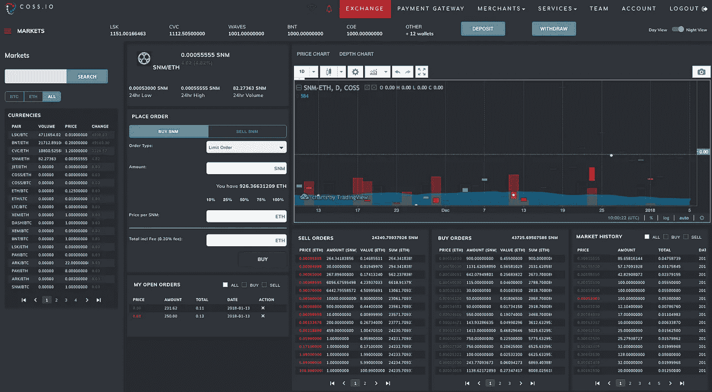
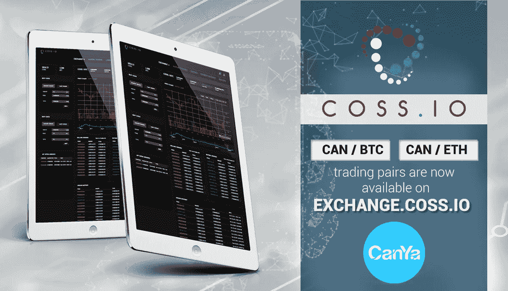
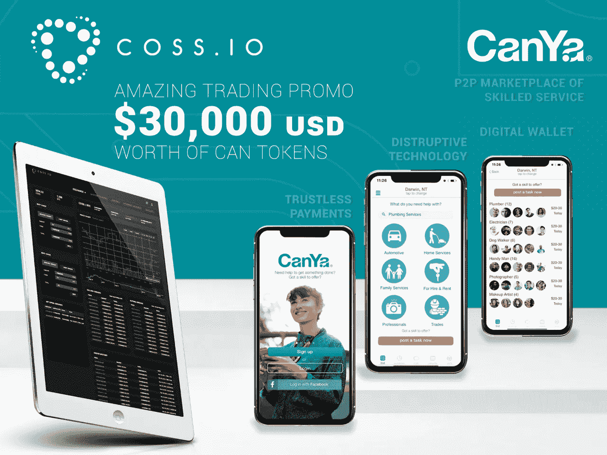
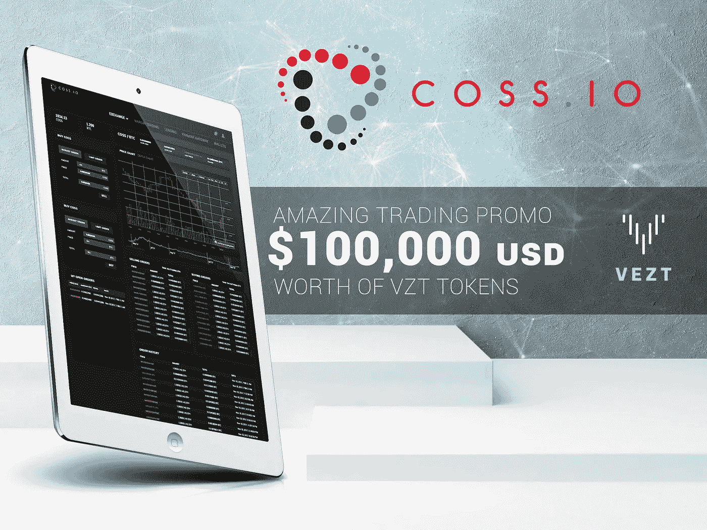
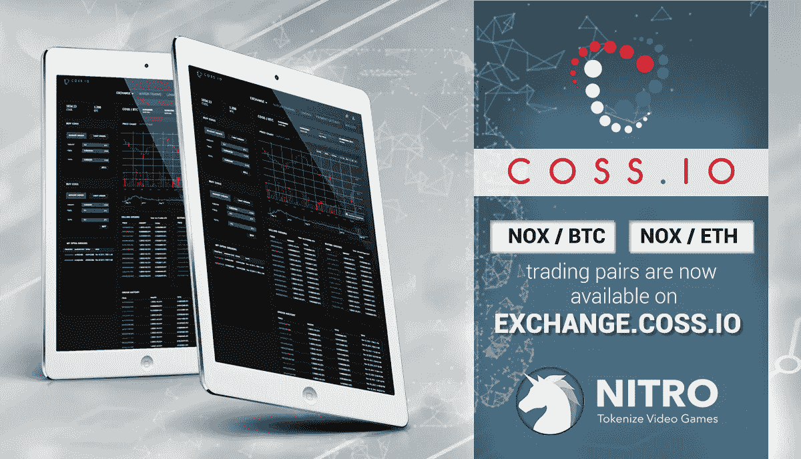
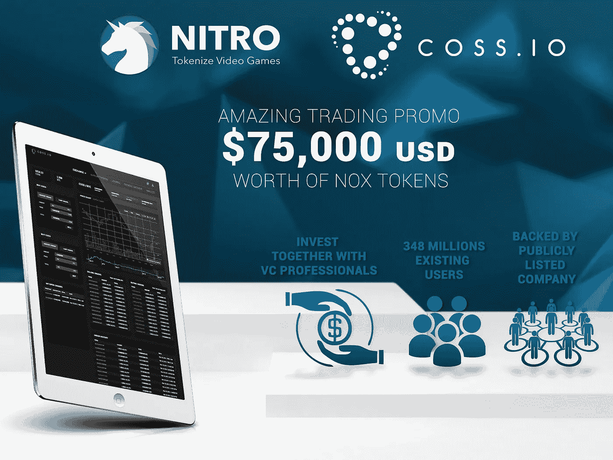
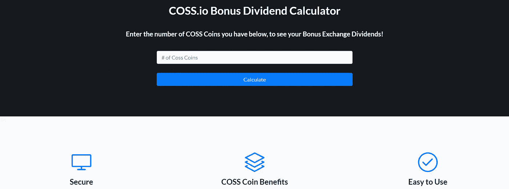

# 曹仁。IO 更新 2018 年 1 月 13 日

> 原文：<https://medium.com/hackernoon/coss-io-update-january-13th-2018-80c73bdf83b8>

亲爱的所有人。

欢迎来到本次 coss.io 更新。我们都在为 coss.io 上周日的 UI 发布做准备，这里有一些与发布相关的消息。

我们将此次发布视为我们新的 UI v1.0，我们的意思是，将会有更多的升级和改进。在我们详细讨论这个问题之前，让我们先来看看明天我们将使用什么。

这是新 UI 的夜景，也有明亮的日景版本。你在左边看到的市场可以随意打开和关闭。

我们的 UI 团队和后端开发团队一直在努力工作，以满足最后期限，我们的志愿者测试团队也是如此。如果没有测试团队的所有反馈，我们就不会有今天的成就。非常感谢他们所有人。

然后是大问题。我们对明天将要交付的东西满意吗？一个分裂的回答……这是一个新的用户界面，在我个人看来，它看起来比旧的好很多，但我们还没有到那一步。由于测试几乎一直持续到最后一刻，许多事情被发现有两个潜在的结果。一个是另一个延迟，不，我们不希望这两个版本在二月份发布新的 UI v1.1 版本。我们决定采用第二种方案。

换句话说，你现在看到的是 1.0 版本，我们仍然缺少一些主要功能。好消息是，除了带有可移动部件的全新功能之外，它们都将在 1.1 版本中出现，因此你基本上可以在 exchange 上拖放各种功能，以根据自己的喜好进行定制。还要记住，新的用户界面仍然是在旧的引擎之上，所以不要期待奇迹，尽管我们已经升级了服务器，也做了一些配置工作，使交换工作更加顺畅。

我们希望您喜欢您所看到的，但同时也理解我们将继续努力改进。1.1 版本将于二月底推出。

那么，还发生了什么。我们在 coss 度过了又一个动荡的一周，网站关闭，存款和取款丢失/延迟，或者我们在这里称之为:过山车仍然活跃。我们完全理解受影响用户的挫折感，并努力改进。存款和取款的停止给我们的客户服务带来了一场风暴，虽然大多数问题已经解决，但仍有一些问题未得到解决，但积压的支持工作增加了很多，我们必须清除一些支持票证才能回到正轨。
所以这里有一个重要的通知:

1 月 12 日之前发生的所有关于存款和取款的票据都将被关闭，因为大多数案件都已解决。这样，支持人员就不必花 2 周时间查看已经解决的问题。因此，如果您仍有关于存款或取款的未解决票据，请务必开一张新票据。

新列表和新交易宣传片
周日晚上(新加坡时间)当我们上线新用户界面时，您还将看到 4 个新代币的列表。

1)残亚:[https://canya.io/](https://canya.io/)股票代码:残将被交易 vs ETH 和 BTC

CAN 交易宣传片:

2)VEZT:【https://vezt.co/】T4股票代码:VZT 将与 ETH 和 BTC 进行交易

VZT 交易推广:

3)硝基:[https://www.nitro.live/](https://www.nitro.live/)
股票代码:NOX 将与 ETH 和 BTC 进行交易

NOX 交易宣传:

和 4)
作为一个没有促销的正常上市，我们将推出 LA Token:[https://latoken.com/](https://latoken.com/)
股票代码:LA 将与 ETH 和 BTC 进行交易

享受你在 coss.io 上的交易

我们的一个用户制作了一个工具来检查你的费用分配。尽管这不是官方的 COSS 产品，而且我们也没有对计算结果进行验证，但我们还是要感谢卡马洛特(他在我们的电报组被称为:[https://t.me/myCOSS](https://t.me/myCOSS))
这是他为大家制作的计算器:[https://www.cosscalc.com/#noref](https://www.cosscalc.com/#noref)

还要注意，这种分配的正式名称是:基于象征性的费用分割分配，绝不是任何形式的股息。

其他值得一提的话题。我们每天都收到关于新加坡新法规的问题，以及 COSS 是否会很快引入菲亚特交易。对于这些问题，我们可以回答如下:
根据新加坡金管局发布的最新咨询文件，我们将获得全面许可。许可证将有 3 个类别，我们将根据新加坡金融管理局规定的标准申请成为主要支付机构。通过这一举措，我们将对合规政策采取基于风险的方法:
-对所有入职客户强制执行 CDD/KYC 和 AML。
-风险等级为低、中、高。
-评估(更新/核实现有用户或获取额外的 KYC 信息)
-强化尽职调查。根据道琼斯名单进行筛选。
交易监控。

请注意，我们将在适当的时候宣布这一点，并给所有用户一个适当的宽限期来遵守。

有了上述所有计划，我们已经开始与银行联系，以确保合作伙伴关系，因此我们可以继续在 coss.io 上引入菲亚特交易(我们非常有信心能够做到)。

过去几周，我们也看到了良好的增长。这又有点像过山车，我们第一次达到 2 美元，日交易量为 1000 万，但受到停机时间的影响，价格下跌，交易量下降到 100 万，但看到许多问题得到解决，价格再次上升到 2 美元以上，交易量再次达到 1000 万左右。这是一段颠簸的旅程，但也是一段有趣的旅程。别忘了享受。

最后(是的，我知道我可以在这个星期的更新上多写 10 页，但这次我会尽量写得简短)我对你们所有人有一个个人请求。我充分意识到我们的客户服务有积压，我也充分意识到每个用户都认为他或她的案例是最重要的，需要立即解决，我完全理解并分享几天后没有得到回复的沮丧，但是……我已经并正在尽我所能帮助你们中的许多人，这些天来，随着积压工作的增多，越来越多的人向我个人求助。这是通过电子邮件、脸书或电报。请记住，我也只是一个人。我通常一天工作 18 个小时，我的基本睡眠模式是不存在的。事实上，你把我加到了电报上，可以选择给我发短信，这是一回事，但是不要因为我们的支持人员没有在 2 小时内回复你，就在夜里 3 点按下拨号键给我打电话。即使我会错过或忘记每天收到的数百条私人信息中的几条，也不意味着我会忽视你。对于我接触的许多人来说，如果我没有立即回复你，通常是因为你的案子还没有解决。在许多问题上，我只是一个信使。我需要将信息转发给 Dev，我必须等待他们调查此事，每次他们调查此事，他们都会将其他问题推到他们面前。所以请帮助我们帮助你。我认为我们有一个在这个行业中看不到的优秀社区，有大量技术熟练的人自愿回答问题并帮助其他用户。当然，这些了不起的人不能登录服务器并开始编码来帮助你，但是要感谢他们所做的。如果没有他们，我是不会活下来的。你知道你是谁，也知道我对你们每一个人都怀有最深的敬意。衷心感谢你。让我们一起努力，保持社区的强大。是的，仇恨者永远是仇恨者，有些人喜欢 FUD 只是因为好玩。我现在的角色是我必须面对它。我们的版主不是，但他们仍然留下来，他们处理它。这是值得尊敬的，对我来说是正直的，总有一天会得到回报。

请注意，我们将在 1 月 14 日周日进行一次 UI 升级维护。
时间:约 5 小时。
开始:阿姆斯特丹时间上午 11 点，新加坡时间下午 6 点。