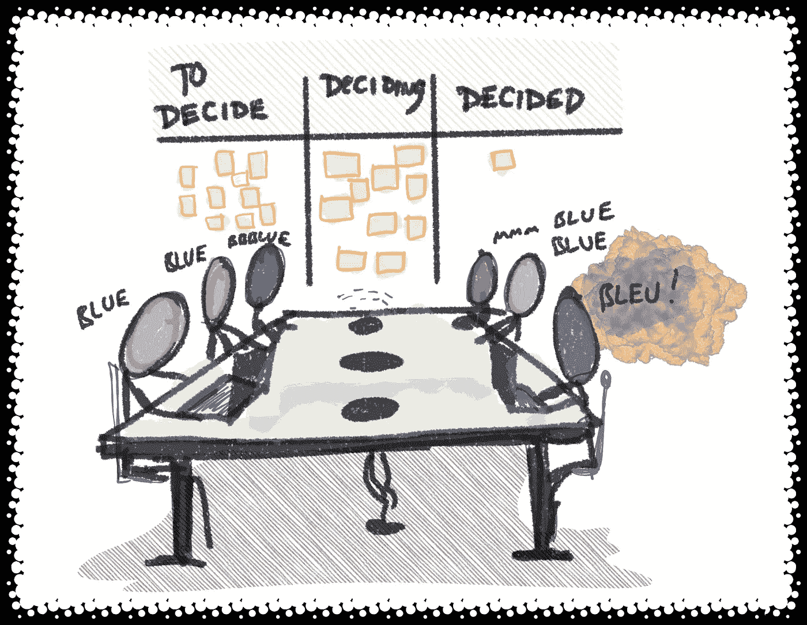

# 每个合理决定的成本(CPRD)

> 原文：<https://medium.com/hackernoon/cost-per-reasonable-decision-cprd-ed1ca8c6147>

注意:随着我儿子的到来，我放慢了写博客的速度。给我几个月时间(或者更多不眠之夜)，我会回来的。

你每个合理决策的成本是多少(CPRD)？你的合理决策吞吐量是多少(RDT)？

考虑一下**成本**:电子邮件线程、1:1、小型会议、大型会议、会议准备、准备的模型和样本、沟通决策所花费的时间、重新讨论决策的会议(以及纠正由于太多人参与而导致的误解)……以及所有这些本可以花在其他地方的时间/精力的机会成本。

我让几个人估算一下他们公司最近一些决策的直接成本。结果从 25 美元到 500 万美元不等(不包括机会成本)。

> 但是这个决定真的非常非常重要…

好的。与花费几分钟的“6”决策相比，花费几天/几周/几个月(和*很多*人)的“8”决策的增量价值是多少？你的决定是不是太大了(反馈循环太长了)以至于如果事情变糟了，你就不能早点抽身，或者如果事情进展顺利，你就不能双倍下注？有些决定就是这样。大多数不是。

另一个想法是，如果你拿了做[某个决定]所需的 50，000 美元，并提供培训，这样你会更有信心在更接近“工作”的情况下推动决策，会怎么样？或者，花时间深思熟虑地划定界限(如“做任何可行的事，但不要搞砸 _ _ _ _ _ _ _ _ _ _ _ _”)。或者限制决策的爆炸半径，让那个讨厌的人——你知道，就是去年大家一直关注的那个人——不再困扰人们。

> 但是，等等，让人们了解情况……然后再做决定。

如果他们真的只是“在圈子里”，那么为什么要让他们拖你的后腿？事后把决定发邮件给他们。很可能他们大部分时间都在圈内，但拥有(或认为自己拥有)某种批准/否决权。他们是否有有价值的数据/背景来为决策提供信息？

> 但是去年的那个决定…

如果你的团队的决策一直都是完美的，那么你很有可能处于一个低增长、低可变性的情况。所以不要执着(可用性启发式)。对自己诚实……什么是*他们的*打击率“vs*你的*打击率”。在某种程度上，领导者比一线团队更容易，也更难。重大决策往往需要更长的时间来渗透，所以很难说“这是个坏主意”。但是当事情真的出错时，它们会变得非常/非常糟糕。一线团队崩溃和燃烧得更快(也更明显)。饶了大家吧。将糟糕的决定与好的决定进行比较，不要认为糟糕的结果意味着糟糕的决定(运气)。

也许更重要的是，要有一个从过去的决策中学习的系统。许多公司对新的决策感到恐慌，却很少从过去的决策中吸取教训。

> 你不明白…目前情况非常危急。我们不能失败。

这是一个艰难的处境。也许修正一下为什么不能偶尔失败。

> 你是在为自上而下的决策做论证吗？我们很快就做出了伟大的决定……然而，当涉及到执行时，有些东西在翻译中丢失了。

执行是大多数决定发生的地方。在这种情况下，你所说的决策可能是非常高层次的(更像是目标或命令)。对于真正的决策战场，漫步下来，与中层管理人员交谈。他们都试图向上管理——让你做决定，和/或给他们自主权——或者向下管理。那些一年一次批准预算的会议…现在这些都很贵。它们是 Cs 的简称，但是把所有的“预备”会议都算进去。

> 问题不在于我们的决策，而在于坚持我们的决定。

一个团队应该坚持一个不再有意义的决定吗？当你做那个必须坚持的决定时，你有所有可用的数据吗？根据我的经验，早期的决策缺乏细致入微、测试和勇气。“让我们开始吧”的手势变得更加丰富和有力。而且往往与众不同。

> 你看到我的日历了吗？

您的组织有多少决策正在进行中(DIP)？都是高价值的吗？您是否在决策中运用了杠杆作用，从而从更严格的审查中获益？这就是不同价值的分批决策的问题…你倾向于以同样的方式对待一切。

> 这些会议确实会永远持续下去…

专注于合理、快速地做出合理的决定。这里的一个大问题是信息。没有数据，做决策似乎需要更长的时间(猜测就是这样)。数据依赖于反馈回路。反馈随着一系列合理的、较小的决定而改善。这就是为什么年度预算和年度路线图活动变成了一场狗屎秀，尤其是在快速增长的公司中。

> 这不适用于我们，因为我们是集群决策。当你这样做的时候，有一个规模经济。

但是也有焦点的不经济，和许多上下文切换。在最后负责任的时刻，在最负责任的情况下，做决定需要什么？

> 一旦我们做出了重大决定，那么我们就很乐意让人们去做……前提是我们能快速审核/批准。

这真的值得吗，尤其是如果你已经正确地框定了最初的决定？谨防成为瓶颈，并激发批准戏剧，从而使情况被糖衣和过于简化。

## **总结**

想象一下，把你所有的决定都放在工作跟踪板上。在你的组织中，工作流程会有一些相似之处。但是看起来可能会有很大的不同。我们显然不希望糟糕的决策快速通过。但是假设决策是合理的，我们希望快速通过小的、不会失败的决策，同时关注高层次的战略决策，这些决策将为组织设定几个月/几年的路线。

有时候，100 万美元(或 4.5 万美元或 1 万美元)的决定是值得的。通常不是这样。想想具有讽刺意味的是，许多组织花费 50k 美元对需要两周时间来实际实现和测试的工作做出一个决定。