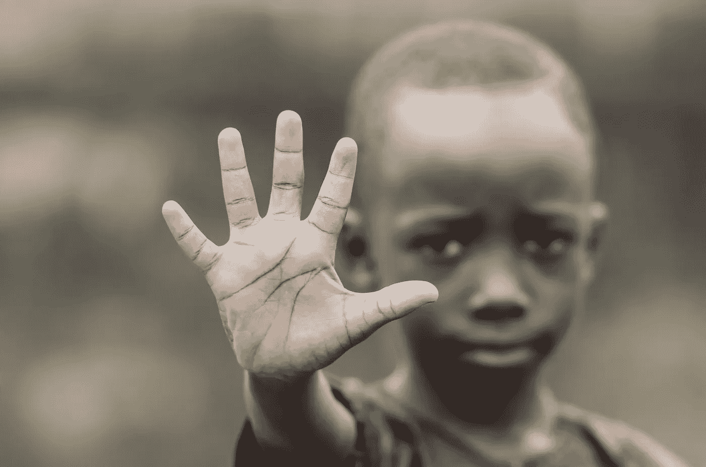

# 区块链技术能否帮助难民证明身份？

> 原文：<https://medium.com/hackernoon/could-blockchain-technology-help-refugees-to-prove-their-identity-63262fc4380c>

对于逃离危机的难民来说，战斗不会因为被一个新国家接纳而结束。

尽管官方身份是最重要的恢复之一，但也是最难获得的东西之一。

目前，全世界有超过 11 亿人没有正式证件。

没有合法的存在证明，从找工作、获得银行账户、找住处、获得教育、医疗保健和投票等一切都几乎不可能。

因此，这些人被剥夺了保护、获得服务的机会及其基本权利。世界上的其他人仍然看不到他们，他们无法在社会中前进。

根据[世界银行集团](http://www.worldbank.org/en/topic/financialinclusion/overview)发布的统计数据，预计将有超过 20 亿人不使用正规的金融服务，全球最贫困家庭中超过 50%的成年人没有银行账户。

2013 年，世界银行集团行长金永吉宣布，[全民金融接入目标](http://www.worldbank.org/en/topic/financialinclusion/brief/achieving-universal-financial-access-by-2020)是到 2020 年，所有目前不属于传统金融系统的成年人都将拥有一个交易账户，允许他们存储、发送和接收资金。

## 身份是一项基本人权

> 每个人都有权在任何地方被承认在法律面前的人格。-《世界人权宣言》第 6 条。

此外，可持续发展目标(2015-2030 年)的[具体目标 16.9](https://www.un.org/sustainabledevelopment/peace-justice/) 旨在"*到 2030 年为所有人提供合法身份，包括出生登记。*

然而，这一目标面临许多挑战。

首先，它不包括全世界 2 亿多移民、2130 万难民或 1000 万无国籍人士。

通常情况下，这些人没有正式的身份证明，也没有办法进入控制它的机构。

> 没有 ID，我们很快就会被现代生活和社会安全网边缘化。我们的存在没有得到说明，我们的需求没有得到满足，我们无法获得金融服务或经济机会。”

## 区块链技术能帮助难民找到立足之地吗？

由于高度投机的加密市场，[区块链](https://hackernoon.com/tagged/blockchain) [科技](https://hackernoon.com/tagged/technology)似乎越来越频繁地出现在新闻中——而且理由充分。

尽管最广为人知的是支持比特币和以太坊等加密货币，但区块链技术有着广泛的应用。

特别是，区块链有许多特点，使其成为记录保存的合适选择。作为一个分散的分布式分类账，它不依赖于中央当局来验证其存在或促进交易。这使得它比集中式应用程序更安全，更不易被篡改。

因此，越来越多的热心者将它作为一种解决我们作为一个社会所面临的一些最大挑战的解决方案来推进，特别是作为一种改善弱势群体生活的解决方案。

区块链技术的一个重要用途是为那些无法获得现代金融服务的人开辟新的金融渠道。

## ID2020:全球识别系统

ID2020 是一个非盈利的公私联盟。

该平台是联合国支持的项目的一部分，旨在为所有需要的人提供合法身份证明。

> "拥有数字身份是一项基本人权."—埃森哲全球区块链负责人 David Treat。

该平台由来自公共和私营部门的政府和组织组成，包括微软、埃森哲和 UNICC 等公司。

ID2020 项目关注四个核心身份原则:

*   **个人:**用户独有
*   **持久:**伴随使用者从生到死
*   **私有:**只有用户可以授予使用数据的权限
*   **便携式:**用户可以从任何位置访问

## 莫尼:数字货币系统

在芬兰，芬兰移民局为难民提供预付万事达卡。叫[摩尼](https://moni.com/)。

这一创新完全避开了对银行账户、身份证件和信用记录的要求。它允许用户在不需要银行等金融中介的情况下收款和支付账单。

相反，万事达卡只是链接到区块链上的一个独特的数字身份，该身份记录了用户的金融交易。

这意味着用户之间的交易是即时的、更便宜的和高度透明的。

持卡人甚至可以用手机向朋友或金融公司申请贷款。

用户可以选择他们愿意借钱给谁，包括他们愿意发送的最大金额。这些贷款将没有利息，也没有额外的费用。

用户甚至可以选择将他们的工资直接发送到他们的 MONI 帐户，即使他们没有正式的银行帐户，也可以工作。

## 数字身份计划弊大于利吗？

虽然这种系统无疑有许多好处，但我们需要问自己的一个重要问题是:*这种技术的相关风险是什么？*

一种观点认为，这样的系统可以成功地为难民提供与当地居民相同的机会。

然而，现实情况是，这些地区的许多当地人一开始就没有什么机会。

难民抵达北美和欧洲国家的报道占据了头条。然而，现实是[绝大多数难民——事实上是 90%——被发展中国家收容](https://www.gsma.com/mobilefordevelopment/wp-content/uploads/2017/06/Refugees-and-Identity.pdf)，这些国家正面临着严重的社会经济问题。

*   世界难民人口的 25%生活在撒哈拉以南非洲
*   该地区 80%的难民来自以下国家之一:索马里、苏丹、南苏丹、刚果民主共和国或中非共和国

此外，还存在一个巨大的风险，即实施数字身份系统可能被用来跟踪难民的行动，分析他们的行为，并建立最终可能被用来对付他们的数据线索，使他们容易遭受人权侵犯。

例如，从难民那里收集的数据可能会被用来对付他们，甚至确保他们被保存在邻国。

这种情况可能会使难民比以前更加脆弱，更加依赖他人。

同样，这种解决办法也有可能不被难民接受。很有可能，许多人会强烈反对以这种方式被追踪，并如此自由地获得他们所有的数据。

难民往往是为了逃离严重的冲突、迫害和残酷的人权侵犯。

不难想象，如果一个包含大量个人信息的数据库落入坏人之手，后果会是怎样。

## 区块链不是“灵丹妙药”——但它可以有所帮助。

毫无疑问，区块链技术的一些应用有能力解决难民面临的许多基本挑战。

然而，重要的是要理解难民问题在很大程度上是政治性的，单靠技术解决办法是远远不够的。

尽管如此，虽然这绝不是一个完整的解决方案，但毫无疑问，这种技术的实施肯定有助于“公平竞争”，让我们离消除贫困又近了一步。

# _

如果你喜欢这个，你可以发消息给我，地址是**aimee.pearcy@gmail.com—**我很乐意收到你的来信。☺️

否则，请鼓掌和分享，让我知道你喜欢它！👏 ⭐️ ❤️