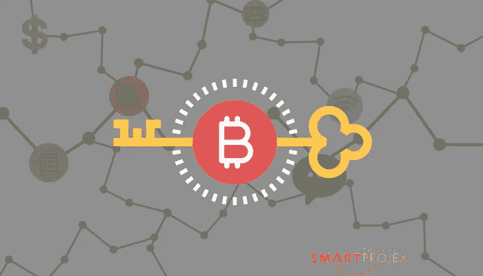

# 区块链技术能提高项目成功率吗？

> 原文：<https://medium.com/hackernoon/could-blockchain-technology-improve-project-success-adc79083008d>

不看到俄罗斯人这个词，很难听到或读到世界新闻。把你的政治放在一边几分钟，承认这一点。俄罗斯有一些非常聪明的人。这不是一个愚人的国家。因此，去年当俄罗斯国有银行 VEB 宣布它正在利用区块链技术和 T2 技术开发一个项目管理工具时，我振作了起来。

据《T4 硬币电讯报》援引 VEB 主席谢尔盖·戈尔科夫的话说:“当我们开始考虑如何有效地管理项目时，我们意识到没有一个平台。我们意识到，区块链是未来一个良好的基础和定性平台。”

绝对惊人的消息！几年来，我一直对区块链及其在项目管理中的应用着迷。区块链技术能提高项目的成功率吗？

# 什么是区块链技术？

在我继续之前，让我解释一下区块链技术——对于那些不熟悉这个概念，并且不太明白[维基百科定义的人来说，](https://en.wikipedia.org/wiki/Blockchain)区块链是[比特币](https://en.wikipedia.org/wiki/Bitcoin)(一种加密货币)所基于的技术。区块链是一种连接电子数据的高度技术化的方式，以便数据得到保存，不容易被操纵。这是保存数字资产的一种方式。

有一些非常聪明的人认为项目包含大量重要的数字资产。但是它们是什么，哪些是重要的？我已经为此纠结了好几年了。

# 什么是项目的数字资产？

假设我们将项目重新思考为一系列的承诺(即使没有作为承诺传达),以交付一些有价值的东西。以下是一些例子:

*   一个程序员同意写一批代码来解决一个问题，以换取一份薪水。
*   一个钢铁供应商同意为这条道路提供 20，000 磅的钢铁，以换取付款。
*   一位拥有人力资源专业知识的承包商同意为一家正在进行重大组织变革的公司提供新的薪酬结构建议，以此换取金钱。
*   项目经理同意编写执行报告，以确保项目的持续融资。
*   一名志愿者同意为一个非营利组织装饰一个宴会场所，作为交换，他承诺会补偿实际费用。

在一个网络世界中，这些提供有价值的东西的承诺代表数字资产吗？假设我们将这些工作设置为智能合同？

# 什么是智能合约？

对于那些不熟悉智能合约的人，我来解释一下。在某种程度上，它们是为了消除中间人(通常是律师)并实现商品或服务交换的自动化。人们的想法是，智能计算机可以取代中间人手工完成的工作。

因此，从这个角度考虑项目工作，您的项目计划变成了一系列执行的智能合同，在每个合同结束后，可以自动付款。

# 区块链是怎么进来的？

区块链技术提供的一个优势是能够使用工具中跟踪的智能合同。假设我们将基本项目活动设置为智能合同。我以前写过如何将一个项目分解成必要的活动。

如果项目活动以智能合同的形式输入到区块链中，用户可以很快发现，例如，钢铁交付将会延迟。当钢材交货时，系统会自动向钢材供应商付款。天气延误更容易解释。该软件可以很容易地调整延迟，以及那些提前交付的活动。也许那会更频繁地发生？

[如果我们可以将项目分解成活动，并以智能合同的形式输入到#区块链中，会怎么样？点击发微博](https://twitter.com/intent/tweet?url=http://www.smartprojex.com/?p=2844&text=What%20if%20we%20could%20break%20down%20projects%20into%20activities%20that%20were%20entered%20into%20%23blockchain%20as%20smart%20contracts%3F%20%20&via=smartprojex&related=smartprojex)

在比特币世界里，验证交易是否发生更容易。在项目世界中，至少现在，我认为我们需要在付款之前考虑安全和质量审计的需要。

这与我写的一些关于在项目计划中构建质量的文章有关系。如果每个活动都有一个负责检查质量的人，我们可以让这个人与项目发起人和项目经理一起，验证智能合同的条款是否得到满足，从而根据智能合同的条款发放付款。

一旦活动已经完成，付款已经发放，项目成本报告立即更新，提供一个更可靠的项目情况。让质量经理验证区块链以放行付款的这一步骤也可以与安全审计相结合。

而且，当项目需要变更时，这些变更将在区块链内部处理，确保每个人都参与进来。

# 有哪些必须考虑的限制？

## 可量测性

区块链技术是加法。没有办法回到交易链中删除一些东西。如果我们要搬到区块链，我们需要小心输入工具的数据。虽然区块链验证了数据，但它没有验证数据的质量。垃圾输入…垃圾输出…随着可伸缩性越来越被认为是区块链的限制，没有理由在区块链工具中加载无关紧要的对话，比如那些可能在 Slack 中处理的对话，或者其他聊天工具。

多年来我一直说，所有的电子邮件和聊天交流可能会回来困扰我们。我们应该注意激励的科学，并利用定期的战略会议在积极参与的项目团队之间建立更好的关系。我不会呼吁召开更多的会议。我提倡更好的会议，在那里解决问题，做出承诺，建设性地分享信息，并在区块链工具中记录决策。

## 安全性

当我们每天读到对信用卡公司、医院、交通基础设施和信用报告机构的黑客攻击或间谍活动时，很难对支撑我们社会的技术有信心。我们已经看到了多起比特币黑客攻击，关于它们是监守自盗还是真正的安全妥协的争论仍在继续。而且，本周我们了解了处理器问题，它几乎影响了所有连接到互联网的东西。显然，网络安全一词是一个矛盾修饰法。然而，难道我们不应该专注于提高我们工具的安全性吗？

虽然区块链可能是迄今为止最安全的技术，但它依赖于个人来保护他们的密钥。当这些“私人钥匙”被放在办公桌的记事本下，或者贴在世界各地办公室的监视器上时，会发生什么？当私人钥匙保护着我们作为个人所赚的钱时，也许我们对保护这些钥匙的兴趣比其他时候更大？

## 使用

在我们所处的世界中，第一世界的大部分人口仍在为电子邮件、在线日历和待办事项清单而苦苦挣扎。更复杂的是，很少有人生活在一整天都呆在一个浏览器窗口标签中的世界里。我们在手机、笔记本电脑、台式机和平板电脑之间来回切换。然后，我们应对多个项目、运营需求、个人需求，而不仅仅是偶尔的危机。

在一天结束的时候，我们大多数人只是想知道我们接下来应该做什么。这可能就像记得在回家的路上买牛奶，或者转移一些资金来支付抵押贷款或租金一样简单。

如果一些聪明的头脑聚在一起，建立一个项目管理工具，其中包含一些区块链技术的元素，也许还有一些人工智能，谁会使用它？他们为什么要用它？人性可能是支配使用的最高因素。今天人们使用的许多应用程序正在形成习惯。也许我们应该考虑增加一些对我们的组织和其中的人有真正价值的东西。

对于较大的实体，这种解决方案可以在许可的区块链中运行，这在共享数据库上提供了改进的安全级别。显然有许多问题需要回答。一些问题集中在从事相同工作的不同利益相关者群体之间的透明度水平上。在公私合作、国际项目或法律项目中尤其如此，在这些项目中，工作由多个法律实体分担。

我看到了定制仪表板的区块链工具的潜力，专门针对不同玩家的需求。Smart Projex 方法可以对整个项目组合进行更可靠、更具可比性的数据分析，智能合同的加入将提高数据质量。

我看到了在不同的项目涉众群体之间增加信任的巨大潜力。我认为在跨越国家或组织的大型项目中尤其如此。我看到这种信任的建立与管理离散的工作块的能力有关，通过正确界定范围的智能合同，并指定质量经理。当团队可以信任向管理层和其他利益相关者报告的数据时，它将激发对工具和彼此的信心。

如果你对区块链和项目管理的交集感兴趣，我很乐意和你聊聊。我正处于 Smart Projex 的十字路口，正在评估我的下一步。你呢？点击此处通过 LinkedIn [与我联系，或者安排一次通话。也许我会在即将发布的博客或白皮书中介绍你如何做到这一点。](https://www.linkedin.com/in/suzannesdavenport/)