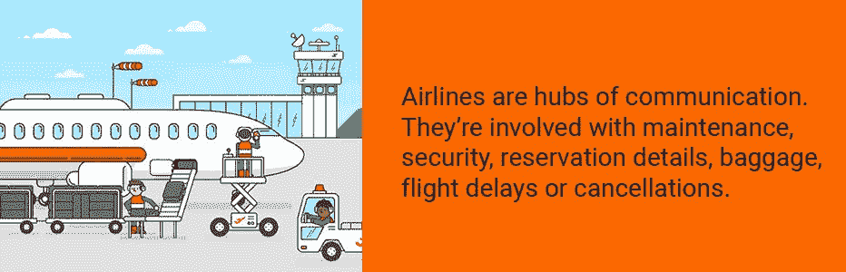
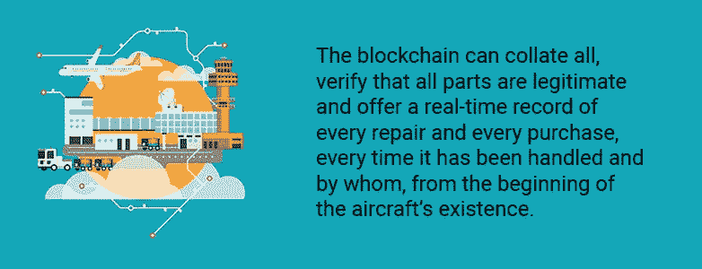
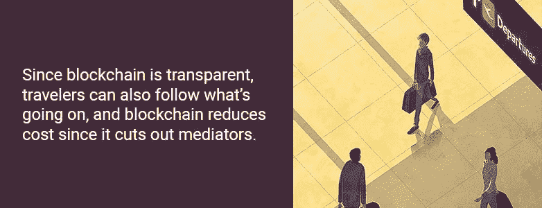

# 加密技术能让航空公司的未来更美好吗？

> 原文：<https://medium.com/hackernoon/could-crypto-technology-make-the-future-of-airlines-better-afe0e930c5e9>

对于那些知道航空公司如何运作的人来说，航空公司能够正常运转的事实令人难以置信。航空公司在某种程度上是通信枢纽，因为它们涉及维护、安全、预订细节、行李、航班延误、乘客物流和取消。他们跟踪行李、旅行安排以及乘客忠诚度积分。例如，分销商和旅行社也需要跟踪航空公司的详细信息，如果信息发生冲突，旅客和航空公司最多会损失几百到几百万美元。在最坏的情况下，数据保护的漏洞会导致灾难。

幸运的是，区块链科技(凭借其透明的账本和智能合约)显示出了帮助这些不同层次的通信准确了解每时每刻正在发生什么的潜力。它可以协作更新重要信息，确保航空公司和乘客数据的安全，为顺畅的流动签订机票条件，并在任何条件被破坏时退款。

# 问题

航空公司有几个问题，其中最重要的是，没有关于飞行数据的单一来源，并且确实存在的数据不容易被所有各方访问。这就是所谓的“飞行数据问题”

虽然有许多航空公司和机场合作共享航班数据的案例，但这些数据仍然存在于不同的孤岛中。结果就是当出现航班延误的时候，旅客 app，机场航班信息显示系统，航空公司网站，他们的电话订票系统，代理商给出的信息都是相互矛盾的。这可能导致航空公司的声誉受损，航空公司、旅客和利益相关者的时间和金钱损失，还可能导致昂贵的诉讼。例如,[引用了](https://www.usatoday.com/story/travel/flights/2015/02/02/canceled-flights-cost-airlines-and-fliers-millions/22750345/)masFlight.com 的数据库网站，并强调取消航班给航空公司、滞留乘客和公司造成了数百万美元的损失。

分散的集中信息的存在还会导致其他问题，如网站关闭或被黑客攻击，航空公司无法跟踪他们的维护需求，以及难以跟踪乘客和行李。

这就是区块链利用其正在开发的技术来帮助航空公司改善客户体验和安全的原因。

# 区块链解决方案:面向航空公司

[根据国际航空运输协会(IATA)的数据，](https://www.nationalgeographic.com/environment/urban-expeditions/transportation/air-travel-fuel-emissions-environment/)2016 年航空旅客人数将达到 38 亿，预计未来 19 年航空旅行将翻一番，航空业面临着艰巨的任务。他们需要提供最大限度的安全和保障，表现出响应和关怀，展示效率，并及时与利益相关者和旅行者沟通。

区块链即将在以下领域起飞:

*   票务——大多数航空公司都提供电子机票选项，以平稳乘客的飞行。从本质上讲，电子客票是客户的旅行细节，存储在一个巨大的数据库中并从中检索。区块链可以使用智能合同来添加关于门票销售和使用的业务逻辑以及条款和条件，这可以帮助不同的合作伙伴从世界任何地方实时销售门票。
*   乘客信息——实时共享的数据量是巨大的。忘掉协调航班吧。即使在跟踪单个航班上的乘客时，每个航空公司也必须至少跟踪乘客何时办理登机手续，何时登机扫描他们的机票，以及他们的行李相对于他们的最终目的地在哪里。航空公司不希望再次发生类似于[联合航空公司道医生事件](http://www.dailymail.co.uk/news/article-4409434/Dr-Dao-s-lawyer-compares-United-incident-Vietnam-War.html)的公关灾难，在该事件中，一名男子被强行从芝加哥一架超售的联合航空公司航班上拽下。一旦分散的分类帐达到与集中式网站相同的数据速度，区块链就可以利用其独特的透明度和协作性来防止超额预订和收入损失。

*   取消或延误的航班——航空公司必须在航班变更发生前至少 14 天通知乘客，否则乘客将获得赔偿或退款。最近[印度提出更高的航班延误赔偿](https://www.reuters.com/article/india-airlines/india-proposes-higher-compensation-for-flight-delays-in-efficiency-push-idUSL3N1SU2JB)。可以理解，航空公司并不太高兴，但[他们并不总是能够知道或阻止时间的变化](https://www.telegraph.co.uk/travel/advice/are-airlines-allowed-to-change-my-flight-time-compensation-refund/)，除此之外，航班数据驻留在不同的筒仓(文件夹、类别、不同的 IT 流程或系统)中，因此旅客往往会收到矛盾的信息。随着时间的推移，区块链可以提供这种单一的真相，利益相关者提供最新的和经过验证的信息，为航空公司节省资金和压力。
*   维护——2017 年， [IBM 提出了](http://www.aviationtoday.com/2017/01/13/iot-blockchain-proposed-to-improve-aircraft-maintenance-process/)区块链，作为航空公司、MRO 团队和原始设备制造商共享的数字账本，用于记录飞行事件、运行状况和预定的飞机维护检查。航空公司必须确保关于引擎或其他部件状态的所有数据都是最新的，并由所有相关方安全共享。目前，航空公司的维护日志保存在笨重的数据库中，或者在最坏的情况下，保存在活页夹中。区块链可以核对所有信息并验证所有零件是否合法，同时提供维修、购买、建造和维护检查的实时记录。这种可视性可以将飞机安全提升到全新的水平。
*   安全和身份—航空公司负有保护乘客记录、航班清单和机组人员信息的重要责任。2018 年 5 月，数字安全公司 [Dashlane 测试了 55 家航空公司网站的密码](https://airlinegeeks.com/2018/05/02/__trashed/)，发现只有 6 家获得了完美排名。包括达美航空和西南航空在内的大多数航空公司都取得了平均评级。在当今不安全的世界中，数据保护不容小觑。区块链技术凭借其对黑客攻击的高弹性，可以通过使用授权访问要求，提供一种风险低得多的存储和共享信息的方法。
*   对黑客攻击和故障的恢复能力——因为航空业是集中的，它们容易受到黑客攻击、崩溃或电脑故障的影响。2015 年整整五天，俄罗斯让瑞典的空中交通管制系统崩溃，据称是为了测试电子战能力。2016 年，[达美航空经历了一次电脑故障，取消了](https://www.wired.com/2016/08/computer-outage-can-take-whole-airline/)650 多个航班，延误了美国、日本、意大利和英国的更多航班。然而，在一个分散的区块链中，航空公司、旅客和利益相关者可以依靠不间断的可信的、最新的信息流。

# 区块链解决方案:面向旅行者

航空旅客会发现区块链也为他们提供了解决方案，原因如下:

*   **忠诚—** [由飞行常客计划提供的忠诚积分](https://en.wikipedia.org/wiki/Frequent-flyer_program)，可以为你节省航空旅行费用，或者他们可以为你提供其他奖励。通常，你必须等到忠诚度积分结算后才能使用它们，而且你只能在有限的范围内使用它们。通过在区块链上象征性地兑换忠诚度积分，您可以通过当场兑换获得即时价值。
*   成本——除了已经很高的费用，航空公司还要收取各种各样的费用。由于竞争激烈，某些公司垄断了这个行业，并制定了自己的收费标准。最重要的是，航空公司向机场、分销商、地方、州和联邦政府收取费用和税收。区块链技术通过将其他参与者引入该领域并消除第三方干预，缩短了其中一些费用。
*   **航班数据问题—** 由于数据存储在不同的筒仓中，乘客在航班上往往会得到相互矛盾的信息。2017 年， [IT 公司 SITA 公布了其 FlightChain 项目的结果，](https://www.airport-technology.com/features/blockchain-future-flight-data-management/)该项目调查了区块链在航班信息存储和管理方面的潜在用途。研究发现，由于区块链为飞行数据提供了单一的真实来源，它可以为乘客节省大量的时间、压力和金钱。

简而言之，区块链技术可以在四个主要方面革新航空业:

1.  它提供了对分发到网络中所有参与者的加密固定更新/信息的访问，因此每个人都知道交易记录(即航班变更或取消的细节)对于所有参与者来说是真实和一致的。
2.  区块链为几个人提供了更新公共数据集的机制，其中该数据集对该分类帐上的所有参与者(主要是该特定航空公司的所有利益相关者)都是可见的。
3.  对于集中式系统，除了系统可能崩溃或被黑客攻击之外，你不知道该相信什么。区块链具有信任方面，因为所有记录都是不变地记录和协作共享的，所以所有参与者都可以看到它们，并且可以在必要时反驳它们。
4.  集中式数据库只由一个权威机构控制，这就容易出错。然而，分类帐通过智能合约工作，在智能合约中，不同的组织不仅共享对数据的控制，而且还通过智能合约实现一组经批准和共享的业务规则。这使得数据可信，因为它使错误发生的可能性大大降低。

# 面向航空公司的区块链服务

航空公司的三大区块链平台分别是[远途网、](https://further.network/)、[蜿蜒树](https://windingtree.com/)。

# 进一步的网络

Further Network 正在推出一种分散式计费、结算和支付(BSP)模式，以实现更安全、更便捷的旅行，以及满足所有旅行需求的其他选择。它通过智能合同(称为智能旅行记录[STR])和数字货币 Aton 实现了这些发展。进一步的创新有助于航空业改善其服务、可见性和盈利能力。

航空公司利润率只有 2.5%-5%，几乎无法运营，更不用说创新了。分散的 BSP 模式减少了结算和支付成本，使航空公司能够增加利润。通过移除第三方和实现不间断的实时 P2P 通信，进一步实现了这一点。

进一步为航空公司和旅客提供以下服务:

1.分散式计费、结算、支付(BSP)流程:进一步的网络有助于航空公司降低运营成本(通过消除第三方)，因此航空公司可以专注于以客户为中心的体验，从而增加利润。

2.带生物识别 ID 的乘客钱包:进一步为用户提供个人客户钱包，用于管理他们的旅行资产和 Aton 交易。还将生物识别添加到他们的钱包中，通过将多个 ID 数据点减少到由旅行者控制的单个点来帮助改善“客户的旅程”。

3.P2P 旅游产品分销:由于国际航空运输协会(IATA)作为航空公司和旅行社之间的联络人，非 IATA 航空公司缺乏知名度。进一步的区块链不仅帮助这些航空公司推销自己，还帮助这些公司通过分布式账本传输他们的库存。

4.总部位于区块链的乘客服务系统:进一步的区块链给航空公司一个安全的分散数据管理系统。机票必须不仅仅记录航班信息。它还应该可以根据旅行者的需求和偏好进行定制。令牌化这些门票(通过 STR)有助于利益相关者和旅行者更改、销售、添加选项和定制他们的门票。

5.开放的网络标准和 P2P 交易市场:航空公司、酒店、汽车租赁、邮轮和铁路运营商以及利益相关者都可以使用 Further Network 的区块链来构建自己的技术，帮助他们扩展和创新自己的系统。

简而言之，进一步的区块链技术帮助航空公司改善其业务的所有组成部分，包括客户服务、库存管理、运输、 **s** 储存和材料处理、营销、信息处理、需求预测和其他活动。区块链技术也有助于航空公司促进其直接渠道销售、交叉销售和动态定价。共享账本为安全数据管理和削减成本提供了一个封闭的分散式云系统。随着所有利益相关者通过 Further's ledger 共享实时通信，航空公司可以防止安全问题，提高吸引力，增加利润。

# 有气泡的

法国保险公司安盛(AXA)推出的 Fizzy 是另一个区块链平台，它向客户承诺，如果航班延误超过两小时，他们可以获得即时和无冲突的退款。

航空乘客订阅 Fizzy，并在 Fizzy 的共享账本上输入他们的机票号码。Fizzy 的智能合同记录了旅行者的详细信息和条件，只要航空公司至少延误两个小时，就会自动触发支付，旅行者就会获得补偿。Fizzy 的智能合同与全球空中交通数据库相连，因此乘客赔偿是自动的。客户不需要提交索赔，智能合同最大限度地减少了保险公司和客户之间的差异。

目前，奖金以法定货币发放，尽管安盛的目标是最终使用乙醚。Fizzy 也只覆盖美国跨大西洋航班和巴黎戴高乐机场。到 2018 年底，它计划覆盖世界其他地区。

# 蜿蜒的树

Winding Tree 使用以太坊网络作为去中心化的旅行平台，最大限度地降低供应商和包括酒店在内的终端用户之间的交易成本。Winding Tree 通过允许旅行者与所有分销商(而不仅仅是垄断行业的分销商)进行非中介互动来平衡市场，以便旅行者可以获得最低的成本。由于区块链是透明的，参与者也可以跟踪正在发生的事情。

该平台使用 ERC20 令牌 Lif。

其他好处包括:

*   供应商将库存直接分配到销售点，跳过了昂贵的中间环节和瓶颈。
*   卖家从一个平台获取所有供应商的库存，没有加价费，也没有进入壁垒。
*   旅行者使用 Lif 直接支付旅行需求。

结果呢？对各方而言，航空旅行和航空运营变得更便宜、更顺畅、更可靠，航空业变得更加民主。

新西兰航空公司、[瑞士航空公司和汉莎航空公司](/wolverineblockchain/blockchains-new-pilot-disrupting-the-airline-industry-fd0a2b5024ea)、[是众多使用 Winding Tree 的航空公司中的三家。](https://airlinegeeks.com/2018/02/08/airlines-beginning-to-evaluate-blockchain-solutions/)

# 结论

区块链技术对于航空业来说是一个完美的匹配。多个参与者依赖及时、连贯、一致和完全准确的数据，不仅用于制定和实施计划，还用于共享出行者和运营信息等。

目前，航空公司存在沟通不一致的问题，导致航空公司声誉受损、昂贵的诉讼以及航空公司、旅客和利益相关方的时间和金钱损失。

区块链技术可以帮助解决这个问题，它的透明、分布式账本既永久又安全。航空公司可以使用区块链技术来管理他们关于航班、行李、乘客和天气的海量数据。他们可以使用它来跟踪维护需求，并通过使用智能合同来改善票务服务。乘客可以使用区块链管理忠诚度积分、协调航班、降低成本等。航空公司和旅行者都可以使用区块链的服务，如 Further Network、Fizzy 或 Winding Tree，来整合航空公司的接触点，获得退款，并最大限度地降低交易成本。

通过采用区块链技术，航空公司可以创建更高效的服务模式，并提供更好的客户服务和安全性。

## 关于作者:

基里尔·希洛夫——geek forge . io 和 Howtotoken.com 的创始人。采访全球 10，000 名顶尖专家，他们揭示了通往技术奇点的道路上最大的问题。加入我的**# 10k QA challenge:**[geek forge 公式](https://formula.geekforge.io/)。