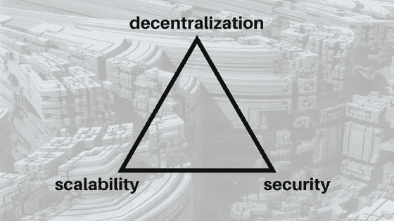
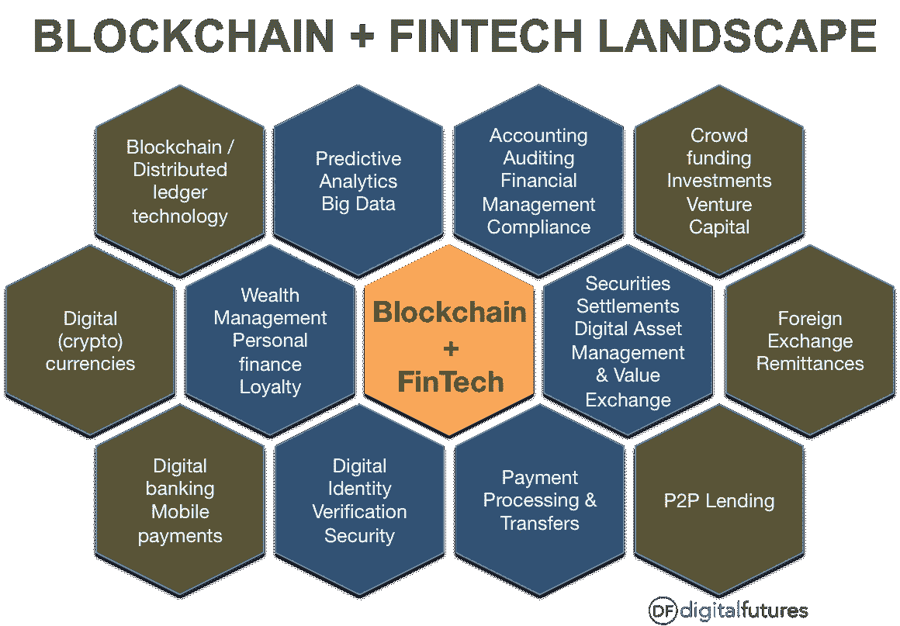

# MOAC 会是推翻以太坊的多层区块链吗？

> 原文：<https://medium.com/hackernoon/could-moac-be-the-multi-layered-blockchain-that-dethrones-ethereum-d02f404cee9d>

## 改变世界的想法有时涉及对现有技术的调整。区块链是一项需要经常调整的技术，直到它的最佳性能得以实现。

[Source](/@salmanmiah)

在它存在的这些年里，对区块链进行了一些改进。区块链经历了不同的时代，区块链 4.0 是帮助这项技术在全球范围内被接受和实用的最新尝试。MOAC 的新多层架构旨在推动去中心化超越以太坊和 EOS 所能提供的范围，成为世界正在等待的新的革命性区块链。

MOAC 的(所有区块链之母)挑战区块链，如何改善其表现可能是区块链需要的补救措施。MOAC 的平台完全是为了提高区块链的表现。MOAC 的建筑可能是迄今为止区块链最实际的应用。MOAC 正在使用**多层区块链**架构，这将增强智能签约，从而使其平台性能比现有平台有显著提高。

# 我们为什么需要区块链？

区块链的重要性不仅仅局限于加密货币。它在网络中的影响力可以为集中式平台面临的一些挑战提供解决方案。

## ➽ ***安全***

最近记录了一些黑客攻击。仅在 [2017](http://www.informationisbeautiful.net/visualizations/worlds-biggest-data-breaches-hacks/) 一年，就发生了超过 4 起 **0 起引人注目的**黑客攻击事件。 **Equifa** x、 **Cellebrite** 和**瑞典运输机构**都是其数据和客户数据遭到破坏的公司之一。对于 Equifax 来说，超过 143，000，000 名美国消费者的个人信息因黑客攻击而暴露。在将数据的访问权交给未经审查的 IT 人员后，瑞典交通管理局掌握的所有车辆数据都可能遭到破坏。目前还没有感觉到或确定其影响。然而，事实仍然是，大约有 **3，000，000** 人的数据遭到破坏，其后果可能还没有被真正感受到。在另一次黑客攻击中，Cellebrite 丢失了 **900GB** 的数据。他们的情况变得更糟，因为黑客也攻击了他们的系统，使得该公司更难真正估计安全漏洞可能造成的损害程度。

这些黑客攻击的破坏程度很大程度上是由于数据存储的集中性质造成的。一旦黑客攻破这些系统，他们就更容易获得大量数据。集中式平台通常将它们的分类信息放在一个中央系统中；因此，一次黑客攻击可能会危及所有数据的安全。此外，它们对网络罪犯也很有吸引力，因为一旦系统被攻破，它们会提供丰厚的回报。

## ➽ ***隐私***

如果安全受到威胁，那么隐私也受到侵犯。为特定团体准备的数据通常会落入坏人之手。这样的场景让所有平台的用户感到不安。用户最明显的沮丧和失望来自脸书，一个拥有超过 10 亿用户的平台。脸书的首席执行官和创始人马克·扎克伯格不得不在 T2 的美国国会和 T4 的欧盟议会解释为什么他们平台上的第三方应用程序可以收集用户数据。这是在第四频道新闻报道了用户数据如何被用来操纵人们的投票模式之后。

这唤醒了人们对隐私的需求，即使是在在线平台上。有关数据隐私的法规由相关机构实施，特别是在欧盟**。因此，公司一直在更新他们的隐私政策，以符合规定。然而，只要收集了用户数据，数据就仍然存在风险，尤其是以集中方式存储时，大多数平台都是如此。**

## **➽ ***不变性*****

**当一个集中式平台崩溃时，通过该平台进行的所有交易都很有可能丢失。假设，如果这种情况发生在银行或医院，许多人可能处于危险之中，从而放大了对不可变平台的需求。存储在区块链上的数据可以分布在整个网络中，使得网络的一个组件的故障不会影响网络的其余部分，这与集中式平台可能感觉到的方式相同，从而保存了存储的数据和交易记录。**

****

**Just like how vehicles, mobiles, TV’s and computers changed public way of life in the 21st century, the time is now for blockchain to make that same kind of impact | [Source](https://www.intheblack.com/articles/2018/03/22/blockchain-future-record-keeping)**

# **对高效区块链平台的需求**

**区块链主要是因为其在加密货币领域的影响力而得到认可，然而，它最大的潜力可以说是改善和提高我们现有系统的效率的能力。为了实现稳定的基础和平稳运行的平台，可能需要打乱这些系统。已经做出努力来提供能够支持这种变化的区块链。**

**区块链被视为将给世界带来积极变化的颠覆性技术。然而，它还没有达到世界领先技术所期望的操作水平。它在每个时代都在改进，但还没有达到预期的运营统计或采用。以太坊提供了最重要的改进之一——智能契约，它允许开发人员开始创建基于区块链技术的去中心化应用程序。像**以太网**和**密码猫**这样的应用是以太坊和区块链提供的预定因素同化的结果。**

**自从区块链开始流行以来，它一直存在的一个根本问题是协议必须处理大量事务请求的效率越来越低。这是在[以太坊](https://www.bbc.com/news/technology-42237162)推出 CryptoKitties 期间看到的，它导致交易处理速度变慢。CryptoKitties 当时的[数量](/@galea/crypto-kitties-by-the-numbers-6d3bbd791aac)接近 40000，对于预计会被大多数人采用的技术来说，如果处理**40000+**是艰难的，可以想象当处理 **1 亿+** 用户时，平台会如何艰难地运营。**

**更多分散化的应用项目和想法正以各种方式出现在经济的各个领域。然而，由于这些应用程序所基于的协议中的不足，它们仍然没有如它们的开发者所设想的那样运行。第三代协议如 **EOS** 和 **COSMOS** 提供了鼓励，但所需的进展尚未实现。**

**有了高效的区块链，通过这项技术可以完成很多事情。只有当区块链的效率提高到可以接受的速度，它才会真正意识到区块链能够展示的潜力和能力。**

# **MOAC 方法**

**MOAC 的目标是拥有一个完美平衡**可扩展性**、**安全性、**和**去中心化**的平台；区块链著名的三连胜。当前的区块链协议缺乏一种可以同时提供这三种功能的实现。MOAC 的目标不仅仅是成为普通人；它希望将终极的区块链体验从开发者那里传递给托管在其平台上的分散式应用的用户。MOAC 解决方案是一个多区块链平台，它增强了可伸缩性和性能，提高了安全性和分散性。为 MOAC 平台选择的架构方法允许它在其平台的各种组件内分配任务。其结果是一个高效率和有效的平台，可以服务于任何形式的应用程序，而不管其技术需求。**

**这种任务分配使 MOAC 的运行速度比以太坊快 100 倍，甚至更有效，因为它是为适应各种分散的应用类型而构建的。这些是 MOAC 平台的组成部分，以及它们如何致力于改进当前的用户解决方案:**

## **➽ **母链:工作证明区块链****

**Motherchain 为智能合同和 MOAC 的 DApp 公司处理数据存储和计算机处理。Motherchain 是跨不同系统工作的区块链的证明。使用工作证明很重要，因为所需的激励措施可以防止第三方的剥削和虐待。像 **DDoS** 这样的攻击被工作机制的证明所挫败。在 MOAC 生态系统中，母链是一个公共区块链层，它定义了诸如区块链操作、余额转移、共识和数据访问等功能。它也帮助其他使用微链的共识模型。**

## **➽ **作为微链的智能合约****

**这可以说是 MAOC 项目中最具创新性的想法。每个 DApp 通常都有自己独特的需求，而其所基于的协议可能并不完全支持这些需求。与那些专注于健康或教育的人相比，金融科技 Dapps 有不同的需求。来自不同的 DApp 组的事务请求可能各自对网络造成独特的影响。为了帮助减轻 MOAC 平台的压力，MOAC 为每个单独的智能合约实施了微链。这将释放智能合约，允许它们与任何类型的共识协议一起工作。**

**除了释放智能合约，开发者还可以自由选择最适合他们应用的共识算法。因此，MOAC 成为最适合任何类型的 DApp 的平台。例如，当涉及到可伸缩性时，尤其是在企业级，利益相关机制的证明是很棒的。因此，商业和金融科技应用可以选择股权证明，而不是工作证明，以实现更快、更高效的分散化应用。此外，还将确定适用于特定智能合同的节点数量，同时微链还将保存智能合同的所有状态，这些状态也可以写在母链上。**

## **➽ **区块链·沙尔丁****

**分片是确保 MOAC 平台始终保持快速高效的关键组成部分。分片只是将大量的数据和信息分割成更小、更易于管理的分片，这样可以更快地处理事务请求。该方法依赖于节点。MOAC 网络上更多的节点意味着 MOAC 更高的效率和 TPS 速率。即使在分片之后，顶级安全性仍然得到维护，因此 MOAC 可以安全地处理并行事务。**

## **➽ **跨链能力****

**MOAC 已经准备好了。这意味着它可以很容易地与系统内的其他区块链以及外部区块链甚至加密货币联系起来。它还能够在区块链之间交换数据块，并使用基于原子交换的交叉链。MOAC 与其他区块链在内部和外部的轻松互动使其能够创建一个生态系统，在这个生态系统中，DApp 可以轻松交换数据，在一个屋檐下提供各种服务。这种简单的互动可能会导致改变行业的伙伴关系。**

**这些和其他功能，如 API、事件处理以及挖掘过程如何与 MOAC 一起工作都将在[这里](https://www.moac.io/uploads/MOAC_White_Paper.pdf)详细解释。**

****

**While many blockchains have attempted to tackle the trifecta, the fact remains none have substantially made progress without compromising one of the pillars | [Source](https://coin5s.com/content/brave-new-solution-scalability-trilemma)**

# **重大变革的催化剂**

**区块链将打破世界经济领域的现状。然而，协议经历的挫折减缓了区块链展示其真实能力的步伐。随着 MOAC 教被引入区块链势力范围，这些破坏最终可能会在全球范围内发生。以下是 MOAC 可以提供优质服务的一些领域:**

## **➽ ***金融科技解决方案*****

**据福布斯报道，金融科技增长不如预期的主要原因之一是科技和金融之间的战略矛盾，这可以归因于这两个实体增长率的差异。随着新的创新频繁推出，金融科技的技术发展速度很快。这也可能是金融科技应用的开发者和创意创始人之间愿景差异的结果。现有的区块链金融科技解决方案正面临一个重大的**可扩展性挑战。****

**有了 MOAC，眼前的可伸缩性问题将迎刃而解。任何托管在 MOAC 的金融科技应用都将处理用户可以管理的交易。MOAC 的目标也是对开发者友好，因此开发者可能更容易制作出接近原始想法的 DApp。有了来自区块链的额外安全优势，用户可能会被总部设在 MOAC 的 DApp 所吸引。MOAC 的建筑让它能够跟上不断变化的技术场景。它的**跨链能力**和可伸缩性方法将在基于新一代区块链推出新 DApp 时保持其相关性。MOAC 进入金融科技领域可能会克服的另一个障碍是它将带来的实际变化。等级森严的高管不愿意改变，这拖累了金融科技的增长和发展。MOAC 的平台很可能是去中心化金融科技应用所需要的垫脚石。**

## **➽ ***医疗解决方案*****

**医院和医疗保健部门的其他支持部分非常敏感，因为它们直接影响人类的生活质量。他们需要能够高效可靠地提供患者所需护理的系统。医院有许多问题，主要是管理和安全问题。MOAC 的能力允许开发者在 MOAC 的平台内开发一个完整的医疗保健生态系统，这将消除大多数这些挑战。**

**医疗保健生态系统可以有一个招聘 DApp，一个病人数据库应用程序，一个医院财务 DApp 和任何其他创新的医院解决方案 DApp 的。这可能有助于医院管理的行政部分。如果医护人员的数据都存储在由 MOAC 托管的安全、分散的数据库中，招聘工作将变得更加容易，同时高效地管理所有患者记录和治疗，从而减少行政措施的可能性。**

**利用 MOAC 平台还可以管理医疗保险，以便为所有人提供全民保险。它有能力处理医院每天遇到的事务需求。适当的财务管理也可以通过使用高效的分散应用程序来实现，这可以帮助医院节省大量资源。**

**MOAC 可以让医院为即将到来的技术特征做好准备，加密货币可能是大多数人的首选货币。在这样一个时代，基于支持跨链交易的平台会有所帮助。发展中国家将从《MOAC 纲要》中受益匪浅，因为这种创新可以帮助这些国家更快地实现发展目标。**

**MOAC 的建筑就是为这种优化而建造的。在其平台内执行事务时产生的分区使其能够处理医疗行业可能出现的大量需求。在 MOAC，极限是每个开发者的想象力。**

## **➽**高等学府 t5】****

**发展中国家和许多发达国家总是需要在教育领域得到某种支持或改善。这些国家的大多数高等教育机构的状况仍然远远落后于其他大洲已建立的高等教育机构。筹资活动可以通过 MOAC 平台进行，以支持现有机构的发展和新机构的建立。可以使用基于 MOAC 的 DApp 来管理这些机构。该平台还可以利用高等教育机构中的创造性思维，这些创造性思维可能会为平台本身提出创新想法，甚至可以使用 DApp 的实现其他想法。**

**可以通过 MOAC 提供的联系采取措施，将高等教育机构与行业参与者联系起来。这可以帮助学生为他们正在学习的实际工作做准备，也可以帮助雇主对毕业生有信心。高等教育机构通过 MOAC 平台保存的记录也可用作**认证分散申请**的参考点。就业市场上候选人素质的整体改善将标志着这些国家的一定水平的增长。**

****

**Blockchain technology has the potential to universally reshape the way business transacts across nearly every industry in the global economy | [Source](http://digitalfutures.co/1724-2/)**

**MOAC 有能力创建一个分散的生态系统，支持世界参与的各种经济部门每天发生的绝大多数功能。凭借可能比以太坊高 100 倍甚至更高的 TPS 速率，MOAC 可以提供区块链所预期的破坏。**

**MOAC 支持去中心化应用的平稳运行，它支持加密货币操作，并促进区块链旨在实现的去中心化未来。除了在教育、健康和金融科技领域、酒店行业和广告行业的应用，游戏行业也会发现 MOAC 平台非常适合他们的活动！**

*****免责声明:*** *请仅将此信息作为我自己的***意见，在任何情况下都不应视为财务建议。做任何决定前请记住****DYOR****🤓****

***♂️你好，我叫萨尔。*如果你觉得这篇文章很有用，并且想看我的其他作品，请一定要鼓掌并在 medium 上关注我！😎****