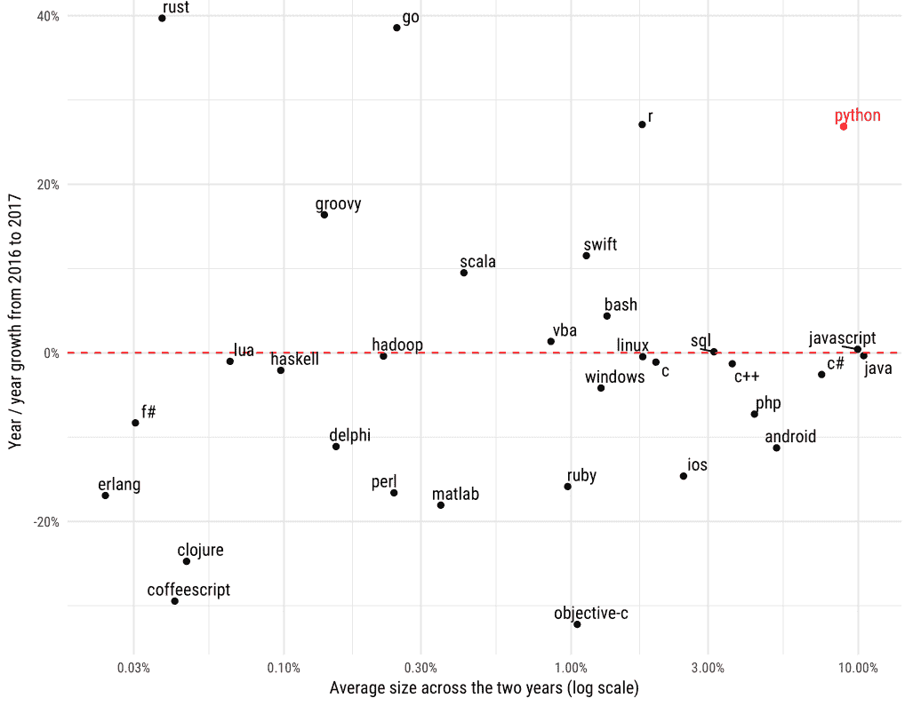

# 未来五年，Python 的受欢迎程度会超过 JavaScript 吗？

> 原文：<https://medium.com/hackernoon/could-pythons-popularity-outperform-javascript-in-the-next-five-years-abed4e307224>

JavaScript 和 Python 是两种有影响力的编程语言，用于构建广泛的应用程序。

虽然 JavaScript 多年来一直是主流编程语言，但 Python 的快速增长有可能取代这项广受欢迎的技术。

拥有十多年软件开发经验的 Melight 目前正在向人们传授他的技能，他说,“随着技术领域最近的发展，我们很可能会看到 JavaScript 和 Python 之间不分上下的流行竞争——而后者可能会赢得大多数开发人员的心。"

那么，在未来五年内，Python 的受欢迎程度会超过 JavaScript 吗？

(本文不是要比较 JavaScript 和 Python 之间的*最佳编程语言*。这两种语言有不同的用例，您不能完全用一种语言替代另一种语言。

# **JavaScript 的霸气流行**

JavaScript 最初发布于 1995 年，是一种脚本编程语言，主要用于增加网页的交互性。

还有其他高级版本的语言，如 Node.js，用于在应用程序的服务器端添加额外的功能。

事实上，估计所有网站中大约有 [94.9%](https://w3techs.com/technologies/details/cp-javascript/all/all) 使用 JavaScript。

以下是 JavaScript 流行的三个主要原因:

*   JavaScript 可以在客户端和服务器端使用。因此，开发人员发现使用这种语言并避开 PHP 等其他服务器端语言很容易。
*   JavaScript 是一种跨平台的编程语言。例如，通过使用脸书支持的 React 本地 JavaScript 库，您可以构建在桌面和移动平台上部署的应用程序。
*   有一个庞大的 JavaScript 爱好者社区支持继续使用这种语言。如果没有积极使用这种语言并支持它继续被采用的人，动态语言就不会有今天的辉煌。

根据 [Stack Overflow 的](https://insights.stackoverflow.com/survey/2018#most-popular-technologies) 2018 开发者调查结果，JavaScript 是最常见的编程语言。

下面是一个堆栈溢出图，显示了各种编程语言的流行程度:

如上图所示，堆栈溢出用户更喜欢选择 JavaScript 作为他们的语言。

虽然 69.8%的被调查用户声称他们热爱 JavaScript，但只有 38.8%的人声称他们与 Python 有着牢固的关系。

令人惊讶的是，JavaScript 在过去的六年里一直占据着第一的位置。

此外，GitHub 还报道说，JavaScript 仍然是编程语言的冠军。

根据 2017 年底完成的一项[研究](https://octoverse.github.com/)，代码共享网站提到大多数开发者更喜欢使用 JavaScript 作为他们的存储库。

下面是一个 GitHub 图表，显示了平台上每种编程语言所代表的拉取请求的数量:

如上图所示，大多数用户更喜欢使用 JavaScript 进行拉取请求。

有趣的是，Python 是该平台上使用第二多的语言——表明它试图在不久的将来取代 JavaScript。

# **Python 越来越受欢迎**

Python 最初发布于 1991 年(因此，它比 JavaScript 更早)，是一种功能强大的编程语言，正越来越受到人们的青睐。

它是一种高级通用语言，用于完成广泛的任务，包括构建 web 应用程序、分析数据和创建机器学习算法。

以下是 Python 使用量惊人增长的三个主要原因:

*   Python 因为其简单易用的语法而获得了很多赞誉。这种语言强调代码的可读性和简单性，这使得它成为许多首次开发人员的首选。
*   Python 的可靠性和高效性赢得了许多人工智能专家的喜爱。因此，随着当前机器学习和数据科学应用使用的增加，Python 已经成为该领域专业人员的首选。更重要的是，有几个 Python 库，它们简化了完成各种科学任务。
*   就像 JavaScript 一样，Python 也有一个支持该语言发展的活跃社区。Python 已经存在好几年了；因此，有大量的指南和出版物可以让用户很容易地找到支持—无论他们是初学者还是有经验的人。

在 2018 年 9 月的 [TIOBE 编程社区指数](https://www.tiobe.com/tiobe-index/)中，Python 有史以来第一次被列为第三大最受欢迎的编程语言。

该指数按月计算，评级基于编程语言的搜索引擎结果。

以下是 2018 年 9 月的 TIOBE 指数图:

由于 Python 在完成各种技术任务中的使用越来越多，Stack Overflow 将其称为[“发展最快的主要编程语言”](https://stackoverflow.blog/2017/09/06/incredible-growth-python/?_ga=2.199625454.1908037254.1532442133-221121599.1532442133)

这是一个堆栈溢出图，显示了从 2012 年到 2018 年，Python 相对于其他编程语言在高收入国家的增长情况:

正如上面关于编程语言趋势的数据所示，Python 在 2017 年 6 月首次记录了关于堆栈溢出的最高整体问题浏览量 JavaScript 紧随其后。

这表明了显著的增长，因为在 2012 年，对 Python 平台的兴趣非常低；事实上，从那时起，这种语言已经增长了 2.5 倍。

此外，Stack Overflow 建立了一个模型来预测未来两年主要编程语言的流量。

下面是预测的结果:

令人惊讶的是，该模型预测 Python 将在 2020 年保持对 JavaScript 的领先地位。

此外，Stack Overflow 比较了 2016 年至 2017 年主要编程语言流量的年增长率。

下面是分析的结果:

正如上面关于最新编程语言趋势的截图所示，Python 实现了 27%的年增长率，这表明了它的快速增长。

令人惊讶的是，JavaScript 在两年内实现了非常小的流量增长。

# **收尾**

虽然 JavaScript 多年来一直被称为互联网的“通用语言”，但 Python 可以超越它的这一头衔——基于显示 Python 令人难以置信的增长的数据。

尽管如此，时间会证明 Python 是否配得上这个称号。

重要的是，软件开发中这些不断变化的趋势指出了在你为未来做准备时最适合学习的[编程语言](https://www.liveedu.tv/guides/programming/)。

那么，你认为哪种语言将主宰 web 开发的未来？

在接下来的五年里，Python 的受欢迎程度会让 JavaScript 相形见绌吗？

请在下面的评论区提供你的想法。