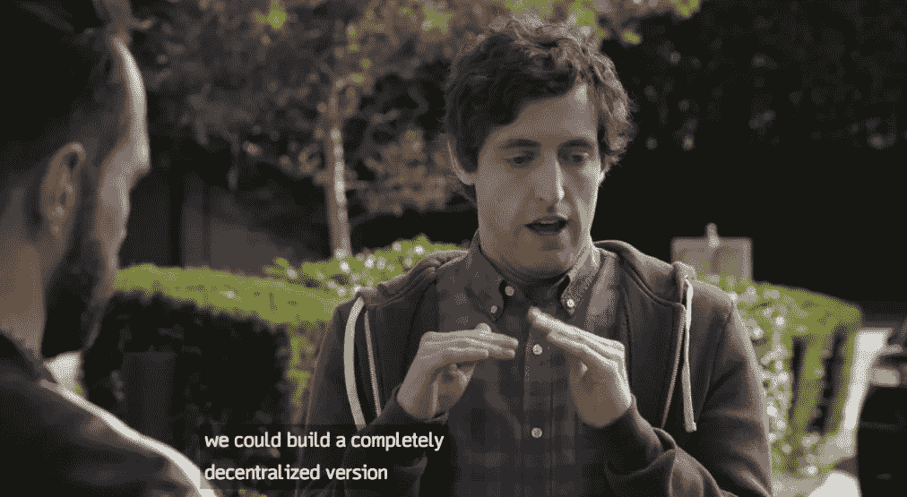

# 去中心化的互联网能把我们从硅谷的巨人手中拯救出来吗？

> 原文：<https://medium.com/hackernoon/could-the-decentralized-internet-save-us-from-the-giants-of-silicon-valley-6f1702de4491>

## 2017 年是硅谷在更多方面受到更多批评的一年。但是，应该用法规——还是用代码——来对抗科技巨头呢？

几十年来，硅谷主要被认为是创新和伟大思想的中心。但在 2018 年，在硅谷工作听起来和在华尔街工作一样有魅力。甚至以前似乎对硅谷巨头的主导地位漠不关心的团体也加入了批评者的行列:美国政客、[前雇员](https://www.nytimes.com/2018/02/04/technology/early-facebook-google-employees-fight-tech.html)甚至[公司本身](https://www.nytimes.com/2017/09/21/technology/facebook-frankenstein-sandberg-ads.html) [承认](https://www.nytimes.com/interactive/2017/10/13/opinion/sunday/Silicon-Valley-Is-Not-Your-Friend.html)并非一切都是应该的。

# 没完没了的争议

争议的清单变得很长，仅举几个例子。假新闻和俄罗斯试图操纵选举活动。社交媒体对我们心理健康的影响。通过收购和持续增长走向垄断的趋势。共享经济和自动化导致稳定工作减少，并把人们推向所谓的[不稳定状态。](https://en.wikipedia.org/wiki/Precariat)

然而，即使你放大硅谷，这也是一幅令人沮丧的画面。开发商收入过高，导致房价上涨，而那些在自助餐厅为他们服务的人工作不稳定，收入微薄。#MeToo 运动在硅谷也有非常成问题的工作文化，关于[性骚扰](https://www.nytimes.com/2017/02/22/technology/uber-workplace-culture.html)和[代表性不足](https://www.wired.com/story/the-other-tech-bubble/)的故事，几乎每个群体都有，除了白人异性恋男性。

# 你能抵制大科技吗？

这些故事中的每一个都足以证明批判的眼光，但总的来说，它让越来越多的人得出结论，大型科技公司没有负责任地行使权力。

不过，由于网络效应，抵制他们通常很难。使用这项服务的人越多，它就越有用。散居者试图与脸书竞争，但当你所有的朋友都在脸书时，那又如何？搜索引擎 DuckDuckGo 在不收集你的数据的情况下做得很好，但是只要谷歌是大多数浏览器的默认搜索引擎，这能改变什么吗？

当新公司真的设法挑战大公司时，巨头们很快就会收购或模仿它们。

# 要求监管的呼声越来越高

北欧的解决方案是呼吁加强 T2 的监管，但是甚至 T4、美国、共和党都开始接受这个想法。(然而，这在[争取网络中立](https://www.battleforthenet.com/)中并不明显)。挑战在于，对垄断的传统理解强烈关注虚高的价格。但是价格并不高——科技巨头的问题在于权力的集中。像谷歌和脸书这样的公司已经成为我们在网上所做的一切的基础设施，但是这些公司的国有化并不现实。

在欧洲，以德国为首，我们确实看到了更强监管的例子。去年夏天，欧盟因谷歌滥用市场地位对其罚款 24 亿欧元。5 月 25 日，欧盟指令 [GDPR](https://www.dn.no/etterBors/2017/11/26/2050/Teknologi/nye-regler-setter-forholdet-til-kundene-pa-prove) 开始生效，让用户对如何使用他们的数据有更多的控制权。一月份，一项德国法律生效，该法律要求社交媒体公司在其服务上传播假新闻和仇恨言论时承担责任。如果他们不遵守，他们将面临巨额罚款的风险。

# 对新的权力下放的呼吁

如果你回到 30 年前，互联网成为历史上一些最强大公司的基础是令人惊讶的。互联网是由[非商业](https://www.nytimes.com/2016/06/08/technology/the-webs-creator-looks-to-reinvent-it.html)力量开发的，是一个[中立](https://techcrunch.com/2016/07/02/for-everyone/)和[去中心化](https://www.theguardian.com/technology/2017/mar/11/tim-berners-lee-web-inventor-save-internet)的系统。万维网也被设计成去中心化的。具有讽刺意味的是，一些看似无害的网站变得强大起来，这在网络诞生之初是不可想象的。渐渐地，网络变得集中在少数几个强大的节点上，比如脸书、谷歌和亚马逊。

The idea of the decentralized Internet got a little bit of mainstream attention when [Pied Piper realized in Season 4 of Silicon Valley](https://www.wired.com/2017/06/pied-pipers-new-internet-isnt-just-possible-almost/) that they could use their technology to build a decentralized Internet. Photo: HBO

有些人认为，你无法通过监管重建去中心化的网络。更确切地说，当前互联网和网络的设计存在根本性的缺陷。这个问题我们需要*编码*自己解决，而不是*规范*自己解决，稍微简化一下论点。在全球范围内，有许多不同的团体支持开放、中立和分散的网络理念。代表人物从理想主义者到风投资助的企业家。

# 分散的网络——用简单的英语说

虽然没有[一致同意的分权定义](https://ischoolonline.syr.edu/blog/what-is-the-decentralized-web/)，但是不同的项目有一些共同的特征。一个[中心思想](https://www.makeuseof.com/tag/goodbye-http-faster-safer-decentralized-internet-ipfs/)就是从其他用户那里获取文件，也就是点对点而不是中央服务器。由于不同用户存储了文件的额外副本，即使在某些地方存在连接问题，您仍然可以通过[获得](https://techcrunch.com/2015/10/04/why-the-internet-needs-ipfs-before-its-too-late/)文件。没有用户存储整个文件，只有多个文件的微小加密位。因此，几乎不可能通过[侵入](https://techcrunch.com/2014/07/23/maidsafe/)来窃取密码或信用卡信息，或者让各州[审查](https://techcrunch.com/2014/07/23/maidsafe/)并控制互联网流量。当额外的费用低得多时，服务器就显得老得无可救药了。

但是为什么你我要费心去存储别人的文件呢？在几个项目中，这是使用[区块链技术来激励的，](https://www.nytimes.com/2018/01/16/magazine/beyond-the-bitcoin-bubble.html)同样的[技术](https://www.wired.com/story/future-of-bitcoin-blockchain-2018/)是比特币等加密货币的基础。像 [MaidSafe](https://techcrunch.com/2014/07/23/maidsafe/) 和 [IPFS](https://www.wired.com/2017/06/pied-pipers-new-internet-isnt-just-possible-almost/) 这样的项目都有自己的[加密货币，](https://www.wired.com/2017/01/bitcoin-will-never-currency-something-way-weirder/)作为代币。您贡献的存储越多，您赢得的代币就越多，这些代币可以在网络内使用。或者你可以选择将它们转换成“常规”货币。

最彻底的变化可能是，这些代币可以实现全新的商业模式。在一些项目中，系统会自动直接奖励那些[贡献价值](https://techcrunch.com/2017/01/08/the-future-is-a-decentralized-internet/)的人——用户本身，以及那些开发网络上最受欢迎应用的人——这在理论上意味着你可以[摆脱](https://techcrunch.com/2014/07/23/maidsafe/)[广告模式](https://www.nytimes.com/2018/01/16/magazine/beyond-the-bitcoin-bubble.html)的。已经有一些市场不再有任何中介抽取佣金。相反，[整笔钱](/lux-capital/inventing-a-new-decentralized-internet-57f30de494f8)直接从买方转给卖方。

代币也是股权的一种替代方式，模糊了企业家、投资者和使用者之间的界限。另一方面，这种发展也催生了一种新类型的[诈骗](https://www.wired.com/story/cryptocurrency-scams-ico-trolling/)在你加入加密货币潮流之前，你应该知道。

# 分散的网络带来了新的难题

分散式网络充满了挑战。如果曾经在线的任何东西不会仅仅因为某人关闭互联网服务或服务器崩溃而再次消失，那么世界上的图书馆员和档案馆可能会感到高兴。但是我们大多数人也可以想象我们希望从网络上消失的内容。

相应地，当我们想到中国、土耳其或伊朗等国家的审查制度时，一个不关闭整个互联网就不可能审查的网络听起来很有吸引力。但这也意味着不可能检测和审查例如儿童剥削材料(我选择不使用儿童色情制品这个术语)。

# 我不能支持我几乎不懂的东西

权力的集中不仅仅是因为协议和系统的设计方式。像脸书和谷歌这样的巨头帮助大多数人获得和使用 T2 的技术。你今天可以使用互联网，却不知道它是如何工作的。

从 12 岁起，我就有一个 24/7 的互联网连接，把时间花在 IRC 上，并建立了几个网站。当我的朋友们遇到电脑问题时，他们都会打电话给我。在过去的十年里，我的工作是创建数字服务和网站。

尽管如此，即使在花了几天时间阅读去中心化网络之后，我发现它几乎是不可理解的。只要大多数人不能理解什么是去中心化的互联网，我认为如果我们想挑战科技巨头，我们就必须加强监管。

*这段文字的早期版本发表在挪威商业日报*[*Dagens nringsliv*](https://www.dn.no/etterBors/2018/02/09/2045/Teknologi/et-nytt-nett)*上。评论？把它们留在下面，或者在*[*Twitter*](https://twitter.com/idaaa)*上问好，或者给我发电子邮件至 ida@idaaalen.no.*