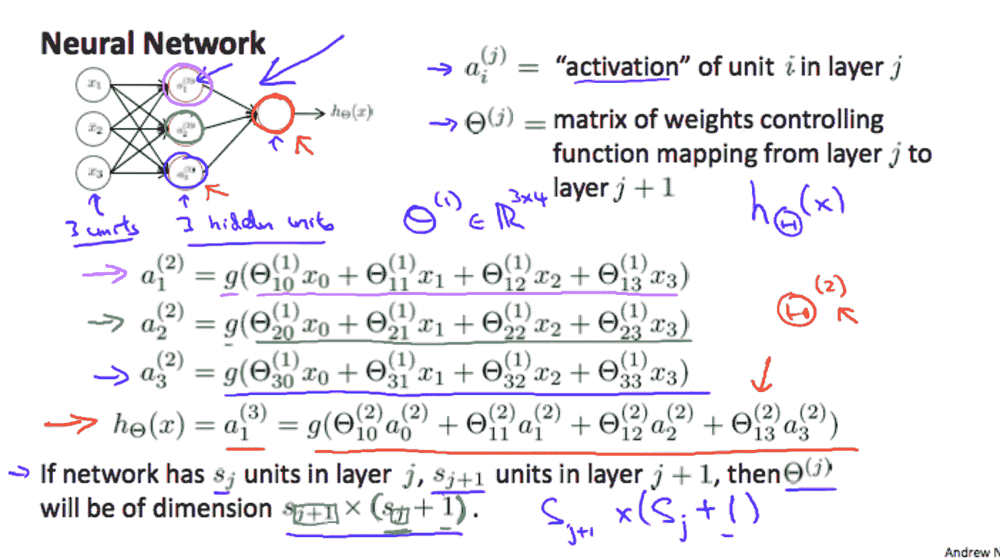

# Coursera vs Udacity 进行机器学习

> 原文：<https://medium.com/hackernoon/coursera-vs-udacity-for-machine-learning-f9c0d464a0eb>

Udacity’s [Machine Learning Engineer Nanodegree](https://www.udacity.com/course/machine-learning-engineer-nanodegree--nd009t) Thumbnail

对于机器学习的学生来说，2018 年是一个激动人心的时刻。有大量现成的教育材料，该行业的重要性只会继续增长。也就是说，有这么多容易获得的资源，选择适合你兴趣的可能很难。为了帮助那些考虑进入机器学习世界的人，我想分享我在 2017 年参加的两门课程的经验: [Coursera 的机器学习课程](https://www.coursera.org/learn/machine-learning)和 [Udacity 的机器学习工程师纳米学位项目](https://www.udacity.com/course/machine-learning-engineer-nanodegree--nd009t)。我发现这两门课程都很有教育意义，很有价值，但本质上非常不同。如果你没有时间两者兼顾，那么希望这篇文章可以帮助你决定哪一个最适合你。

**Coursera**

Coursera 的机器学习课程是“OG”机器学习课程。由著名的史丹福教授吴恩达带领，这门课程感觉上像是一门大学课程，有教学大纲、每周时间表和标准讲座。大学的感觉也延伸到了课程上。这是一张幻灯片示例:

Courtesy of Coursera

如果这让你害怕，你并不孤单。我通常回避数学课，但实际上我很欣赏这门课的方法。课程从线性代数复习开始，解释机器学习的概念，如梯度下降，成本函数，正则化等。一路上。它的结构比我参加过的任何大学课程都要好。材料不容易，但这是件好事。你带着真正理解机器学习的满足感离开课程，足以让你甚至可以从头开始构建自己的机器学习框架。

**Udacity**

Courtesy of Udacity

Udacity 的机器学习工程师纳米学位项目是 Coursera 学术界的替代贸易学校。从基本的统计数据到成熟的深度学习，Udacity 教你过多的行业标准技术，以完成该程序精心制作的项目。事实上，这些项目是如此之好，以至于我在 Github 上分享了它们的回购协议，并把我的解决方案作为组合项目放了出来。该计划的最后一步是完成一个你自己选择的顶点项目。虽然理论上你可以自己做一个类似的项目，但我发现完成纳米学位的愿望是一个强大的动力；我最终投入了比我通常投入到一个独立的兼职项目中更多的时间和精力。最终，我创造了令我真正自豪的东西。Udacity 的项目与其说是教授，不如说是为你自学提供了一个框架和动力。

**对比**

既然我已经介绍了这两个程序，我将从几个方面强调每个程序的优点和缺点。

**编程环境**

我提到过，Coursera 就是“OG”机器学习课程；因此，它在“OG”3D 数学语言和编程环境中教授也就不足为奇了:Matlab。由于 Matlab 的成本和许可问题，机器学习世界大多已经转移到 Python。这一举动严重限制了编程任务的实用性，因为您必须重新学习 Python 中的大量工作。如果你是一个懂很多语言的经验丰富的程序员，那可能没什么大不了的。然而，如果你相对来说是编程新手，那么这条弯路可能会花费你很多时间。

Udacity 课程是在一个现代 Python 环境中教授的，使用了流行的框架，如 Sklearn、Tensorflow 和 Keras。该课程甚至教学生如何使用 AWS 将机器学习软件部署到云上。该课程还简化了使用 Docker 映像和 AMI (Amazon 机器映像)安装机器学习依赖项的过程，分别用于本地和 AWS 开发。事实上，整个 Udacity 环境符合行业最佳实践，学习它的学生将在就业市场上做好准备。

赢家= Udacity

**讲座**

Coursera 的机器学习课程由人工智能教父吴恩达亲自创建和教授。这门课程在很大程度上提高了他在业内的声誉。这些讲座遵循一个统一的格式，每一个都以有条不紊的方式建立在最后一个的基础上。更不用说，他亲自带领每一个人。最后，吴教授在他的视频中也非常鼓舞人心，我认为这是一个很好的接触。

相比之下，Udacity 的讲座以角色的轮换为特色，这可以在不同部分之间产生非常不和谐的过渡。我数了一下，在整个课程中，至少有七个不同的人在讲课。虽然 Udacity 试图为其学生提供多种内容来源，但缺乏同质性无疑削弱了我对讲座的热情。在课程结束时，我只是直接跳到项目上，看讲座，甚至根据需要搜索 Youtube。

赢家= Coursera

**项目**

Coursera 的课程有编程作业，在这些作业中，学生提交代码，并根据自动化单元测试进行测试。虽然这种模式有助于扩大班级规模，但当出现问题时，它会让您在论坛中搜寻。也就是说，我从未遇到任何重大障碍。作业本身与课程材料直接相关，并强化了课堂内容。有时感觉我实际上是在创建自己的机器学习框架；然而，在其他时候，感觉我只是在实现方法，直到单元测试通过。

Udacity 的项目设计得非常好。事实上，它们是我见过的最好的教育材料。每个项目涵盖一个主题，如无监督学习、强化学习、线性回归，其中你要解决一个多步骤的机器学习问题，并写下你的方法和理解。当你觉得你已经完成了一个项目，你把它交给一个人来评分。我得到的反馈质量令人难以置信。最终项目是一个顶点，你可以自己选择，但它仍然由 Udacity 的工作人员审查。这个提议和[最终报告](https://github.com/notnil/udacity-ml-capstone/blob/master/report.pdf)成为我创造的最好的投资组合项目之一，也是我编程生涯中最引以为豪的事情之一。

赢家= Udacity

**成本**

Coursera 的价格很难被击败，因为它是免费的。获得认证需要 80 美元。如果你预算有限，那么 Coursera 是一个很好的选择。

Udacity 最近改变了机器学习纳米学位的定价模型。当我加入这个项目时，月薪是 200 美元。现在是 999 美元的固定费用。每月定价模式激励我在三个月内快速完成这个项目。虽然我必须承认，鉴于教师反馈的质量，即使价格上涨，学费似乎仍然合理。正在一丝不苟地审查项目的高技能劳动力无法支付自己的费用。然而，如此高的金额，报名参加纳米学位项目显然是一个更大的考虑。

赢家= Coursera

**结论**

当与获胜类别数量相关的课程时，我将选出一个获胜者。这是…

Udacity。付费课程击败免费课程并不奇怪，但 Udacity 机器学习工程师 Nanodegree 项目给了我信心，让我可以专业地追求机器学习的职位和机会；为此，它的入场费是一个非常小的代价。也就是说，我仍然建议你两门课都学。从 Coursera 开始，这样当你使用“包含电池”的高级框架时，你就能理解底层细节，并对你实际编码的东西有更好的理解。在你建立了一个坚实的概念基础之后，通过学习 Udacity 的实用的行业标准实践来进一步完善你的技能。总的来说，我很高兴我在 2017 年迈出了进入机器学习世界的具体步伐，我鼓励你在 2018 年也这样做。

Coursera 的机器学习证书

机器学习工程师纳米学位证书

