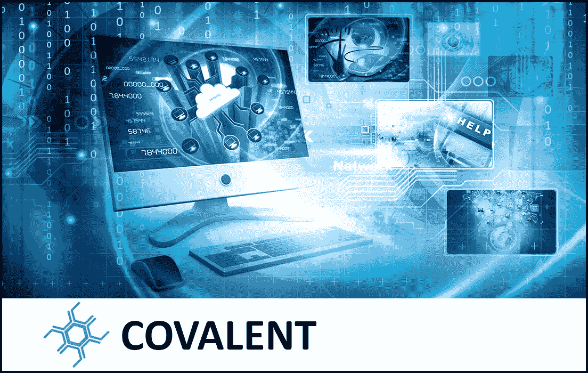

# 共价协议分析和潜在的使用案例

> 原文：<https://medium.com/hackernoon/covalent-protocol-analysis-and-potential-use-cases-74c72e65382c>

***完整披露:*** *本文无意作为投资建议。这只是我个人对共价协议的看法。你应该总是做自己的研究#DYOR。我是“文章小组”的一员，该小组奖励我写这篇文章，并鼓励我表达自己的观点。*

在我的[上一篇文章](/@cultcrypto/covalent-the-privacy-preserving-data-utilization-protocol-a-project-overview-cb49c71e2d4b)中，我写了一篇关于[共价协议](http://covalent.ai/)项目的详细概述，在这篇文章中，我想更进一步，讨论共价协议的几种可能的用例。然而，在我们进入用例之前，我首先想解释一下共价是怎么回事。

2017 年总共创建了 22 个 zettabyte (ZB)的[数据](https://www.seagate.com/www-content/our-story/trends/files/Seagate-WP-DataAge2025-March-2017.pdf) (1 个 ZB = 10 亿字节)；然而实际上只有 1%得到了利用。这一比例如此之低有几个原因，但最大的原因可能是:1)隐私，数据所有者不愿意信任第三方来处理他们的数据；2)缺乏价值网络，这将激励数据所有者共享他们的数据。

共价旨在通过利用区块链技术的力量来解决上述问题，并建立一个隐私保护的、分散的计算平台和协议，该平台和协议能够在不损害隐私的情况下从数据中提取/分析特定信息。这意味着，通过共价协议，数据所有者可以控制自己的数据，并能够指定他们想要共享的特定数据片段以及与谁共享。由于数据的使用在共价网络上是可追踪的，数据所有权保证了数据所有者在传播和使用过程的每个阶段都得到公平的补偿。现在我们对共价项目的目的有了一个很好的理解，我们可以看看共价方案的一些潜在的使用案例。

让我们假设存在关于您的医疗状况的数据，并且您希望出于研究目的共享这些数据。但是，您希望共享数据而不损害您的隐私，并且您只希望数据用于一个特定的研究项目。你怎么知道研究机构没有重复使用甚至是转售你的数据？你能信任这个第三方来处理你的数据吗？

为了解决这个问题，共价开发了一个分散的应用程序(DApp)，在共价协议之上，称为 Medata。Medata 是一个医疗数据市场，患者可以指定他们想要共享的数据以及如何使用这些数据。当研究人员请求一个数据集时，只选择相关的患者数据，并对其进行匿名化或聚合(因此这些值不再能追溯到某个人)。然后，研究人员可以使用该数据集来分析/运行预测模型，以回答他/她的研究问题。通过使用智能策略(类似于智能合同)，共价协议保证数据只能用于特定的研究项目，而不能重新分配给其他方。此外，患者还会因为分享数据而获得 Cova 令牌(驱动共价生态系统的令牌)的奖励。

简而言之，研究人员通过获得大量以前未开发的数据而受益；而患者可以在不侵犯其隐私的情况下帮助推进科学研究，同时还可以因为分享他/她的数据而获得回报。因此这是一个双赢的局面。

你有没有觉得不愿意和第三方分享你的信用卡号(我知道我有)。在目前的系统下，我们不知道第三方公司如何处理我们的信用卡信息。据我们所知，他们可能会重复使用或转售我们的信用卡信息，在你知道之前，它可能会被其他人未经你的允许而使用。共价协议为这个问题提供了一个解决方案。通过利用智能策略，共价协议可以强制您的信用卡号码只能用于一次性收费，并在支付完成后从服务器上删除。

让我们假设你写了一个伟大的新故事，你想在网上发布你的文学杰作；但是你想保持它的独占性，只允许分享 100 次。以目前的技术，这是不可能的，因为每个人都可以复制文档，重新发布它的内容。然而，通过利用共价协议，可以设置智能策略，跟踪某个文档被共享的次数，并在共享次数达到 100 时阻止共享选项。

这就是共价协议的三个潜在用例。这绝不是共价项目在数据共享和数据控制方面提供的所有可能性的详尽样本；但我想提供一个小的迹象，表明共价的力量，以及他们如何设想通过建立一个保护隐私的、分散的计算平台和协议来颠覆现有的数据产业。

**共价结合的更多信息来源:**

网址:【http://covalent.ai/index.html T3

白皮书:[https://docsend.com/view/dvvb75n](https://docsend.com/view/dvvb75n)

电报:【https://t.me/covalentofficial 

推特:【https://twitter.com/covatoken 

博客:[https://medium.com/@covatoken](/@covatoken)

github:[https://github.com/covalent-hq](https://github.com/covalent-hq)

*订阅我的频道:*[*Medium*](/@cultcrypto)*，*[*Twitter*](https://twitter.com/CryptoShowdown)*和*[*ste emit*](https://steemit.com/@cryptoshowdown)*如果您喜欢我的文章并希望了解区块链、加密货币项目和新闻。也可以看我在*[*LinkedIn*](https://www.linkedin.com/in/donjohanson/)*上的文章。

如果你对本文有任何疑问，请在下方评论区评论。掌声也欢迎，谢谢！*

**秘密对决**