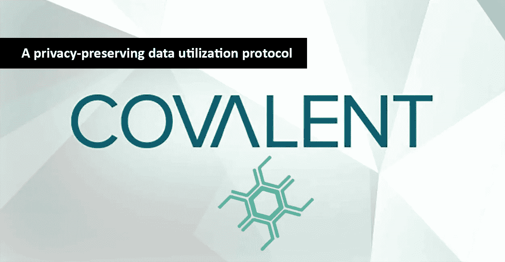
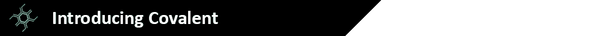
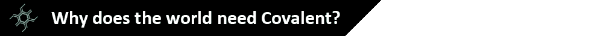
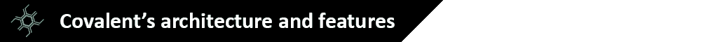
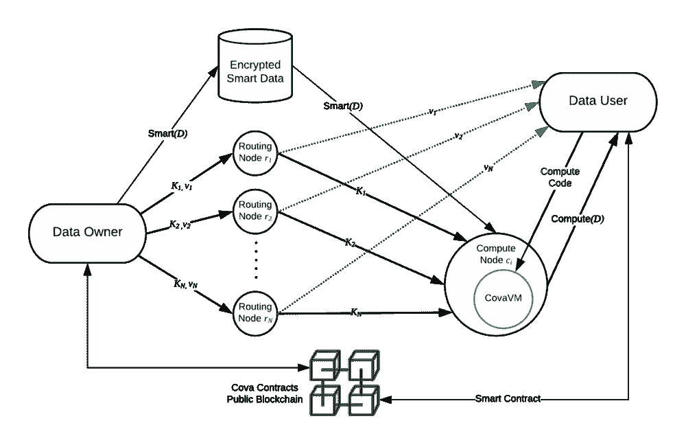
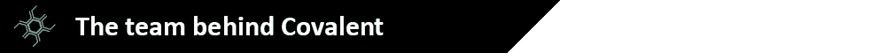
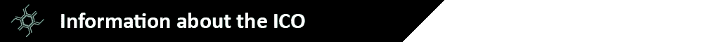
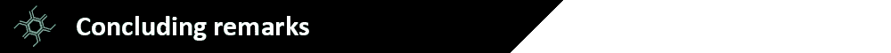

# 共价，隐私保护数据利用协议:项目概述

> 原文：<https://medium.com/hackernoon/covalent-the-privacy-preserving-data-utilization-protocol-a-project-overview-cb49c71e2d4b>

***全披露*** *:本文无意作为投资建议。这只是我个人对共价项目的看法。你应该总是做自己的研究。我是“文章小组”的一员，该小组奖励我写这篇文章，并支持我表达自己的个人观点。*

共价是一个隐私保护，分散的计算平台和协议。共价的目的是提供一个分布式网络计算层，能够从数据中提取/分析信息，而不损害隐私。在共价生态系统中，COVA 令牌将用于为数据所有者的数据的每次微使用进行补偿。这听起来可能很复杂，但是让我们用下面的例子来说明共价协议的一个典型用例。让我们假设您将自己的医疗数据存储在一个安全的地方，并且出于隐私考虑，您不愿意(也理应如此)与第三方(例如研究机构)共享这些数据。使用共价协议，相关信息可以从您的医疗数据中转移出来，而不会损害隐私，也不会有任何第三方获得对数据本身的直接访问。然后可以对提取的数据进行汇总和分析，有望为如何预防/治疗某些疾病带来新的见解。作为分享你的数据的回报，你将获得 COVA 代币的报酬，同时也帮助推进了医学研究。

2017 年总共创建了 22 个 zettabyte (ZB)的[数据](https://www.seagate.com/www-content/our-story/trends/files/Seagate-WP-DataAge2025-March-2017.pdf) (1 个 ZB = 10 亿字节)。然而，在这些大量创建的数据中，只有 1%得到了实际利用。数据仍然未被利用，因为共享数据通常会导致隐私泄露。一旦数据被共享，数据所有者就会暴露他们的敏感数据，并失去对其使用和分发的所有控制。因此，在这方面，可以理解的是，只有一小部分潜在的可用数据得到了实际利用。

我们目前在这个领域看到的是，数据自然聚合的领域(例如在线搜索和在线广告)，机器学习和人工智能进展迅速。看看谷歌和脸书是如何利用聚合的用户数据和算法来确定最佳搜索和广告策略的。然而，在其他领域(如医疗和教育)，进展非常缓慢。这些领域进展缓慢的原因之一是数据更加敏感和分散，因此可用于人工智能模型的数据往往更少，从而限制了它们的有效性。

从机器学习和人工智能的角度来看，如果数据可以共享，那么它就可以聚合成大型数据集(更多的数据往往会导致更可靠的模型)，这些数据可以由各种授权的第三方访问；而不是各自为政。然而，在这种情况下出现了两个主要问题。1)隐私，数据所有者不愿意信任第三方来处理他们的数据(尤其是当数据包含敏感信息时，如医疗记录)。2)价值网络，数据所有者没有动力分享他们的数据。这就是区块链技术，尤其是共价技术的用武之地。通过利用区块链技术，共价允许在不损害数据提供商隐私的情况下进行私人建模和计算，并通过其 COVA 令牌为数据所有者的数据的每次微使用进行补偿。

为了建立一个隐私保护的、分散的计算平台和协议，共价将实现以下功能:共价虚拟机(CVM)、可信执行环境(TEE)和数据市场。在这一节中，我将简要介绍这些特性，因为对每一项技术进行深入分析太长了。此外，共价已经发表了自己的[深潜文章](/@covatoken/covalent-technology-overview-part-1-57b648a107f1)解释共价的技术(我发现这是一篇非常全面和写得很好的文章)。

共价虚拟机(CVM):共价是建立一个增强版的以太坊虚拟机，将能够进行大规模计算。在 CVM 中，计算由单个节点通过智能契约在链外执行，所有其他节点只需要验证计算的证明。因为验证计算的过程本质上比重复执行计算更快，所以计算的速度大大提高；因此使得大规模计算成为可能。此外，共价开发了离心机，一种用于编写智能策略的语言，旨在利用 CVM 的增强功能。

可信执行环境(TEE):为了促进计算的私密性，共价将利用 TEE，它可以被描述为与操作系统并行运行的隔离环境，并为富环境提供安全性。它保证加载到环境中的数据和代码在机密性和完整性方面得到保护。作为一个隔离的执行环境，TEE 提供了一些安全特性，例如:隔离执行、与 TEE 一起执行的应用程序的完整性以及其资产的机密性。

数据市场:共价也将整合一个数据市场，数据所有者，模型培训师和 SGX 主机矿工可以相互交流。数据所有者可以在按使用付费的基础上列出他们的私有数据集。模型培训师付费使用市场上的数据集来运行他们的私人模型。SGX 主机矿商在满足隐私和计算证明要求的同时，促进了交易(并得到 COVA 代币的补偿)。

简而言之，CVM 依靠 TEE 来使大规模计算与智能合约兼容。虽然 SGX 主机矿工执行典型的功能，如交易验证和块生产，他们还托管离线计算的安全环境。每个计算都在单个节点上离线执行，以最大化隐私并减少链上网络负载。当计算任务完成时，链外节点将计算证明与报告的输出结果一起提交给智能合同协议，以便网络中的其他节点可以验证该计算。

文森特李(Vincent Li)(联合创始人)曾是哈佛大学的博士生，但决定从事金融职业，而不是获得博士学位。Vincent 在 Tower Research Capital 做了一年的工程师，然后去了 Citadel，这是一家领先的对冲基金。在 Citadel 工作两年后，他在一家名为 Gigster 的自由软件开发初创公司获得了一个职位，并在那里工作了一年。

[**Raymond Gao**](https://www.linkedin.com/in/raymond-xiang-gao-67a93380/) (联合创始人)从普林斯顿大学获得机械工程硕士学位，并在那里担任了两年的研究助理。在他的简历中写道，他是 BTC 和瑞士联邦理工学院的早期采纳者和矿工。2016 年加入 Raymond 领导并参与投资大数据和物联网公司的 FreeS Fund。

[**肖顺丹**](https://www.linkedin.com/in/shundanx/) (软件工程师)获得北卡罗来纳州立大学计算机科学硕士学位。Shundan 在亚马逊、LinkedIn、Gusto 和 Gigster 等公司担任资深程序员和软件工程师已有 5 年以上的经验。

根据他们的 LinkedIn 页面，共价团队由至少 9 名其他成员组成，因此，要了解其他团队成员的更多信息，你也可以查看他们的 LinkedIn 个人资料。

在他们的网站上共价提到了两位顾问，分别是: [**周硕基**](https://www.linkedin.com/in/shuojizhou/)(FBG 资本创始人)**贾天**(Bitfinex 的投资人，Bitfund 的有限合伙人)。此外，共价已经获得了几个知名风险投资家的投资，总额超过 1000 万美元。这些风险投资包括:真格基金、FBGCapital、IOST/蓝山和 Node Capital。共价还获得了来自 Huobi 和旧金山的加密货币基金 Long Crypto Group 的资助([来源](https://www.crunchbase.com/organization/covalent-37e0#section-funding-rounds))。

目前共价项目仍处于前 ICO 阶段，ICO 的日期尚未透露。为共价生态系统提供动力的令牌将被称为 COVA，最初将作为基于以太坊区块链的 ERC-20 令牌推出。当共价的 mainnet 发布(日期尚未确定)的 ERC-20 COVA 代币将被替换为本土 COVA 区块链代币。

如果你希望在更多关于共价的 ICO 的信息可用时得到通知，我会建议你订阅共价的 [Twitter](https://twitter.com/covatoken) 并加入他们的[电报频道](https://t.me/covalentofficial)。

共价项目仍处于早期阶段，一些信息，如 ICO 的细节，仍然缺乏。此外，共价的白皮书是非常令人生畏的阅读，更有针对性的人在机器学习和区块链技术领域的先验知识，而不是缺乏这些知识的“普通”人。也就是说，我认为共价团队做得很好，他们的深度文章试图用更通俗的术语解释共价项目背后的技术。我认为开发隐私保护的分散计算平台的想法是有前途的，这肯定是一个项目，我将在未来几个月内将其添加到我的简短项目列表中，并看看这个项目和 ICO 细节将如何展开。

**共价结合的更多信息来源:**

网址:[http://covalent.ai/index.html](http://covalent.ai/index.html)

白皮书:[https://docsend.com/view/dvvb75n](https://docsend.com/view/dvvb75n)

电报:[https://t.me/covalentofficial](https://t.me/covalentofficial)

推特:[https://twitter.com/covatoken](https://twitter.com/covatoken)

博客:【https://medium.com/@covatoken 

github:【https://github.com/covalent-hq 

*订阅我的频道:*[*Medium*](/@cultcrypto)*，*[*Twitter*](https://twitter.com/CryptoShowdown)*和*[*ste emit*](https://steemit.com/@cryptoshowdown)*如果您喜欢我的文章并希望了解区块链、加密货币项目和新闻。也可以看我在*[*LinkedIn*](https://www.linkedin.com/in/donjohanson/)*上的文章。

如果您对本文有任何疑问，请在下方评论区评论。掌声也欢迎，谢谢！*

**秘密摊牌**