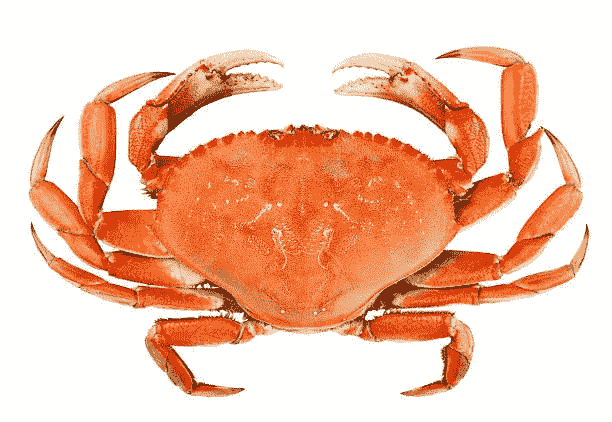

# 螃蟹或密码竞赛:一个传奇的虾摊牌

> 原文：<https://medium.com/hackernoon/crabs-or-crypto-contest-a-legendary-shrimpy-showdown-e5a5e11f15c9>

欢迎虾米家族！今天是传奇挑战的第一天。规则很简单，我们将给予所有参赛作品特别的测试版访问权限(首次访问 Shrimpy 的最新功能)。此外，当你在螃蟹晚餐上讲述加密货币如何彻底改变世界的故事时，你可以告诉你的孙子们一个令人敬畏的奖励，因为他们茫然地看着你，问:“爷爷，什么是菲亚特？”

所以戴上你的比赛帽或贝雷帽，继续阅读。

## 你喜欢加密吗？

> 是的，我当然想！

## 螃蟹怎么样？

> 啊？

## 我说的是这些海洋中的宏伟生物:

**I am delicious.**

这两件迄今为止毫无关联的事情在整个七月第一次结合在一起。是的，我们在 Shrimpy 对所有甲壳类动物情有独钟，我们想与一位幸运的获奖者分享我们对这种美味的热爱。我们甚至会为您提供我们最喜欢的螃蟹食谱。

# 刺耳的视频比赛

整个 7 月，我们将举办一场视频比赛。

> 比赛的目的是弘扬虾精神。我们希望继续推出一款出色的产品，并收到了大量的请求，包括添加硬币、多兑换支持、离线钱包、更多历史信息以及许多其他功能请求。为了继续超越我们用户的期望，继续运行，并迅速推出新功能，我们需要尽可能多的人来了解 Shrimpy！

## 我们正在寻找的一些主题包括:

*   应用程序的演示或教程。
*   展示 Shrimpy 如何融入您的整体投资策略的概述
*   一个广告或深夜商业信息片
*   一个炒作视频。 [Doge 供参考。](https://www.youtube.com/watch?v=000al7ru3ms)

## 正如承诺的那样，加入比赛其实非常容易。

1.  将您的灵感来源于 Shrimpy 的视频发布到 YouTube(标题中包含 Shrimpy)
2.  把你的投稿发推特给我们 [@ShrimpyApp](https://twitter.com/ShrimpyApp)

截至太平洋时间 7 月 31 日晚上 11 点 59 分，YouTube 上观看次数最多的视频将获得冠军。

# 奖赏

虾队喜欢所有的甲壳类动物，尤其是螃蟹。当我们看到一个与我们的用户分享这种爱的机会时，这太好了，不能不抓住。结果是，在两个同样有价值、但并不同样美味的奖品之间，获胜者做出了一个相互矛盾的决定。

第一个也是最开胃的选择是两打活螃蟹(价值高达 200 美元)。没错，我们会把活螃蟹运送到你家。恭喜你现在有了一个小螃蟹军团，就像你在二年级时告诉巴特勒夫人的那样。现在谁在笑巴特勒太太？？

或者邀请你的朋友过来，像“正常人”一样煮螃蟹。

但首先一定要在 Instagram 上分享你的小螃蟹军队的照片，让你所有的朋友都低调嫉妒。

好吧，好吧，虽然由你的螃蟹军团或螃蟹煮产生的甜蜜，甜蜜的互联网嫉妒听起来很有吸引力，但后勤可能不会为你工作。也许你是素食主义者。或者你可能因为看了《螃蟹皇后》而受到了伤害，不能靠近任何一只螃蟹一百英尺以内(说真的，[去看预告片](https://www.imdb.com/title/tt2319456/)寻找一些有趣的笑声和一个可能的电影之夜的想法)。

不管是什么，螃蟹对你没用。在这种情况下，我们的第二个选择对您来说是个不错的选择:

只需告诉我们您选择的密码，我们将向您发送价值 200 美元的资产。市场仍然很便宜，所以可能有一些很大的价值，但我不能保证这个密码尝起来一样美味，也不会让你再也见不到的童年朋友在网上羡慕你。

但是，等等，还有呢！因为我们知道制作一个视频需要时间，我们将奖励每个提交视频的人超级闪亮的测试版访问 Shrimpy 平台。率先测试新功能并向我们的团队提供反馈！

# 情况

并不是世界上所有的地方都可以把活螃蟹运送到你家门口。我们将尽最大努力为获胜者找到供货，但我们最熟悉的是在美国运送活螃蟹。在我们不能或不希望提供活螃蟹的情况下(由于不利的情况)，我们将提供密码代替它们。

我们保留选择获胜者的权利。虽然意见将是我们决策过程中的最大因素，但如果涉及作弊，如果视频内容与 Shrimpy 应用程序无关，或者如果视频包含非法内容，我们有权取消提交的内容。

请记住不要包括有版权的音乐或视频。这可能会导致您的视频被删除，并取消我们的比赛资格。

不要忘记查看 [Shrimpy 网站](https://www.shrimpy.io/)，关注我们在 [Twitter](https://twitter.com/ShrimpyApp) 和[脸书](https://www.facebook.com/ShrimpyApp)的更新，并向我们在[Telegram](https://t.me/ShrimpyGroup)&[Discord](https://discord.gg/gXyy95y)上的惊人、活跃的社区提出任何问题。

*捕虾队*