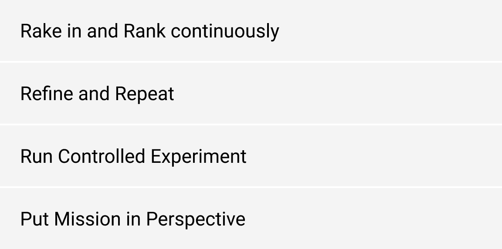

# 破解产品中的 A/B 测试

> 原文：<https://medium.com/hackernoon/cracking-a-b-testing-in-your-product-e63b5897d359>

*通过对“Travel Triangle”应用程序进行 A/B 测试，在 2.5 个月内将应用内转化率提高了 70%。*


*【原载于*[*LinkedIn*](https://www.linkedin.com/pulse/tenets-abtesting-from-travel-triangle-sarthak-handa/?published=t)

# *A/B 测试在构建优秀产品中的作用*

*当改变应用程序上的像素显著改变用户行为并帮助另一边的个人更好地实现他/她的目标时，这很有趣。你发送给用户的每个产品特性都会产生有价值的数据。产品经理在用户身上试验产品的不同变化，并比较它们对关键业务指标的相对影响——简而言之，这就是 A/B 测试。*

*打造优秀产品的艺术可以归结为根据从以下方面获得的见解，对最具影响力的 A/B 实验进行优先排序和发布:*

**

*知道*什么*和*在哪里*寻找，以及运行 A/B 测试中的潜在陷阱可能是好产品和伟大产品之间的区别。我将分享一些在 Travel Triangles 的 Android 应用程序上识别和执行 **3 个最有影响力的 A/B 测试**的经验，然后深入探讨 A/B 测试的基本原则。在我担任该公司产品顾问的 2.5 个月期间，这 3 个实验主要导致应用内线索提交量增加了 70%。*

# *背景:*

*拥有 1 亿多美元资金的 [Travel Triangle](http://traveltriangle.com/) 是一家领先的旅游初创公司，帮助人们预订他们梦想中的度假套餐。在该应用上，用户浏览 100 多个目的地，提交定制旅游套餐的请求，并在平台上找到最佳旅行社。我的任务是确保更多的用户在应用程序上提交包裹请求(线索)。因此，每个实验都旨在提高核心指标— **安装到销售线索的转化。***

**

# *3 个实验:*

# *1.消除瓶颈:*

> *当谈到应用内用户之旅时，在这条路上不断增加转化率会带来最大的收益。*

**

*检查优化潜力的明显目标是最后一个阶段:将打开“销售线索表单”的用户转化为成功提交销售线索的用户。“Lead Form”UI 在当前的实现中有 1.5 个屏幕长，因此用户必须滚动才能看到 CTA(行动号召)。将“Lead Form”UI 转换成一个页面并赋予它一个持久的 CTA(例如，在底部固定一个可操作的按钮，这样它就很难被忽略)是一个清晰的范围。*

**

***结果:** 4 小时的开发工作和 **7%的增长**在*安装导致*转换！*

*该实验在 3100 名用户中进行，实现了 0.05 的 [p 值](https://www.google.com/search?q=p-value&oq=p-value&aqs=chrome..69i57j0l5.2937j1j1&sourceid=chrome&ie=UTF-8)(即观察到的趋势有不到 5%的**机会**是侥幸)。重要的是收集足够的数据点，以达到统计意义，并确保趋势是确定的，而不仅仅是随机变化。*

*发现这个实验的关键是寻找最佳设计原则的实现。明确的前期 CTA 减少了用户进入下一阶段的摩擦。*

# *2.应用内 coachmark:*

> *对于 app 中可能不太清晰的功能/动作项，改进 CTA 或增加 coach-mark 可以显著提高点击率(CTR)。*

*整个应用内浏览体验的目的是吸引用户提交线索。但是，数据显示，不成比例的应用程序用户甚至没有点击 FAB 图标(浮动操作按钮),该图标本应打开“Lead Form”。因为 FAB 图标的目的在当前的实现中对用户来说并不是非常明显，通过使用 coach-mark 来教育他们关于'*它做什么*'可以显著提高点击率。*

**

***结果:**添加教练标志花费了 **1 天**的开发工作，并在 CTR 中产生了 **25%的增长**。我们进一步试验了不同的 FAB 图标设计，这又增加了 4%的点击率。*

*总体而言，该实验将核心业务指标——安装*以引导提交——提高了 **15%** 。**

**

***注意:** FAB 图标是有意检查优化潜力的，因为它是引导用户从*浏览*阶段到*引导表单打开*阶段的关键步骤。*

# *3.优化信息密度:*

> *在一定程度上，在应用程序屏幕上添加更多(有意义的)行动号召(CTA)选项会成比例地提高其点击率(CTR)。*

*首页被 100%的 app 打开用户看到。确保用户顺利导航到应用程序中的下一个相关部分(即增加主页的点击率)可以显著提高参与度，并对线索提交产生后续影响。*

*在目前的实现中，主页有一个非常稀疏的用户界面，8 个目的地类别显示在 4 个垂直屏幕上。所有 8 个类别可以很容易地压缩到一个垂直的框架中，这将消除用户滚动的需要，但不会增加任何额外的认知负荷。*

**

***结果**:CTR 增加 60%。app 打开率提升 40%。**从安装到销售线索提交指标增加 15%**。*

# *A/B 测试的原则:*

**

# *1.连续耙入和排列:*

*虽然一切都可以测试，但为了加速产品优化，我们需要彻底评估并优先考虑对关键业务指标有很大潜在影响的实验。*

```
*Experiment’s Impact = Users Impacted x Needle Moved*
```

*潜在的影响，以及开发工作，共同推动了选择实验的决定。过程越客观越好。*

# *2.提炼并重复:*

*来自大多数实验的见解推动了更新的假设和进一步的测试。新 FAB 图标的成功可以激发对不同图标、颜色、按钮类型、通信机制等的进一步测试。我们优先考虑哪一个完全取决于假设的强度和实现的努力。*

**

# *3.运行受控实验:*

*外部世界对指标的影响通常比产品变化大得多。根据一周中的某一天、一年中的某个季节，甚至是应用程序安装的来源，用户可能会有不同的行为。受控实验隔离产品变化的影响，同时控制外部因素的影响。重要的是在相同的条件下对用户进行实验，直到获得足够数量的数据点以获得统计显著性(p 值< 0.05).*

**

# *4\. Put Mission in Perspective:*

*While A/B testing is the path to product optimization, the only thing that trumps metrics is *任务*)。着眼于公司的长期使命和方向，可以防止产品路线图和优化朝着未来不可避免地需要修正的方向发展。*

*然而，除此之外，破解 A/B 测试的代码等同于构建世界级的产品。*

**非常感谢*[*suha as*](https://www.linkedin.com/in/suhaaskaul/)*给我机会在 Travel Triangle 上修改产品，感谢*[*Parth Tripathi*](https://www.linkedin.com/in/parth-tripathi-961973a6/)*分享他对本文的反馈。**

## *感谢阅读！:)如果你喜欢，请鼓掌支持👏🏻还有分享帖子。*

## *欢迎在 LinkedIn 上发表评论或联系我。*