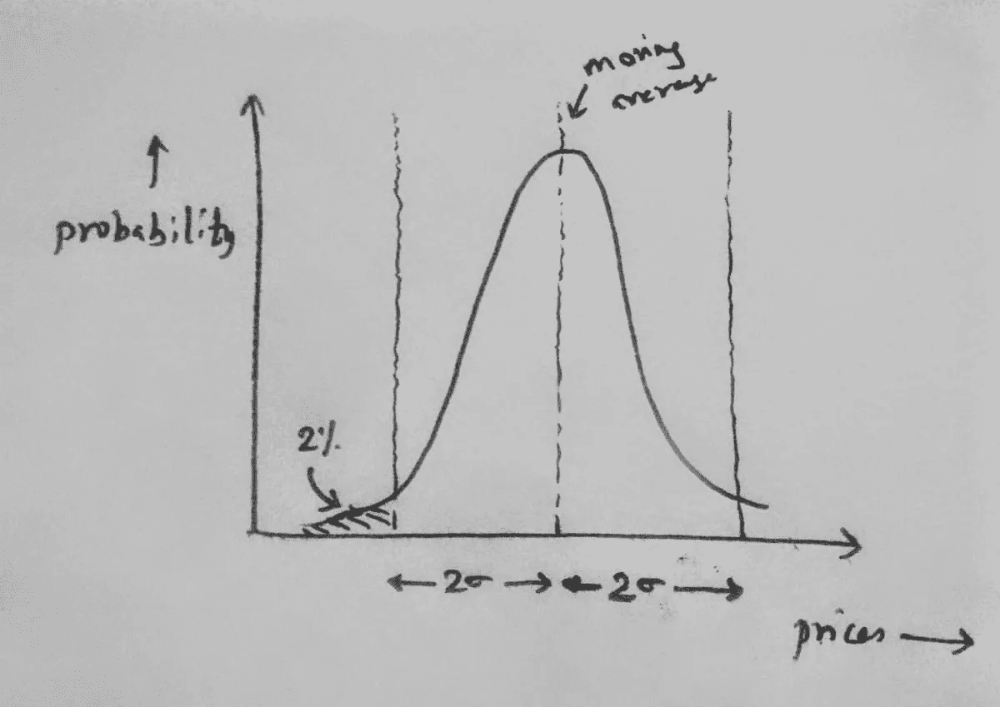

# Algo 交易加密货币的途径

> 原文：<https://medium.com/hackernoon/cracking-algo-trading-in-cryptocurrencies-db26cd444f9b>

为什么加密交易是一件大事，即使在过去 7 个月的市场低迷中，帮助我制定了‘**【ƀ'】***的策略，以及一些宝贵的经验教训。*

Photo from [here](https://unsplash.com/photos/yFbyvpEGHFQ?utm_source=unsplash&utm_medium=referral&utm_content=creditCopyText)

# **为什么加密资产的算法交易是十年一遇的机会？**

每十年都会有一个新的市场开放给公众交易，无论是商品、股票还是加密资产。所有这些市场在最初几年都表现出很高的波动性，因为市场监管较少，交易量较低，期货交易仍处于萌芽状态。加密市场仍处于全盛时期，其波动性是其他成熟市场的 10 倍。高波动性导致更高的价格高点和更低的价格低点，这意味着如果你乘风破浪，收益会更大。

要在股票市场进行算法交易，你必须购买专有软件，获得许可，并为测试算法的历史数据付费，这是一个巨大的准入门槛。然而，大多数加密交易所为交易提供简单的开放 API。因此，即使是一个大学生也可以建立一个平台，执行算法，并完全依靠他/她的智力赚钱。

这种**的公平竞争环境**，对我来说，是令人兴奋的！

在成熟市场中脱颖而出既需要良好的策略，也需要能够在数毫秒内执行正确交易的快速硬件处理器。然而，加密市场是如此的新生，以至于即使是在简单的 PC 机上运行的老式教科书交易策略也能获得可观的回报。

# **那么人们是如何交易密码的呢？**

Photo by [rawpixel](https://unsplash.com/photos/8dHheu02i8s?utm_source=unsplash&utm_medium=referral&utm_content=creditCopyText) on [Unsplash](https://unsplash.com/search/photos/trading?utm_source=unsplash&utm_medium=referral&utm_content=creditCopyText)

交易者采取三种方法之一:

*   **基础分析**:根据加密项目的进度、技术基础、市场范围和团队实力对加密资产的投资进行评估。例如，一种在市场上没有实际产品的加密资产从根本上来说将是一个糟糕的投资选择，即使它设法在交易量方面名列前十。
*   **情绪分析**:一些交易者通过 reddit、twitter、期货市场等解析情绪，寻找热门交易机会。例如，一名交易员可以获得一项加密资产在大型交易所上市的消息，并进行交易，预先判断该消息对情绪和价格的影响。
*   **技术分析**:当一项加密资产的价格发生变化时，100 多项技术指标(如移动平均线、RSI、MACD)也会发生变化，这些指标提供了未来价格可能变动的线索。交易者喜欢它。我也是。(更多信息请见下文。)

这比你想象的更强大。这三条信息结合在一起，可以在何时进入市场和何时退出 T21 市场上给出非常有用的提示。例如，跟随可以是一种策略。

MACD and RSI are Technical Indicators that quantifies DIRECTION and VALUATION aspect of the crypto-asset. It’s okay to not know what they mean for now.

在过去的 1.5 年中，这一策略在任何给定的 2 个月以上的时间间隔内，对于大多数著名的加密资产来说，都战胜了市场——有时是以巨大的幅度。

**注:**这里有两个优秀的阅读资源，用于[技术](/@CarpeNoctom/toshimokus-trading-tips-tricks-f0ff5cc38cc8) & [情绪](https://hackernoon.com/sentiment-analysis-in-cryptocurrency-9abb40005d15)分析。

# 我获得市场优势的方法？

用统计赚钱的想法让我着迷！我专注于寻找我可以在市场上验证的假设和趋势，然后通过算法自动化——这样一段代码即使在我睡觉的时候也可以为我赚钱。

Photo from [here](https://unsplash.com/photos/OVbeSXRk_9E?utm_source=unsplash&utm_medium=referral&utm_content=creditCopyText)

让我们以一个交易算法策略为例，这是我在过去 7 个月中构思、测试和部署的，以便更好地理解整个过程。

> 假设:如果一项加密资产的价格“不合理地低”，它将有很大的反弹倾向。

我们将很快回到如何定义这个“不合理的低”门槛。现在，请注意下面的图表清楚地显示了当价格下降到阈值线以下时，加密资产的价格是如何反弹的。如果这是一个持续的模式，那么我们就有所发现了！我们只需要在价格低于阈值时购买加密资产，并在下一个瞬间价格上涨时卖回它！

Box plot representation of prices. Observe that prices rise back when they fall below the green line!

上图中的阈值绘制为“2 标准。低于移动平均线的偏差”。让我们快速看一下这是什么意思。

**统计 101:2 标准差交易**

Bell Curve (Gaussian Distribution)

任何完全随机变量都遵循钟形曲线，在峰值处有一个平均值*和一个标准差*。定义分布范围的偏差*。*

96%的数据点位于 *2-std 内。平均值上下的偏差*。

根据对称性，该值下降的概率低于' *2-std。戴夫。低于平均值*的是**不到 2%！**

加密资产的价格不是完全随机的，但是如果它们低于 2-std。戴夫。低于平均值，那么它们很有可能会很快回升到平均值。至少前面显示的价格图表证实了这一点。

## **方法:**

假设总是这样开始的。这是一种直觉。您可以在价格图上直观地验证趋势。如果它看起来令人信服，你就通过创建一个算法并在不同的密码资产上针对不同的参数进行回溯测试来验证你的直觉。

> 我在不同的时间间隔(5m、15m、30m、1h)和不同的阈值(2.0 sigma、2.2 sigma、..3 sigma ),以评估哪个特定的组合给出了交易信号的高计数，而不损害每次交易的盈利能力。

Process for building the algo trading strategy

一旦参数得到优化，你就可以用真实的资金实现算法，监控业绩指标(利润、滑点、夏普比率等)，并最终调整分配给算法交易策略的资金。

# 课程

在过去的 7 个月里，在一个动荡的市场中，除了使用这个策略获得的利润，我还获得了一些无价的观点:

*   今天运行良好的交易算法肯定会在接下来的 6 个月里饱和，不会再像以前那样有利可图。
*   当你的交易基金增加到 100，000 美元时，在 10，000 美元时运行良好的算法将不再有用。
*   一个算法越难概念化和编码，它就越容易辩护。
*   大多数算法都与市场相关，即一些算法在上涨的市场中表现良好，而另一些算法在下跌的市场中表现良好。拥有每种类型的算法组合，以避免任何一方的下行风险，是值得的。

算法交易是一个持续的胜人一筹的游戏。市场从不睡觉。它一直在进化。如果交易者停止创新新的交易策略，他/她就会失去优势。这是一个巨大的开放机会。

如果你喜欢这种东西，就直接进去吧！

**其他资源:**

*   Algo 交易平台: [Gekko](https://gekko.wizb.it/) 、 [Cryptotrader](https://cryptotrader.org/) 、 [Haasbot](https://www.haasonline.com/pricing/) 、 [Gunbot](https://www.gunbot.com/) 、 [Zenbot](https://github.com/DeviaVir/zenbot) 等。
*   风险管理和加密交易课程:[此处](https://docs.google.com/document/d/15c3rN15rkXldY8Te3GDG4NG7noaaoikydOoZQlElwXw/edit)
*   交易员经常出没的社区:[https://in.tradingview.com/](https://in.tradingview.com/)

## 感谢阅读！:)如果你喜欢，请鼓掌支持👏🏻还有分享帖子。

## 欢迎在 LinkedIn 上发表评论或联系[我。](https://www.linkedin.com/in/sarthakhanda/)