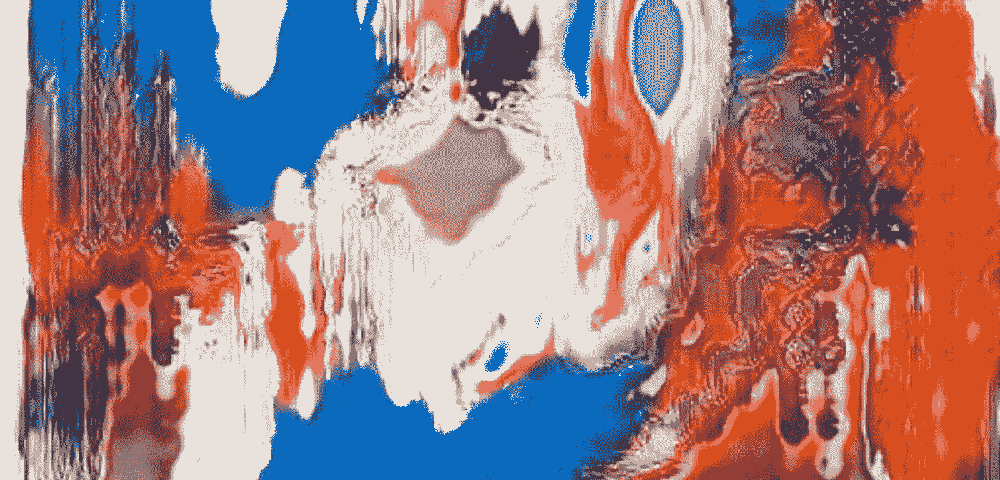

# 神经网络生成的疯狂 VJ 艺术

> 原文：<https://medium.com/hackernoon/crazy-vj-art-generated-by-neural-network-86bf1b612f6f>

## 我做了一个简单但非常漂亮的解决方案，用开源代码为任何音乐生成视觉效果

Sample screenshot

## 介绍

这个想法非常简单——制作一个神经网络来产生与音乐同步的惊人视觉效果。这完全是受 NVIDIA 的 faces generator 的启发。对于那些不知道的人，NVIDIA 在 2017 年发布了一篇很棒的研究文章和他们的生殖对抗网络(GAN)的代码。这是 GAN 能够生成高分辨率、高保真度名人图像的第一个例子。这是它的样子。

我不会在这里解释什么是 GAN 以及它是如何工作的——网上有大量很棒的教程和解释。

## 技术细节

我很少尝试这样做。首先，我用 MXNET 作为神经框架，使用一些当时不可用的现代技术(如相对论 GAN)，构建了我的 Nvidia 网络的克隆。我的工作没有我预期的那么好。如果你想了解一下——加入[我的 GitHub](https://github.com/crazyleg/progressive_gan_mxnet) 。

无论如何，简单的方法是一条路要走，对不对？所以，我回到了[最初的 NVIDIA 代码](https://github.com/tkarras/progressive_growing_of_gans)，而不是使用我刚刚放入 WikiArt 档案中的名人头像——我使用了 80 年代和 90 年代的抽象表现主义绘画作为学习模板。就复制的简单性而言，这是有意义的——不需要照片写实主义或其他东西。我添加了一些随机裁剪，翻转，颜色的东西来增加大约 2500 张图像的数据集，并让它训练了大约 5 天。

结果非常好，下一个问题是同步疯狂的艺术与音乐。肯定有很多更好的解决方案，但我的也行。我刚刚做了快速傅立叶变换，提取了 512 个频率，并把它作为神经网络的潜在向量输入。这是结果。

## 神经网络生成的 VJ 艺术。