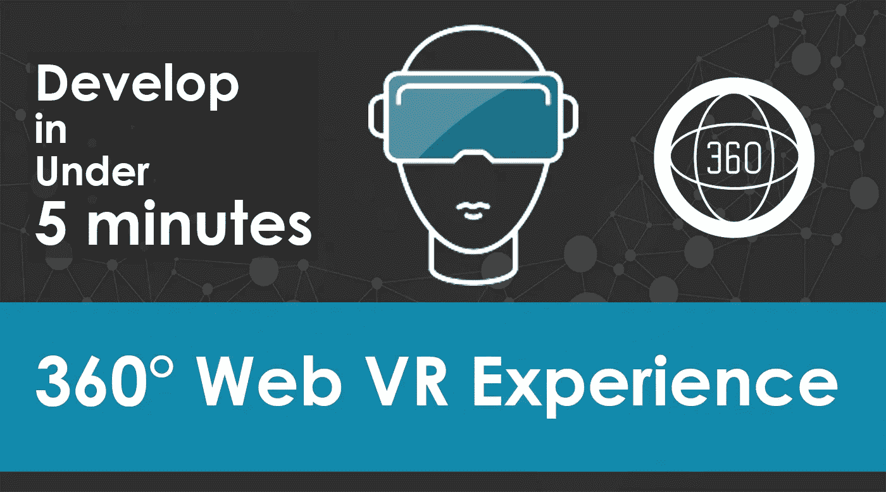
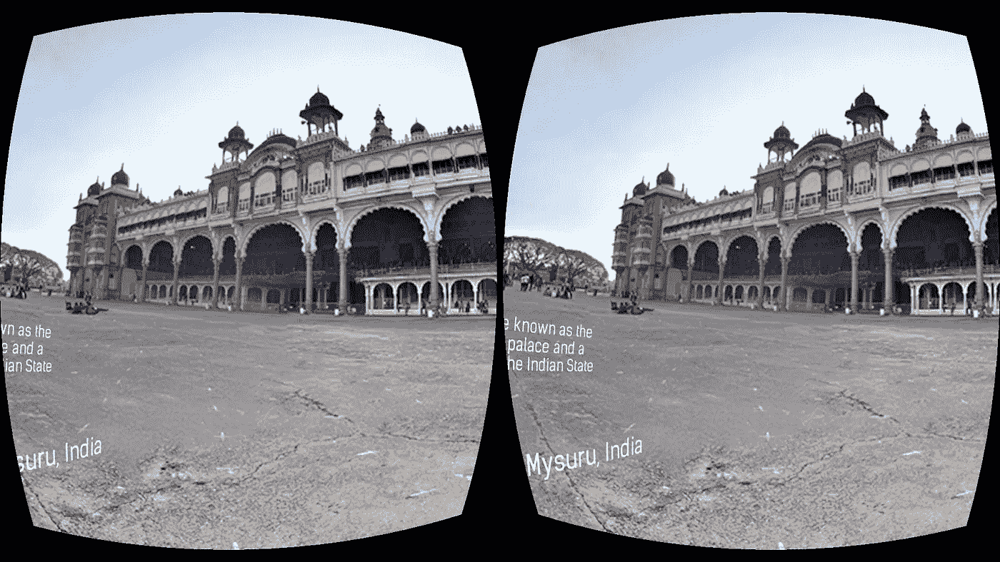
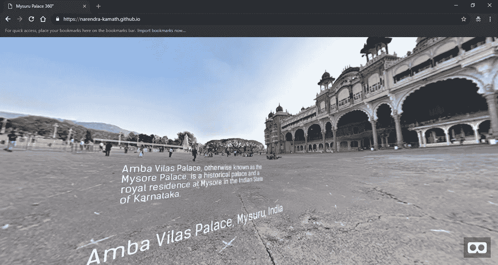

# 在不到五分钟的时间内创建 360 VR 支持的网络体验

> 原文：<https://medium.com/hackernoon/create-a-360-vr-supported-web-experience-in-under-5-minutes-bf3886cdb1c6>

> “虚拟现实是‘终极移情机器’这些经历不仅仅是纪录片。它们是穿别人的鞋走一英里的机会。 *—* 克里斯·米尔克

虚拟现实(VR)、增强现实(AR)和混合现实(MR)是沉浸式技术世界中发展最快的领域。为了体验沉浸式技术，安装大型应用程序的需求将很快被市场上出现的 web 框架所主导。

在快速增长的沉浸式技术 web 框架中， [**A-Frame**](https://aframe.io/docs/0.8.0/introduction/) 凭借其轻松、简单和强大的实体-组件框架，非常适合创建 VR 体验。在这篇文章结束时，你将学会如何使用 A-Frame 在不到 20 行的 HTML 代码中开发自己的 360 VR 支持的 Web 体验应用程序！！

**演示**:[https://narendra-kamath.github.io/demo/webvr-360-example](https://narendra-kamath.github.io/demo/webvr-360-example/)

***GitHub 资源库关注****:*[360 VR Web App](https://github.com/Narendra-Kamath/webvr-360-app)

VR view from Chrome browser

## 我们需要什么来开始？

1.  A-Frame:我们将在我们的 web 应用程序中使用这个框架来支持 VR。我们可以下载 A-Frame JavaScript 包，也可以使用 A-Frame 的 CDN 链接。
    下载:[https://aframe.io/releases/0.8.0/aframe.min.js](https://aframe.io/releases/0.8.0/aframe.min.js)
2.  [**等矩形图像**](https://wiki.panotools.org/Equirectangular_Projection) :这是我们将要在 web 应用程序中显示的 360°图像。在这个例子中，我们将使用 Mysuru Palace 360 捕捉。(随意使用自己选择的任何图像)
    **下载** : [Mysuru 宫 360 捕捉](https://github.com/Narendra-Kamath/webvr-360-app/blob/master/images/mysuru_palace.jpg)
    **添加**:[https://www.flickr.com/groups/equirectangular/](https://www.flickr.com/groups/equirectangular/)

## 创建应用程序

我们将为这个应用程序创建一个专用文件夹，并在这个文件夹中创建一个 index.html 文件。还创建了一个名为 ***images*** 的文件夹，用于存储我们将在应用程序中显示的图像。

在本例中，我们已经下载了 [**A 帧** JavaScript 文件](https://aframe.io/releases/0.8.0/aframe.min.js)，并将其保存在名为 ***js*** 的文件夹中。为了在一个普通的 HTML 文件上创建一个 VR 场景，我们将包含一个称为 **a-scene** 的 A-Frame 元素。A-Frame 的 a-scene 元素将处理所有必要的 WebVR 样板文件。在 a-scene 元素中，我们将包含一个 **a-sky** 元素。A 帧天空图元用于为场景添加背景色或 360°纹理。我们将使用 **a-sky** 的 **src** 属性来引用保存的图像。这将创建一个基本的 360 度渲染场景。创建的场景的特点是，对于有**陀螺仪**支持的设备，场景的旋转可以随着设备的移动而进行。

**奖励**:现在我们要给场景添加一些文本项，使用名为 **a-text** 的元素进行三维定位。文本元素的字体属性是可选的。最后，我们将要在场景中显示的文本，作为相应 a-text 元素的**‘value’**属性的值给出。搞定了。！

## 结果

Desktop view of the application

恭喜您，我们已经使用 A-Frame 在几分钟内轻松成功地创建了一个 360 VR 支持的 Web 体验应用程序。同一个例子可以用许多其他方式即兴创作，用于各种其他应用；)快乐发展！！

请在回复部分分享您的观点:)谢谢！

## **参考文献**:

*   [开始使用 A 形架](https://aframe.io/docs/0.8.0/introduction/)
*   [人字架示例](https://aframe.io/examples/)