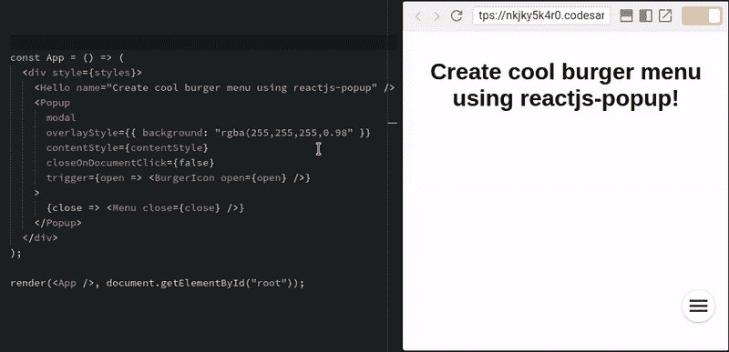
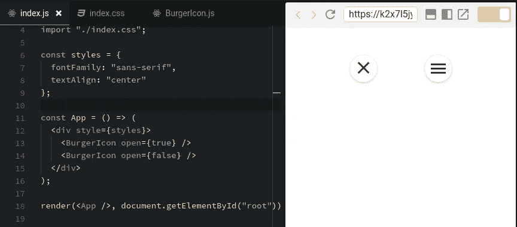

# 使用 reactjs-popup 创建一个别致的汉堡菜单

> 原文：<https://medium.com/hackernoon/create-a-fancy-burger-menu-using-reactjs-popup-e7ed6d3c965f>

> 这篇文章是一个循序渐进的教程，使用 reactjs-popup 为你的网站创建一个简单的汉堡菜单

burger menu deom

Reactjs-popup 是一个新的简单的 react 弹出组件，使用 react 片段构建，这是 react 16 的新特性之一。它可以处理多种用例。通过使用这个小小的反应弹出组件，你可以创建工具提示，模态和菜单。

到本文结束时，你将能够用 reactjs-popup 创建你自己的汉堡菜单。

> 准备好了。！让我们开始吧。

## 步骤 1:创建汉堡图标组件。

我们将从构建一个汉堡图标组件开始，

正如你所看到的，我们将“open”属性传递给组件，这样我们就可以像预览示例解释的那样改变图标类名

Burger icon css

burger Icon state

你可以在这里找到一些很好的汉堡图标和动画[的例子](https://jonsuh.com/hamburgers/)

## 步骤 2:自定义 CSS 菜单

我们的菜单将是一个简单的列表，所以让我们以 reactjs-popup 主页菜单为例。

正如你看到的，这个菜单是一个简单的 ul 元素，没有什么特别的。

## 步骤 3:用 reactjs-popup 集成所有内容

在这一部分中，我们需要做的就是导入 reactjs-popup 组件，并将 burger menu 设置为 popup 组件的触发器属性，将 menu 设置为 popup 子组件。简单，是吗？神奇！！

由于“作为子模式的功能”,触发器可以很容易地进入弹出状态。我们还需要像下面这样将道具传递给汉堡组件。

添加一些自定义的 css，这是最终的结果。

final result

如果你在智能手机上阅读这篇文章，你可以在 [reactjs-popup 主页上看到启动菜单的汉堡按钮。](https://react-popup.netlify.com/)

演示代码源

 [## y Jose/react js-弹出式汉堡菜单

### 弹出汉堡菜单示例

github.com](https://github.com/yjose/reactjs-popup-burger-menu) 

阅读更多我的文章:

 [## reactjs-popup 简介🎉—反应弹出窗口、模态、工具提示和菜单—全部在一个中

### 这篇文章是关于给你一个简单的概述，你可以用 react 弹出窗口做什么，以及如何有效地使用它。

hackernoon.com](https://hackernoon.com/introducing-reactjs-popup-modals-tooltips-and-menus-all-in-one-227de37766fa)  [## 生产前端性能检查表

### 在网站开发和前端网站，我们花更多的时间来寻找最好的设计和我们的内容…

hackernoon.com](https://hackernoon.com/front-end-performance-check-list-for-production-4e930cb63e8a)  [## 制作纯 CSS 工具提示的分步指南

### 我最近完成了一个关于使用纯 CSS 创建简单工具提示的简短教程(没有额外的 HTML…

medium.freecodecamp.org](https://medium.freecodecamp.org/a-step-by-step-guide-to-making-pure-css-tooltips-3d5a3e237346) 

感谢阅读！如果你认为其他人应该阅读这篇文章并使用这个组件，发推特并分享这篇文章。

记得在 Medium 上关注我，这样你就可以得到关于我未来帖子的通知。

如果你喜欢这个故事，请随意👏👏👏几次(最多 50 次。说真的)。