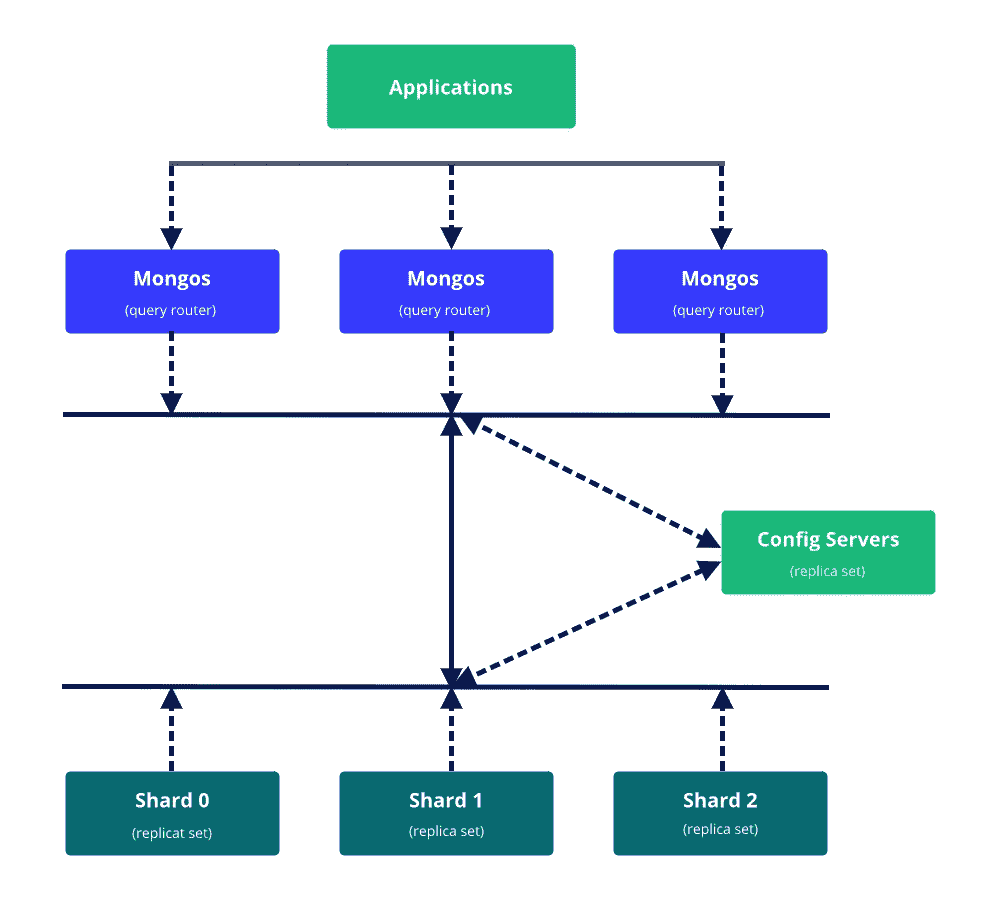
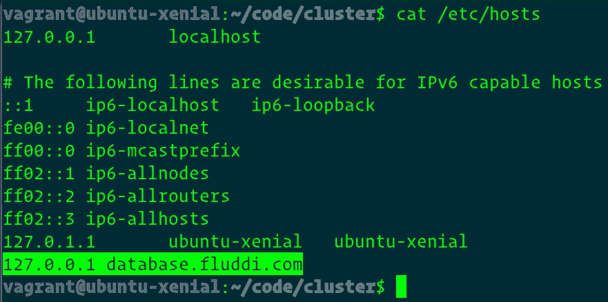
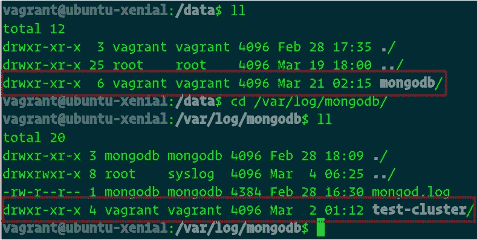
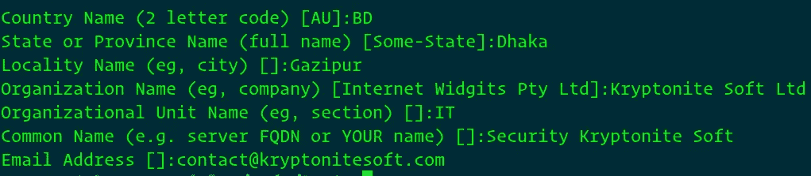
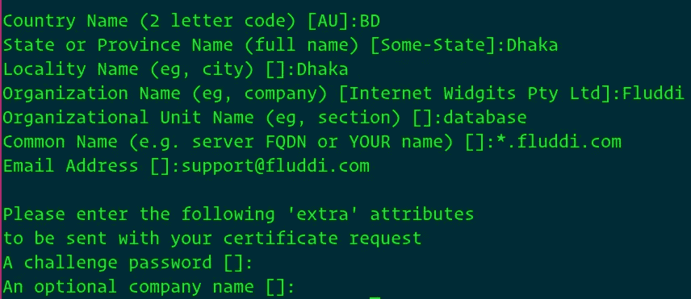
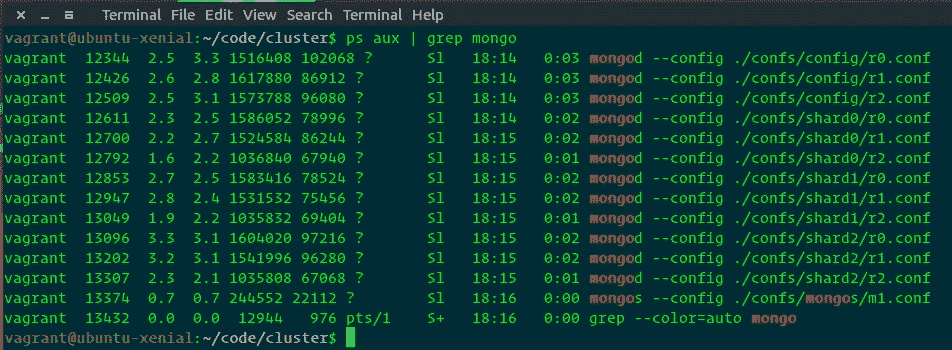
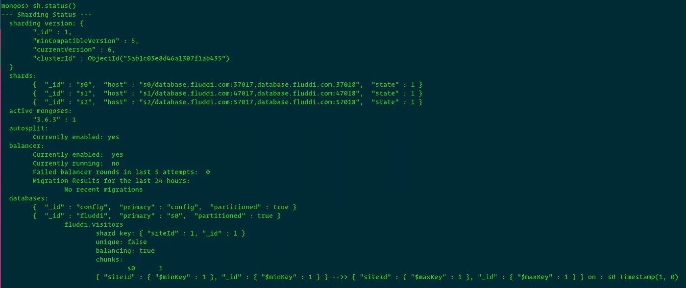
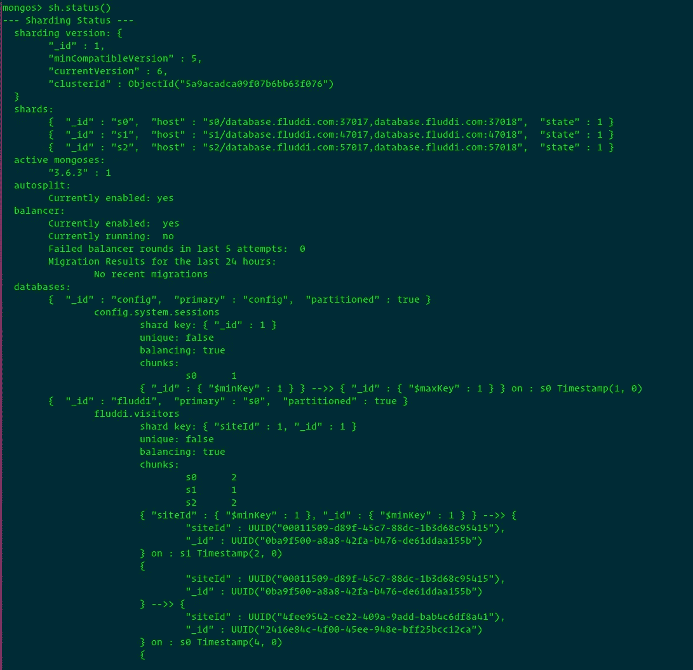

# 创建一个启用 SSL 的 MongoDB 分片集群

> 原文：<https://medium.com/hackernoon/create-a-mongodb-sharded-cluster-with-ssl-enabled-dace56bc7a17>

大约两个月前，我开始认真地学习 MongoDB。在 Growthfunnel.io，我们使用 MongoDB，我们需要扩展我们的系统，以支持大量数据(大约 6TB 以上)和高吞吐量。分片、数据库集群对我来说都是全新的，所以我开始学习。这篇文章的目的是与社区分享和验证我的知识。我不是这方面的专家。我只是分享我学到的东西。

本教程一步一步地解释了如何创建 MongoDB 分片集群。我们将在一台机器上部署这个演示。

# **先决条件:**

*   MongoDB — 3.6.2
*   OpenSSL
*   NodeJS
*   尝试
*   mongodb 分片的基础知识

# **什么是数据库分片？**

分片是在多台机器上分割数据的过程，这些机器将大型数据库分成更小、更快、更容易管理的部分，称为数据分片。shard 这个词的意思是整个集群的一小部分。

# **我们的分片架构**

我们的分片集群将在一台机器上运行，每个组件将在单独的进程和端口上启动。该集群分为三个分片，每个分片包含两个数据成员和一个任意成员。每个碎片复制品具有:

*   1 个主要成员
*   1 个次要成员
*   1 个任意成员



# **准备环境**

## 1.从[官方文档](https://docs.mongodb.com/manual/tutorial/install-mongodb-on-ubuntu/)安装 MongoDB。

## 2.配置主机名

将此行`127.0.0.1 database.fluddi.com`追加到`/etc/hosts`文件中；`database.fluddi.com`将是我们的数据库主机名。

```
echo '127.0.0.1 database.fluddi.com' | sudo tee --append /etc/hosts
```



## 3.确保数据目录和日志目录具有读写权限

创建数据目录和日志目录，并拥有这些目录供您的用户读写。在我的例子中，我的用户和用户组名是`vagrant`。

```
mkdir -p /data/mongodb /var/log/mongodb/test-cluster
sudo chown -R vagrant:vagrant /data/mongodb
sudo chown -R vagrant:vagrant /var/log/mongodb/test-cluster
```



## 4.克隆`[mongodb-sample-cluster](https://github.com/joynal/mongodb-sample-cluster)`回购

[](https://github.com/joynal/mongodb-sample-cluster) [## joynal/MongoDB-样本-集群

### MongoDB-样本-集群- MongoDB 分片集群

github.com](https://github.com/joynal/mongodb-sample-cluster) 

此报告包含群集的配置文件。

```
git clone [https://github.com/joynal/mongodb-sample-cluster](https://github.com/joynal/mongodb-sample-cluster)
```

`confs`目录包含集群组件配置；您可以根据自己的需求进行定制。确保你的数据目录&日志目录有读&写权限。默认数据目录指向`/data/mongodb/`上&日志目录指向`/var/log/mongodb/test-cluster/`上。

# **生成自签名 SSL 证书**

## **1。生成认证机构**

让我们为分片集群生成一个自签名证书，这仅用于本演示。对于生产使用，您的 MongoDB 部署应该使用由单个证书颁发机构生成和签名的有效证书。您或您的组织可以生成并维护一个独立的证书颁发机构，或者使用由第三方 SSL 供应商生成的证书。

```
sudo mkdir -p /opt/mongodb
```

现在拥有这个目录，使用您的用户名和用户组名。

```
sudo chown -R vagrant:vagrant /opt/mongodb
```

好了，让我们创建一个认证中心。为 CA 证书生成一个私钥，并保持它非常安全。

```
cd /opt/mongodb
openssl genrsa -out CA.key 4096
```

现在自行签署此证书。

```
openssl req -new -x509 -days 1825 -key CA.key -out CA.crt
```

这将提示输入证书信息。



## **2。为集群成员生成证书**

生成私钥和 CSR。

```
openssl genrsa -out certificate.key 4096
openssl req -new -key certificate.key -out certificate.csr
```

这将提示输入信息，确保域名支持通配符域。



现在自我签名。

```
openssl x509 -req -days 1825 -in certificate.csr -CA CA.crt -CAkey CA.key -set_serial 01 -out certificate.crt
```

输出将是这样的:

```
Signature ok
[subject=/C=BD/ST=Dhaka/L=Dhaka/O=Fluddi/OU=database/CN=*.fluddi.com/emailAddress=support@fluddi.com](mailto:subject=/C=BD/ST=Dhaka/L=Dhaka/O=Fluddi/OU=database/CN=*.fluddi.com/emailAddress=support@fluddi.com)
Getting CA Private Key
```

创建`.pem`文件。

```
cat certificate.key certificate.crt > certificate.pem
```

## **3。生成客户端证书**

每个客户端证书必须具有唯一的不同于集群成员证书的 SAN。否则，MongoDB 会将其视为集群成员。每个证书都属于一个 MongoDB x.509 用户，[更多详情](https://docs.mongodb.com/manual/tutorial/configure-x509-client-authentication/#client-x-509-certificate)。

好了，让我们按照前面的步骤生成两个证书，只是要确保 **OU** 是不同的。

*   对于 Web 应用程序

```
openssl genrsa -out client.key 4096
openssl req -new -key client.key -out client.csr
```

除了**和**不同之外，其他都和会员证书一样。

```
Organizational Unit Name (eg, section) []:webapp
```

*   对于数据库管理员

```
openssl genrsa -out admin-client.key 4096
openssl req -new -key admin-client.key -out admin-client.csr
```

一切都会和会员证一样，只是**欧**会有所不同。

```
Organizational Unit Name (eg, section) []:appadmin
```

现在将所有文件权限改为只读。

```
cd /opt/mongodb/
chmod 400 *
```

# 创建配置服务器副本集

创建数据目录，用你实际的数据库路径替换`$DB_PATH`。

```
mkdir -p $DB_PATH/config/rs0 $DB_PATH/config/rs1 $DB_PATH/config/rs2
```

把目录改成`mongodb-sample-cluster`代码回购，你就克隆好了。

```
cd ~/mongodb-sample-cluster
```

启动配置服务器副本集的所有成员。

```
mongod --config ./confs/config/r0.conf
mongod --config ./confs/config/r1.conf
mongod --config ./confs/config/r2.conf
```

连接到其中一个配置服务器。

```
mongo --port 57040 --ssl --host database.fluddi.com --sslPEMKeyFile /opt/mongodb/certificate.pem --sslCAFile /opt/mongodb/CA.pem
```

初始化副本集。

```
rs.initiate({
  _id: "cfg",
  configsvr: true,
  members: [
    { _id : 0, host : "database.fluddi.com:57040" },
    { _id : 1, host : "database.fluddi.com:57041" },
    { _id : 2, host : "database.fluddi.com:57042" }
  ]
})
```

# 创建碎片副本集

## **部署碎片 0**

为复制副本实例创建数据目录。

```
mkdir -p /data/mongodb/shard0/rs0 /data/mongodb/shard0/rs1 /data/mongodb/shard0/rs2
```

启动碎片副本集的每个成员。

```
mongod --config ./confs/shard0/r0.conf
mongod --config ./confs/shard0/r1.conf
mongod --config ./confs/shard0/r2.conf
```

连接到碎片副本集的一个成员。

```
mongo --port 37017 --ssl --host database.fluddi.com --sslPEMKeyFile /opt/mongodb/certificate.pem --sslCAFile /opt/mongodb/CA.pem
```

初始化副本集。

```
rs.initiate({
  _id: "s0",
  members: [
    { _id : 0, host : "database.fluddi.com:37017" },
    { _id : 1, host : "database.fluddi.com:37018" },
    { _id : 2, host : "database.fluddi.com:37019", arbiterOnly: true }
  ]
})
```

它将返回如下内容:

```
{"ok": 1}
```

## **部署碎片 1**

创建数据目录，用实际的 db 路径替换`$DB_PATH`。

```
mkdir -p $DB_PATH/shard1/rs0 $DB_PATH/shard1/rs1 $DB_PATH/shard1/rs2
```

启动碎片副本集的每个成员。

```
mongod --config ./confs/shard1/r0.conf
mongod --config ./confs/shard1/r1.conf
mongod --config ./confs/shard1/r2.conf
```

连接到碎片副本集的一个成员。

```
mongo --port 47017 --ssl --host database.fluddi.com --sslPEMKeyFile /opt/mongodb/certificate.pem --sslCAFile /opt/mongodb/CA.pem
```

初始化副本集。

```
rs.initiate({
  _id: "s1",
  members: [
    { _id : 0, host : "database.fluddi.com:47017" },
    { _id : 1, host : "database.fluddi.com:47018" },
    { _id : 2, host : "database.fluddi.com:47019", arbiterOnly: true }
  ]
})
```

## **部署碎片 2**

创建数据目录，用实际的 db 路径替换`$DB_PATH`。

```
mkdir -p $DB_PATH/shard2/rs0 $DB_PATH/shard2/rs1 $DB_PATH/shard2/rs2
```

启动碎片副本集的每个成员。

```
mongod --config ./confs/shard2/r0.conf
mongod --config ./confs/shard2/r1.conf
mongod --config ./confs/shard2/r2.conf
```

连接到碎片副本集的一个成员。

```
mongo --port 57017 --ssl --host database.fluddi.com --sslPEMKeyFile /opt/mongodb/certificate.pem --sslCAFile /opt/mongodb/CA.pem
```

初始化副本集。

```
rs.initiate({
  _id: "s2",
  members: [
    { _id : 0, host : "database.fluddi.com:57017" },
    { _id : 1, host : "database.fluddi.com:57018" },
    { _id : 2, host : "database.fluddi.com:57019", arbiterOnly: true }
  ]
})
```

# 将一个`mongos`连接到集群

```
mongos --config ./confs/mongos/m1.conf
```

查看 mongod 和 mongos 进程。

```
ps aux | grep mongo
```



现在我们准备添加数据库和碎片集合。

# **向集群添加碎片**

将 mongo shell 连接到 mongo。

```
mongo --port 27018 --ssl --host database.fluddi.com --sslPEMKeyFile /opt/mongodb/certificate.pem --sslCAFile /opt/mongodb/CA.pem
```

## 1.创建管理员用户

```
db.getSiblingDB("admin").createUser(
  {
    user: "admin",
    pwd: "grw@123",
    roles: [
      { role: "userAdminAnyDatabase", db: "admin" },
      { role : "clusterAdmin", db : "admin" }
    ]
  }
)
```

让我们认证，

```
db.getSiblingDB("admin").auth("admin", "grw@123")
```

## 2.添加碎片成员

```
sh.addShard("s0/database.fluddi.com:37017")
sh.addShard("s1/database.fluddi.com:47017")
sh.addShard("s2/database.fluddi.com:57017")
```

## 3.为 webapp 和管理添加 x509 用户

```
db.getSiblingDB("$external").runCommand(
  {
    createUser: "[emailAddress=support@fluddi.com](mailto:emailAddress=support@fluddi.com),CN=*.fluddi.com,OU=appadmin,O=Fluddi,L=Dhaka,ST=Dhaka,C=BD",
    roles: [
      { role : "clusterAdmin", db : "admin" },
      { role: "dbOwner", db: "fluddi" },
    ],
    writeConcern: { w: "majority" , wtimeout: 5000 }
  }
)db.getSiblingDB("$external").runCommand(
  {
    createUser: "[emailAddress=support@fluddi.com](mailto:emailAddress=support@fluddi.com),CN=*.fluddi.com,OU=webapp,O=Fluddi,L=Dhaka,ST=Dhaka,C=BD",
    roles: [
      { role: "readWrite", db: "fluddi" },
    ],
    writeConcern: { w: "majority" , wtimeout: 5000 }
  }
)
```

# 为数据库启用分片

在对集合进行分片之前，必须为集合的数据库启用分片。为数据库启用分片不会重新分发数据，但可以对数据库中的集合进行分片。

一旦为数据库启用了分片，MongoDB 就会为该数据库分配一个主分片，在分片开始之前，MongoDB 会将所有数据存储在这个主分片中。

在数据库上启用分片，在这个演示中，我使用的名称是`fluddi`

```
sh.enableSharding("fluddi")
```

# **碎片收集**

## 1.将收藏品分成碎片

您需要在每个集合的基础上启用分片。确定您将使用什么作为碎片密钥。您对分片键的选择会影响分片的效率。

现在使用客户端证书连接到 mongos 并进行身份验证。

```
mongo --port 27018 --ssl --host database.fluddi.com --sslPEMKeyFile /opt/mongodb/admin-client.pem --sslCAFile /opt/mongodb/CA.pem
```

验证用户，

```
db.getSiblingDB("$external").auth(
    {
      mechanism: "MONGODB-X509",
      user: "emailAddress=support@fluddi.com,CN=*.fluddi.com,OU=appadmin,O=Fluddi,L=Dhaka,ST=Dhaka,C=BD"
    }
  )
```

在`fluddi`数据库中创建收藏。

```
use fluddi
db.createCollection("visitors")
```

创建访问者集合的索引。

```
db.visitors.ensureIndex({"siteId": 1, "_id": 1})
```

让我们分享这些收藏品。我在选择一个组合键。

```
sh.shardCollection("fluddi.visitors", {"siteId": 1, "_id": 1})
```

检查集群状态。

```
sh.status()
```

样本输出:



## **2。修改块大小**

出于演示目的，请减小块大小。否则，您将需要生成大量数据。这只是为了演示，不要在生产中这样做。

```
use config
db.settings.save( { _id:"chunksize", value: 8 } )
```

现在块大小将是 8MB。

# **生成一些虚拟数据(可选)**

转到`mongodb-sample-cluster`代码目录，你克隆的。

*   配置。env 文件，遵循. env.example
*   安装软件包，使用`npm i`或`yarn`
*   运行`node index.js`，这将生成 50000 条访客记录

现在再次使用客户端证书连接到& authenticate。

```
mongo --port 27018 --ssl --host database.fluddi.com --sslPEMKeyFile /opt/mongodb/admin-client.pem --sslCAFile /opt/mongodb/CA.pem
```

验证用户，

```
db.getSiblingDB("$external").auth(
    {
      mechanism: "MONGODB-X509",
      user: "emailAddress=support@fluddi.com,CN=*.fluddi.com,OU=appadmin,O=Fluddi,L=Dhaka,ST=Dhaka,C=BD"
    }
  )
```

检查集群状态。

```
sh.status()
```

样本输出:



# 绑定 IP 地址

如果你在远程机器上部署了所有的东西，并且想要从你的计算机访问数据库，或者你想要从另一个服务器连接一个 web 应用，你需要绑定 IP 地址。将`bindIp`改为`0.0.0.0`。现在，mongos 将监听系统上配置的所有接口。

在绑定其他 IP 地址之前，考虑[启用访问控制](https://docs.mongodb.com/manual/administration/security-checklist/#checklist-auth)和[安全清单](https://docs.mongodb.com/manual/administration/security-checklist/)中列出的其他安全措施，以防止未授权访问。

# 术语

**副本集:**一组维护相同数据集的 mongod 进程。
**主:**副本成员接受写入。
**辅助:**(通过操作日志)从主服务器获取并复制变更。

感谢阅读。希望你们喜欢这篇文章，并得到了这个想法。在我的 [**代码回购**](https://github.com/joynal/mongodb-sample-cluster) **，**中，我包含了一个 init 脚本来自动化整个分片设置过程，看看吧。

[](https://github.com/joynal/mongodb-sample-cluster) [## joynal/MongoDB-样本-集群

### MongoDB-样本-集群- MongoDB 分片集群

github.com](https://github.com/joynal/mongodb-sample-cluster) 

# 信用

我从下面的链接中借用了一些文字，因为它比我的版本更适合。

1.  [http://search cloud computing . tech target . com/definition/sharding](http://searchcloudcomputing.techtarget.com/definition/sharding)
2.  [https://cloud mesh . github . io/introduction _ to _ cloud _ computing/class/VC _ sp15/MongoDB _ cluster . html](https://cloudmesh.github.io/introduction_to_cloud_computing/class/vc_sp15/mongodb_cluster.html)