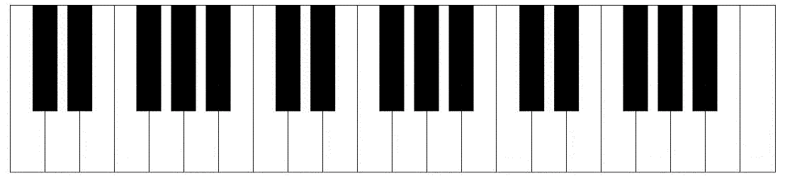

# 用 JavaScript 创建一个钢琴应用

> 原文：<https://medium.com/hackernoon/create-a-piano-app-with-javascript-97dbad1ff28c>



我的目标是制造一架可用的钢琴。一旦我做出了钢琴，我希望能够建立一个可播放歌曲的数据库，能够一起演奏。没有什么花哨的，像摇滚乐队，但只是一个简单的钢琴应用程序与歌曲，你可以一起玩。如果你想继续，这是我的可行的原型，我们将朝着它努力:[https://my-little-piano-app.herokuapp.com/](https://my-little-piano-app.herokuapp.com/)

这是一个有趣的项目，也是为你的孩子做的一个有趣的小游戏。所以让我们开始吧。我将这个项目分成三个主要部分:

# HTML

# JavaScript

# 3 节点。JS 数据库

对于 HTML，我最初想让每个键都可以点击，这样就可以点击播放了。后来，我发现点击每一个键都会导致播放速度变慢，声音也不真实。所以我把它调了一下，把每种声音分配给一个单独的按键。这允许更复杂的旋律和更真实的声音。然而，这两种方法都有好处，所以在本教程中，我将向您展示如何使用其中一种方法，以防您想继续学习。

## 1a — HTML 键

如果你决定做可点击的按键，你可能很快会遇到的一个问题是按键是复杂的形状。它们就像拼图一样相互贴合。在 HTML 和 CSS 中，制作正方形和长方形很容易，但是制作更复杂的形状就稍微困难了。因为我想有鼠标悬停的效果，我需要每个键分开。我没有尝试绘制简单的矩形，然后计算出对齐和 z 索引，而是采用了一种更加困难且不必要的方法:svg 多边形。“SVG”标签允许您创建原本不可能的形状。所以我用我想要的形状中的特定点创建了每个关键点。这样你就不用自己去想了，我在这里包括了这些元素:

```
<svg class="piano" height="230" width="1000">
  <polygon points="200,10 230,10 230,100 245,100 245,220 200,220 200,10" class="white"  id="c" data-key="65"/>

  <polygon points="245,100 260,100 260,10 275,10 275,100 290,100 290,220 245,220 245,100" class="white" data-key="83" id="d"/>

  <polygon points="305,10 335,10 335,220 290,220 290,100 305,100 305,10" class="white" data-key="68" id="e"/>

  <polygon points="335,10 365,10 365,100 380,100 380,220 335,220 335,10" class="white" data-key="70" id="f"/>

  <polygon points="380,100 395,100 395,10 410,10 410,100 425,100 425,220 380,220 380,100" class="white" data-key="71" id="g"/>

  <polygon points="425,100 440,100 440,10 455,10 455,100 470,100 470,220 425,220 425,100" class="white" data-key="72" id="a"/>

  <polygon points="470,100 485,100 485,10 515,10 515,220 470,220 470,100" class="white" data-key="74" id="b"/>

  <polygon points="515,10 545,10 545,100 560,100 560,220 515,220 515,10" class="white" data-key="82" id="key5"/>

  <polygon points="560,100 575,100 575,10 590,10 590,100 605,100 605,220 560,220" class="white" data-key="84" id="key5"/>

  <polygon points="605,100 620,100 620,10 650,10 650,220 605,220 605,100" class="white" data-key="89" id="key5"/>

  <polygon points="650,10 680,10 680,100 695,100 695,220 650,220 650,10" class="white" data-key="85" id="key5"/>

  <polygon points="695,100 710,100 710,10 725,10 725,100 740,100 740,220 695,220 695,100" class="white" data-key="73" id="key5"/>

  <polygon points="740,100 755,100 755,10 770,10 770,100 785,100 785,220 740,220 740,100" class="white" data-key="79" id="key5"/>

  <polygon points="785,100 800,100 800,10 830,10 830,220 785,220 785,100" class="white" data-key="80" id="key5"/>

  <polygon points="230,10 260,10 260,100 230,100 230,10" class="black" data-key="49" id="c_sharp"/>
<polygon points="275,10 305,10 305,100 275,100 275,10" class="black" data-key="50" id="d_sharp"/>
<polygon points="365,10 395,10 395,100 365,100 365,10" class="black" data-key="51" id="f_sharp"/>
<polygon points="410,10 440,10 440,100 410,100 410,10" class="black" data-key="52" id="g_sharp"/>
<polygon points="455,10 485,10 485,100 455,100 455,10" class="black" data-key="53" id="a_sharp"/>
<polygon points="545,10 575,10 575,100 545,100 545,10" class="black" data-key="54" id="key4"/>
<polygon points="590,10 620,10 620,100 590,100 590,10" class="black" data-key="55" id="key4"/>
<polygon points="680,10 710,10 710,100 680,100 680,10" class="black" data-key="56" id="key4"/>
<polygon points="725,10 755,10 755,100 725,100 725,10" class="black" data-key="57" id="key4"/>
<polygon points="770,10 800,10 800,100 770,100 770,10" class="black" data-key="48" id="key4"/>
</svg>
```

每个多边形元素都包含在 SVG 标记中，并由一系列点定义。每个多边形也被分配一个类，或者黑或者白，对应于黑或者白键。以下是我为这些人设计的班级风格:

```
.white {
  fill:white;
  stroke:black;
  stroke-width:1;
  cursor:pointer;
  margin:2px;
}.white:hover {
  fill:#9e9e9e;
  stroke:lightblue;
  cursor:pointer;
  stroke-width:1;
  outline: black solid 1px;
}.black {
  fill:black;
  stroke-width:1;
  cursor:pointer;
  margin:2px;
}.black:hover {
  fill:#515151;
  stroke:lightblue;
  stroke-width:1;
  outline: black solid 1px;
}
```

这定义了颜色和边框，以及每个键的悬停效果。尽管键盘上的黑键和白键是相邻的，但对我来说，在 HTML 文档中将黑键和白键分开分组更容易。每个多边形也有一个 ID。大多数 id 对应于与该多边形相关的音符，从中间“C”开始，一直到下一个八度音程的“B”。您还会注意到，除了 ID 之外，每个多边形元素还有一个数据键，如下所示:

```
data-key="80"
```

它的作用是将每个元素与按键联系起来。键盘上的每个键都有一个数字。因此，在这一点上，我们可以点击屏幕上的键，或按下键盘上的键，让程序为我们播放声音。然而，由于用户不会本能地知道哪个键盘键对应于每个声音，所以我在 HTML 中包含了一个显示来显示给用户。

```
<div class="keysNotes">
  <h3>note</h3>
  <h3>c</h3>
    <h3>d</h3>
      <h3>e</h3>
        <h3>f</h3> 
          <h3>g</h3> 
            <h3>a</h3>
            <h3>b</h3>
            <h3>c</h3>
            <h3>d</h3>
            <h3>e</h3>
            <h3>f</h3>
            <h3>g</h3>
            <h3>a</h3>
            <h3>b</h3>
</div><div id="keysshow" class="keysNumbers">
  <h3>keys</h3>
  <h3>A</h3>
    <h3>S</h3>
      <h3>D</h3>
        <h3>F</h3> 
          <h3>G</h3> 
            <h3>H</h3>
            <h3>J</h3>
            <h3>R</h3>
            <h3>T</h3>
            <h3>Y</h3>
            <h3>U</h3>
            <h3>I</h3>
            <h3>O</h3>
            <h3>P</h3>
</div>
```

然后，在这些类的 CSS 中，我有如下内容:

```
.keysNumbers {
  color: lightgray;
  font-size: 40px;
  font-family: monospace;
  font-weight: bold;
  z-index: 10;
  width: 740px;
  display: flex;
  flex-flow: row nowrap;
  justify-content: space-between;
  margin-left: 80px;
  margin-top: -110px;
}.keysNotes {
  color: gray;
  font-size: 40px;
  font-family: monospace;
  font-weight: bold;
  z-index: 13;
  width: 740px;
  display: flex;
  flex-flow: row nowrap;
  justify-content: space-between;
  margin-left: 80px;
  margin-top: -150px;
}
```

这完美地排列了覆盖在屏幕按键顶部的数字和按键显示。现在，我们需要引入我们的音频文件。我上网搜了一下，找到了我需要的每个键的钢琴音符，除了 F 升，A 升和两个 F。因为我有其他的键音，所以我把这些键放进一个叫 audacity 的免费程序，把音调改变到更高或更低，然后重新保存文件以得到我需要的声音。Audacity 是一个很好的工具，特别是如果你想制作一个类似吉他手而不是钢琴的东西，但只有有限的录音来制作你的初始声音。无论如何，我不想让你经历那么多麻烦，所以我免费提供我在这里收集的声音:[https://www . Dropbox . com/sh/buuc 6h 937s 62 w2/aadhdrxmmdcfcatwjvwavna？dl=0](https://www.dropbox.com/sh/buuc6h937s62vw2/AADHdRxmmDCfcatwjxvdwAvNa?dl=0)

接下来，我将这些文件中的每一个放入带有音频标签的 HTML 中，还包括我们之前在多边形元素中使用的按键代码。

```
<audio data-key="65" id="c_octave1_audio" src="/middle_c.mp3"></audio>
    <audio data-key="49" id="c_octave1_sharp_audio" src="/mid_c_sharp.mp3"></audio>
    <audio data-key="83" id="d_octave1_audio" src="/middle_d.mp3"></audio>
    <audio data-key="50" id="d_octave1_sharp_audio" src="/mid_d_sharp.mp3"></audio>
    <audio data-key="68" id="e_octave1_audio" src="/middle_e.mp3"></audio>
    <audio data-key="70" id="f_octave1_audio" src="/middle_f.mp3"></audio>
    <audio data-key="51" id="f_octave1_sharp_audio" src="/mid_f_sharp.mp3"></audio>
    <audio data-key="71" id="g_octave1_audio" src="/middle_g.mp3"></audio>
    <audio data-key="52" id="g_octave1_sharp_audio" src="/mid_g_sharp.mp3"></audio>
    <audio data-key="72" id="a_octave1_audio" src="/middle_a.mp3"></audio>
    <audio data-key="53" id="a_octave1_sharp_audio" src="/mid_a_sharp.mp3"></audio>
    <audio data-key="74" id="b_octave1_audio" src="/middle_b.mp3"></audio>

    <audio data-key="82" id="c_octave2_audio" src="/high_c.mp3"></audio>
    <audio data-key="54" id="c_octave2_sharp_audio" src="/high_c_sharp.mp3"></audio>
    <audio data-key="84" id="d_octave2_audio" src="/high_d.mp3"></audio>
    <audio data-key="55" id="d_octave2_sharp_audio" src="/high_d_sharp.mp3"></audio>
    <audio data-key="89" id="e_octave2_audio" src="/high_e.mp3"></audio>
    <audio data-key="85" id="f_octave2_audio" src="/high_f.mp3"></audio>
    <audio data-key="56" id="f_octave2_sharp_audio" src="/high_f_sharp.mp3"></audio>
    <audio data-key="73" id="g_octave2_audio" src="/high_g.mp3"></audio>
    <audio data-key="57" id="g_octave2_sharp_audio" src="/high_g_sharp.mp3"></audio>
    <audio data-key="79" id="a_octave2_audio" src="/high_a.mp3"></audio>
    <audio data-key="48" id="a_octave2_sharp_audio" src="/high_a_sharp.mp3"></audio>
    <audio data-key="80" id="b_octave2_audio" src="/high_b.mp3"></audio>
```

您可能希望将音频文件包含在项目中的某个位置，以便您的 HTML 实际上可以访问它们。现在我们有了音频，我们可以编码按键或点击来触发声音，或者两者都编码。

如果我们走 onclick 路线，我们的 JavaScript 可能看起来像这样:

```
function play(){
       var audio = document.getElementById("audio");
       audio.play();
                 }
```

当然，用我们想要触发该功能的任何元素替换“音频”。一个旁注，如果我们什么都不做，你会遇到一个问题，如果你点击一个按钮，然后第二个，第二个不会播放，直到第一个完成。所以在函数中包含一点额外的东西来停止任何以前的声音是很好的，如果一个按钮被点击，然后只播放被点击的声音。

哪种方式更好？OnClick 还是 KeyPress？这完全取决于你，但以下是两者的论据。如果你的目标是帮助你或其他人学习钢琴，OnClick 会更好。原因如下:如果你的程序依赖于按键，那么用户通常会把按键和按键上显示的字母联系起来，而不是和音符相关的字母。所以你可以用" C "键弹奏"中间 C "，以此类推，但这只适用于只有一个八度的情况。然后《升 C 调》等也是有猫腻的。最终你会让用户按下“G”来弹奏“高音 F”，按下“S”来弹奏“升 A”。你可以看到这对一个想学钢琴的人来说是多么的困惑。OnClick 允许用户仅将声音与显示的字母关联，而不是与键盘上的字母关联。然而，点击每个声音会导致钢琴声音更加沉闷，不太流畅，也不容易演奏。在我看来，这两种方法都不是学习乐器的好工具，这就是为什么我选择了按键法，它只是玩起来更有趣。我从 Wes Bos 的一个项目中的架子鼓套件中提取了一些 JavaScript 代码，但这对于这种类型的项目来说是一个很好的方法。它看起来是这样的:

```
window.addEventListener('keydown', function(e) {
    const audio = document.querySelector(`audio[data-key="${e.keyCode}"]`);
    const key = document.querySelector(`.key[data-key="${e.keyCode}"]`);
    if (!audio) return;
    audio.currentTime = 0;
    audio.play();
    key.classList.add('active')
```

您不必通过 ID 获取每个元素，只需监听按键，并将其与相应的数据键进行匹配，这在我们的 HTML 中已经存在。它播放与该按键相关的声音，这在我们的 HTML 中也已经有了。最后，我们说如果没有任何音频，播放它，我们将 audio.currentTime 设置为 0，这有助于我前面提到的等待，允许按键播放，并停止当前仍在播放的任何其他声音。

在这一点上，你应该能够让你的钢琴工作，无论是按键还是点击，无论你喜欢哪个，你的钢琴是可以演奏的，希望如此。我额外做的另一件事是建立一个“乐谱”数据库，这样你可以选择一首歌曲来演奏，它会给你这首歌的音符。你可以在我之前的例子中看到。

困难的是，没有简单的捷径。如果你创建一个类似的数据库，你将不得不手动为每首歌添加注释。但是，如果谁有很棒的方法把活页乐谱转置成 JSON 数据……我洗耳恭听。

一旦我将笔记保存在数据库中，我就可以在选择歌曲时调用 api，并检索与所选歌曲相关的笔记。你还可以更进一步，让这首歌先播放，或者播放任意数量的附加组件。无论如何，我希望你喜欢，并且和我一样从中得到乐趣。如果你有任何反馈，请告诉我！