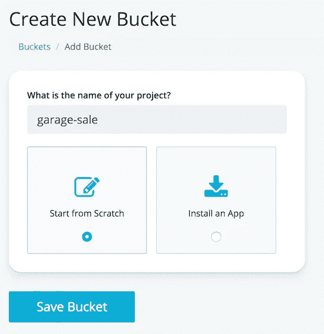
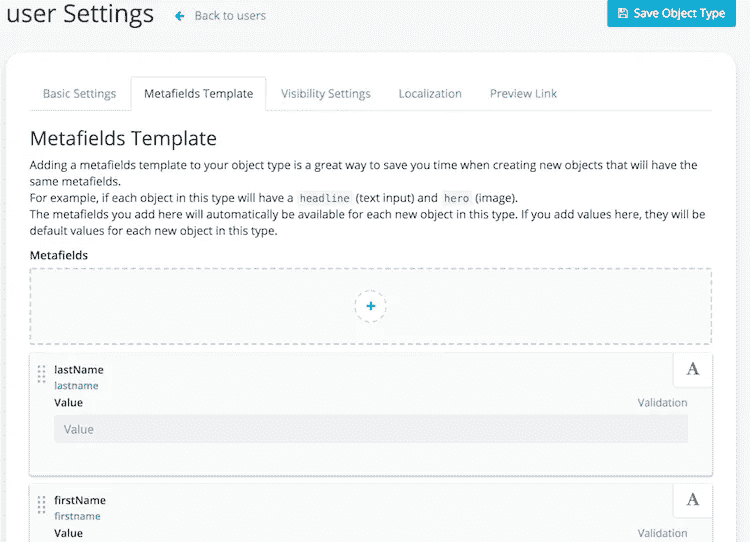

# 使用 Vue、Cosmic JS 和 GraphQL 创建一个渐进式 Web 应用程序

> 原文：<https://medium.com/hackernoon/create-a-progressive-web-app-using-vue-cosmic-js-and-graphql-e3cb86943210>


## TL；速度三角形定位法(dead reckoning)

*   [Vue.js PWA 演示](https://cosmicjs.com/apps/vue-garage-sale)
*   [Vue.js PWA 源代码](https://github.com/cosmicjs/vue-garage-sale)

## 介绍

[渐进式网络应用](https://www.npmjs.com/package/@vue/cli-plugin-pwa) (PWA)将应用的外观和感觉与网站编程的简易性结合起来。这些尖端的应用程序使您的用户可以轻松访问您的内容，而活跃的用户会增加您的收入。快速加载是其特点之一。PWA 的加载速度比移动网站更快，即使互联网可用性有限，也能确保您的用户始终拥有最佳体验。以下是主要功能:

*   随处访问
*   直接部署
*   用 SEO 推广
*   始终可用(即使脱机)
*   轻松更新
*   安全可靠

PWA 最好的一点是，他们可以快速构建并快速进入市场，而无需处理任何手机本机代码或应用商店大战。

这个应用程序的灵感主要来自 Offerup、Letgo 和 Craigslist。像 Craigslist 一样，LetGo 允许你在本地买卖商品，这意味着你不必像在易贝或亚马逊那样处理运输的麻烦。拥有 3000 万用户，比 OfferUp 更受欢迎。LetGo 最近出现在许多商业广告中，所以你可能也更熟悉它。唯一的问题是，这两个应用程序都是 iPhone 和 Android 平台上可用的移动应用程序，但没有 PWA 版本。所以让我们坐下来，看看我们是否可以利用 PWA，Vue 和 Cosmic JS 来建立一个。

## 应用概述

该应用程序包含三个主要功能:

*   显示您所在地区的待售商品列表。在我们的情况下，这将是所有待售项目的画廊视图
*   能够搜索关键字并过滤图库视图中与搜索词匹配的项目
*   能够点击一个项目的图像，并显示项目描述，卖家，更多的图像，并联系卖家…
*   添加新项目的能力。由于这个项目的范围，我没有建立这个功能，但这肯定可以增加一个有价值的补充。


## 启动您的 Vue PWA 应用程序

让我们卷起袖子开始建设吧。我们将从使用 vue-cli 命令创建项目开始。但是，如果您没有安装 vue-cli，请遵循以下步骤。因此，打开您的终端窗口，键入以下内容:

```
vue create garage-sale
# then select Manually...Vue CLI v3.0.0-rc.9
┌───────────────────────────┐
│  Update available: 3.0.0  │
└───────────────────────────┘
? Please pick a preset:
  default (babel, eslint)
❯ Manually select features# Then select the PWA feature and the other ones with the spacebar
? Please pick a preset: Manually select features
? Check the features needed for your project:
 ◉ Babel
 ◯ TypeScript
❯◉ Progressive Web App (PWA) Support
 ◉ Router
 ◉ Vuex
 ◯ CSS Pre-processors
 ◉ Linter / Formatter
 ◯ Unit Testing
 ◯ E2E Testing? Pick a linter / formatter config:
  ESLint with error prevention only
  ESLint + Airbnb config
❯ ESLint + Standard config
  ESLint + Prettier? Pick additional lint features: (Press <space> to select, a to toggle all, i to invert selection)
❯◉ Lint on save
 ◯ Lint and fix on commit🎉  Successfully created project barage-sale.
👉  Get started with the following commands:$ cd barage-sale
$ npm run serve
```

到目前为止，除了 PWA 选择步骤，这一步看起来像任何常规的 Vue 应用程序创建。感谢 vue-cli，它在 senes 后面做了大量工作，并添加了服务人员选项，这是 PWAs 的一个主要功能。所以让我们继续，一步一步地添加我们的功能。

我们还需要添加 Vuetify，这将是我们的 css 框架。在使用 Vuetify 之前，我的大多数项目都使用 Bootstrap，但是在尝试了 Vuetify 之后，我就迷上了它。在我看来，Vuetify 提供了两大优势:

*   与 bootstrap 相比，快速开发
*   与 Vue 轻松集成

所以让我们把它添加到我们的项目中

```
vue add vue-cli-plugin-vuetify
? Use a pre-made template? (will replace App.vue and HelloWorld.vue) Yes
? Use custom theme? No
? Use a-la-carte components? Yes
? Use babel/polyfill? Yes
✔  Successfully invoked generator for plugin: vue-cli-plugin-vuetify
```

还要注意，我在添加 Vuetify 时选择了`use-a-la-carte`选项，因为我想定制它的一个组件，而且我不想从 Vuetify 导入所有组件。与导入所有 Vuetify 库相比，这将使文件更小。

## 应用程序清单

为了让移动设备知道您的应用程序支持 PWA，您需要在`manifest.json`文件中输入一些关于您的应用程序的信息。让我们来看看:

```
{
  "name": "garage-sale",
  "short_name": "garage-sale",
  "icons": [
    {
      "src": "/img/icons/android-chrome-192x192.png",
      "sizes": "192x192",
      "type": "image/png"
    },
    {
      "src": "/img/icons/android-chrome-512x512.png",
      "sizes": "512x512",
      "type": "image/png"
    }
  ],
  "start_url": "/",
  "display": "standalone",
  "background_color": "#000000",
  "theme_color": "#4DBA87"
}
```

首先，指定应用程序的名称，以及可用于应用程序快捷方式的图标。作为 PWA 应用程序，移动设备浏览器会在用户第一次访问您的网站时询问他们是否要安装您的应用程序。如果是，则快捷方式将被添加到移动设备主屏幕。同样值得注意的是，作为这个应用程序设置的一部分，你需要创建不同大小的图标，可以用于不同的移动设备。对我来说，我必须定义以下图标:

```
android-chrome-192x192.png
android-chrome-512x512.png
apple-touch-icon-120x120.png
apple-touch-icon-152x152.png
apple-touch-icon-180x180.png
apple-touch-icon-60x60.png
apple-touch-icon-76x76.png
apple-touch-icon.png
msapplication-icon-144x144.png
mstile-150x150.png
```

这是我的应用图标之一:


## 添加应用程序组件、路由器和商店

由于该应用程序将作为一个 SPA(单页应用程序),我们需要添加路由器。对于我们的应用程序，我们只需要两条路线:

*   主页:显示文章网格视图和搜索工具栏的地方
*   发布:这是项目详细信息视图，我们可以在其中看到项目详细信息

因此，让我们打开终端窗口，并添加以下文件:

```
# adding the vue components
touch src/views/Home.vue
touch src/components/PostGrid.vue
touch src/components/PostItem.vue
touch src/components/PostDetails.vue
touch src/components/PostCarousel.vue# add router, store,
touch src/router/index.js
touch src/store/index.js
```

我们将路由添加到我们的应用程序中，如下所示:

注意，路由器一开始并没有导入`PostDetails.vue`组件。这是惰性加载，这意味着我们的应用程序不会在开始时加载这个组件，以使它更快，只有在用户需要时才加载这个组件。让我们编辑 main.js 和 App.vue，如下所示:

注意，为了使用 Vuetify，我们不说`import Vuetify from 'vuetify'`我们从`/plugins/vuetify`进口，因为我们只需要选择我们正在使用的组件。看看 [vuetify.js](https://github.com/mtermoul/garage-sale/blob/master/src/plugins/vuetify.js) 看看是怎么做的。

## 添加用户界面代码

所以让我们从创建我们的 UI 开始，如下图所示。

到目前为止，在我们的主页中，我们刚刚添加了一个顶部工具栏，带有搜索文本字段、搜索按钮和左侧导航菜单。在页面的内容区域，我们刚刚添加了一个组件`post-grid`，它将作为我们数据的占位符。

在继续之前，我们需要一些数据来测试和构建我们的 UI 组件。因此，不做更多的事情，让我们在下一节做。

## 用 Cosmic JS 构建后端

在发现 Cosmic JS 之前，我使用普通的 JSON 文件并编写一个小小的 Node.js 应用程序，它有一堆 Rest API 端点。另一种方法是使用一些云 noSQL 数据库来托管 JSON 数据文档，并编写一个服务器 Rest API 来服务这些数据。然而，这一切都过去了，在了解到使用 Cosmic JS 后，您不再需要编写服务器端 API。只要设计好你的数据，从 JSON 文件中插入或导入，Cosmic JS 就会自动为你生成 Rest API。事实上，Cosmic JS 提供了两种 API 端点:

*   Rest API 将成为添加、显示和更新数据的 CRUD 方法。
*   GraphQL API，它也类似于 Rest，但是您可以使用称为 GraphQL 的特殊语法来编写查询。如果您不熟悉 GraphQL，我鼓励您查看这些文档。由于其灵活性和受欢迎程度，它最近获得了很大的发展势头。另外，它是由脸书开发的。对于我的应用程序，我将包括 Rest 和 GraphQL 方法，让您试验并决定哪一个最适合您。如果您没有使用 Cosmic JS，那么您必须使用某个数据库作为存储机制来编写自己的服务器 GraphQL API，并为 GraphQL 端点编写 Node.js。

好了，让我们跳到宇宙 JS，添加我们的数据元素。注册免费帐户后，打开仪表板，添加名为`garage-sale`的新桶。



之后，打开该桶的仪表板，从左侧菜单添加以下`ObjectType`:

*   邮件
*   用户
*   位置
*   后置条件
*   后置类别

如果您来自 RDBMS 数据库，那么对象类型就相当于数据库表。添加每个对象类型后，您可以开始为每个对象类型定义`metafield`。元字段相当于模式或表列。那么下面我们来看看这个过程:



因此，向每个对象类型添加以下字段:

```
# Locations
city: text
state: text
country: text
postalCode: text# Users
email: text
firstName: text
lastName: text# Posts
title: text
description: text
condition: PostCondition
price: text
isFree: boolean
categories: [PostCategory]
images: [media/file] (files will be uploaded to Cosmic JS files.
mainImage: number
isSold: boolean
dateAdded: date
user: User# PostConditions
name: text
desc: text# PostCategories
name: text
```

添加了`ObjectType`和`metafields`之后，是时候添加一些数据了。要添加数据，只需点击 Cosmic JS 仪表板左侧菜单中的对象类型，然后开始添加数据。还可以使用 Cosmic JS CLI API 插入数据。请查看 CLI 函数的文档。我个人使用仪表板和 CLI 为我的应用程序插入测试数据。以下是如何将数据添加到文章类别对象类型的示例:

```
# inserting into PostCategories
cosmic add-object --type_slug "postcategories" --title "Shoes" --metafields [{title: "name", value: "Shoes"}]
cosmic add-object --type_slug "postcategories" --title "Cars" --metafields [{title: "name", value: "Cars"}]
```

同样，你可以添加所有的对象。对于图像，更容易打开仪表板，并使用 Cosmic JS 仪表板左侧菜单中的`Media`功能上传所有图像。对于我的应用程序，每个帖子有多个图像，每个图像有三个版本。将根据屏幕显示尺寸选择超小型、小型和中型。因为我们是为 PWA 开发的，而 PWA 主要是为移动设备开发的，所以我们将主要服务于 xm 和 sm 图像。不过，我们也提供了一个使用 md 文件的桌面替代视图，以防应用程序从桌面屏幕打开。我们将进一步深入了解如何为 PWA 应用程序优化图像的更多细节。


我们从后端开始。在下一节中，我们将回顾如何使用 Cosmic JS API 消费我们的数据。

## 通过 Rest 或 GraphQL 使用 Cosmic JS API

如前所述，Cosmic JS 提供了两种通过 API 调用执行 CRUD 操作的方法。首先，我们可以使用普通的旧 API 与数据进行交互。完整文档请查看 [Cosmic JS Rest API 文档](https://cosmicjs.github.io/rest-api-docs/#introduction)这里有几个例子:

```
Cosmic.getObjects({type: 'postcategories', limit: 10})
Cosmic.getObjects({type: 'users', skip: 5, limit: 2})
Cosmic.getObjects({type: 'posts'})
```

我们还可以通过 GraphQL api 与 Cosmic JS 进行交互。请阅读 [Cosmic JS GraphQL API](https://cosmicjs.com/docs/graphql) 获取完整文档。如果您想运行一些查询并测试这个 API，请打开 [GraphiGL Playground](https://graphql.cosmicjs.com/) 并编写一些 graphiql 查询:


## 使用 Vuex、Cosmic JS 和 Vue store 的应用状态

为了维护应用程序的状态，我们需要在某个地方保存数据，并允许应用程序中的所有组件和模块共享这些数据。因此，为此我们将使用 [Vuex](https://vuex.vuejs.org/) 。所以对于我的应用程序，如前所述，我有两个动作从 Cosmic JS 获取数据。第一个`fetchPosts`将简单地调用 Cosmic JS REST api 并检索所有帖子。我不会深入探讨这个问题，因为已经有很多关于这个问题的文献了。第二种方法是`fetchPostsGQ`,它将从 Cosmic JS GraphQL API 获取 post 数据。所以让我们来看看它是如何做到的。

现在让我从上面的存储文件中查看几个要点。首先，为了使用来自 Cosmic JS 的 GraphQL API 或任何其他 GraphQL api，我们需要 GraphQL 客户端库。在撰写本文时，有许多 js 库可以用作 GraphQL 客户端，但是我选择了 [apollo-boost](https://www.npmjs.com/package/apollo-boost) ，因为它具有内存缓存特性。我还使用了`graphql-tag`来解析多行字符串形式的 GraphQL 查询。之后，我们需要通过提供 GraphQL API 的 URL 来启动`ApolloClient`实例。在我们的例子中，CosmicJS 提供给我们的 url 是`https://graphql.cosmicjs.com/v1`
。在这之后，我们准备编写我们的第一个 GraphQL 查询，并获取一些数据。在函数`fetchPostsQG`中，我们可以看到 GraphQL 查询的语法如下:

```
query: gql`query Posts($bucket: String, $type: String!) {
        objectsByType(bucket_slug: $bucket, type_slug: $type) {
            _id
            title
            slug
            metadata
        }
    }`,
variables: {bucket: 'garage-sale', type: 'posts'}
```

如果您熟悉 SQL 语言，上面的查询相当于下面的 select 语句。

```
SELECT _id, title, slug, metadata
FROM garage-sale.posts
```

剩下的代码只需要获得结果并填充`state.posts`变量。我还应该提到，我们有`state.isDataready`变量，一旦我们从 api 获得数据，它将被设置为`true`。否则 UI 会显示某种加载图标。最后，我想提一下我们的 UI 所需的所有数据，将从`post.metadata`中选择，这只是从 Cosmic JS 返回的数据的格式。Vuex 商店的完整源代码请看一下 [index.js](https://github.com/mtermoul/garage-sale/blob/master/src/store/index.js) 。

## 加载初始数据并填充主页

当启动应用程序时，我们将看到数据加载微调器几秒钟，然后我们将看到网格加载了来自服务器的数据。


我们能够通过首先从 [main.js](https://github.com/mtermoul/garage-sale/blob/master/src/main.js) 中调用`loadingInitialData`来实现这一点

正如您在上面的代码中看到的。为了触发获取数据，我们只需从应用程序`created`生命钩子中调用`loadInitialData`动作。

现在让我们看看`Home.vue`组件，看看我们如何使用这些数据。

从上面的代码中可以看到，有一个计算属性`posts`，它将直接从 Vuex 存储中获取。这个 posts 属性作为组件属性传递给`PostGrid`组件。`PostGrid`组件将遍历数组元素，并在屏幕上绘制文章项目。

在主页中，还有一个搜索功能，它将简单地从输入框中取出搜索词，并使用关键字参数再次调用`fetchPosts`动作。

## 显示帖子详细信息页面

首页的`PostGrid`中的每一项，都会有一个到`post`页面的链接

当我们点击`PostItem`时，路由器会将用户带到`PostDetails`页面。


一旦我们进入这个页面，我们有四个主要功能:

*   向上滑动:显示文章的上一张图片
*   向下滑动:显示文章下一张图片
*   向左滑动:显示下一篇文章
*   向右滑动:显示上一篇文章

除了滑动功能，这将需要一个触摸屏设备，还有其他功能，如`Contact Seller`按钮和`More Info`按钮，它们是直截了当的。点击每个按钮，我们使用 Vue `v-show`和`v-bind`指令显示/隐藏视图上的一个部分。

这个难题的最后一部分是文章细节转盘，用于浏览文章的图片。对于这个项目，我使用 Vuetify `Carousel`组件来显示多个图像，并允许用户通过上下滑动来浏览这些图像。
我也包括在这个项目中['/src/components/post carousel . vue '](https://github.com/mtermoul/garage-sale/blob/master/src/components/PostCarousel.vue)。该组件是`vuetify.carousel`的扩展，稍加改动。我添加了垂直滑动模式，允许用户浏览图片。开箱即用的`vuetify.carousel`将只允许左/右滑动。所以如果你看一下代码，你会看到这个组件扩展了`VCarousel`组件

所以，你有它！这就是你如何使用组件继承，并以最基本的方式扩展第三方组件。

## 桌面视图怎么样？

尽管这款应用主要是为移动设备开发的，但只需添加几行代码就一定能让它变得对桌面友好。因此，作为一部分，你可以使用网格布局系统轻松地编写响应性 web 应用程序。例如:

```
<v-flex xs12 sm6 offset-sm3>
...
<v-flex>
```

这意味着，如果这个`xm`表示超小型设备，那么这个`div`将占据页面的整个宽度。对于小尺寸或更大尺寸的屏幕，它将占用一半的宽度。知道每个屏幕总共有大约 12 列。Vuetify 还有另一个特性，允许我们查询屏幕大小，发布条件语句或应用条件样式。它叫做`breakpoint`，可以如下使用:

```
# only apply the css class if size is medium and up
<div :class="{'view-medium-and-up': $vuetify.breakpoint.mdAndUp}"># image size will be calculated based if screen size is small and down
const imgSize = this.$vuetify.breakpoint.smAndDown ? '200px' : '400px'
```


如你所见，桌面上的文章详情页面只占了一半的宽度。我还加入了导航箭头(左、右、上、下),因为桌面版没有滑动功能。所有这些逻辑都可以很容易地用 Vuetify 和 Vue 实现。

还有一点值得一提的是，后期图像的分辨率会根据屏幕大小而变化。因此，每个图像都有三种分辨率 xm、sm 和 md，并且有逻辑根据屏幕大小显示适当的图像。让我们看看我们是怎么做到的。

首先，所有 post 图像需要针对 PWA 进行优化，并为每个图像生成三个文件。例如，如果一个帖子有一个名为`adidas-yeezy-color-fashion-1280064.jpg`的图像，那么我们将需要产生如下三个版本的图像:

*   阿迪达斯-yee zy-color-fashion-1280064-xs _ 1x . jpg
*   阿迪达斯-yee zy-color-fashion-1280064-sm _ 1x . jpg
*   阿迪达斯-yee zy-color-fashion-1280064-MD _ 1x . jpg

您可以使用许多方法、应用程序、工具和网站来优化图像并自动化该过程。在下一节中，我将更多地解释这个过程和 PWA 优化。然而，在这一节中，我只想向您展示如何有条件地更改 UI，并根据屏幕大小显示不同的图像

```
postImages () {
        const imgSize = this.$vuetify.breakpoint.smAndDown ? '-xm_1x' : '-sm_1x'
        ...
    },
```

上面的代码只是根据屏幕大小选择正确的图像文件名。

## 是时候运行应用程序并进行测试了

我认为此时我们的应用程序已经准备好进行一些测试了。为了检查和了解该应用程序在移动设备上的表现，我强烈建议使用 Chrome dev tool。在那里，您可以使用设备工具栏来更改设备屏幕大小。您还可以看到该应用程序如何使用触摸屏功能。我相信 Safari 也有类似的功能，在开发菜单下叫`Enter Responsive Design Mode`。另一个有用的功能是 xCode 设备模拟器，它可以让我测试实际的手机感觉。我在排除一些 iPhones 特有的问题时使用了这个功能，它真的派上了用场。我相信 xCode 可以很容易地安装在 mac 上，但是我不确定 PC 上是否可以！但是我认为 Windows OS 应该有类似的 app 或者其他设备模拟器。


我也推荐使用用于 Chrome 的 vue-dev-tools 插件。这将为您节省大量调试时间，并了解实际情况。

因此，要运行该应用程序，只需运行以下 vue-cli 命令:

```
# run on dev mode
npm run serve# build you app for production
npm run build# serve prod build on your local machine. You need to install serve first (npm install serve)
serve -s dist
```

对于这个项目，我使用`http-serve`在服务器上提供我的 PWA 应用程序，因为它提供了许多有用的功能，如:

*   https 功能
*   gzip 文件服务

如果你喜欢控制，你也可以写你自己的节点/快速服务器，但是对我来说这样更快。

## 用 Google Lighthouse 优化 PWA 应用程序

在所有这些工作之后，当我使用 Chrome dev-tools 的 Google Lighthouse 运行应用程序审计时，真相大白的时刻到来了。我第一次进行审计时，分数很糟糕，低于 50%。
在实施几项建议之前，这是它在某一点上的看法


第一次运行后，我不得不一个接一个地检查 Lighthouse 的分数，并执行所有推荐的建议。每次分数都越来越好。我也获得了更多关于 SEO、性能、PWA……如何评分以及如何在这些方面做得更好的见解。经过多次迭代后，我得到了以下分数


尽管我没有在所有类别中获得 100%的分数，但通过实施谷歌建议的改变，我感觉好多了，也学到了很多东西。
有没有可能所有类别都得 100 分？你可能会问。答案是肯定的，如果你愿意花时间实施所有的建议。

影响网站性能的一个主要问题是图像。我意识到我提供的图像与屏幕尺寸不匹配。所以在浏览了一些建议后，我找到了这篇文章
[一个使用现成模板的响应式图像指南](https://medium.freecodecamp.org/a-guide-to-responsive-images-with-ready-to-use-templates-c400bd65c433)
，它详细解释了这个问题并为你设计了最佳解决方案。所以在这篇文章之后，我创建了一个简单的过程，遍历一个文件夹下的每张图片，并生成多个版本。

我知道我没有在这里浏览每一行代码，但是我强烈建议你尝试一下应用程序[演示](http://garage-sale.cosmicapp1.co/)，看看感觉如何。你也可以查看一下[代码](https://github.com/mtermoul/garage-sale)，看看有没有问题。

## 结论

起初，构建 PWA 应用程序可能会感觉是一项艰巨的任务。然而，在 Vue 模板、Vuetify 和 Cosmic JS 的帮助下，这个任务感觉更加愉快，最后我学到了更多的技巧。我的结论是，在你的旅程开始之前，你可能不知道所有的答案，但是，只要你有能力问这些问题，并尝试新事物，你就会在你的旅程中学习和成长。

感谢您花时间阅读我的故事，我希望我已经启发您建立您的下一个 PWA 想法。如果你有任何问题或意见，请告诉我[在 Twitter 上联系我们](https://twitter.com/cosmic_js)并加入我们的 [Slack 社区](https://cosmicjs.com/community)。