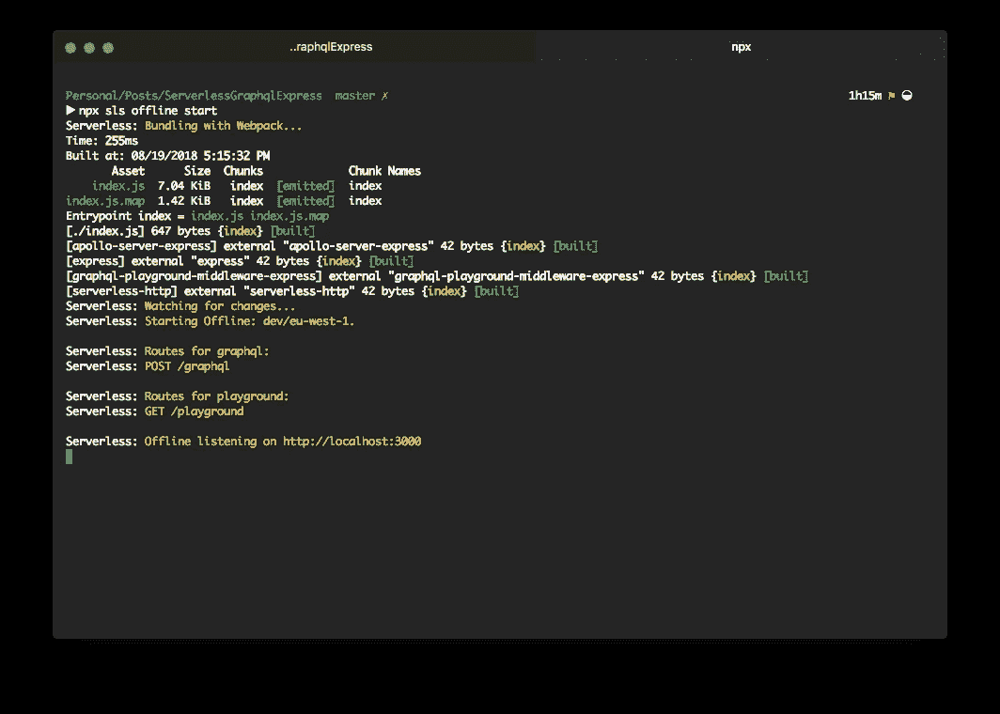
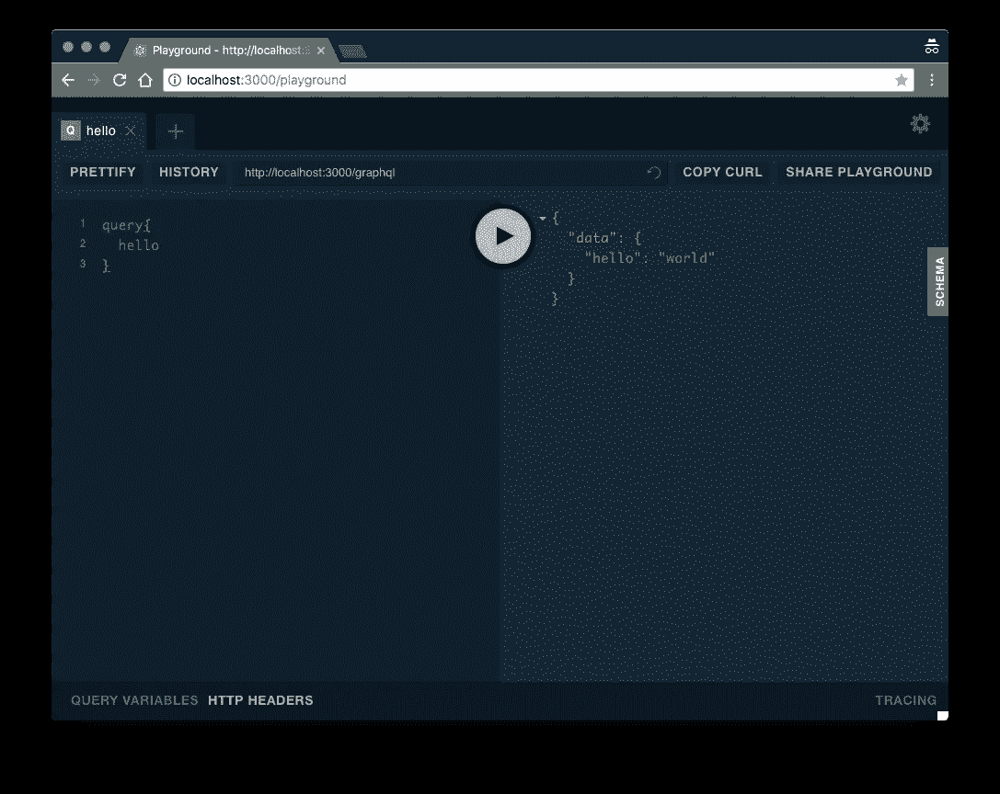

# 使用 Express、Apollo Server 和 AWS Lambda 创建一个无服务器的 GraphQL 服务器

> 原文：<https://medium.com/hackernoon/create-a-serverless-graphql-server-using-express-apollo-server-and-aws-lambda-c3850a2092b5>

…因为谁不想要无服务器的 GraphQL 服务器呢，对吧！？


如果你曾经玩过 GraphQL、无服务器和爱 T2 JavaScript，那么你来对地方了。有什么比混几个近段时间最刺激的技术，不多，诶。

继续我们的[无服务器](https://hackernoon.com/tagged/serverless)之旅，并进一步建立在之前的帖子上，在那里我们已经探索了 [*从运行在 Lambda 函数*](/@YatinBadal/rendering-and-serving-a-create-react-app-from-an-express-server-running-within-a-lambda-function-832576a5167e)*——*内的 Express 服务器渲染和服务 Create-React-App，现在让我们将注意力转向 GraphQL 并将其与无服务器结合。这样，就不需要一个持续运行的 GraphQL 实例，这是一个操作梦想。

我们将为我们的服务器使用 [AWS Lambda](https://serverless.com/) 函数和[无服务器框架](https://serverless.com/)。我们的 Lambdas 将运行节点。JS 8.1 运行时。我们还将利用 [Webpack](https://webpack.js.org/) 的捆绑优势和 [Babel](https://babeljs.io/) 来传输我们的堆栈。

为了启动和运行我们的无服务器 GraphQL 服务器，我们需要:

*   设置无服务器
*   创建和表达应用程序
*   引入并配置 Apollo 服务器

好了，我们开始吧！

# 无服务器+网络包

首先，安装无服务器框架和它需要的所有必要的依赖项:

```
$ npm i -S serverless serverless-webpack serverless-http serverless-offline 
```

我们还需要安装 Webpack、节点外部包和 babel-loader。接下来为 Webpack 创建一个配置文件:

```
$ npm i -D webpack webpack-node-externals babel-loader
$ touch webpack.config.js
```

并将以下基本配置放入其中:

```
// webpack.config.jsconst path = require("path");
const slsw = require("serverless-webpack");
const nodeExternals = require("webpack-node-externals");module.exports = {
  entry: slsw.lib.entries,
  target: "node",
  mode: slsw.lib.webpack.isLocal ? "development" : "production",
  optimization: {
    minimize: false
  },
  performance: {
    hints: false
  },
  devtool: "nosources-source-map",
  externals: [nodeExternals()],
  module: {
    rules: [
      {
        test: /\.js$/,
        exclude: /node_modules/,
        use: [
          {
            loader: "babel-loader"
          }
        ]
      }
    ]
  },
  output: {
    libraryTarget: "commonjs2",
    path: path.join(__dirname, ".webpack"),
    filename: "[name].js",
    sourceMapFilename: "[file].map"
  }
};
```

你可以在这里找到更多关于无服务器网络包插件[的信息。](https://github.com/serverless-heaven/serverless-webpack)

接下来，我们需要创建并配置我们的 **serverless.yml** 文件:

```
$ touch serverless.yml
```

将以下 YML 放入其中:

```
// serverless.ymlservice: serverless-graphqlplugins:
  - serverless-webpack
  - serverless-offlinecustom:
  webpack:
    webpackConfig: ./webpack.config.js
    includeModules: trueprovider:
  name: aws
  runtime: nodejs8.10
  stage: dev
  region: eu-west-1
```

接下来我们将添加和配置我们的功能。

# Express +阿波罗服务器

好吧，让我们继续我们的服务器。我们需要安装 Express、Apollo 服务器和其他一些依赖项:

```
$ npm i -S express apollo-server-express graphql
```

我们还将使用 [Prisma GraphQL playground](https://github.com/prisma/graphql-playground) 来测试我们奇特的服务器。让我们安装必要的软件包:

```
$ npm i -D graphql-playground-middleware-express
```

创建一个 **index.js** 文件，该文件将包含我们的服务器代码以及我们的入口点:

```
$ touch index.js
```

将以下代码放入其中:

```
// index.jsimport express from "express";
import serverless from "serverless-http";
import graphiql from "graphql-playground-middleware-express";
import { ApolloServer, gql } from "apollo-server-express";const typeDefs = gql`
  type Query {
    hello: String
  }
`;const resolvers = {
  Query: {
    hello: () => "world"
  }
};const app = express();const server = new ApolloServer({
  typeDefs,
  resolvers,
  path: "/graphql"
});server.applyMiddleware({ app });app.get("/playground", graphiql({ endpoint: "/graphql" }));const handler = serverless(app);export { handler };
```

没错，我们的 **index.js** 已经被设置为容纳两个 lambda 函数，一个用于 GraphQL Apollo 服务器，另一个用于游乐场。更新 **serverless.yml** 文件，添加我们需要的两个函数:

```
// serverless.ymlfunctions:
  graphql:
    handler: index.handler
    events:
      - http:
          path: graphql
          method: post
          cors: true
  playground:
    handler: index.handler
    events:
      - http:
          path: playground
          method: get
```

…至此，我们差不多完成了设置。让我们测试一下我们的 GraphQL Apollo 服务器吧！回想一下，之前我们添加了**无服务器离线**作为依赖项，让我们继续离线启动我们的服务器:

```
$ npx sls offline start
```

这将启动我们服务器的一个本地实例。您应该会看到以下输出:



Running our GraphQL server for the first time!

您会注意到我们的两个端点将被创建， ***/graphql*** 是我们的 graphql 服务器端点，而我们的 playground 位于 ***/playground*** 。为了测试我们的服务器，让我们导航到我们的游乐场，[*http://localhost:3000/playground*](http://localhost:3000/playground)

执行一个简单的查询，看看无服务器 GraphQL 服务器的魔力…😎



Our Serverless GraphQL server in all it’s glory 😎

# —终于

通过几个简单的步骤，我们已经在 AWS Lambda 上创建了一个简单的 Express 和 GraphQL 服务器。要部署我们的服务器，我们现在需要做的就是运行:

```
$ npx sls deploy -v
```

将你的服务器连接到你的 [React 前端，也就是从 Lambda](/@YatinBadal/rendering-and-serving-a-create-react-app-from-an-express-server-running-within-a-lambda-function-832576a5167e) 渲染的服务器端，你就有了一个非常灵活的无服务器解决方案。这就结束了我们结合无服务器和 GraphQL 的小小尝试——这是目前最热门的两项技术。

你可以在[https://github.com/FBI23/serverless-express-graphql](https://github.com/FBI23/serverless-express-graphql)找到这篇文章的代码