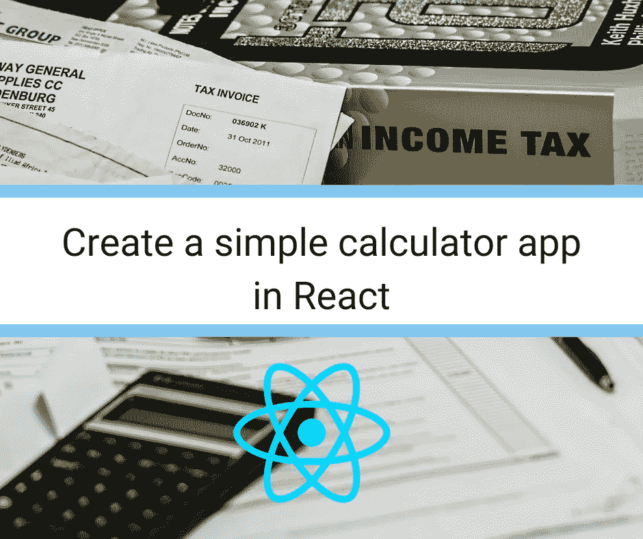
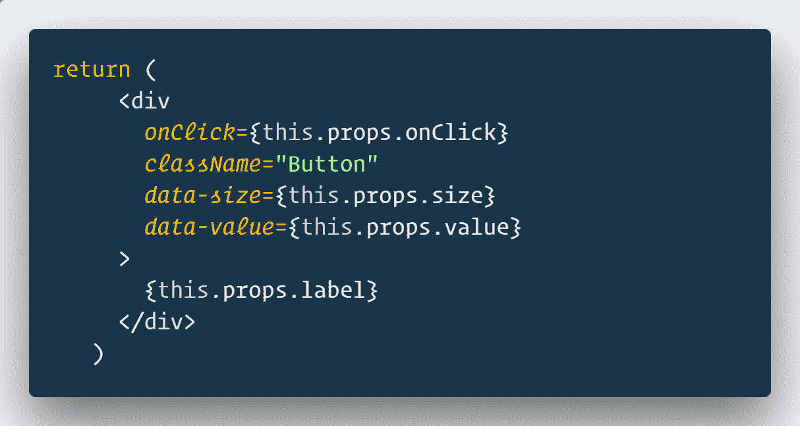
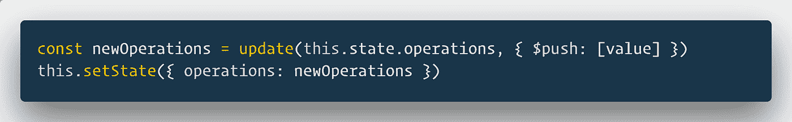
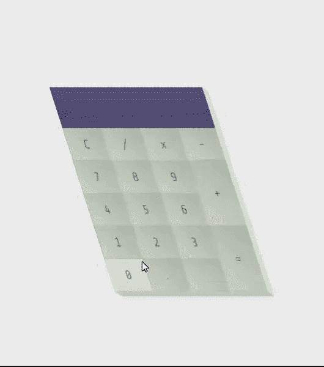
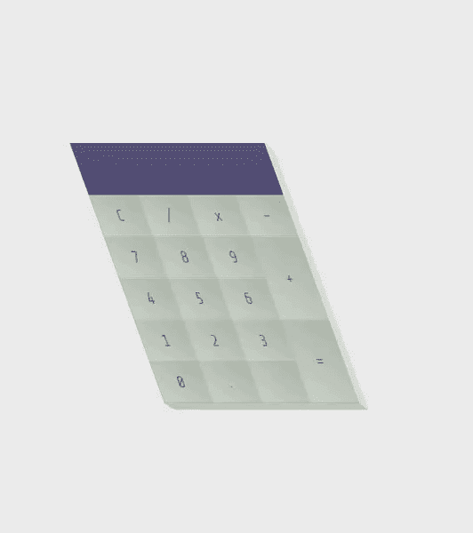

# 在 React 中创建一个简单的计算器应用程序

> 原文：<https://medium.com/hackernoon/create-a-simple-calculator-app-in-react-1ec6a7bbe09d>



今天我们将创建一个新的 react 应用程序，一个计算器。虽然操作非常简单，但要将东西固定在适当的位置并保持适当的状态还是有点困难。

# 特色 React JS 课程

## [React 16 —完整指南(包括 React 路由器 4 & Redux)](http://thebestdevlist.link/react-the-complete-16-guide-incl-redux)

4.7/5 星 **||** 33.5 小时视频**| |**61597 名学生

学习反应或深入研究。学习理论，解决作业，在演示项目中实践，并构建一个在整个课程中不断改进的大型应用程序:汉堡生成器！ [**了解更多。**](http://thebestdevlist.link/react-the-complete-16-guide-incl-redux)

[](http://thebestdevlist.link/react-the-complete-16-guide-incl-redux) [## React 16 —完整指南(包括 React Router 4 和 Redux)

### 投身其中，从头开始学习 React！了解 Reactjs、Redux、React Routing、动画、Next.js 基础知识以及更多内容！

thebestdevlist.link](http://thebestdevlist.link/react-the-complete-16-guide-incl-redux) 

## 【React 专业化的全栈 Web 开发

构建完整的 Web 和混合移动解决方案。在 Coursera [**注册的四门综合课程中掌握前端 web、混合移动应用程序和服务器端开发，开始为期 7 天的完全免费试用。**](http://thebestdevlist.link/coursera-full-stack-react)

[](http://thebestdevlist.link/coursera-full-stack-react) [## 使用 React | Coursera 进行全栈 Web 开发

### 香港科技大学 React 的全栈 Web 开发。学习前端和…

thebestdevlist.link](http://thebestdevlist.link/coursera-full-stack-react) 

这是我们将要创建的应用程序的演示。

`create-react-app`是我们开始确保您照常拥有`node`、`npm`、`create-react-app`的地方。

如果没有，请从[这里](https://nodejs.org/)安装 NodeJS(NPM 自带)。

将带有`npm install create-react-app --global`的`create-react-app`安装在端子上。

这就是所有的安装部分。

用`create-react-app react-calculator`创建一个新的 react app。确保你的应用程序名称中没有空格，初学者经常犯这个错误。

`cd react-calculator
npm start`

这将启动一个 react 欢迎页面，如下所示。


我将把计算器应用程序分解成单独的小块。首先，它有一些 JSX，看起来像 HTML，但实际上是 JavaScript。这个 JSX 使计算器应用程序呈现在屏幕上。它有一堆带有类名的 div 和按钮。CSS 的魔力融入了类名，使其看起来更好。

# 用于在 React 中创建计算器的库

1.  反应，反应-dom
2.  数学
3.  不变性助手

**如何开始？**

我从`create-react-app`开始，继续添加组件。现在，该应用程序包含以下组件:

*   **App** —主占位符组件
*   **按钮** —单个按钮的占位符
*   **按钮** —单个按钮
*   **显示**——顶部的显示条

# 处理计算器组件

我们的计算器进行加减乘除运算。我们将所有用户输入存储在一个变量中，并在输入等号(`=`)时进行计算。

因为每次按下按钮都必须修改输入变量，所以我们将使用状态来处理这个问题。

> React 是什么状态？
> 
> react 中的`state`是指组件中的数据状态。如果使用相同的状态来呈现页面中的多个部分，当它在应用程序中的任何位置发生变化时，所有值都将更新。我们用它来存储按钮按压和显示栏中的显示值。

我们必须初始化状态，我们通过构造函数来完成。

```
class App extends Component {
  constructor() {
    super()
    this.state = { operations: [] }
  }
  .....
}
```

操作变量是按钮输入的数组，可能看起来像`[2, *,4, -, 1]`。

我们有数字按钮 0-9 和运算符+、-、*、/。我们也有清除，等于和十进制按钮。每个按钮都有一个点击处理程序。

```
render() {
    return (
      <div className="App">
        <Display data={this.state.operations} />
        <Buttons>
          <Button onClick={this.handleClick} label="C" value="clear" />
          <Button onClick={this.handleClick} label="7" value="7" />
          <Button onClick={this.handleClick} label="4" value="4" />
          <Button onClick={this.handleClick} label="1" value="1" />
          <Button onClick={this.handleClick} label="0" value="0" />

          <Button onClick={this.handleClick} label="/" value="/" />
          <Button onClick={this.handleClick} label="8" value="8" />
          <Button onClick={this.handleClick} label="5" value="5" />
          <Button onClick={this.handleClick} label="2" value="2" />
          <Button onClick={this.handleClick} label="." value="." />

          <Button onClick={this.handleClick} label="x" value="*" />
          <Button onClick={this.handleClick} label="9" value="9" />
          <Button onClick={this.handleClick} label="6" value="6" />
          <Button onClick={this.handleClick} label="3" value="3" />
          <Button label="" value="null" />

          <Button onClick={this.handleClick} label="-" value="-" />
          <Button onClick={this.handleClick} label="+" size="2" value="+" />
          <Button onClick={this.handleClick} label="=" size="2" value="equal" />
        </Buttons>
      </div>
    )
```

它返回一个按钮，将所有的按钮放在一起。

```
class Buttons extends Component {
  render() {
    return <div className="Buttons"> {this.props.children} </div>
  }
}
```

`props.children`保存在<按钮></按钮>之间传递的所有信息，这些按钮都是按钮。我计划了一个关于`props.children`细节的帖子。所以它只是按原样呈现传递的按钮。

> **更新:**我在这里创建了一个关于`props.children`T25 的帖子。

这个按钮是一个独立的按钮。

```
class Button extends Component {
  render() {
    return (
      <div
        onClick={this.props.onClick}
        className="Button"
        data-size={this.props.size}
        data-value={this.props.value}
      >
        {this.props.label}
      </div>
    )
  }
}
```

它从`App`接收一个`label`、`value`和`onClick`函数。`Button`组件利用这些数据来呈现按钮。

我们还没有谈到的一个组件是应用程序，那就是显示器。

显示器从应用程序获取状态`operations`(数组)作为道具。

```
class Display extends Component {
  render() {
    const string = this.props.data.join('')
    return <div className="Display"> {string} </div>
  }
}
```

接收到的数据是来自状态的`operations`，它被转换成字符串以显示在计算器顶部的`Display`组件中。您在显示区域看到的操作是一个字符串。

这些都是你在屏幕上看到的组件。

# React 计算器中的操作

这些操作由`handleClick`函数处理，点击该按钮即可调用该函数。

```
handleClick = e => {
    const value = e.target.getAttribute('data-value')
    switch (value) {
      case 'clear':
        this.setState({
          operations: [],
        })
        break
      case 'equal':
        this.calculateOperations()
        break
      default:
        const newOperations = update(this.state.operations, {
          $push: [value],
        })
        this.setState({
          operations: newOperations,
        })
        break
    }
```

单击按钮后，事件按钮被传递。如果在`Button`组件中查找，该值被存储为`data-value`。



使用`e.target.getAttribute('data-value')`，我们获得分配给属性`data-value`的值，该值与从`App`组件传递的`value`相同。

使用`switch`和`case`，我们清除所选值是否被清除，即清除按钮是否被按下。在状态下，操作数组被设置为空白。

`calculateOperations`功能在点击`equal`时执行，我们将在下面讨论。对于所有其他选项，我们使用更新功能。

# 更新 react 应用程序中的状态

按钮的不清楚，或者等于它去操作数组。其中包含计算显示器上最终输出的所有内容。

在`App`的顶部，我们从`immutability-helper`导入了`update`，我们使用相同的功能。

**为什么更新而不是直接将新值推送到数组？**



`this.state.comment = 'Hello'`不会重新渲染组件。

`this.setState({comment: 'Hello'})`将重新渲染组件。

当状态改变时，组件被重新渲染是很重要的，这是 react 的基本概念。你不可能照顾到所有使用状态的地方并一个一个地修改它。我们使用状态而不是那样做。

唯一可以赋值`this.state`的地方是构造函数！

你可以在[的官方文档中读到更多相关信息。](https://reactjs.org/docs/state-and-lifecycle.html#do-not-modify-state-directly)

我们所做的不是修改操作数组，而是创建它的一个副本(`newOperations`)以及一个新的值。然后我们将`operations`状态设置为`newOperations`。这解决了问题，功能由库`immutability-helper`提供。

一旦我们更新了状态，react 就知道 DOM 需要更新。

# 计算操作

计算器必须算出运算的答案！

```
calculateOperations = () => {
    let result = this.state.operations.join('')
    if (result) {
      result = math.eval(result)
      result = math.format(result, { precision: 14 })
      result = String(result)
      this.setState({
        operations: [result],
      })
    }
  }
```

它从数组中形成字符串。

如果数组中存在任何内容，则用 math.eval 计算字符串。我们不使用全局 eval 函数来计算该字符串，它将计算任何 JavaScript 表达式，而不仅仅是数学表达式。这是一个相当大的安全问题。我们没有修补潜在的安全问题，而是使用了一个名为 [mathjs](http://mathjs.org/) 的包。

`mathjs`有自己的 eval 函数，只解析数学表达式。

`math.eval()`取字符串，给数字。

**为什么要格式化？**

JavaScript 中的算法有一个基本问题。与其他语言不同，数字只有一种类型。它有很高的精度，它不在乎你实际使用了多少。

如果我不控制精度，这就是我得到的…



即使是 14 位精度，我们也能得到正确的结果。它将显示多达 14 个十进制字符的正确结果。对我们来说这就足够了。

随着精密设置，我得到这个…



然后，我们将状态设置为结果，以便显示得到更新。

简单回顾一下，顶部的`Display`组件使用`state.operations`来显示输入和结果。这是上面讨论的最后一个组件。

就是这样，现在您在 react 中有了一个工作的计算器！

尽管有一些陷阱，表达式必须是有效的。类似`2*/5`的东西会让应用崩溃。表情`2.4.5 + 1`也会让 app 崩溃。这是应用程序的逻辑方面(纯 JavaScript 逻辑)，与 react 无关。

这可以通过在用`newOperations`更新`operations`之前在`handleClick`中使用条件语句来解决，以检查无效操作符(`2*/`)或小数(`.`)。今天我们保持简单，但是如果你有兴趣修复它，不要忘记[发送 PR 到这个库](https://github.com/therj/react-calculator)。

*原载于* [**反应过来的忍者**](https://reactninja.io/2018/06/26/create-simple-calculator-app-react/) *。*

# 结束语:

我在 [**React Ninja**](http://reactninja.io/) 上发表 React、React Native 以及其他一切与 web 开发相关的文章。一定要在 [**推特**](https://twitter.com/reactninjaio) 上关注我。

加入我们的 [**简讯**](https://reactninja.io/subscribe-our-newsletter/) 获取最新最棒的内容，让你成为更好的开发者。

## 如果这篇文章有帮助，请点击拍手👏按钮下面几下，以示支持！⬇⬇