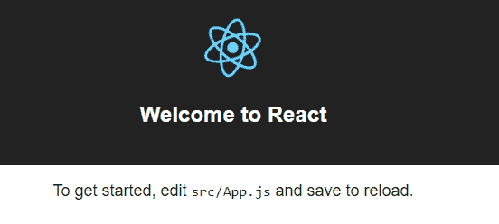
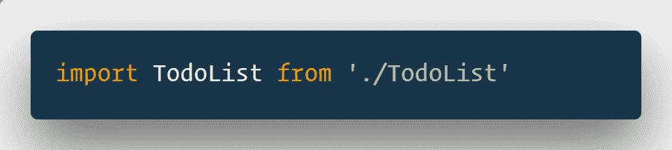
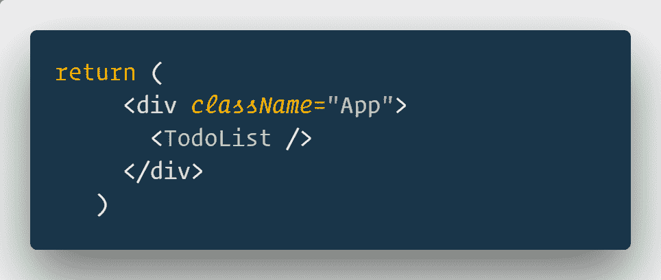
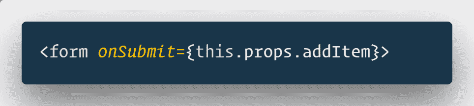
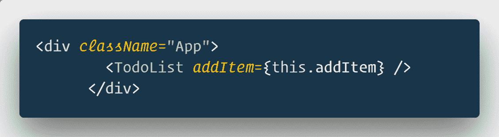
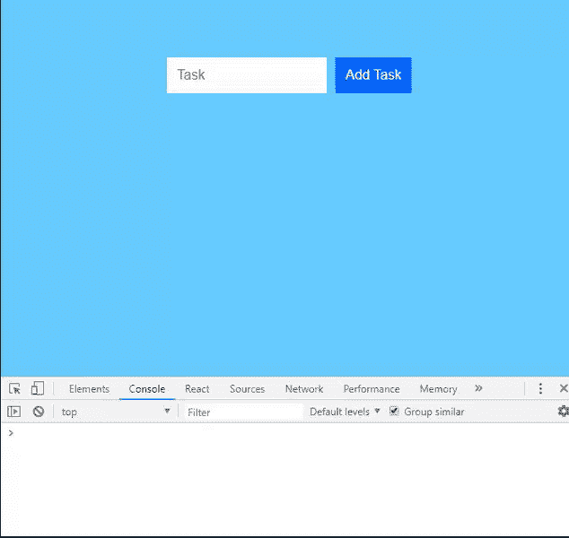
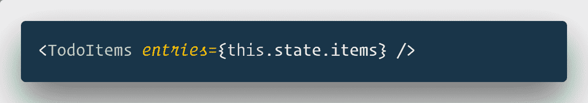

# 在 React 中创建一个简单的 ToDo 应用程序

> 原文：<https://medium.com/hackernoon/create-a-simple-todo-app-in-react-9bd29054566b>

[](https://www.educative.io/collection/5661736652767232/5629499534213120?affiliate_id=5312887308419072) [## 学习纯 React——深入了解 React.js 基础知识的互动课程

### 欢迎学习纯 React。我将孤立地教你 React 的核心概念，没有 Redux，Webpack…

www.educative.io](https://www.educative.io/collection/5661736652767232/5629499534213120?affiliate_id=5312887308419072) [](https://www.educative.io/collection/10370001/5637225408626688?affiliate_id=5312887308419072) [## 学习 React 之前的 JavaScript 基础知识

### 在广泛教授 React，000 多名学生)之后，无论是面向更多受众的在线课程还是面向公司的现场课程…

www.educative.io](https://www.educative.io/collection/10370001/5637225408626688?affiliate_id=5312887308419072) 

在本教程中，我们将使用 React 创建一个 ToDo 应用程序。它对初学者很友好，所以如果你所做的所有反应都是“你好，世界”，那也没关系。可以在这里自己体验一下 app。它也嵌入在这篇文章的结尾。

# 跟进工具

*   NodeJS 和 npm:从这里安装，如果你还没有
*   用`npm install create-react-app --global`安装 create-react 应用程序

现在，我们可以走了。

# 创建新的 react 应用程序

新的 react 应用程序是用

```
create-react-app react-todo
```

它将创建一个包含一些文件和文件夹的新文件夹`react-todo`。

## react-todo 中的文件和文件夹

`package.json`包含应用程序使用的模块列表。每个模块执行一个功能或一组功能。
`node_modules`存储 package.json 中列出的所有包。
`src`包含所有 React 源代码文件。
`public`包含样式表和图片等静态文件。

使用`npm start`运行此应用程序

```
cd react-todonpm start
```

**你会看到一个欢迎页面……**



如说明所说，修改 App.js 进行修改。`App.js`从`index.js`文件渲染而来。将`App.js`视为所有其他组件的容器。

体验下面的 ToDo 应用程序。在输入框中输入任务，点击添加按钮添加到列表中。要从列表中删除，请单击要删除的待办事项。

转到`src`中的`App.js`文件。从返回中删除除父 div 之外的所有内容。它看起来像下面

```
import React, { Component } from 'react'
import './App.css'
class App extends Component {
  render() {
    return (
      <div className="App">

      </div>
    )
  }
}
export default App
```

在这个 return 语句中，所有组件都将放在 div 中。

# 创建用户界面

待办事项列表是你在上面经历过的表格和下面的显示。

我们在 src 目录下的 TodoList.js 文件中创建组件`TodoList`。

我们导入这是 App.js，这样我们就可以把它放在我们所说的 div 中。



此外，将 TodoList 放在 return 语句的 div 中。



托德利斯有什么？

```
import React, { Component } from 'react'
class TodoList extends Component {
  render() {
    return (
      <div className="todoListMain">
        <div className="header">
          <form>
            <input placeholder="Task" />
            <button type="submit"> Add Task </button>
          </form>
        </div>
      </div>
    )
  }
}

export default TodoList
```

您可能会发现一些多余的 div，不要担心，我们一会儿就会填充它们。

该组件创建表单。

看起来是这样的…


因为 CSS，你的输出不会和我的一样。我偷偷把 CSS 加到了`index.css`文件里。这是基本的东西，我们不会在这之后讨论样式表。如果你想让你的应用程序像例子中那样，从这里[获取 index . CSS](https://github.com/therj/react-todo/blob/master/src/index.css)…

如果您尝试在此应用程序中添加待办事项，它只会重新加载页面。这是因为表单的默认行为是提交到同一个页面。

# 赋予 React Todo 应用生命

我们已经有了一个毫无生气的 todo 应用程序，它除了显示自己什么也不做。

我们要做的是:

*   添加项目
*   显示项目
*   移除项目

# 添加项目

当提交表单时，输入项被提交。要处理此操作，请在 TodoList 中添加 onSubmit to form 标记。



这个`addItem`应该在 App 组件处理。它作为一个道具传递给其他组件。



这必须存在于应用程序中才能通过。在`App`中创建一个`addItem`属性。

我们可以将它声明为一个旧的类似 JavaScript (ES5)的函数，但是它不会将表单与它绑定在一起。我们必须通过构造函数手动绑定它。我会用 ES6 之类的语法把它去掉。

我们仍然需要状态来保存项目数组。状态使得在页面上呈现和元素变得容易。当数据状态改变时，所有使用数据的组件将自动改变。

我们还需要另一个名为`currentItem`的状态来保存内存中的当前值。它是一个对象，除了文本，它还有一个键。React 在内部使用这个键，只在有多个相似组件时才呈现组件。如果没有键，则无法呈现待办事项列表，因为将会有所有的`li`。

向`App`添加构造函数。同样加上`addItem`和`handleInput`。

addItem 管理列表的添加，handleInput 管理输入字段的更改。

这是我的 App.js 的样子…

```
import React, { Component } from 'react'
import './App.css'
import TodoList from './TodoList'

class App extends Component {
  constructor() {
    super()
    this.sate = {
      items: [],
      currentItem: {text:'', key:''},
    }
  }
  handleInput = e => {
    console.log('Hello Input')
  }
  addItem = () => {
    console.log('Hello Add Item')
  }
  render() {
    return (
      <div className="App">
        <TodoList addItem={this.addItem} />
      </div>
    )
  }
}

export default App
```

要获得输入元素，我们必须有一种方法来引用它。您可能会对使用 querySelector 感到兴奋，但是 React 不喜欢这样。虽然它完全有效，但虚拟 DOM 的思想不是直接与 DOM 交互，而是与 DOM 中的组件交互。

为了引用输入，我们用`inputElement =React.createRef()`创建了一个`ref`。像`addItem`一样把这个传给`TodoList`

`inputElement = {this.inputElement}`

将其用作`TodoList`中的`ref = {this.props.inputElement}`。



如果你现在尝试这个应用程序，你可以看到它记录了来自 addItem 的消息，然后重新加载。重新加载是表单提交的默认行为。

若要停止此行为，请将 addItem 修改为以下内容。

```
addItem = e => {
    e.preventDefault()
    console.log('Hello World')
  }
```

`preventDefault`将防止提交表单时重新加载。

这是我们传递给 TodoList 的所有数据…

```
 <TodoList
          addItem={this.addItem}
          inputElement={this.inputElement}
          handleInput={this.handleInput}
          currentItem={this.state.currentItem}
        />
```

`addItem`要处理点击添加。

`inputElement`泛指这种元素。

`handleInput`处理输入字段上的数据变化

`currentItem`显示状态设置为 currentItem 的值。

下面是我的 TodoList.js 的样子…

```
import React, { Component } from 'react'

class TodoList extends Component {
  componentDidUpdate() {
    this.props.inputElement.current.focus()
  }
  render() {
    return (
      <div className="todoListMain">
        <div className="header">
          <form onSubmit={this.props.addItem}>
            <input
              placeholder="Task"
              ref={this.props.inputElement}
              value={this.props.currentItem.text}
              onChange={this.props.handleInput}
            />
            <button type="submit"> Add Task </button>
          </form>
        </div>
      </div>
    )
  }
}

export default TodoList
```

一会儿我们会谈到 eh**component did update**…

`form`提交调用时`addItem`

`ref`指当前元素。

`value`作为文本存储在`currentElement`对象中。

如果组件中没有`onChange`，该字段将是只读的。我们不想这样。

`onChange`调用 handleInput，这是接下来要讨论的。

```
handleInput = e => {
    const itemText = e.target.value
    const currentItem = { text: itemText, key: Date.now() }
    this.setState({
      currentItem,
    })
  }
```

handleInput 获取事件，它从输入框获取值，并将状态设置为和对象`currentItem`。它将 key 作为当前数据，将 text 作为输入数据。关键字是 Date.now()，它是从 1970 年到现在的毫秒数。每毫秒最多只能接受 1 次输入。这对我们的案子来说足够了。

我们需要这个对象，因为当用户提交表单时，我们需要将这个值存储到数组`items`中。

```
addItem = e => {
    e.preventDefault()
    const newItem = this.state.currentItem
    if (newItem.text !== '') {
      console.log(newItem)
      const items = [...this.state.items, newItem]
      this.setState({
        items: items,
        currentItem: { text: '', key: '' },
      })
    }
  }
```

`addItem`防止默认重新加载。它从状态`currentItem`获取输入框中的值。

因为我们不想在 todo 中添加空值，所以我们检查。如果不为空，则析构 items 数组并添加`newItem`。

我们必须将这个项目设置为状态，我们称之为`this.setSate`。重置`currentItem`清除输入框也是有意义的。

**ComponentDidUpdate** 是 React 中的生命周期方法之一。[我们在这里已经全部谈过了](https://reactninja.io/2018/06/23/how-to-use-react-lifecycle-methods/)。ComponentDidUpdate 被调用来关注由`inputElement`引用所引用的输入框。提交表单时会更新组件。`this.props.inputElement.current.focus()`在输入区域设置焦点，这样我们可以继续输入待办事项列表中的下一项。

# 显示待办事项

我们已经有了所有的 todos 状态，我们需要的是另一个组件，可以在屏幕上呈现这些。

我们将这个组件称为`TodoItems`，并将所有项目作为道具传递。



下面是`TodoItems`的样子…

```
import React, { Component } from 'react'

class TodoItems extends Component {
  createTasks(item) {
    return <li key={item.key}>{item.text}</li>
  }
  render() {
    const todoEntries = this.props.entries
    const listItems = todoEntries.map(this.createTasks)

    return <ul className="theList">{listItems}</ul>
  }
}

export default TodoItems
```

函数 createTasks 为每个传递的项目返回 li。它使用我们之前提供的密钥。在这个阶段，它不能与 key 一起工作，因为 React 必须能够区分多个项目，以重新渲染适当的项目。

使用映射功能将所有这些列表项保存到`listItems`。这用于 return 语句中的`ul`。

# 正在删除待办事项

我们已经添加了待办事项，我们可能想要删除一些。

我们已经在`TodoItems.js`中显示了 todos，我们做了一个小的修改。只需添加一个 onClick 侦听器来删除带有键的 Item。

```
createTasks = item => {
    return (
      <li key={item.key} onClick={() => this.props.deleteItem(item.key)}>
        {item.text}
      </li>
    )
  }
```

这将执行 deleteItem，并将键作为参数。道具要从`App`传过来。
`<TodoItems entries={this.state.items}deleteItem={this.deleteItem}/>`
在 App.js 中新建一个属性为`deleteItem`。

```
deleteItem = key => {
    const filteredItems = this.state.items.filter(item => {
      return item.key !== key
    })
    this.setState({
      items: filteredItems,
    })
  }
```

它从`items`状态过滤接收到的密钥。然后将项目设置为已过滤的项目。

*最初发表于* [**反应过来的忍者**](https://reactninja.io/2018/06/20/set-up-react-project-scratch/) *。*

# 特色 React JS 课程

## [React 16 —完整指南(包括 React 路由器 4 & Redux)](http://flyy.link/react-16-udemy)

4.7/5 星 **||** 33.5 小时视频**| |**61597 名学生

学习反应或深入研究。学习理论，解决作业，在演示项目中实践，并构建一个在整个课程中不断改进的大型应用程序:汉堡生成器！ [**了解更多。**](http://flyy.link/react-16-udemy)

[](http://flyy.link/react-16-udemy) [## React 16 -完整指南(包括 React 路由器 4 和 Redux)

### 投身其中，从头开始学习 React！了解 Reactjs、Redux、React Routing、动画、Next.js 基础知识以及更多内容！

flyy.link](http://flyy.link/react-16-udemy) 

## [现代反应与还原](http://flyy.link/modern-react-and-redux-on-udemy-32341)

4.6/5 星 **||** 26 小时视频 **||** 111，998 名学生|| 33，630 个评分在您使用 React 路由器、Webpack 和 ES6 [**开发应用程序时掌握 React v16.3.2 和 Redux 的基础知识了解更多**](http://flyy.link/modern-react-and-redux-on-udemy-32341) **。**

[](http://flyy.link/modern-react-and-redux-on-udemy-32341)

## 结束语:

我在 [**React Ninja**](http://reactninja.io/) 上发表 React、React Native 以及其他一切与 web 开发相关的文章。一定要在 [**推特**](https://twitter.com/reactninjaio) 上关注我。

加入我们的 [**简讯**](https://reactninja.io/subscribe-our-newsletter/) 获取最新最棒的内容，让你成为更好的开发者。

> *w* 蚂蚁雇佣我为你的博客写稿查看我的 [**Fiverr**](https://www.fiverr.com/krissanawat/write-programming-blogs-or-articles) 页面

## 如果这篇文章有帮助，请点击拍手👏按钮下面几下，以示支持！⬇⬇