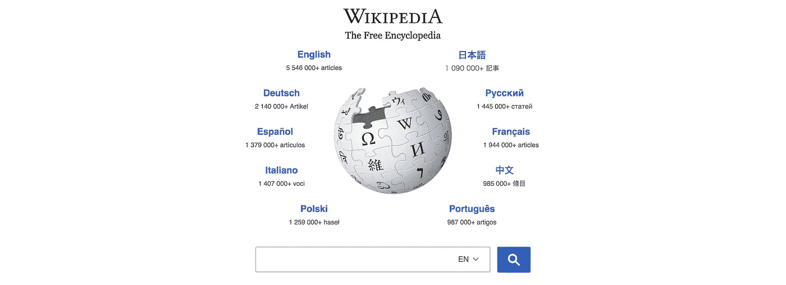
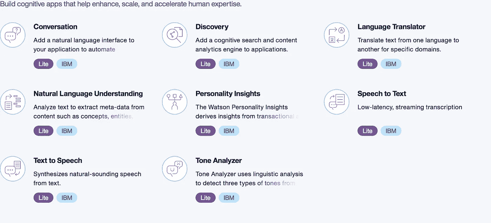
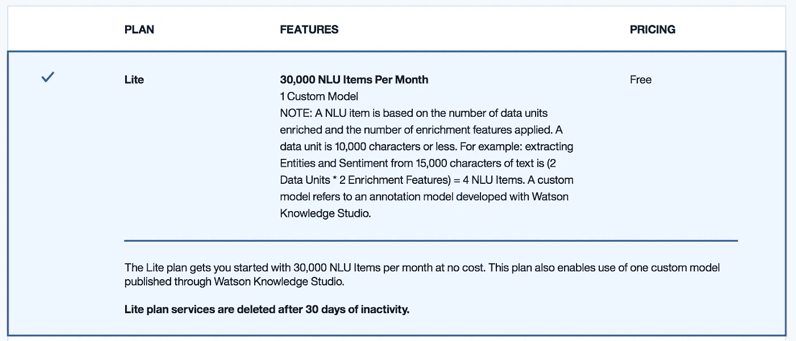
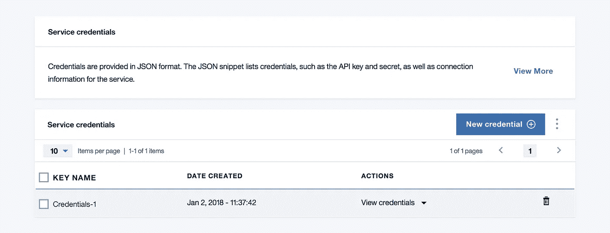
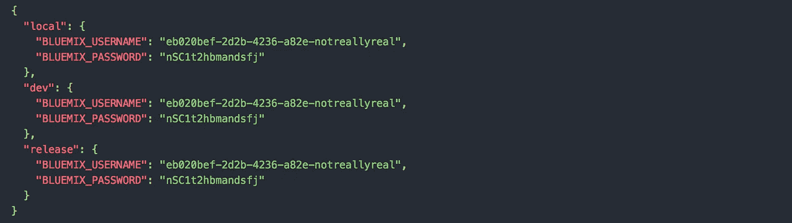

# 用 StdLib 和 IBM Watson 用 4 个步骤创建一个维基百科偏见跟踪器

> 原文：<https://medium.com/hackernoon/create-a-wikipedia-bias-tracker-in-4-steps-with-stdlib-and-ibm-watson-4088f2eb01be>



当试图快速获得某个主题的信息时，维基百科是一个无价的资源。对于更严格的研究，它可以提供一个起点，并通过文章附带的参考资料找到更多的来源。由于维基百科是一个开放平台，订阅[五大行为支柱](https://en.wikipedia.org/wiki/Wikipedia:Five_pillars)以防止滥用。其中之一是文章必须以“中立的观点”来写。从中立角度写作的一个重要部分是使用[公正的语气](https://en.wikipedia.org/wiki/Wikipedia:Neutral_point_of_view#Impartial_tone):

> 即使一个话题是根据事实而不是观点提出的，不恰当的语气也可能通过选择、提出或组织事实的方式引入。中性文章以一种不偏不倚、准确、均衡地表达文章中所有观点的语气撰写。

问题是，维基百科在多大程度上保持了这种中立的观点，尤其是不偏不倚的语气。使用 [IBM](https://hackernoon.com/tagged/ibm) 沃森的[自然语言理解 API](https://watson-api-explorer.mybluemix.net/apis/natural-language-understanding-v1) 我们可以尝试检验这个问题。API 让你在文本中寻找情感和情绪。在理想世界中，中性文本的情感和情绪应该接近于零。为了检查这一点，你可以使用 IBM Watson 的 API 和 [Wikimedia 的 API](https://wikimedia.org/api/rest_v1/#) ，用 [StdLib](https://stdlib.com) 粘在一起。

如果你以前没有听说过 StdLib，我们是构建后端 web 服务和实现真正商业价值的最快方式。构建在“无服务器”架构上，您永远不必担心管理服务器或为扩展分配资源。编写一个函数，部署，你就可以开始了！我们还有一个由其他开发者贡献的易于使用的[集成](http://www.stdlib.com/sourcecode)生态系统。

## 第一步:注册 StdLib


开始使用 StdLib 很简单——到我们的[网站](https://stdlib.com)，选择选择一个用户名，点击“声明名称空间”。稍后，您将了解如何获取我们的 [CLI](https://github.com/stdlib/lib) 并部署服务。但是首先，您需要为这个应用程序设置数据库。

## 第二步:设置沃森

点击[这里](https://console.bluemix.net/registration/)开始创建 Bluemix 账户。确认您的电子邮件后，您可以进入[沃森页面](https://console-regional.ng.bluemix.net/dashboard/watson)。点击“创建沃森服务”,你会看到一些选项。



选择“自然语言理解”。所有默认选项都可以，只要确保选择了‘Lite’(免费)计划！



点击“创建”并进入新页面后，您会在左上角看到一个名为“服务凭据”的选项卡。单击“新凭据”,会出现一个下拉列表，您可以在其中找到您服务的用户名和密码。记下这些，你很快就会用到。



## 步骤 3:设置 Wikimedia API

维基媒体和维基百科的 API 不需要任何认证。然而，使用起来可能会有点混乱。因此，为了方便起见，我发布了一个 StdLib 服务，它包装了一些常见的操作。例如，如果您想要给定月份和年份的前 1000 篇最受关注的文章，您可以使用 [lib npm 包](http://github.com/stdlib/lib)调用:

或者，如果你想知道去年被编辑次数最多的 100 篇文章:

这两个端点都返回文章的 URL，这与您将要创建的服务配合得很好。

## 第四步:把所有东西放在一起

您将使用 StdLib 来编写 Watson 和 Wikimedia APIs。为了使用 StdLib，你需要获得命令行[工具](https://hackernoon.com/tagged/tools)，可以从 GitHub 上的[这里](https://github.com/stdlib/lib)获得。首先，如果你没有安装 Node.js，你可以下载最新版本，还有 npm，这里是。现在安装了 Node，您可以通过打开终端并运行以下命令来获得 StdLib CLI:

```
$ npm install lib.cli -g
```

现在创建一个工作区，并使用以下命令导航到该工作区:

```
$ mkdir stdlib-workspace
$ cd stdlib-workspace
$ lib init
```

接下来，通过运行以下命令获取沃斯顿列表的代码:

```
$ lib create -s @steve/watson
```

您将被提示给新服务命名，本教程的其余部分假设它仍然是`watson`。现在，您可以通过以下方式导航到新服务:

```
$ cd <username>/watson
```

现在您可以打开在根目录中找到的`env.json`文件。有两个字段。将创建 IBM 帐户时的用户名和密码复制并粘贴到各自的位置。



现在只需运行:

```
$ lib up dev
```

有了这个命令，您 Watson API 就生活在一个可变的开发环境中。它只公开了一个接受 URL 数组的端点`__main__`。对于每个 url，它从该页面收集情绪和情感数据，并对所有文本的结果进行平均。Watson 会对页面进行一些清理，所以你不用担心广告之类的问题。如果您想从命令行尝试该服务，您可以输入:

```
$ lib <username>.watson '["[https://en.wikipedia.org/wiki/IBM"]'](https://en.wikipedia.org/wiki/Wikipedia:Five_pillars)
```

它将只返回关于 IBM 的维基百科文章的结果。这项服务适用于任何有文字的网页，所以你可以尝试你最喜欢(或最不喜欢)的新闻来源。

设置好这个端点后，您可以执行一些简单的分析。只需打开一个文本文件，输入下面的代码。它使用维基百科包装器获得 2017 年 12 月观看次数最多的文章，然后将其输入沃森 API。

使用`$ node example.js` 运行这个脚本，应该会得到如下结果:

```
{ sentiment: -0.037099235591900016,
  emotions: 
   { sadness: 0.21031268868868871,
     joy: 0.45655976376376384,
     fear: 0.07352899499499507,
     disgust: 0.0967122352352352,
     anger: 0.07937950750750744 } 
}
```

情绪类别的范围为(-1，1)，较低表示负面情绪，较高表示正面情绪。情绪在(0，1)的范围内，数字越大意味着情绪越多。理想情况下，对于一篇没有偏见的文章，所有的数字都应该接近 0。对于 2017 年 12 月观看次数最多的前 1000 篇文章来说，这似乎是真的，baring joy 得分相对较高。现在，如果你想查看编辑最多的(因此也是最有争议的)文章，你可以使用:

它返回:

```
{ sentiment: -0.48160470200000033,
  emotions: 
   { sadness: 0.39764493939393936,
     joy: 0.1554383434343435,
     fear: 0.13799211111111104,
     disgust: 0.08601269696969707,
     anger: 0.2993595656565651 } 
}
```

这些数字差别很大。总的来说，他们更加消极，愤怒和悲伤更加突出。考虑到频繁编辑的文章可能是有争议的话题，这是有意义的。

## 谢谢你

就这些了，感谢阅读！希望您能够学习一点关于用 StdLib 编写 API 的知识。如果你有好的想法想要分享，请直接通过电子邮件联系我:【steven@stdlib.com】T2，或者在 Twitter 上关注[我](https://twitter.com/notoriaga)和 [StdLib](https://twitter.com/stdlibhq) 团队。

一如既往，我们期待您和快乐大厦的回音！

Steve Meyer 是 Oberlin 学院的应届毕业生，也是 StdLib *的软件工程师。当他不编程的时候，你会发现他在烹饪、烘焙或者玩《野性的呼吸》。*