# 使用标准库在 5 分钟内创建一个 Alexa 无线电技能—更新

> 原文：<https://medium.com/hackernoon/create-an-alexa-radio-skill-in-5-minutes-with-standard-library-and-nodejs-93dc32b08c42>

> 本教程已于 2019 年 9 月 6 日更新。如果你以前做过这个教程，**你需要再做一次**。最大的变化是现在你得到了一个**响应网页**来**添加频道和电台**。

使用您最喜欢的流媒体电台或有声读物创建**您自己的 Alexa 广播技能**。一旦部署完毕，你可以说“ **Alexa，打开无线电”**然后 Alexa 就会开始流式传输你的定制电台。

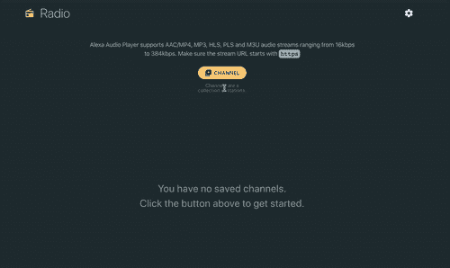

添加和删除你的站点是一件轻而易举的事情，你的 API 会自动提供一个**响应网页**。轻松添加**频道**，这是*电台*的集合。如果你添加有声读物，频道名称将是*权力的游戏*，每个电台将是*个人书籍*。

你可以通过名字 向 Alexa 要一个*频道或者一个* ***。如果你说“Alexa，请电台播放蓝调”，该技能将首先搜索该名称的频道，然后是电台。如果找到一个频道，则播放该频道中的随机电台。如果是有声读物，它会从你上次停止的地方继续播放。***

你也可以**使用网页定制当你去下一站或遇到错误时 Alexa 会说什么**。

# 特征表

*   一个**响应网页**，用于添加和删除您的频道和电台。
*   Alexa **的回应可以使用网页定制**。改变技能所说的现在玩，下一个等等。您可以根据需要经常更换它们。
*   支持**有声读物**。如果流式链接是 MP3 文件，则保存进度。如果您的频道包含多个 MP3 文件，**技能将自动排队等待下一个文件。**
*   Alexa 交互模型更新为使用**自定义槽**并启用模糊搜索。如果你的频道叫`The Hitchhiker’s Guide to the Galaxy`，你可以说 Alexa，要求电台播放`guide to the galaxy`
*   你可以在网页上看到各站的**状态，如`unplayed`、`streamable`和`failed`**

## 查看现场演示— [Alexa Radio](https://balsimpson.github.io/alexa-radio/)

# 使用

多亏了[标准库](https://stdlib.com/)，部署它变得异常容易。它包括**两个步骤，**大量的按钮点击和一些复制面食。

# 第一步

第一步是将您的代码部署到[标准库](https://stdlib.com/)。**右击下面的**按钮，打开链接，进行部署。

[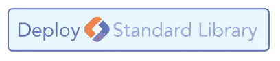](https://build.stdlib.com/from-github/?repo=balsimpson/alexa-radio)

Click on the button to deploy to Standard Library

在新页面上，点击**生成身份**按钮。一旦完成，点击它下面的**部署项目**按钮来部署代码。

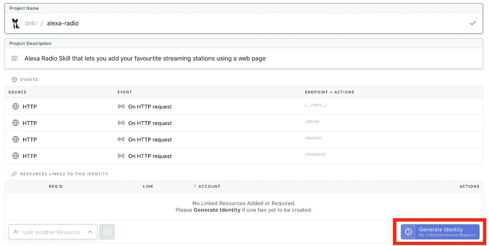

Click on Generate Identity and then Deploy

代码部署后，您将被带到您的项目页面。在这里您可以**更改您的项目名称**并添加您自己的描述。

现在点击 **dev** 按钮来查看您的项目的所有**端点。**

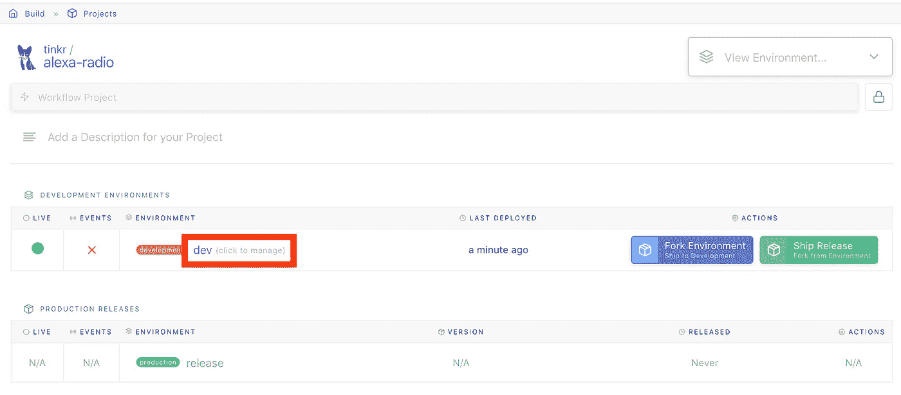

Click on dev to see the details of your deployment

**记下第二个网址**。下一步你会用到它。如果你很好奇，点击第一个链接，你可以看到添加和删除自定义电台的网页。

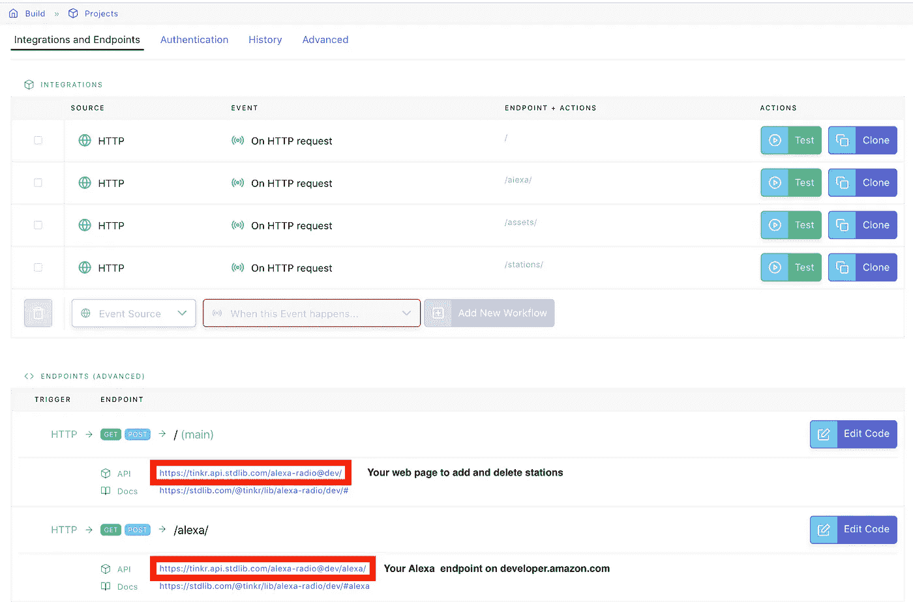

The first URL will take you to the web page. The second URL is the Alexa Endpoint

# 第二步

去 developer.amazon.com[的](https://developer.amazon.com)到**创造一个新的 Alexa 技能**。如果你还没有注册亚马逊开发者账户，现在就注册吧。一旦登录，你应该会看到**创造技能**按钮。

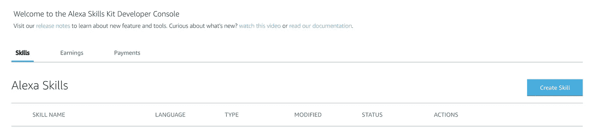

Create a skill

给你的技能起一个名字，比如 *radio* 并选择你的默认语言。选择**自定义**模型添加到你的技能中，点击**创建技能**。

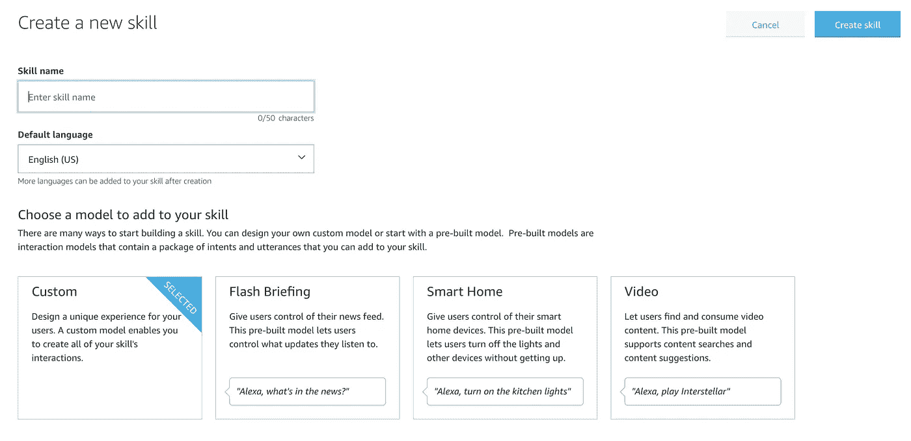

Choose custom model

在下一个屏幕上，选择**从头开始**。

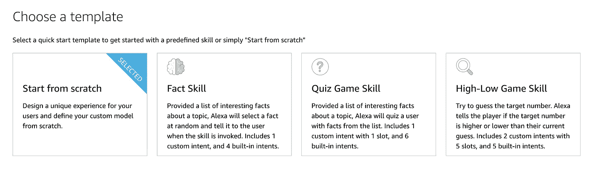

Choose Start from scratch

一旦你创建了 Alexa 技能，点击左下角的 **JSON 编辑器**。删除里面的所有内容。

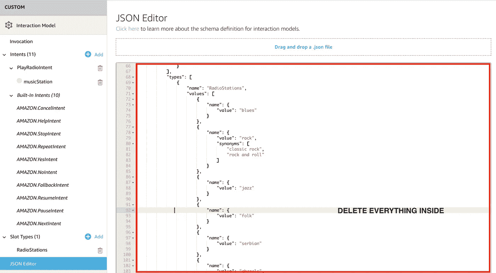

Replace the entire contents with the contents from the AlexaInteractionModel.json on the GitHub repo

右键单击并打开 [Github](https://github.com/balsimpson/alexa-radio) repo 上的`AlexaInteractionModel.json`文件。复制文件内容。

回到 Alexa 开发者门户，粘贴到 JSON 编辑器中。点击**保存模型**，保存模型。

> *将*调用名*设置为* **单选** *。要更改名称，只需更改 JSON 文件顶部的 invocationName 值。*

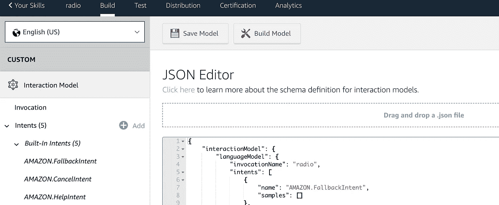

Change the invocationName value to change invocation name

我们差不多完成了。点击**端点**链接我们的标准库部署代码到 Alexa 技能。输入您之前提到的**标准库 API URL** 。

您的端点应该看起来像`https://[username].api.stdlib.com/alexa-radio@dev/alexa`。确保您从下拉菜单中选择了**我的开发端点是一个域的子域**选项。

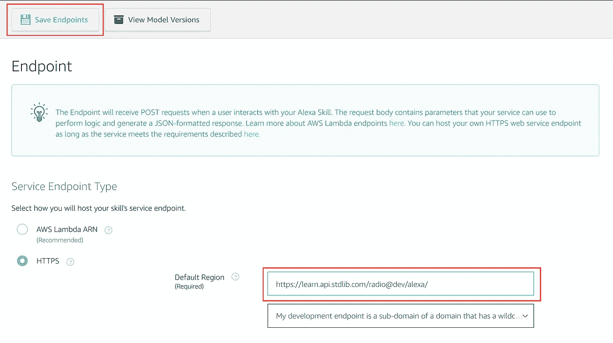

Enter your Standard Library URL and choose My development endpoint is a sub-domain option. Save endpoint.

接下来，点击**接口**，打开 ***音频播放器*** 接口。如果不启用这个技能，它将不起作用。

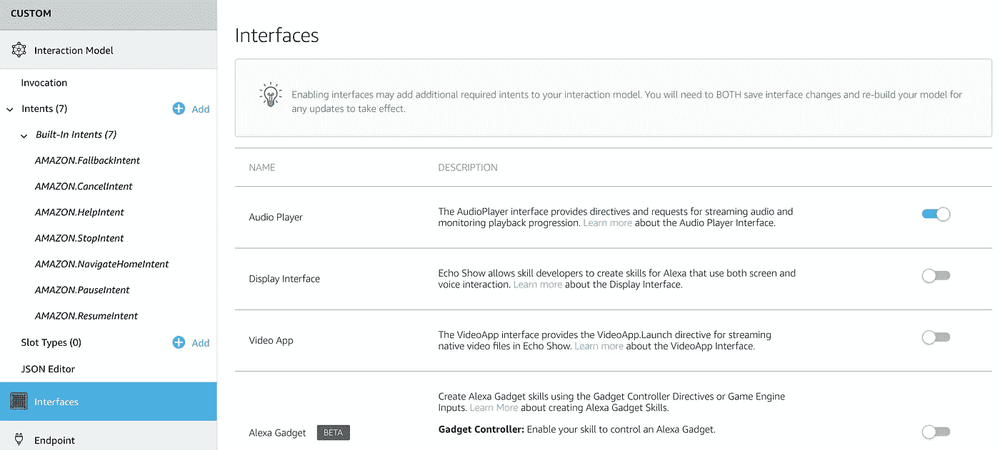

Enable Audio Player Interface

这就是你需要做的所有设置。在 Alexa 开发门户中，点击**构建模型**。这可能需要几分钟时间。

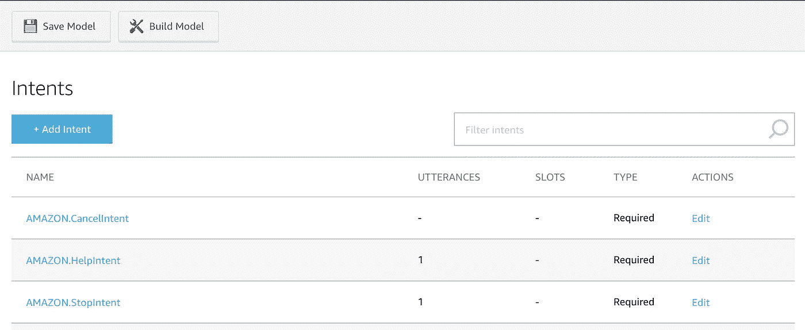

Click on Build Model

一旦弹出消息说**构建成功**，点击 Alexa 开发者控制台上**构建**旁边的**测试**标签。**打开测试**，键入*打开电台*。你应该会得到一个回复，要求你**去网页**添加你的电台。

如果你在控制台上得到回复，这意味着该技能在你的 Alexa 设备上也是活跃的。向你的设备问同样的问题，你会得到同样的回答。

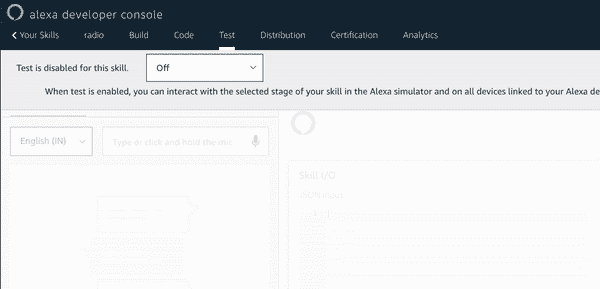

Turn on Development and open radio. If you get a reply, you skill is enabled on your Alexa devices too

现在**让我们添加一些带电台的频道**。转到您的主标准库 URL，这是下面提到的第一个 URL 。

Go to the first URL to add and delete stations

# 添加您的电台

点击上面的链接会打开一个网页，你可以**添加频道和电台**，以及定制 Alexa 的响应。

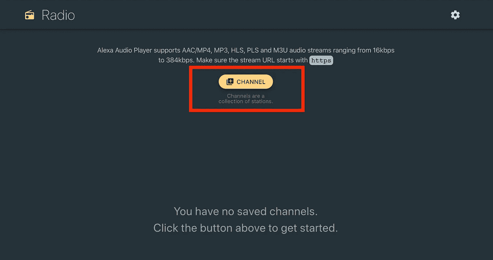

Click on channel button to add a new channel

先加个频道吧。**频道类似于播放列表**，基于情绪或流派。在有声读物的情况下，它将是图书系列的名称。点击**通道**按钮添加一个新通道。

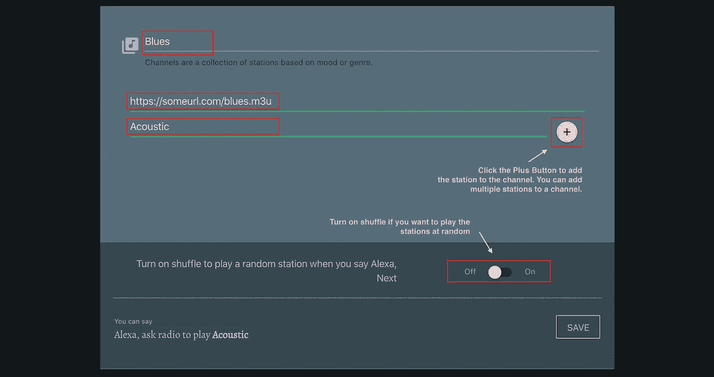

You can add multiple stations to your channel

这将打开一个模式，您可以在其中添加频道的详细信息。您可以在此**添加多个站点**。需要注意一些事情:

*   电台网址必须以`https`开头
*   如果您正在添加 MP3 文件作为有声读物的一部分，请确保关闭**随机播放**
*   去 shoutcast.com 的[找你喜欢的电台。使用**任意播放器(. m3u)** 链接。如果需要，为 URL 添加一个`s`，这样它就是一个`https`链接](https://directory.shoutcast.com)

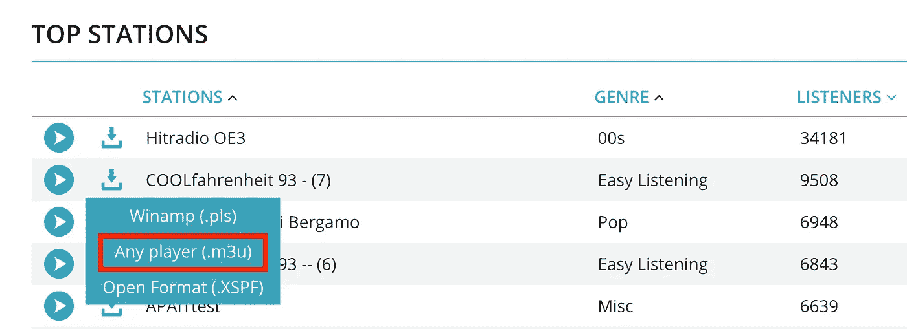

Add an ‘s’ so that the URL starts with https://

*   试试[archive.org](https://archive.org)一些你可以添加的很棒的**有声读物**。使用 MP3 直接下载链接作为电台 URL

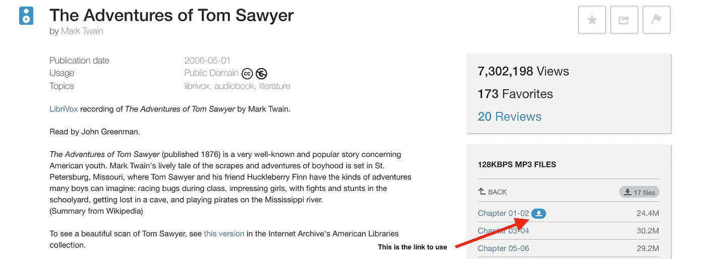

添加频道后，点击**保存**按钮。如果你愿意，你当然可以增加更多的频道。

您还可以通过点击**重命名**任何频道、电台或**编辑 URL** 。

# 定制 Alexa 响应

你可以通过点击主页右上角的**齿轮图标**来定制 Alexa 响应。您可以在这里添加或删除回答。

> *如果你愿意，可以使用 SSML，让它更有个性。*

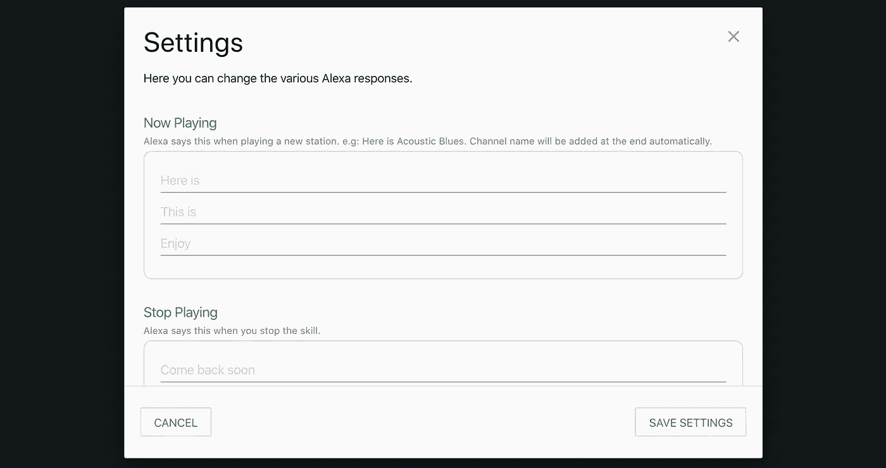

**注意事项**

*   所有的流媒体网址都应该是`https`。
*   如果`URL`无法发挥，你的技能会说`stream failed to play`。网页上的频道状态将更新为显示`failed`。如果播放成功，状态会显示`streamable`
*   Alexa 开发者门户**上的测试模拟器不播放**任何音频。
*   任何知道你的站点 URL 的人都可以改变你的库内容。
*   该技能不需要发布供您使用。

如果你在任何地方卡住了，或者你有任何反馈，[给我写](mailto:tinkr.simpson@gmail.com)。*你可以在这里* *找到代码库* [*。*](https://github.com/balsimpson/alexa-radio)