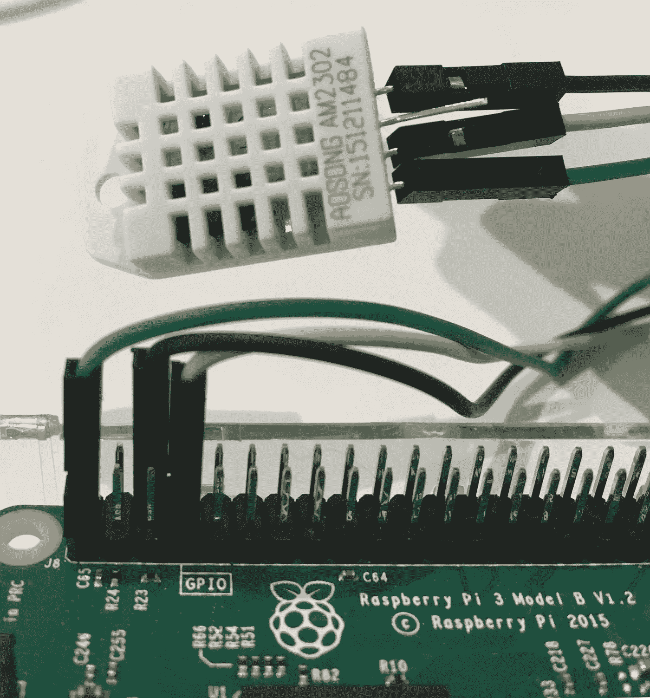

# 通过 5 个简单的步骤创建一个物联网 Twitter 机器人

> 原文：<https://medium.com/hackernoon/create-an-iot-twitter-bot-in-5-easy-steps-96988b814fee>

在本教程中，我们将向您展示如何使用 [PubNub 函数](https://www.pubnub.com/products/functions/?utm_source=Syndication&utm_medium=Medium&utm_campaign=SYN-CY18-Q2-Medium-July-11)通过五个简单的步骤创建一个简单的物联网 Twitter 机器人。然而，在我们这样做之前，让我们解释一下什么是物联网 Twitter bot，以及为什么有人会想要使用它。

# 什么是物联网 Twitter 机器人？

一个**推特机器人**本质上是一个通过推特 API 控制推特账户的软件。这可以执行诸如发微博、点赞、转发等操作。

在 PubNub，我们创建了一个 [Twitter 模块](https://www.pubnub.com/docs/blocks-catalog/twitter?utm_source=Syndication&utm_medium=Medium&utm_campaign=SYN-CY18-Q2-Medium-July-11)，它可以在 PubNub 函数中自动为你创建一个 Twitter 机器人。这意味着你所要做的就是将 PubNub SDK 包含到你的代码中，然后启动你的函数，向你的任何 Twitter 账户发布你想要的任何内容。

一些常见的 Twitter 机器人例子各不相同，从简单的发布天气或商店新交易的机器人，到人工与真实用户互动的机器人。

# 它们为什么有用？

你所需要的就是 PubNub SDK 来使用我们的 Twitter 块。这意味着您可以开始让您的物联网设备及其数据与社交媒体提供的独特全球化互动。通过这一点，我确实在暗示，通过 Twitter 全球化你的物联网数据与通过其他社交媒体是有区别的:这种区别在许多情况下是有利的。

# 物联网 Twitter Bot 示例用例

假设您为自己的拼车业务安装了一台物联网设备，每 10 分钟发布一次地理位置。现在，你的每一个客户只需关注你的 Twitter 账户，就可以监控你的车队的流量和可用性。这减少了分发数据时的摩擦，因为您的客户端只需按一个 follow 按钮，而无需安装前端应用程序。

此外，Twitter 是一项已经拥有许多活跃用户的服务，因此在那里分发你的数据比将人们转发到你的定制前端要容易得多。这两个因素最大限度地扩大了数据的受众，并简化了消化过程。

# 让我们开始编码吧！

下面是一个教程，解释了如何通过五个步骤用 Twitter Bot 连接温度/湿度传感器(或任何物联网传感器)和 Raspberry Pi。

这里是这个[项目的 GitHub 链接，作为教学参考。](https://github.com/Cakhavan/PubNub-Tweather)

# 你需要什么

*   [树莓派 3](https://www.adafruit.com/product/3775?gclid=EAIaIQobChMI7cPe_br02wIVCLbICh2KlwNQEAkYBiABEgI_7vD_BwE)
*   3 [母-母跳线](https://www.adafruit.com/product/1951?gclid=EAIaIQobChMIgNC16Lr02wIVSiSGCh1M4wC9EAQYAiABEgKNhPD_BwE)
*   [温湿度传感器](https://www.google.com/shopping/product/11256644188417662406?q=A0Song+Am2302&biw=1440&bih=826&prds=paur:ClkAsKraX-pK2DSJ2AEkYZ4QBdLXkt0WgYTXFnxoN92cYq21EhvWHLbDsahr2rsU6ncjVUkzSwFNECAhDNd4iGaH0cjjDB8UQpCBQSOkAHmUUv49FAankCKUARIZAFPVH71LKgKLnt2Ahhq_JYbszLZ5jId6ug&sa=X&ved=0ahUKEwil79yJtvTbAhUqqlkKHRGYD2sQ8wIIgQI)



# 步骤 1:配置您的传感器

要将传感器连接到 RPI，使用跳线:

*   将传感器的针脚 1 (Vd)连接到 RPI 的针脚 1
*   将传感器的针脚 2 (GND)连接到 RPI 的针脚 6
*   将传感器的针脚 4(数据输出)连接到 RPI 的 GPIO4 针脚 7

# 步骤 2:启用 SSH

下一步是在 RPI 上启用安全外壳(SSH ),它允许您从计算机远程连接到 RPI 的终端。虽然这不是一个必要的步骤，但是在 RPI 上启用 SSH 对于嵌入式系统编程来说是一个很好的实践，您将在第五步中看到原因。

要在 RPI 上启用 SSH，[按照简单快速的说明操作。](https://www.raspberrypi.org/documentation/remote-access/ssh/)

# 步骤 3:安装传感器的 RPI 库

对嵌入式设备和传感器编程的诀窍是不要。相反，谷歌特定设备的图书馆。对于这个演示，我谷歌了 AM2303 传感器的库，并找到了以下说明的网站[。](https://www.modmypi.com/blog/am2302-temphumidity-sensor)

在开始这一步之前，确保您的计算机上安装了 [GitHub](https://github.com/) 以及 [npm 包管理器](https://www.npmjs.com/get-npm)。打开您的终端并输入以下内容。

```
npm install git
```

在您的项目目录中，克隆并输入传感器的代码库。

```
git clone [https://github.com/adafruit/Adafruit_Python_DHT.git](https://github.com/adafruit/Adafruit_Python_DHT.git) 
cd Adafruit_Python_DHT
```

安装一些 Python 依赖项。

```
sudo apt-get upgrade 
sudo apt-get install build-essential python-dev
```

现在，安装传感器的库。

```
sudo python setup.py install
```

这将编译库的代码并将其安装在您的设备上，这样任何 Python 程序都可以访问 Adafruit_DHT python 模块。

如果您想快速测试传感器以查看传感器是否工作，请输入以下命令:

```
cd examples sudo ./AdafruitDHT.py 2302 4
```

您应该会看到类似如下的读数:


# 第四步:PubNub

这是魔法开始的地方！为了让你的传感器数据将数据发布到 Twitter 账户，你首先需要[在这里注册一个免费的 PubNub 账户。](https://dashboard.pubnub.com/signup?utm_source=Syndication&utm_medium=Medium&utm_campaign=SYN-CY18-Q2-Medium-July-11)

接下来，[跟随这个链接访问 Twitter 块](https://www.pubnub.com/docs/blocks-catalog/twitter?utm_source=Syndication&utm_medium=Medium&utm_campaign=SYN-CY18-Q2-Medium-July-11)，它允许你通过自己的 PubNub 函数访问 Twitter 的 REST API。

一旦你创建了你的函数，打开你的函数，你应该会看到这样的内容:


就像评论中描述的那样，你需要在“我的秘密”部分填写键值来连接这个功能和你的 Twitter 账户。

要获得密钥和值，[到这里创建一个 Twitter 应用](https://apps.twitter.com/)。

**注意:**要获得创建 Twitter 应用程序的帮助，[关注这篇文章。](https://www.pubnub.com/docs/blocks-catalog/twitter?utm_source=Syndication&utm_medium=Medium&utm_campaign=SYN-CY18-Q2-Medium-July-11)

在“我的秘密”标签中，像这样输入你的密钥，


## 注意:当你完成时，确保你按下了函数编辑器右上角的播放按钮

用您的传感器实现 PubNub 的最后一步是将 PubNub SDK 添加到您设备的代码中，以允许它使用 Twitter 块。

目前，我们在步骤 3 中使用的示例代码使用 bash 命令来获取传感器数据。为了保持快速和简单，我们将在项目的 examples 目录中创建一个新文件，并使用示例文件的基本组件为我们的 Twitter Bot 编写准系统代码。

在新文件中，通过将 PubNub 的 SDK 添加到代码顶部来包含它

```
import pubnub 
from pubnub.pnconfiguration import PNConfiguration 
from pubnub.pubnub import PubNub pnconfig = PNConfiguration() //your subscribe key
pnconfig.subscribe_key = "sub-c-a667485c-757f-11e8-9f59-fec9626a7085"//your publish key
pnconfig.publish_key = "pub-c-cb2e18e3-a8b0-486a-bf82-2d9e9f670b7e"pnconfig.ssl = False pubnub = PubNub(pnconfig) def publish_callback(result, status): 
     pass # Handle PNPublishResult and PNStatus
```

回头看看示例代码，我们可以看到，我们可以使用这些参数简单地设置 RPI 上的传感器引脚:

```
#22 represents the sensor we are using (Adafruit_DHT.DHT22) 
sensor = 22 
#4 represents the GPIO pin we are using on the RPI 
pin = 4
```

然后我们可以看到，我们需要包括这条线，以实际获取传感器读数。

```
humidity, temperature = Adafruit_DHT.read_retry(sensor, pin)
```

最后，我们可以将数据读数保存并格式化为一个“tweet”变量，然后将其发布到我们的 Twitter 块，以便发布到 Twitter。

```
#Format for publishing a tweet 
tweet = ('Temp={0:0.1f}* Humidity={1:0.1f}%'.format(temperature, humidity)) #publish to Twitter Block 
pubnub.publish().channel('twitterinput').message(tweet).async(publish_callback)
```

# 步骤 5:上传代码

现在您可以看到为什么我们在前面的步骤 2 中设置了 SSH。

首先，创建一个 GitHub 存储库来存放您的代码。然后在您的终端中输入这些命令，将代码推送到存储库。

```
git init 
git add . 
git commit -m "first commit" 
git remote add origin <your repository URL> 
git push -u origin master
```

然后 SSH 到您的 RPI buy 中，在终端中键入以下内容

```
ssh pi@<YOUR RPI IP ADDRESS>
```

你现在在 RPI 的终端。最后一步是在 RPI 上安装依赖项，并从存储库中提取代码

```
sudo apt-get install python 
sudo apt-get install git 
sudo apt-get upgrade 
sudo apt-get install build-essential python-dev 
git clone <YOUR REPOSITORY URL>
```

现在，无论何时您想要编辑您的代码或添加更新，您都可以将代码从您的机器推送到您的存储库，SSH 到您的 RPI，然后使用:

```
git pull
```

现在只需运行您的代码并检查您的 Twitter！


希望这个项目能够帮助你理解 PubNub 功能的强大和简单，尤其是在与物联网设备结合使用时。

如果您喜欢这篇文章或者对探索各种其他物联网项目感兴趣，请查看下面的这些文章！

*   [IoT 如何在没有 SDK 的情况下使用 PubNub 的 REST API 进行发布和订阅](https://www.pubnub.com/blog/iot-publish-and-subscribe-without-and-sdk-using-rest-api/?utm_source=Syndication&utm_medium=Medium&utm_campaign=SYN-CY18-Q2-Medium-July-11)
*   [物联网和区块链](https://www.pubnub.com/blog/implementing-pubnub-dapp-with-ethereum-blockchain/?utm_source=Syndication&utm_medium=Medium&utm_campaign=SYN-CY18-Q2-Medium-July-11)
*   [用 PubNub 函数搭建云服务器状态机](https://www.pubnub.com/blog/cloud-server-state-machine-pubnub-functions/?utm_source=Syndication&utm_medium=Medium&utm_campaign=SYN-CY18-Q2-Medium-July-11)

*最初发表于*[*www.pubnub.com。*](https://www.pubnub.com/blog/create-an-iot-twitter-bot-in-5-easy-steps/?utm_source=Syndication&utm_medium=Medium&utm_campaign=SYN-CY18-Q2-Medium-July-11?utm_source=Syndication&utm_medium=Medium&utm_campaign=SYN-CY18-Q2-Medium-July-11)