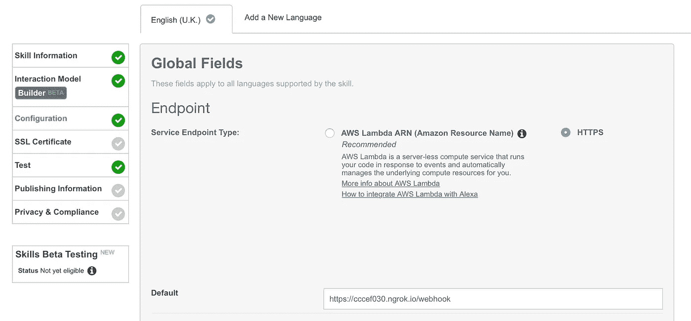

# 用 Jovo 创建跨平台的语音应用程序

> 原文：<https://medium.com/hackernoon/create-cross-platform-voice-applications-with-jovo-9b93f2fcd461>

[Jovo](https://www.jovo.tech/) 旨在创建一个开发框架，让你一次写完代码*，交付给*多个*语音平台(此时是 Alexa 和 Google Assistant)。同样，这就像语音生态系统正在走与应用程序开发相同的道路，试图找到维护多个代码库的方法。每个语音平台都有一些不可避免的步骤，但是您可以用 JavaScript 编写应用程序的核心逻辑。*

在这篇文章中，我创建了一个简单的应用程序，告诉用户我的站点上的最新文章是什么。

# 安装 Jovo

Jovo 是一个 NPM 模块，所以请安装:

```
npm install -g jovo-cli
```

此命令安装一个命令行实用程序，帮助您创建和管理项目，包括一个有用的项目创建命令:

然后，安装 Jovo 项目需要的其他依赖项:

```
cd <project_name>
npm install
```

你可以用`node index.js`或`jovo run`启动应用程序，但是，由于所有的语音平台都是通过网络连接的应用程序工作的，你需要通过 [ngrok](https://ngrok.com/) 等工具将你的应用程序暴露在网络上，并获取它生成的 URL 的安全版本。

# 把 Jovo 和 Alexa 联系起来

要让您的应用程序代码与 Alexa 一起工作，您需要采取两个初始步骤(但根据其复杂性还会有其他步骤)。

# 1.添加意图

意图告诉 Alexa 如何处理特定的默认和自定义动作，以及用户可以用来触发它们的自定义短语。如果您没有为默认操作指定任何内容，它将使用平台默认值。将以下内容添加到您技能的 [Alexa creator](https://developer.amazon.com/alexacreator) 的意图部分:

```
{
  "languageModel": {
    "intents": [
      {
        "name": "AMAZON.CancelIntent",
        "samples": []
      },
      {
        "name": "AMAZON.HelpIntent",
        "samples": []
      },
      {
        "name": "AMAZON.PauseIntent",
        "samples": []
      },
      {
        "name": "AMAZON.ResumeIntent",
        "samples": []
      },
      {
        "name": "AMAZON.StopIntent",
        "samples": []
      },
      {
        "name": "LatestPostIntent",
        "samples": [
          "latest post",
          "latest news",
          "latest article",
          "latest blog"
        ],
        "slots": []
      }
    ],
    "invocationName": "<your_invocation>"
  }
}
```

正如你在上面看到的，我只是改变了自定义的`LatestPostIntent`，并添加了一些可以触发该意图的替代“话语”。这种意图与应用程序代码直接相关，但我稍后将回到这一点。

# 2.添加 Webhook URL

在 ***配置*** 选项卡中，将 ***服务端点类型*** 更改为***【HTTPS】***并添加您上面公开的 URL，附加`/webhook`:



# 谷歌说明

# 1.添加意图

设置 Google Assistant 更复杂，默认情况下提供的功能更少。为了提高速度，在本文中，我推荐您通过 ***设置*** *>* ***导出和导入*** 选项导入我创建的意图。你可以在下面看到`LatestPostIntent`的细节，包括触发短语:


# 2.添加 Webhook URL

在 ***履行*** 标签中，启用 ***Webhook*** 并从上面添加您的公开网址，追加`/webhook`:


# 代码

多亏了 Jovo，这个应用程序的代码相当简单，只需要对文件底部的`index.js`做一点小小的更新:

```
const handlers = {'LAUNCH': function() {
        app.toIntent('LatestPostIntent');
    },'LatestPostIntent': function() {
        parser.parseURL('[https://gregariousmammal.com/feed.xml'](https://gregariousmammal.com/feed.xml'), function(err, parsed) {
            console.log(parsed.feed.title);
            parsed.feed.entries.slice(1).forEach(function(entry) {
                console.log(entry.title + ':' + entry.link);
                app.tell(entry.title);
            })
        });
    },
};
```

`toIntent`方法允许您在同一个请求中跳转到一个新的意图——在本例中是`LatestPostIntent`。意图的逻辑是 JavaScript，使用 [rss-parser](https://github.com/bobby-brennan/rss-parser) 解析站点的 rss 提要并返回框架所说的一个结果。

这是我在我的 Echo 上尝试应用程序。

在谷歌助手模拟器中:


# 让它变得更加简单

如果你已经读到这里，Jovo 似乎没有像你希望的那样节省你的时间，这是一个有效的评论。这部分是因为需要访问不同的开发者门户来将代码连接到平台，但也因为 Jovo 是一个新的平台。我与平台背后的团队谈过，他们很快就会发布新版本。这个版本将减少在每个平台上创建交互模型的需要。相反，您可以在本地创建一个文件，新的 CLI 命令会将这些文件推送到平台上。它还将引入一个与上述略有不同的文件结构，并计划很快添加字符串国际化。

如果你对为多种平台开发语音界面感兴趣，但又想让你的代码尽可能易于管理，那就尝试现有的平台，[注册 Jovo Slack](https://www.jovo.tech/slack) 并密切关注这些变化。

*原载于*[*dzone.com*](https://dzone.com/articles/create-cross-platform-voice-applications-with-jovo)*。*