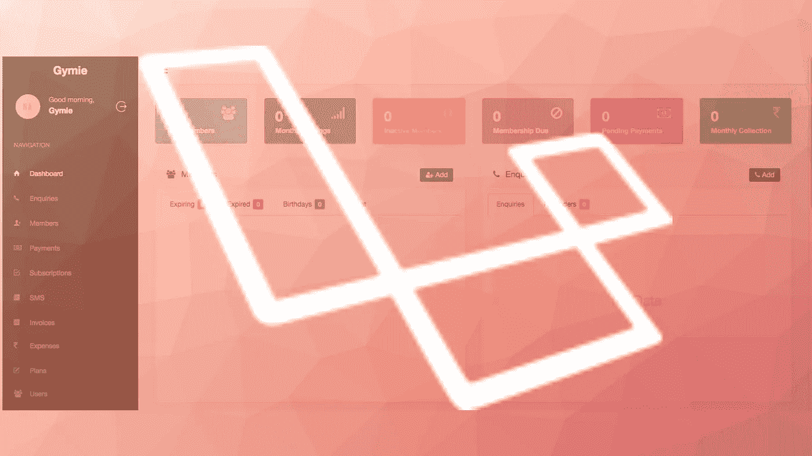
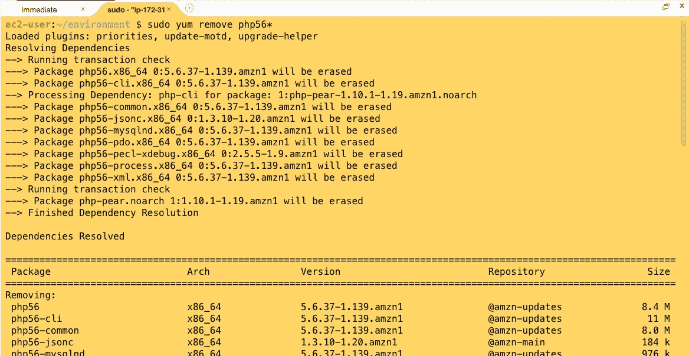
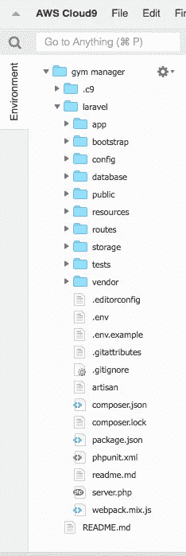
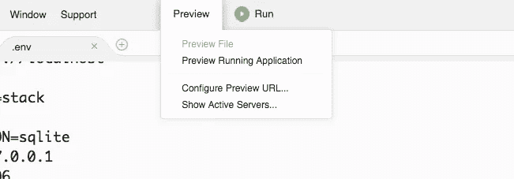
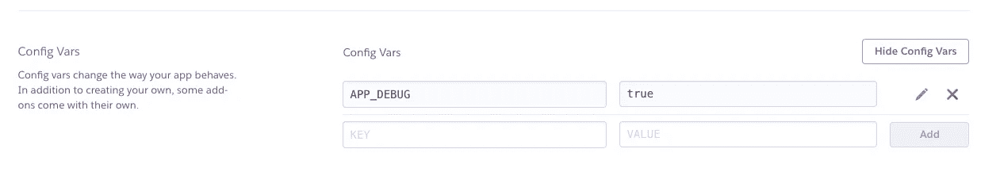

# 在 Laravel 5.7 第 0 部分创建健身房管理::在 AWS cloud9 上安装 Laravel 并设置 Github、AdminLTE，然后在 Heroku 上部署

> 原文：<https://medium.com/hackernoon/create-gym-management-in-laravel-5-7-part-0-install-laravel-on-aws-cloud9-f942f37be2c8>



## 旅程赞助商

[**使用 Laravel 和 Vue.js 进行 Fullstack Web 开发**](https://click.linksynergy.com/link?id=qt/jYwyHv8A&offerid=507388.1608944&type=2&murl=https%3A%2F%2Fwww.udemy.com%2Flaravel-vuejs-fullstack-web-development%2F)了解如何使用 Laravel 5、Laravel Mix、Vue js、Bootstrap 4 & Sass 构建 fullstack web 应用

[**带推送器的实时单页论坛 App&vuejs**](https://click.linksynergy.com/link?id=qt/jYwyHv8A&offerid=507388.1587178&type=2&murl=https%3A%2F%2Fwww.udemy.com%2Freal-time-single-page-forum-app-with-pusher-laravel-vuejs%2F)在单页 App 中用推送器实时制作东西

AWS Cloud9 提供基于云的 Ubuntu 环境。它具有一个基于浏览器的编辑器，支持许多语法高亮和单词补全，一个基于 GUI 的 GDB 调试，对基于云的 Ubuntu 环境的完全控制，以及许多其他功能，包括主题，可定制的布局和键盘快捷键。因为它是基于云的，即使你使用不同的计算机，你也可以继续做你的习题集！
您还可以与 Lambda、Codestar、Light Sail 等其他 AWS 服务集成

在这一章中我已经演练了如果我们需要跟我来

您需要 AWS 帐户


尝试搜索 Cloud9


接下来，我们创建环境


填充名称和描述

然后


选择环境类型和实例类型，查看您在图像中看到的更多描述


上一步我们看到了实例摘要


然后等待…


你有了新操场

试着自己去发现文档

## 安装 Laravel 5.7

这个版本需要 php 7.1.3 或更高版本，现在这台机器上的 php 是 5.6


当你试着去得到


因为基于 Centos 的 Amzon linux

所以首先我们需要用这个命令删除 php 5.6



`sudo yum remove php56*`

我们删除了 php5.6 中所有与*相关内容

我们用这个命令安装所有与 php 7.2 相关东西

`sudo yum install php72*`


接下来尝试 php -v


下一次安装作曲家

导航至[作曲家下载页面](http://getcomposer.org/download)


我们在终端使用 php

```
php -r "copy('https://getcomposer.org/installer', 'composer-setup.php');"
php -r "if (hash_file('SHA384', 'composer-setup.php') === '93b54496392c062774670ac18b134c3b3a95e5a5e5c8f1a9f115f203b75bf9a129d5daa8ba6a13e2cc8a1da0806388a8') { echo 'Installer verified'; } else { echo 'Installer corrupt'; unlink('composer-setup.php'); } echo PHP_EOL;"
php composer-setup.php
php -r "unlink('composer-setup.php');"
```

在终端中复制粘贴


当安装成功时，你会在文件管理器中看到 composer.phar

下一次尝试调用编写器


在这种情况下，我们需要调用长命令总是浪费时间

然后，我们需要将 composer 命令与

```
sudo mv composer.phar /usr/local/bin/composer
```


现在您可以直接调用 composer

## 安装 Laravel 5.7

使用
命令`composer create-project laravel/laravel`


当你在文件管理器中运行完成时



接下来，我们将 Sqlite 用于开发模式。所以打开`.env`


把 mysql 改成 sqlite


以及删除或插入注释


不要忘记将 laravel 文件夹中的每个文件移到根目录


现在试试`php artisan migrate`


错误来自于我们忘记了创建 sqlite 文件，这是用文件管理器创建的简单方法


现在又是`php artisan migrate`


接下来，我们使用 php 内置服务器在端口 8080 上使用 artisan 命令启动服务器，因为 cloud9 允许端口 8080、8081 和 8082


然后选择预览，并选择预览正在运行的应用程序



你已经看到新窗口出现在终端的侧面

我的天啊，我在一个页面中集成了文件管理器、文件编辑器、终端和浏览器


您可以在新标签页中打开


明白了，我们已经在 **AWS cloud9** 上完成了 **Laravel** 的设置

# Github 部分

接下来我们创建 [Github 仓库](https://github.com/new)


接下来遵循这个指南


git 初始化


`git add .` 用于跟踪所有提交的文件

git commit -m“第一次提交”


添加远程存储库路径

git 远程添加原点[https://github.com/krissnawat/laragym.git](https://github.com/krissnawat/laragym.git)

下一步尝试推送代码

```
git push — set-upstream origin master
```

在这种情况下，我们使用 HTTP 身份验证，它始终需要用户名和密码，如果您使用 git url，它需要公钥和私钥，我使用这种方法是因为它很容易，下一次提交时，我们将更改为使用私钥和公钥模式


推送第一次提交成功


# Heroku 部分

创建 Heroku 帐户


认证过程后，您已重定向到此页面


尝试创建新应用程序


我们重定向到应用仪表板


在部署方法中，我们选择连接到 **Github**


搜索您需要部署的回购


然后单击自动部署


现在，在您将触发部署的代码推送到 **Heroku** 之后，我们将进入自动部署模式

签出活动选项卡


您已经看到了在您的虚拟机中是如何发生的


尝试将代码推送到 **Github** 并刷新活动选项卡


您已经看到自动部署被触发


部署完成

尝试查看实时应用程序


这个错误来自我们没有推动。env to **Github** 因为这包含了更多替代方式的凭证

**Heroku** 提供**配置变量**


第一步尝试显示错误



你看到了吗


因为我们没有设置 **APP_KEY**


这是工作


为什么不使用 Cloud9 来显示直播应用程序，因为如果你需要运行 EC2，而使用 Heroku，你可以让你的演示 24/7 免费直播

接下来的快速方式，我们需要一些基本的 kickstart 开发工作流程的管理支架

我选择 [**杨洛诺滕/拉腊维尔-AdminLTE**](https://github.com/jeroennoten/Laravel-AdminLTE)


并遵循指南进行安装

```
composer require jeroennoten/laravel-adminlte
```


下一个打开 app.php 插入这个

```
JeroenNoten\LaravelAdminLte\ServiceProvider::class,
```


发布**管理**资产

```
php artisan vendor:publish --provider="JeroenNoten\LaravelAdminLte\ServiceProvider" --tag=assets
```


接下来，我们用`php artisan make:adminlte`创建 Laravel 内置授权


用**PHP artisan server-port = 8080**运行服务器并运行预览


转到注册页面


尝试注册


将重定向到主页

我们完成了第一部分，接下来我们将创建 **CRUD** 和 **CRUD** 和 **CRUD**

不要忘记将代码推送到 **Github**

## 结束语:

[](https://www.patreon.com/krissanawat)