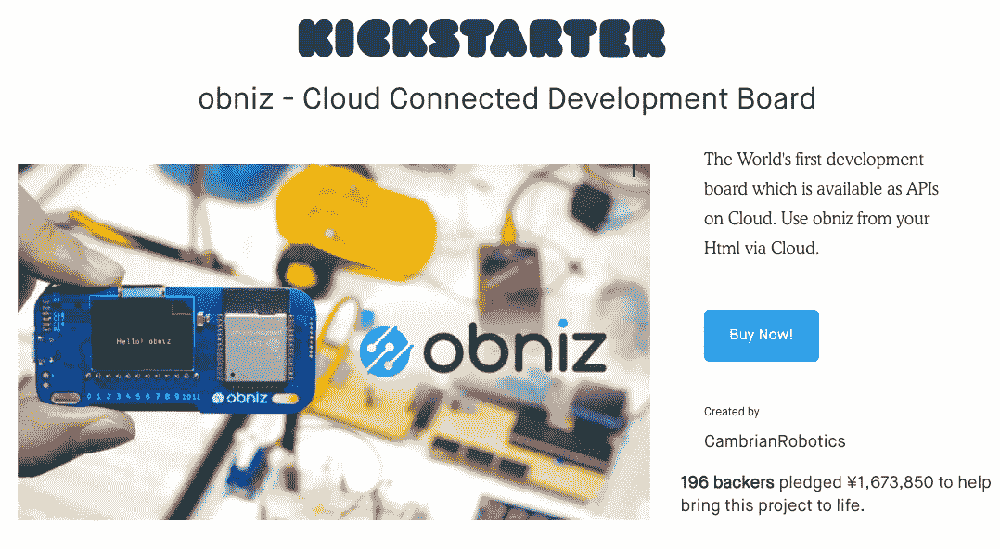

# 使用 JavaScript 创建物联网项目编程

> 原文：<https://medium.com/hackernoon/create-iot-projects-programming-with-javascript-a3c82685cde>

obniz kickstarter page

来自东京 CambrianRobotics 的 Obniz 是一个云连接物联网开发板。你可以在任何智能手机或电脑的网络浏览器上编程，命令通过互联网发送到 obniz。通过 wifi 将 obniz 连接到云，用户可以远程控制物理连接到 Obniz 的设备。

这家日本初创公司通过 [Kickstarte](https://www.kickstarter.com/projects/cambrianrobotics/obniz-api-managed-io) r 筹集资金。Obniz 的商业销售于 2018 年 5 月开始，obniz 现在可以在[亚马逊美国](https://www.amazon.com/obniz-Connected-Including-Forever-License/dp/B07DD6FK8G/ref=sr_1_1?ie=UTF8&qid=1532654858&sr=8-1&keywords=obniz)和 [obniz 网站](https://obniz.io/)上购买。

obniz 有 12 个输入/输出端口和嵌入式 WiFi-BLE 模块。功能可以通过 obniz cloud 上的 API 进行配置——REST 或 WebSocket API。Obniz 可以用任何语言编程，包括 JavaScript。

通过互联网远程控制 obniz，不仅可以使用简单的 IO 开/关，还可以使用 UART、I2C、BLE 等。连接 obniz 只需要通过扫描二维码输入唯一 ID。复杂的流程由 obniz 及其云来完成。你可以用 HTML 开始编程，浏览器和电路已经集成在一起了。如果您编写一个程序来收集传感器值，您可以很容易地制作一个值的图表。

如果 Obniz 连接到 WiFi，您可以使用互联网从任何地方控制连接到 obniz 的设备。无需有线电缆将 Obniz 连接到互联网或计算机。

例如，通过使用 obniz，可以将智能手机改造成空调遥控器，从任何地方控制空调。通过将温度传感器连接到 obniz，您甚至可以在不在家时查看房间温度并打开空调，真正实现了“远程控制”的概念

Obniz 适合没有硬件工程经验的软件工程师。Obniz 强大的驱动能力和内部安全机制允许您直接将电机等设备连接到 obniz，而无需担心支持此类电机驱动所需的复杂电路。Obniz 有 12 个 IO，每个 IO 都可以开到 1A。

这是由智能手机控制的机器人汽车。

由于 obniz 可以与 Dropbox、Twitter 和 Open CV 等其他网络服务相连接，因此您可以创建的 DIY 项目种类繁多，并允许您发挥想象力。例如，您可以创建有趣的项目，如在 twitter 上获得评论时随时移动旗帜，打开 cv 绘图相机，上传到 dropbox 或从 Dropbox 下载。

更多项目可在 obniz 网站上获得。

要开始你的 DIY 电子项目，你需要做的只是按照三个步骤:将 obniz 连接到 wifi，将类似 LED 或电机的设备连接到 obniz，扫描 Obniz 的二维码并开始编程。 [Obniz 网站](https://obniz.io/)也为初学者提供课程和各种示例程序。你现在可以通过复制和粘贴来启动不同的项目。

如需了解更多关于奥布尼兹的信息，请访问[奥布尼兹网站](https://obniz.io/)或[奥布尼兹 Amazon.com 页面](https://www.amazon.com/obniz-Connected-Including-Forever-License/dp/B07DD6FK8G/ref=sr_1_1?ie=UTF8&qid=1532654858&sr=8-1&keywords=obniz)