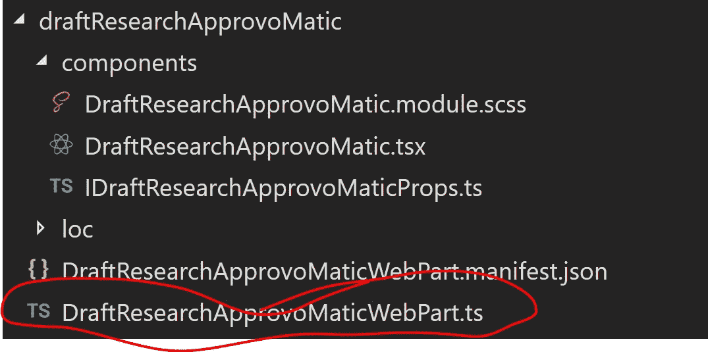
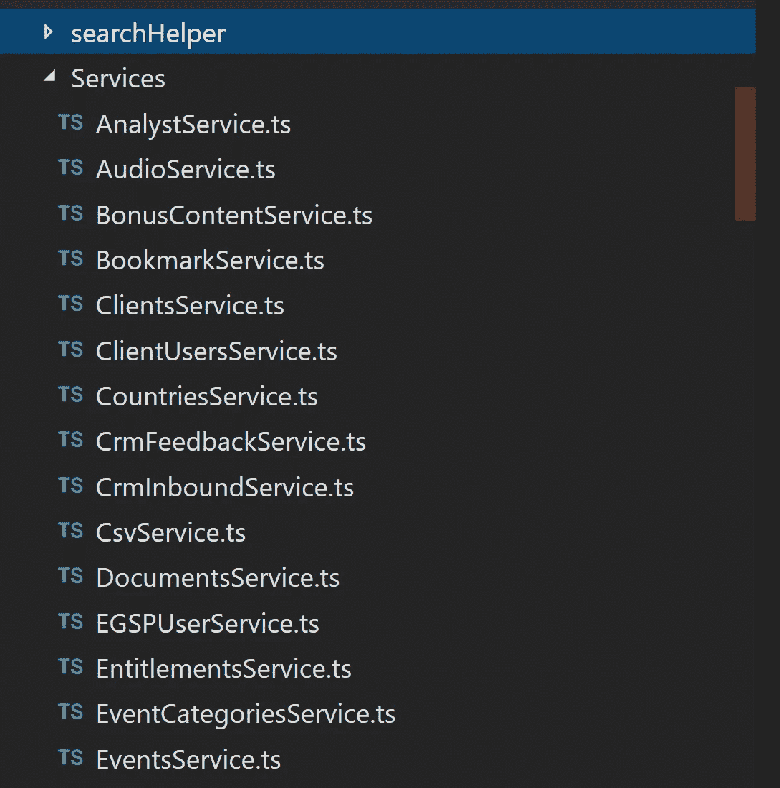

# 在 SharePoint Framework (SPFx)中创建可重用的服务

> 原文：<https://medium.com/hackernoon/create-re-usable-services-in-sharepoint-framework-spfx-70f6cf6eee0d>

我最近完成了一个相当复杂的 SharePoint 框架项目。我们顺着他[反应过来的](https://hackernoon.com/tagged/react)路径跟了上去。这是我使用 Angular 作为我的主要框架大约两年后的第一个 React 项目。(这并不是反对 Angular——如果 SPFx 对 Angular 有很好的支持，我可能会使用它)。

React 让我真正怀念的一件事是可重用服务的想法，这些服务将由 NG 运行时通过其依赖注入(DI)系统注入([参见这里的 DI 总体讨论](https://stackoverflow.com/questions/130794/what-is-dependency-injection))。我还是很怀念那个:)。

我从来没有处理过 DI 方面的事情，但是我非常想要我的可重用服务。

SPFx(至少当我在 2017 年 11 月/12 月开始时)是非常面向组件的——你可以做 web 部件或扩展。这些组件可以很容易地重用，但是它们几乎总是有一个 UI 方面。我有很多服务类型的函数，它们没有 UI，也不适合 SPFx 提供的 web 部件/扩展工具。

我通过将服务创建为单件来解决这个问题。下面的例子描述了一个“工作流服务”该服务知道如何迭代可用的 SharePoint 工作流、启动它们等。这是单身的一部分:

这遵循了单例模式。您可以在这里查看更多细节:[https://stack overflow . com/questions/30174078/how-to-define-singleton-in-typescript](https://stackoverflow.com/questions/30174078/how-to-define-singleton-in-typescript)

我必须导入 SPHttpContext，因为我几乎总是在我的服务中使用它。由于这些是单独的“普通”TS 文件，它们不能从 SPFx web 部件的自动连接中受益。

下面是我如何从 web 部件初始化服务:

在上面的要点中，您可以看到我在两个服务“DocumentsService”和“WorfklowService”上调用 initializeInstance()

即使 web 部件在页面上出现多次，或者多个 web 部件在同一页面上出现，您也可以安全地这样做。这是 JavaScript 是单线程的好例子。

对我来说，我必须在 web 部件容器中完成这项工作，而不是在 React 组件本身中:

(同样，因为我需要传递 http 上下文，这是容易获得的地方；我本打算为此实现一个更优雅的方法，但是这样做太容易了，以至于有点“卡住”)

最后，需要调用服务上的方法的 React 组件(甚至是另一个服务)是这样工作的:

在第 17 行，我调用了 WorkflowService 上的 getInstance()。这不会抛出错误，因为它已经被容器初始化了。

在第 19 行，我调用了服务上的“startWFByDisplayName”方法。

这种方法效果很好。这很容易推理，很容易创建新的服务，也很容易知道什么时候出了问题(通常是因为我试图在还没有初始化的服务上获取 Instance())。

我将所有可重复使用的服务放在“服务”文件夹中:

记住这些服务的“单一”性质是很重要的。主要的含义是，它们在每次页面加载时共享一组数据，因此，确实需要无状态。这对我来说从来都不是问题，尽管在早期，我确实忘记了这一点，并在完全理解其含义之前遇到了一些难以调试的问题。它实际上提高了性能——检索用户配置文件的服务只需一次，就可以将相同的配置文件返回给任何需要它的 web 部件(在我的例子中，我们几乎是每个页面上的每个 web 部件)。稍后我可能会就这个话题写一篇单独的简短博文。

希望这有用！微软很可能(如果他们还没有)为服务类型特性提供一些框架支持。与此同时，这样做的伎俩。