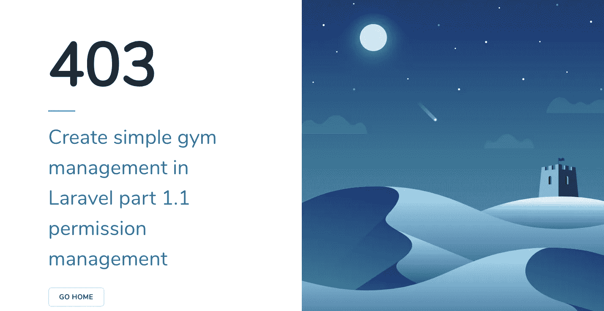
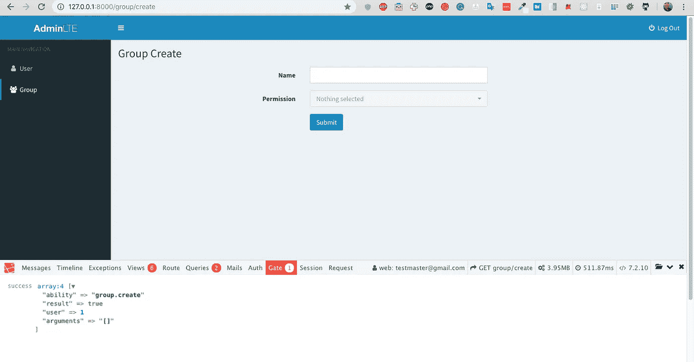
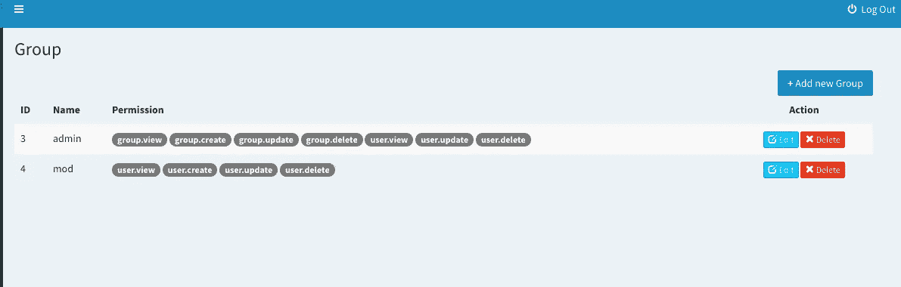
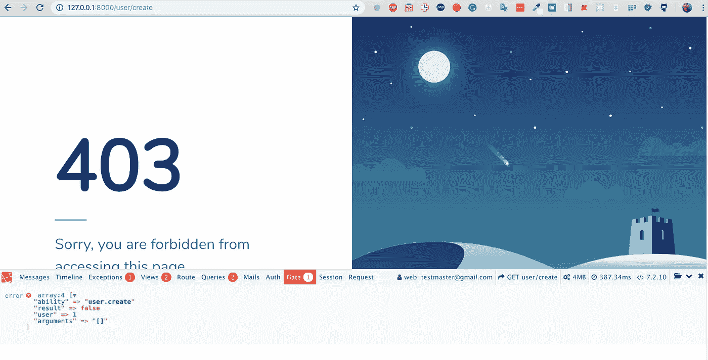

# 在 Laravel part 1.2 权限管理中创建简单的健身房管理:使用 Laravel Gate(官方授权包)轻松授权

> 原文：<https://medium.com/hackernoon/create-simple-gym-management-in-laravel-part-1-2-8a564c7fc1ab>



对于前一部分，我们已经设置了用户和组，以继续我已经实现了 Laravel 门，并显示如何包工作

当你看到 Laravel 文档时，它会给出两个关键字

大门和政策

Gate 是一个执行所有授权周期的类，Policie 是一个组织一组 gate 的类，这些 gate 将你想要的东西分开

你将从本章中学到的四个步骤

1.  生成策略类
2.  检查用户是否有权执行操作
3.  在 AuthService proivider 中注册策略
4.  在控制器或多个地方执行检查，并使用多个助手

## 生成策略类

首先将控制组和用户的授权

我们用 artisan 创建策略类

```
php artisan make:policy GroupPolicy --model=Group
php artisan make:policy UserPolicy --model=User
```

它从模板生成一个类

## 检查用户是否有权执行某项操作

策略类中用于检查控制器中权限匹配的函数

```
public function create(User $user) { *return* in_array('group.create',$user->group->permission);}
```

我们使用 in_array 来检查当前操作在当前登录用户中是否有权限

group.create 来自 Group Controller 和 create 函数以及一个包含我们在上一章中创建的权限列表的数组

`in_array`返回布尔这对我们来说太容易了

## 在 AuthService provider 中注册策略

在 AuthService provider 的功能启动中激活策略

```
public function boot(){*$this*->registerPolicies();\Gate::resource('group','App\Policies\GroupPolicy');
\Gate::resource('group','App\Policies\UserPolicy');}
```

## 在控制器上或许多地方执行授权，并使用许多助手

我们有许多检查授权的帮助函数，如 can、cant、allows 和 denieds，

例如，检查用户是否不能编辑组，我们返回 403

```
public function edit($id){ *if*(auth()->user()->cant('group.edit')){ *return* abort(403);
    } $group = \App\Group::find($id); *return* view('group.edit',compact('group'));}
```

现在让我们试试



您可以使用 laravel debugbar 查看个人资料您是否看到 Gate 返回成功

我试过失败案例



将移除`user.create`表单管理员角色

在策略中添加授权检查

```
public function create(User $user){ *return* in_array('user.create',$user->group->permission);}
```

在控制器中

```
public function create() { *if*(auth()->user()->cant('user.create')){ *return* abort(403); }
   $groups = Group::all();
   *return* view('user.create',compact('groups'));}
```

是的，是工作



那么你下一步应该做什么

这是一个额外的功能，你可以做一般业务需求时完成

您可以重复该过程来覆盖所有动作