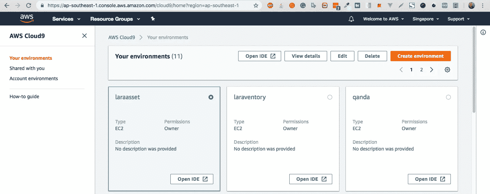
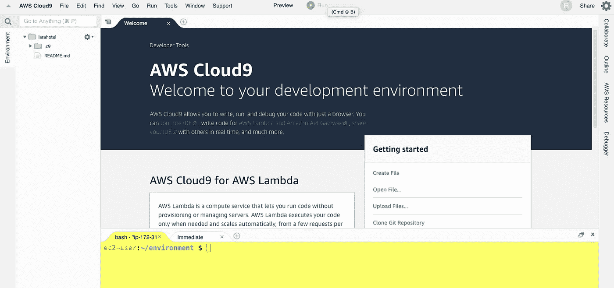
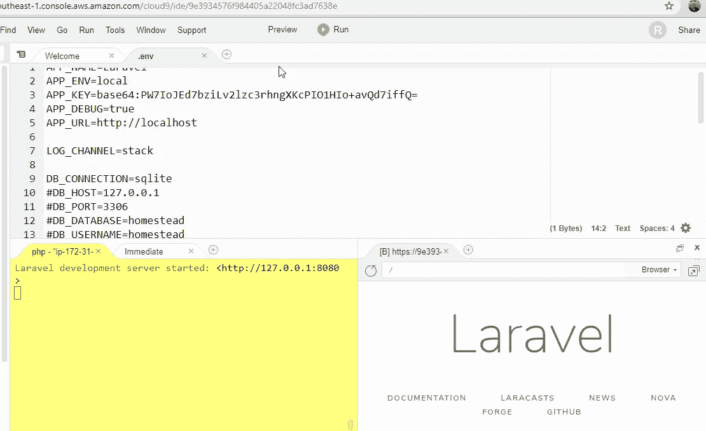

# 使用 Laravel part 0 创建简单的酒店预订::在 AWS cloud9、Github、AdminLTE、Heroku 上安装 Laravel

> 原文：<https://medium.com/hackernoon/create-simple-hotel-booking-with-laravel-part-0-install-laravel-on-aws-cloud9-github-adminlte-c178cdd6159c>

[](https://leanpub.com/create-simple-inventory-management-in-laravel57)

> AWS Cloud9 提供基于云的 Ubuntu 环境。它具有一个基于浏览器的编辑器，支持许多语法高亮和单词补全，一个基于 GUI 的 GDB 调试，对基于云的 Ubuntu 环境的完全控制，以及许多其他功能，包括主题，可定制的布局和键盘快捷键。因为它是基于云的，即使你使用不同的计算机，你也可以继续做你的习题集！
> 您还可以集成 Lambda、Codestar、Light Sail 等其他 AWS 服务。

# [**在 Leanpub**](https://leanpub.com/create-simple-inventory-management-in-laravel57) 上获取这本书的全部内容

在这一章中，我已经演练了如果我们需要跟我来

您需要 AWS 帐户


k



接下来，我们创建环境


填充名称和描述

然后


选择环境类型和实例类型，查看您在图像中看到的更多描述


最后一步，我们看到了实例摘要，然后等待



你有了新操场

试着自己去发现[文档](https://docs.aws.amazon.com/cloud9/latest/user-guide/welcome.html)

这个版本需要 php 7.1.3 或更高版本，现在这台机器上的 php 是 5.6


当你试着去得到


因为基于 Centos 的 Amzon linux

所以首先我们需要用这个命令删除 php 5.6

`sudo yum remove php56*`


我们删除了 php5.6 中所有与*相关内容

我们用这个命令安装所有与 php 7.2 相关东西

`sudo yum install php72*`


接下来尝试 php -v


下一次安装作曲家

导航至[作曲家下载页面](http://getcomposer.org/download)


我们在终端使用 php

```
php -r "copy('https://getcomposer.org/installer', 'composer-setup.php');"
php -r "if (hash_file('SHA384', 'composer-setup.php') === '93b54496392c062774670ac18b134c3b3a95e5a5e5c8f1a9f115f203b75bf9a129d5daa8ba6a13e2cc8a1da0806388a8') { echo 'Installer verified'; } else { echo 'Installer corrupt'; unlink('composer-setup.php'); } echo PHP_EOL;"
php composer-setup.php
php -r "unlink('composer-setup.php');"
```

在终端中复制粘贴


当安装成功时，你会在文件管理器中看到 composer.phar

下一次尝试调用编写器


在这种情况下，我们需要调用长命令总是浪费时间

然后，我们需要将 composer 命令与

```
sudo mv composer.phar /usr/local/bin/composer
```


现在您可以直接调用 composer

使用命令`composer create-project laravel/laravel`


当你在文件管理器中运行完成时


接下来，我们将 **Sqlite** 用于开发模式。所以打开`.env`


把 mysql 改成 sqlite


以及删除或插入注释


不要忘记将 Laravel 文件夹中的每个文件移到根目录


现在试试


错误来自于我们忘记了创建 SQlite 文件，这是用文件管理器创建的简单方法


现在又是`php artisan migrate`


接下来，我们使用 php 内置服务器在端口 8080 上使用 artisan 命令启动服务器，因为 **Cloud9** 允许端口 8080、8081 和 8082


然后选择预览，并选择预览正在运行的应用程序


你已经看到新窗口出现在终端的侧面

我的天啊，我在一个页面中集成了文件管理器、文件编辑器、终端和浏览器



您可以在新标签页中打开


接下来，我们为 Laravel 安装[admin LTE](https://github.com/jeroennoten/Laravel-AdminLTE)


并遵循指南进行安装

```
composer require jeroennoten/laravel-adminlte
```


下一次打开`app.php`插入这个

```
JeroenNoten\LaravelAdminLte\ServiceProvider::class,
```


发布**管理**资产

```
php artisan vendor:publish --provider="JeroenNoten\LaravelAdminLte\ServiceProvider" --tag=assets
```


接下来，我们用`php artisan make:adminlte`创建 Laravel 内置授权


用`php artisan serv --port=8080`运行服务器并运行预览


尝试注册


我们重新回到家


## Github 部分

创建[新存储库](https://github.com/new)


填写名称和描述，然后单击创建


使用终端上的`git init`


`git add .` 跟踪所有要提交的文件，然后`git commit -m “first commit”`


修复设置提交用户名和电子邮件的 git 警告

```
git config --global user.name "kriss"
git config --global user.email [k](mailto:you@example.com)rissanawat101@gmail.com
```

下一个远程存储库路径

```
git remote add origin git@github.com:krissnawat/larahotel.git
```

下一步尝试推送代码

```
git push -u origin master
```

这个错误来自我们没有写的权限


解决这个问题的方法是创建公钥和私钥

配合使用`ssh-keygen`


我们使用默认文件夹，不设置密码

下一次复制公钥

`cat /home/ec2-user/.ssh/id_rsa.pub`


并粘贴你的 [Github 设置](https://github.com/settings/ssh/new)


现在我们成功地将公钥添加到 Github 中


回来再推第一次提交


成功


## Heroku 部分

接下来我们让 demo 一直住在 Heroku

转到[注册页面](https://signup.heroku.com/login)


认证过程后，您已重定向到此页面


尝试创建新应用程序


我们重定向到应用仪表板


在部署方法中，我们选择连接到 **Github**

搜索您需要部署的回购


然后单击自动部署


现在，在你将触发部署的代码推送到 **Heroku** 之后，我们进入自动部署模式


签出活动选项卡


您已经看到了在您的虚拟机中是如何发生的


尝试将代码推送到 **Github** 并刷新活动选项卡

您已经看到自动部署被触发


并部署完整的试用版实时应用程序


这个错误来自我们没有推动。env 到 **Github** ,因为这包含了更多用于替代方式的凭证

**Heroku** 为句柄环境变量提供 **config_var**


第一步尝试显示错误


你看到了吗


因为我们没有设置 **APP_KEY**


你的演示会成功的


为什么不使用 Cloud9 来显示直播应用程序，因为如果你需要运行 EC2，而使用 Heroku，你可以让你的演示 24/7 免费直播

我们完成了第一部分，接下来我们将创建 **CRUD** 和 **CRUD** 和 **CRUD**

不要忘记将代码推送到 **Github**

[](https://www.patreon.com/krissanawat)

*最初发表于*[*Laraboss*](http://laraboss.com/create-simple-hotel-booking-with-laravel-part-0-install-laravel-on-aws-cloud9-github-adminlte-heroku/)*。*