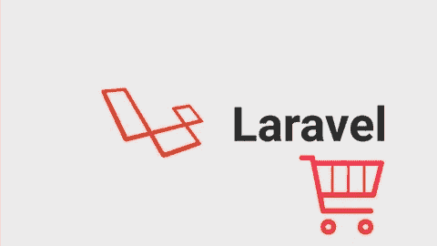

# 从 Laravel 创建简单的库存管理

> 原文：<https://medium.com/hackernoon/create-simple-inventory-management-from-laravel-5eb442417e7a>

## 旅程赞助商

[**使用 Laravel 和 Vue.js 进行 Fullstack Web 开发**](https://click.linksynergy.com/link?id=qt/jYwyHv8A&offerid=507388.1608944&type=2&murl=https%3A%2F%2Fwww.udemy.com%2Flaravel-vuejs-fullstack-web-development%2F)了解如何使用 Laravel 5、Laravel Mix、Vue js、Bootstrap 4 & Sass 构建 fullstack web 应用

[**带推送器的实时单页论坛 App&vuejs**](https://click.linksynergy.com/link?id=qt/jYwyHv8A&offerid=507388.1587178&type=2&murl=https%3A%2F%2Fwww.udemy.com%2Freal-time-single-page-forum-app-with-pusher-laravel-vuejs%2F)在单页 App 中用推送器实时制作东西

在这个系列中，我们将学习如何创建 CRUD 和一些额外的功能，如报告，在 Laravel 中的销售页面，使用一些业务逻辑，如库存管理，那么什么是库存管理系统？是用于跟踪销售、购买、支付的应用程序吗？想象一下你有一个经销商或分销商，你有一个小产品，不需要复杂的程序，这个工具可能适合你

在这篇文章中，我解释了我们是如何从头到尾学习的

灵感项目从[变成了 **LaravelInventry** 变成了](https://github.com/sathish43/LaravelInventry)

 [## sathish43/LaravelInventry

### 使用 Laravel 5.4 的库存管理应用程序。通过创建一个…为 sathish43/LaravelInventry 开发做出贡献

github.com](https://github.com/sathish43/LaravelInventry) 

Github 上的一个简单的 Laravel 5.4 项目

出于学习的目的，我们将在使用 5.7 时做一些小的改变

说真的，我们要向现实生活中的程序员学习

他们不怎么看 Udemy 或 Tut 网站上的教程，而是一头扎进代码森林，试图理解如何使用调试器来拦截代码流，并观察当跳过函数时变量是如何变化的

**他们从 Github 上的一千名专业开发人员那里学习最佳实践**

这个帖子的意图是制作详细帖子添加到后面的目录帖子

# 在开始的第 0 部分，我们为开发准备了环境

我是 [cloud9](http://c9.io) 的超级粉丝，但他们在 2017 年被 AWS 收购，集成到 AWS 服务中，成为完整的云开发环境

我们将学习如何使用 Cloud9 和设置必要的工具

**要求**

亚马逊账户和信用卡(如果不使用本地替代)

你要学习吗

*   基于 Centos 基本 linux 命令
*   Aws 云元素 9
*   如何更改 PHP 版本

# 第 1 部分我们安装并设置 Laravel 5.7 和 Github 库，并部署到 Heroku

因为在 EC2 上保持项目的实时性会收取一些免费的费用，所以我选择 Heroku 进行实时演示

**你会学到**

*   如何在基于 CentOS 的 AWS linux 上安装 Laravel 5.7 和 Mysql
*   安装 AdminLTE，让您的前端生活更轻松
*   基本 git 命令
*   简单的 Github 存储库
*   如何向 Heroku 部署任何承诺，使您的应用程序保持活跃
*   为您的应用奠定基础
*   还有更多..

# 第 2 部分我们将创建简单的 CRUD 系列

记住这个演示应用程序很简单，我们要遵循他们

## **客户**

关于购买你产品的顾客的数据

**在本节中，您将学习**

*   如何用迁移创建样板文件
*   如何创建快速简单的 CRUD 函数
*   如何使用 Laravel 迁移创建版本控制数据库表
*   如何用 Bootstrap 方法制作一个简单的表格

## 供应商

**在本节中，您将学习**

*   如何用迁移创建样板文件
*   如何创建快速简单的 CRUD 函数
*   如何使用 Laravel 迁移创建版本控制数据库表
*   如何用 Bootstrap 方法制作一个简单的表格

## 产品

**在本节中，您将学习**

*   如何用迁移创建样板文件
*   如何创建快速简单的 CRUD 函数
*   如何使用 Laravel 迁移创建版本控制数据库表
*   如何用 Bootstrap 方法制作一个简单的表格

## 种类

**在本节中，您将学习**

*   如何用迁移创建样板文件
*   如何创建快速简单的 CRUD 函数
*   如何使用 Laravel 迁移创建版本控制数据库表
*   如何用 Bootstrap 方法制作一个简单的表格

## 销售

**在本节中，您将学习**

*   如何用迁移创建样板文件
*   如何创建简单的 CRUD 函数
*   如何使用 Laravel 迁移创建版本控制数据库表
*   如何用 Bootstrap 制作复杂的表单

## 报告

**在本节中，您将学习**

*   如何用 Laravel 创建 PDF
*   如何创建日期范围选择器

## 闭幕赞助商

## [终极高级 Laravel Pro 课程(包括 Vuejs)](https://click.linksynergy.com/link?id=qt/jYwyHv8A&offerid=507388.1382640&type=2&murl=https%3A%2F%2Fwww.udemy.com%2Fthe-ultimate-advanced-laravel-pro-course-incl-vuejs-2%2F)

## [Laravel 5.7 电子商务商店](https://click.linksynergy.com/link?id=qt/jYwyHv8A&offerid=507388.1510962&type=2&murl=https%3A%2F%2Fwww.udemy.com%2Flaravel-ecommerce-shop%2F)

[**了解更多。**](https://click.linksynergy.com/link?id=qt/jYwyHv8A&offerid=507388.1510962&type=2&murl=https%3A%2F%2Fwww.udemy.com%2Flaravel-ecommerce-shop%2F)

## 结束语:

如果你需要和我一起探索海洋，普通海盗可以登上黑珍珠号

也许我们可以找到一些代码宝藏

## 如果你需要为这次旅行筹集资金

