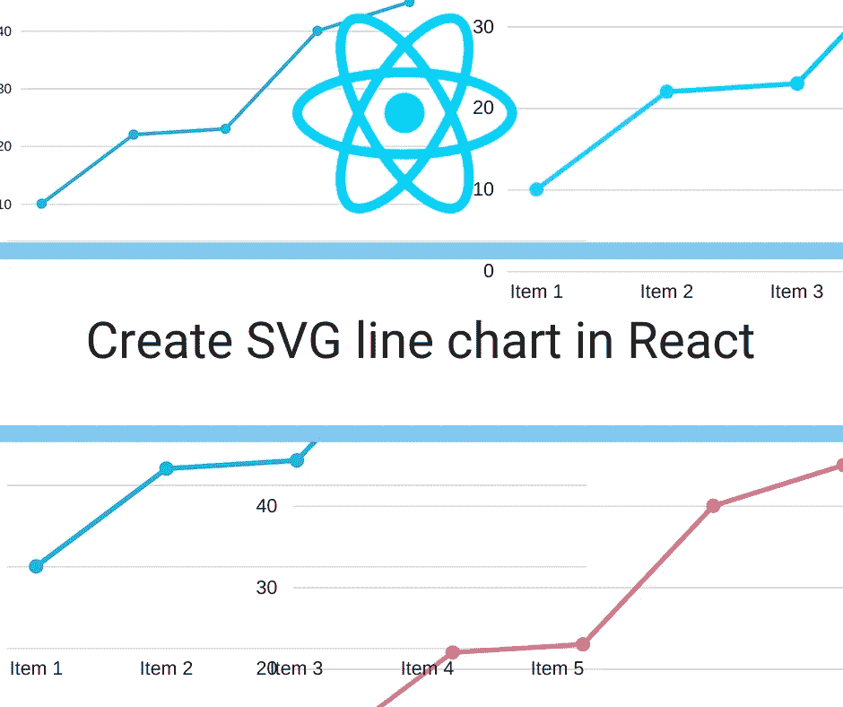
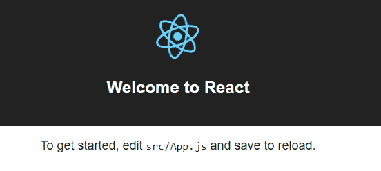
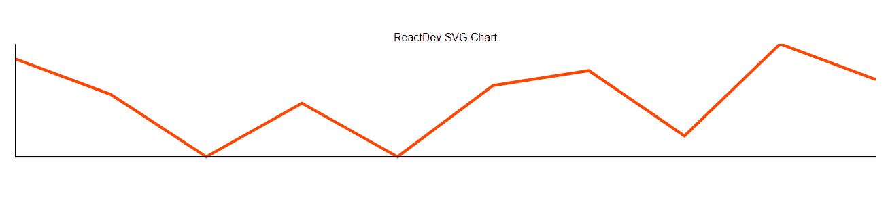

# 在 React 中创建 SVG 折线图

> 原文：<https://medium.com/hackernoon/create-svg-line-chart-in-react-e4dabb009180>

[](http://flyy.link/one-month-javscript)

今天，我们将在 React 中创建一个非常简单的 svg 图表，不需要外部库。

JavaScript 知识是必需的，与 react 熟悉预期。假设您已经安装了节点`create-react-app`。如果你还没有设置好工具，我已经在另一个教程中详细讲解过了。跟着那个，然后回来。

这是我们的图表最后的样子。

使用创建 react 应用程序

`create-react-app reactdev-svg-chart`

使用以下命令转到目录

`cd reactdev-svg-chart`

启动应用程序时使用

`npm start`

它应该会在您的默认浏览器上打开一个欢迎屏幕。



# 什么是 SVG？

我们正在创建一个 SVG 图表，所以你必须知道什么是 SVG。

> SVG 代表可缩放矢量图形。它允许创建基于矢量的形状。矢量图形是独立的，是根据数学规则创建的，如直线或圆。它们加载速度快，可搜索，模块化。

# 如何创建一个 SVG？

让我们看一个简单的 SVG:

`<path d = "M 50 60 L 100 100 z">`

`path`在创建 svg 的标签中

`d`包含路径指令列表

`M`表示*移动到*。

`50 60`是坐标。x =50，y = 60

`L`表示`Line To`

`100 100`是另一个坐标。

`z`表示结束或关闭

所以`<path d = "M 50 60 L 100 100 z">`可以用简单的英语解释为

> 移动到(50，60)并创建一条到(100，100)的线，然后关闭 SVG 元素。

该路径包含在要呈现的 svg 标记中。

很简单，对吧？还有更多的属性可以使用，在 [W3Schools](https://www.w3schools.com/graphics/svg_path.asp) 查阅。

# 那么我们在 React 上用 SVG 做什么呢？

我们将使用来自 React 的数据来创建基于 SVG 的图表。

# 在 React 上创建数据

这是第一个任务，创建将传递给 svg 元素的数据。

```
import React, { Component } from 'react'
import './App.css'

class App extends Component {
  randomArray = (total = 10) => {
    let data = []
    for (let element = 0; element < total; element++) {
      const y = Math.floor(Math.random() * 50) + 50
      const obj = {
        x: element,
        y,
      }
      data.push(obj)
    }
    return data
  }
  render() {
    return (
      <div className="App">
        {/*Render SVG Chart here!*/}
        {/**/}
      </div>
    )
  }
}
export default App
```

`randomArray()`为我们的目的创建对象 w =的随机数组。

我们需要像`[{x:0, y:54}, {x:1, y:72}, ...]`这样的数据。y 坐标将介于 50 和 100 之间。

我们可以手动提供这些数据，但是我选择随机提供。需要的随机值的数量可以作为参数传递，或者使用默认值。

> **注意:**`(0, 0)`坐标位于屏幕左上角，`(maxX, maxY)`位于右下角。不要混淆！

# 折线图

在`./src/`中创建另一个文件`LineChart.js`。它将包含`LineChart`组件。

```
import React, { Component } from 'react'
import './LineChart.css'
class LineChart extends Component {
  render() {
    return <svg />
  }
}
LineChart.defaultProps = {
  data: [],
color: '#ff4500',
  svgHeight: 200,
  svgWidth: 600,
}
export default LineChart
```

道具:

`data`空数组，数据将被传递。

`color`默认为橙色

`svgHeight`和`svgWidth`指的是 svg 元素的高度和宽度。

**linechart . CSS 文件在哪里？**

它在这里，但是如果你卡住了，所有的代码都在这个 GitHub 库上。

```
.linechart_path {
  stroke-width: 2;
  fill: none;
}

.linechart_axis {
  stroke: #000000;
}
```

# SVG 的最小和最大值！

在绘制数据图表之前，我们需要知道数据中的最小值和最大值。

getMinX 和 getMinY 是用于此目的的辅助函数。

```
getMinX() {
        const {data} = this.props 
       const  only_x = data.map(obj => obj.x)
        const min_x = Math.min.apply(null, only_x),
        return min_x
    }
    getMinY() {
        const { data } = this.props 
        const  only_y = data.map(obj => obj.y)
        const min_y = Math.min.apply(null, only_y),
        return min_y
    }
    getMaxX() {
        const {data} = this.props 
       const  only_x = data.map(obj => obj.x)
        const max_x = Math.max.apply(null, only_x),
        return max_x
    }
    getMaxY() {
        const { data } = this.props 
        const  only_y = data.map(obj => obj.y)
        const max_y = Math.max.apply(null, only_y),
        return max_y
    }
```

现在我们有了最小和最大的 x 和 y 坐标，我们还需要 svg 坐标。

# SVG 坐标创建器

它将为对应于我们数据中的点的每个点创建 svg 坐标。

我们需要 x 和 y 坐标，所以我们使用两个函数。

```
getSvgX(x){
        const { svgWidth } = this.props;
        return (x / this.getMaxX() * svgWidth);
    }
    getSvgY(y) {
        const { svgHeight } = this.props;
        return svgHeight - (y / this.getMaxY() * svgHeight);
    }
```

`x/MaxX * width`均匀划分 svg 元素的宽度。

# 创建 svg 折线图

我们需要为每个元素创建路径，为此我们调用了另一个函数`makePath()`。

```
makePath() {
    const { data, color } = this.props
    let pathD = ` M  ${this.getSvgX(data[0].x)} ${this.getSvgY(data[0].y)} `

    pathD += data.map((point, i) => {
      return `L ${this.getSvgX(point.x)} ${this.getSvgY(point.y)}  `
    })
```

它从道具中获取数据和颜色。

pathD 使路径移动到第一个坐标，这是指路径中的 d 属性。

对于数据中的每个坐标值，返回从上一个到当前的行。

这一新行附加在前一行的后面。

`className`用于造型。

# 创建网格

图表已创建，但它没有容器，因此图表中的点没有意义。

为了使图表有意义，必须有轴。轴是:左垂直，下水平。

为此，我们使用了另一个辅助函数`makeAxis()`。

```
makeAxis() {
    const minX = this.getMinX()
    const maxX = this.getMaxX()
    const minY = this.getMinY()
    const maxY = this.getMaxY()
    return (
      <g className="linechart_axis">
        <line
          x1={this.getSvgX(minX)}
          y1={this.getSvgY(minY)}
          x2={this.getSvgX(maxX)}
          y2={this.getSvgY(minY)}
        />
        <line
          x1={this.getSvgX(minX)}
          y1={this.getSvgY(minY)}
          x2={this.getSvgX(minX)}
          y2={this.getSvgY(maxY)}
        />
      </g>
    )
  }
```

我们得到最大值和最小值。

我们在`g`标签中返回两行。它是 svg 的容器标签，就像其他标签的`div`一样。

`getSvgX`和`getSvgY`实现起点和终点的坐标。

# 绘制轴和线图

我们拥有了我们需要的一切…我们需要做的就是返回`makePath`和`makeAxis`。

```
render() {
    const { svgHeight, svgWidth } = this.props

    return (
      <svg viewBox={`0 0 ${svgWidth} ${svgHeight}`}>
        {this.makePath()}
        {this.makeAxis()}
      </svg>
    )
  }
```

视图框从(0，0)开始，一直到我们定义的尺寸。

# 主文件

除了更新之外，我们什么都做了。

```
import React, { Component } from 'react'
import './App.css'
import LineChart from './LineChart'

class App extends Component {
  randomArray = (total = 10) => {
    let data = []
    for (let element = 0; element < total; element++) {
      const y = Math.floor(Math.random() * 50) + 50
      const obj = {
        x: element,
        y,
      }
      data.push(obj)
    }
    return data
  }
  render() {
    return (
      <div className="App">
        <div className="App">
          <div className="header">ReactDev SVG Chart</div>
          <LineChart data={this.randomArray()} />
        </div>
      </div>
    )
  }
}
export default App
```

导入折线图并返回此组件。数据从`randomArray()`通过 props 传递！



你的图表不会像上面那样，因为它每次都使用随机数据。

*最初发表于* [**反应过来的忍者**](https://reactninja.io/2018/06/20/create-svg-line-chart-in-react/) *。*

# 特色 React JS 课程

## [React 16 —完整指南(包括 React 路由器 4 & Redux)](http://thebestdevlist.link/react-the-complete-16-guide-incl-redux)

4.7/5 星 **||** 33.5 小时视频**| |**61597 名学生

学习反应或深入研究。学习理论，解决作业，在演示项目中实践，并构建一个在整个课程中不断改进的大型应用程序:汉堡生成器！ [**了解更多。**](http://thebestdevlist.link/react-the-complete-16-guide-incl-redux)

[](http://thebestdevlist.link/react-the-complete-16-guide-incl-redux) [## React 16 —完整指南(包括 React Router 4 和 Redux)

### 投身其中，从头开始学习 React！了解 Reactjs、Redux、React Routing、动画、Next.js 基础知识以及更多内容！

thebestdevlist.link](http://thebestdevlist.link/react-the-complete-16-guide-incl-redux) 

## 【React 专业化的全栈 Web 开发

构建完整的 Web 和混合移动解决方案。在 Coursera [**注册的四门综合课程中掌握前端 web、混合移动应用程序和服务器端开发，开始为期 7 天的完全免费试用。**](http://thebestdevlist.link/coursera-full-stack-react)

[](http://thebestdevlist.link/coursera-full-stack-react) [## 使用 React | Coursera 进行全栈 Web 开发

### 香港科技大学 React 的全栈 Web 开发。学习前端和…

thebestdevlist.link](http://thebestdevlist.link/coursera-full-stack-react) 

# 结束语:

我在 [**React Ninja**](http://reactninja.io/) 上发表 React、React Native 以及其他一切与 web 开发相关的文章。一定要在 [**推特**](https://twitter.com/reactninjaio) 上关注我。

加入我们的 [**简讯**](https://reactninja.io/subscribe-our-newsletter/) 获取最新最棒的内容，让你成为更好的开发者。

## 如果这篇文章有帮助，请点击拍手👏按钮下面几下，以示支持！⬇⬇