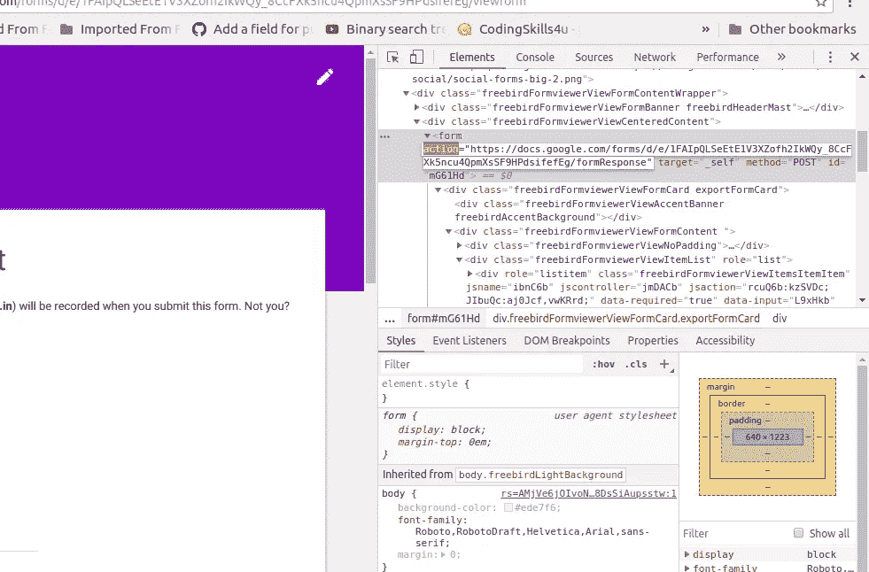
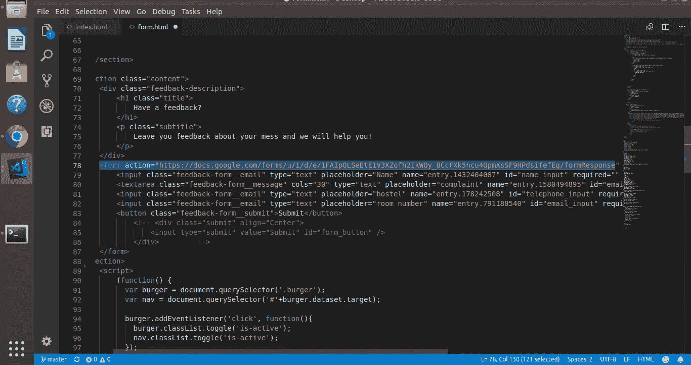
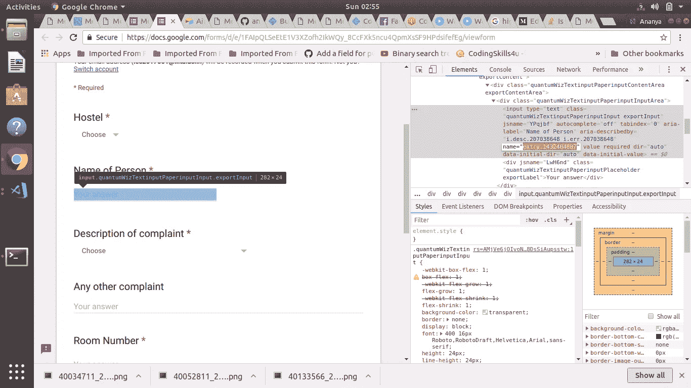
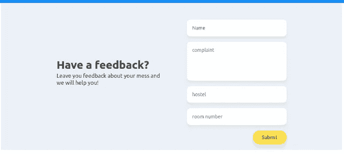

# 使用谷歌表单创建网站

> 原文：<https://medium.com/hackernoon/create-websites-using-google-forms-49a19cc8beb8>

*改变谷歌表单的 CSS，不用代码创建网站*

> 最好的代码是根本没有代码

# **第一步**

导航到 [google forms](https://www.google.com/forms/about/) 并创建一个包含必填字段的表单。

# **第二步**

创建一个 html 表单，使用 google 表单中提到的相同字段，这样您就可以在其中连接您的 google 表单。

# **第三步**

导航回您创建的 google 表单，检查 Google 表单的`action`属性。



# **步骤 3(a)**

将相同的动作复制到 html 表单中。



# **第四步**

检查并查找 Google 表单中提到的每个字段的属性`name`的值。



# **步骤 4(a)**

为您的 html 表单项提供相同的名称值。这些值看起来有点像`entry.742532386`。

使用标签将该值放入 html 表单字段。

# **第五步**

在 html 表单中填写一个测试输入，并验证您的 google 表单是否得到了响应。

因为它是一个原生的`<form>`元素，所以可以随意应用 CSS:)

嵌入了 google 表单的 html 表单示例。

```
<form action=”https://docs.google.com/forms/u/1/d/edjffbsffefEg/formResponse" method=”POST” id=”contact_form” name=”” class=”feedback-form”><input class=”form__email” type=”text” placeholder=”Name” name=”entry.1432404007" id=”name_input” required=”” /><textarea class=”form__message” cols=”30" type=”text” placeholder=”complaint” name=”entry.1580494895" id=”email_input” required=”” rows=”5"></textarea><input class=”form__email” type=”text” placeholder=”hostel” name=”entry.178242508" id=”telephone_input” required=”” /><input class=”form__email” type=”text” placeholder=”room number” name=”entry.791188540" id=”email_input” required=”” /><button class=”form__submit”>Submit</button></form>
```

与谷歌表单链接的样本表单。



# 下一步怎么样

您可以使用 zapier 与 Airtable 的集成，并创建一个平台。[https://zapier.com/apps/airtable/integrations/google-sheets](https://zapier.com/apps/airtable/integrations/google-sheets)