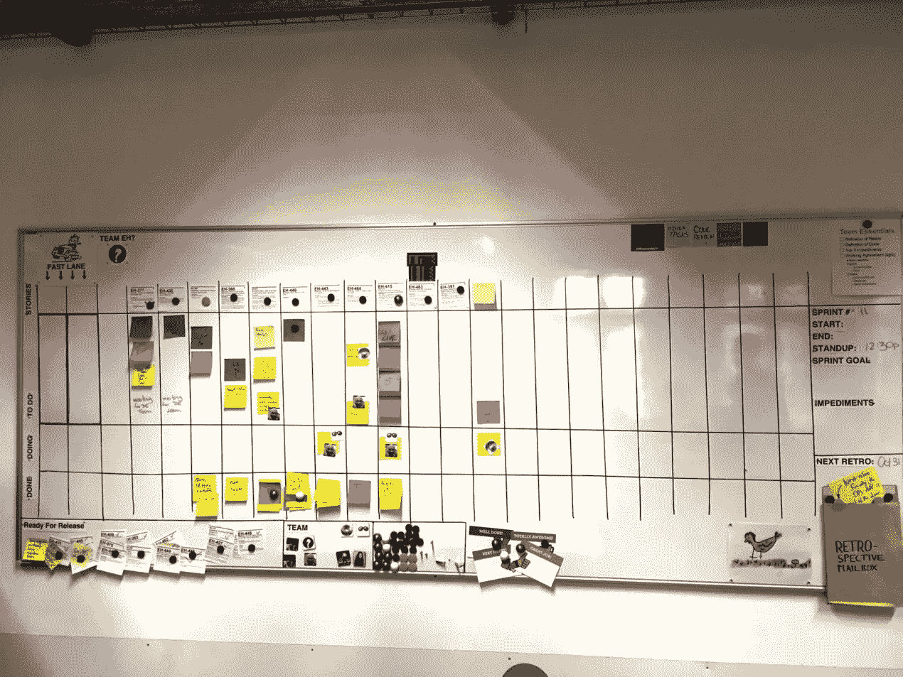
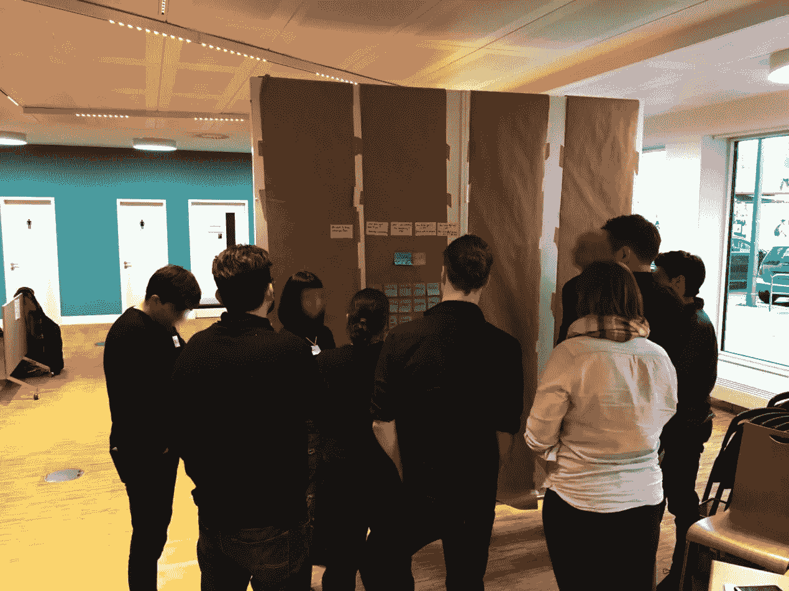
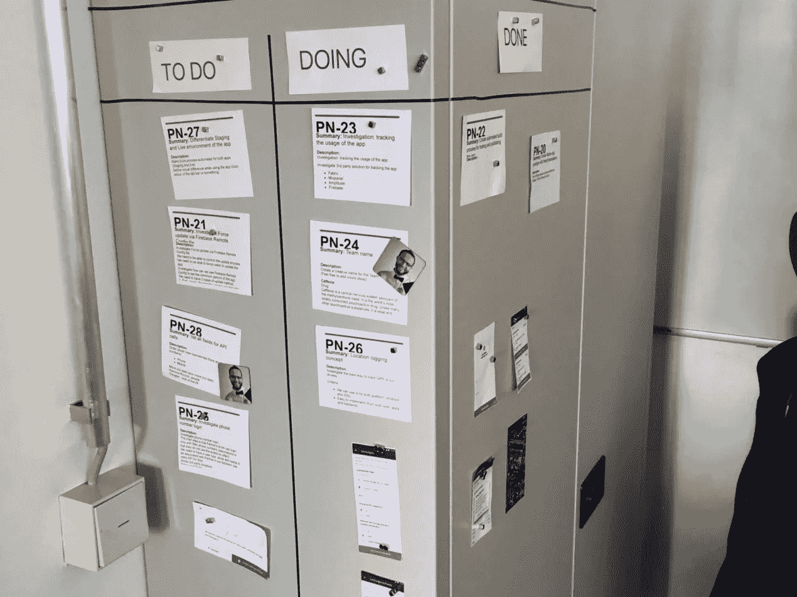
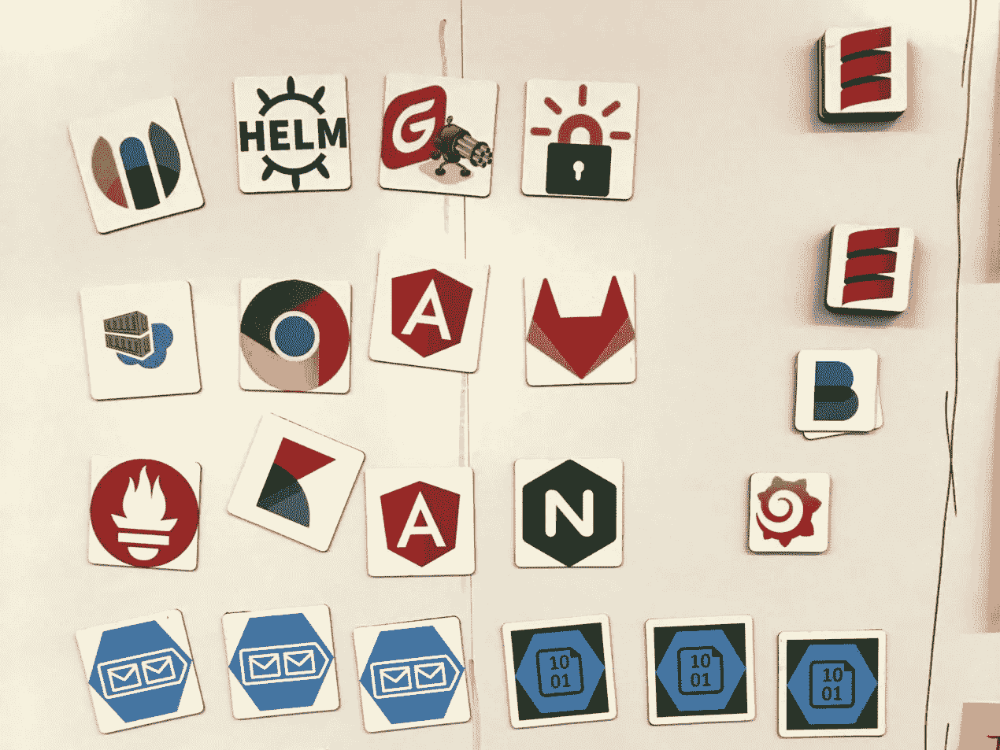
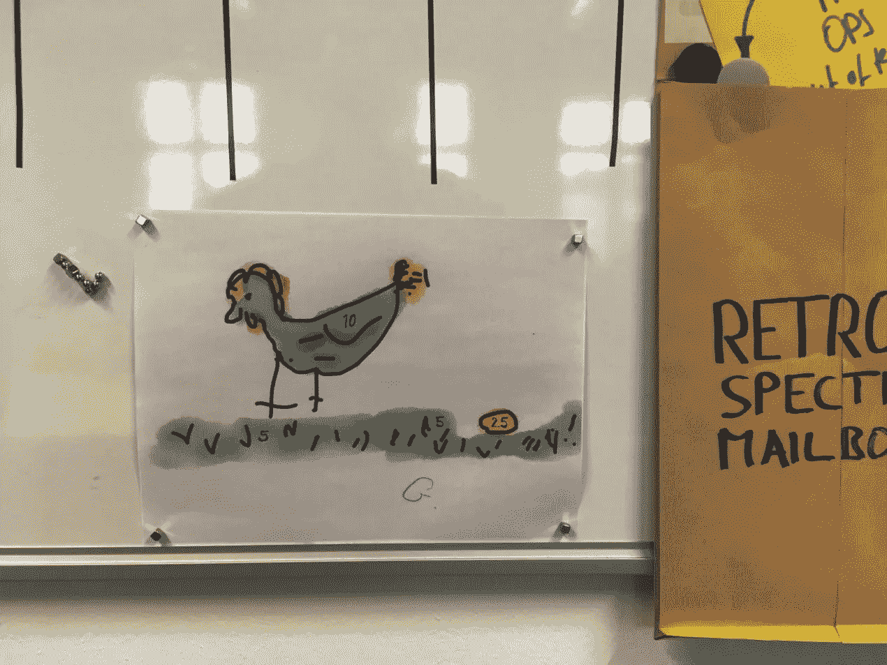

# 为透明度和协作创建白板

> 原文：<https://medium.com/hackernoon/create-whiteboards-1633a532d4e9>

# TL；灾难恢复—如何创建白板

了解如何创建白板:白板很神奇，因为它们支持基本的敏捷原则，如交互、协作、面对面交流或透明。它们有助于适应变化、持续改进和团队的自组织。你可以用一些索引卡、大头针、铅笔和干墙来创建有意义的软件——你不需要吉拉或任何其他敏捷过程工具。

# 白板的使用案例

敏捷实践者想到的白板的第一个应用可能是冲刺板。然而，我们的想象力往往局限于可用的“白板空间”事实证明，白板不仅仅适合显示 sprint backlog 或者团队的工作流程和工作量。

白板通常是优秀的信息辐射器:从产品积压、产品路线图、实验和假设积压，到技术债务或架构图的可视化，到影响映射或用户故事映射。白板提供即时透明度，并邀请其他团队成员或利益相关者进行协作。此外，白板在向风险承担者和新团队成员解释团队流程时特别有用。与看起来本质上是静态的以及印刷前经过“批准”的印刷海报相比，白板对描绘的现状提出了挑战——因为它们可以快速改变并且可逆。

最后，本文意义上的“白板”不一定是有磁性的，尽管它们更加通用。干墙也可以，厚厚的软木层也可以。

# 实用:如何创建白板

有四种基本技术可以获得离线电路板:

1.  购买带轮子的可移动白板，放在房间的某个地方。(有各种各样的选择，从时髦的到粗陋的将工作做完。

1.  在墙上安装预制磁性白板。就每平方米成本而言，这是最昂贵的选择。此外，现成的板通常要么太小，要么不适合可用的墙壁空间。将它们安装在房间中央可能会变得不稳定。
2.  普通非磁性干墙是现成白板的绝佳替代品。只要你愿意使用大头针，这对于索引卡来说是非常好的。用软木或其他柔软材料覆盖墙壁也能达到类似的效果。
3.  最后，另一种方法是将墙壁变成磁性白板。一个客户最近将大约 20 米的干墙改造成了一个巨大的白板——几乎 3 米高——每平方米的成本约为 70 美元。(同时，我们还在这个巨型白板的一部分前运行产品积压优化。)

当然，窗户和门也可以用作临时白板，这取决于你的办公室接受什么。(我知道请求原谅可能比请求允许更容易。但是，如果你有疑问，我建议问一下设施管理人员。由于众多的安全和管理规则，其中一些人真的很有保护意识。)

## 如果你喜欢这篇文章，帮我一个忙👏👏 👏多次—您的支持对我来说意味着一切！

***如果你更喜欢邮件通知，请*** [***注册我的每周简讯***](https://age-of-product.com/subscribe/?ref=Food4ThoughtMedium) ***，加入 17591 位同行。***

# 白板用品

有明显的白板用品，如磁铁、大头针、索引卡或便利贴。虽然索引卡主要需要粘贴在白板的表面上，但是胶粘物可以暂时起作用，而不需要额外的手段，这取决于胶粘物的表面和质量。(无论如何，我建议使用“超级粘”的粘性物质，但即使是这些物质也迟早会屈服于重力。)

无需清洁剂即可从白板上移除的白板标记应该是您办公室中唯一的标记。(我知道，可供白板记号笔使用的颜色较少。)问题通常始于将白板标记与挂图纸上的永久标记混淆。老实说，我很难理解为什么后者仍然会被购买，因为如果它们被用在白板上而没有被立即移除，那么移除成本会很高。(为此准备一瓶清洁剂；含酒精的通常能胜任工作。)

例如，在白板上画线来标记柱子或泳道可能是一件棘手的事情。使用白板标记没有帮助，因为您需要经常重画它们。此外，团队成员在使用白板时往往会擦掉白板上的线条。虽然从白板上移除白板笔很容易，但从白色衬衫或罩衫上移除黑色或红色白板笔却是另一回事。因此，我最喜欢的划线工具是一种非常薄、柔韧但有粘性的胶带，用于绘画工作。

有用的白板的另一个重要组成部分是磁性头像。(我们让服务提供商打印它们。)我们为每个团队成员使用它们来标记某人在 sprint 期间正在处理的任务。我们还在产品待办事项板上使用它们来匹配团队的任务。(我们有一个统一的产品 backlog，供多个团队使用。)最后，我们使用它们来可视化应用程序的架构。

# 如何使用短跑板

鉴于白板可能最常用于 sprint 积压工作或看板，以下是一些过去有用的实践:

*   **队名**:将队名或队徽放在板上。
*   **团队成员**:创建团队成员列表。如果你使用头像，在这里匹配名字和头像。
*   **本次冲刺的基本日期**:从冲刺号开始，起止日期，起立时间，可能还有其他仪式。
*   **冲刺目标**:我们这次是为了什么而战？用大而易读的字体写在显眼的地方。
*   **泳道**:创建泳道以使信息获取更容易:这些泳道可以是常规泳道，或者可能你的团队喜欢将非功能性任务和 bug 与其他任务分开。每项任务都有一条泳道可能会有用，这样可以避免板子上杂乱无章的粘贴物或卡片。
*   **使用模板**:通过创建一个基本设计来标准化板上的卡片或贴纸。这种设计适用于彩色编码卡和标记。例如，总是使用相同的颜色，并在索引卡或贴纸上的相同位置书写或打印票号。减少认知负荷，从而便于远距离阅读卡片或贴纸。
*   **每日混战**:在棋盘前跑单立，移动牌。(这应该是一个低能儿，但似乎不是。售货员想让你在买新衣服前摸摸是有原因的。由此产生的触觉体验已经灌输了一定程度的感知所有权。在卡片上放一个头像，移动卡片让它也成为你的卡片，支持自我组织，创造责任感。)
*   **WIP —限制正在进行的工作**:有几种方法可以限制正在进行的工作的数量。例如，限制磁性头像的数量，并制定一条规则，如果不在贴纸上放置头像，就不能处理票证。或者限制放置卡片的空间——当然，不允许堆叠卡片。用不动的红点标记便笺，以直观显示工作项的时间。通过这种方式，团队可以及时移除阻碍进展的障碍。
*   **领先系统**:如果您使用离线和在线电路板，请确保有领先系统，并且电路板定期同步，例如，在站立后立即同步。顺便说一下，这种同步是所有团队成员的工作，而不是 scrum 主管的任务。)

# 白板反模式

和往常一样，当团队使用敏捷工具箱中的工具时，您可以观察到反模式。例如，在白板的情况下，最关键的白板反模式是:

*   **废弃的木板**:一个团队开始使用一块木板，然后停止使用，让旧木板腐烂。
*   **中途退出**:有必要定期提醒一些团队成员照看板子。
*   **缺乏透明度**:不是所有的牌都放在棋盘上；有一个影子会计，模糊了画面。
*   **缺乏运动**:胶粘物没有被定期移动，因此你的团队经历了与其他电路板的同步失败。(如果此白板反模式持续存在，将导致两块白板都无法使用。)
*   **领导系统被忽略**:领导系统的工作协议没有得到每个团队成员的尊重。
*   **WIP 限制被忽略**:团队成员不遵守工作协议——反映在电路板的设计中——关于在制品限制。

# 白板游戏

让我们以白板的另一个有趣部分——游戏来结束:

我以前的一个团队曾经在 scrum of scrum 仪式上通过在白板上扔小磁铁来识别代表团队的团队成员——想一想，有无穷无尽的机会！

# 如何创建白板—结论

白板是敏捷工具箱中最通用的工具之一:创建简单，甚至可以快速即兴创作，辐射信息，邀请每个人合作，从而成为解决方案的一部分。

你用白板有过哪些好的或不好的体验？请在评论中与我们分享。

# 📅即将举行的网络研讨会

**立即下载您的邀请—座位不超过 100 个**:

*   **2018 年 6 月 19 日**，第六次网络研讨会将讨论[产品所有者反模式](https://age-of-product.com/webinar-product-owner-anti-patterns/)。

**注意:**所有网络研讨会的播出时间为 CEST 时间下午 06:00 至 07:00。(即美国东部时间下午 12:00 到 1:00，或太平洋时间上午 9:00 到 10:00。)

# ✋不要错过:加入 3400 多人的强大的“动手敏捷”Slack 团队

我邀请你加入[“手把手的敏捷”Slack 团队](https://goo.gl/forms/LObbRtSF9vvxN3CL2)，享受来自世界各地的敏捷实践者的快速增长、充满活力的社区带来的好处。

如果你现在想加入，你现在所要做的就是通过这个谷歌表格提供你的证书，我会帮你注册。对了，**免费的。**

# 如何创建白板-相关文章

[免费下载《敏捷过渡——实战指南》](https://age-of-product.com/download-agile-transition-hands-guide-trenches/)

# 🎓你还想这样多读书吗？

好吧，那么:

*   📰*加入 17591 位同行和* [*报名我的每周简讯*](https://age-of-product.com/subscribe/?ref=Food4ThoughtMedium)
*   🐦*关注我的*[*Twitter*](https://twitter.com/stefanw)*并订阅我的博客* [*产品时代*](https://age-of-product.com)
*   💬*或者，免费加入* [*Slack 团队【动手敏捷】的 3400 多名同行*](https://goo.gl/forms/XIsABn0fLn9O0hqg2) *。*

[创建透明和协作白板](https://age-of-product.com/create-whiteboards/)首次发布于《产品时代》。